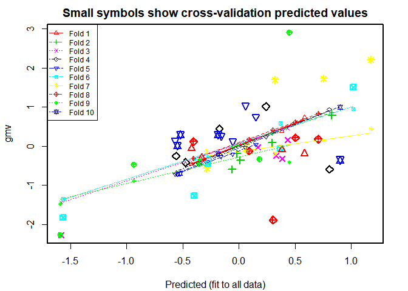
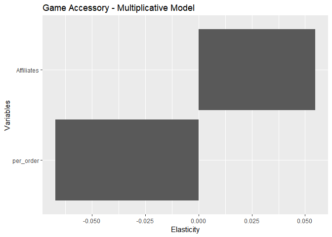

Data PreProcessing
================
Goldston Dias
March 4, 2019

Install and load packages neccesary for analysis
------------------------------------------------

``` r
library(dplyr)
library(plyr)
library(lubridate)
library(MASS)
library(car)
library(DataCombine)
library(zoo)
library(glmnet)
library(DAAG)
library(ggplot2)
```

Load Dataset in working directory
---------------------------------

``` r
ecom <- read.csv("mmm_data.csv")
```

Let's modify the name
=====================

``` r
colnames(ecom) <- c("FSN_ID","Order_date","Year","Month","Order_id","Order_item_id","gmv","Units","deliverybdays","deliverycdays", "payment_mode","SLA","cust_id","pincode","P_super_category","P_analytic_category","P_sub_category","P_analytic_vertical","MRP","Procurement_SLA")
```

### structure of dataset

``` r
str(ecom)
```

    ## 'data.frame':    1648824 obs. of  20 variables:
    ##  $ FSN_ID             : Factor w/ 21219 levels "ACCCX3S58G7B5F6P",..: 1 1 3 3 3 6 6 6 6 6 ...
    ##  $ Order_date         : Factor w/ 1155192 levels "2015-05-19 13:42:09",..: 261290 272488 276287 200433 266471 258475 241221 218942 219916 291196 ...
    ##  $ Year               : int  2015 2015 2015 2015 2015 2015 2015 2015 2015 2015 ...
    ##  $ Month              : int  10 10 10 10 10 10 10 10 10 10 ...
    ##  $ Order_id           : num  3.42e+15 1.42e+15 2.42e+15 4.42e+15 4.42e+15 ...
    ##  $ Order_item_id      : num  3.42e+15 1.42e+15 2.42e+15 4.42e+15 4.42e+15 ...
    ##  $ gmv                : num  6400 6900 1990 1690 1618 ...
    ##  $ Units              : int  1 1 1 1 1 1 1 1 1 1 ...
    ##  $ deliverybdays      : Factor w/ 143 levels "-10","-12","-13",..: 24 24 24 24 24 24 24 24 24 24 ...
    ##  $ deliverycdays      : Factor w/ 171 levels "-11","-115","-14",..: 37 37 37 37 37 37 37 37 37 37 ...
    ##  $ payment_mode       : Factor w/ 2 levels "COD","Prepaid": 1 1 1 2 2 2 2 1 2 1 ...
    ##  $ SLA                : int  5 7 10 4 6 5 6 5 9 7 ...
    ##  $ cust_id            : num  -1.01e+18 -8.99e+18 -1.04e+18 -7.60e+18 2.89e+18 ...
    ##  $ pincode            : num  -7.79e+18 7.34e+18 -7.48e+18 -5.84e+18 5.35e+17 ...
    ##  $ P_super_category   : Factor w/ 1 level "CE": 1 1 1 1 1 1 1 1 1 1 ...
    ##  $ P_analytic_category: Factor w/ 5 levels "Camera","CameraAccessory",..: 2 2 2 2 2 2 2 2 2 2 ...
    ##  $ P_sub_category     : Factor w/ 14 levels "AmplifierReceiver",..: 5 5 5 5 5 5 5 5 5 5 ...
    ##  $ P_analytic_vertical: Factor w/ 74 levels "\\N","AmplifierReceiver",..: 20 20 20 20 20 20 20 20 20 20 ...
    ##  $ MRP                : int  7190 7190 2099 2099 2099 4044 4044 4044 4044 4044 ...
    ##  $ Procurement_SLA    : int  0 0 3 3 3 5 5 5 5 5 ...

``` r
summary(ecom)
```

    ##               FSN_ID                      Order_date           Year     
    ##  ACCE6VGHYKYFX4WB:  37622   2016-04-27 00:19:27:    294   Min.   :2015  
    ##  SELDXMC3JNMTQMGV:  17859   2016-04-27 00:33:02:    282   1st Qu.:2015  
    ##  CAMDA6RJERF8HS4G:  16741   2016-04-27 00:23:23:    267   Median :2016  
    ##  ACCDXEGXG8HJUCSK:  14281   2016-04-27 00:45:47:    228   Mean   :2016  
    ##  ACCECYHH4QDNZXEX:  13640   2016-04-27 00:36:51:    220   3rd Qu.:2016  
    ##  ACCE9C3WYBMPJ98R:  13281   2016-04-27 00:36:16:    218   Max.   :2016  
    ##  (Other)         :1535400   (Other)            :1647315                 
    ##      Month           Order_id         Order_item_id            gmv        
    ##  Min.   : 1.000   Min.   :7.633e+07   Min.   :1.080e+08   Min.   :     0  
    ##  1st Qu.: 3.000   1st Qu.:1.603e+15   1st Qu.:1.607e+15   1st Qu.:   340  
    ##  Median : 6.000   Median :2.612e+15   Median :2.619e+15   Median :   750  
    ##  Mean   : 6.586   Mean   :2.842e+15   Mean   :1.376e+16   Mean   :  2461  
    ##  3rd Qu.:10.000   3rd Qu.:3.611e+15   3rd Qu.:4.398e+15   3rd Qu.:  1999  
    ##  Max.   :12.000   Max.   :5.395e+15   Max.   :3.000e+17   Max.   :226947  
    ##                                                           NA's   :4904    
    ##      Units        deliverybdays     deliverycdays      payment_mode    
    ##  Min.   : 1.000   \\N    :1312972   \\N    :1312971   COD    :1191443  
    ##  1st Qu.: 1.000   4      :  62062   5      :  56417   Prepaid: 457381  
    ##  Median : 1.000   5      :  60594   6      :  51930                    
    ##  Mean   : 1.022   3      :  53701   4      :  50627                    
    ##  3rd Qu.: 1.000   6      :  48655   3      :  40504                    
    ##  Max.   :50.000   2      :  37513   7      :  38456                    
    ##                   (Other):  73327   (Other):  97919                    
    ##       SLA              cust_id              pincode          
    ##  Min.   :   0.000   Min.   :-9.223e+18   Min.   :-9.222e+18  
    ##  1st Qu.:   4.000   1st Qu.:-4.617e+18   1st Qu.:-4.415e+18  
    ##  Median :   6.000   Median :-1.738e+16   Median : 1.241e+17  
    ##  Mean   :   5.688   Mean   :-7.058e+15   Mean   : 1.002e+17  
    ##  3rd Qu.:   7.000   3rd Qu.: 4.604e+18   3rd Qu.: 4.787e+18  
    ##  Max.   :1006.000   Max.   : 9.223e+18   Max.   : 9.223e+18  
    ##                     NA's   :4904         NA's   :4904        
    ##  P_super_category         P_analytic_category         P_sub_category  
    ##  CE:1648824       Camera            :101172   Speaker        :543928  
    ##                   CameraAccessory   :257493   CameraAccessory:239508  
    ##                   EntertainmentSmall:944698   GamingAccessory:201899  
    ##                   GameCDDVD         :114503   TVVideoSmall   :142995  
    ##                   GamingHardware    :230958   HomeAudio      :124860  
    ##                                               Game           :114406  
    ##                                               (Other)        :281228  
    ##        P_analytic_vertical      MRP         Procurement_SLA   
    ##  LaptopSpeaker   :287850   Min.   :     0   Min.   :  -1.000  
    ##  MobileSpeaker   :250250   1st Qu.:   799   1st Qu.:   1.000  
    ##  AudioMP3Player  :112892   Median :  1599   Median :   2.000  
    ##  PhysicalGame    :105061   Mean   :  4108   Mean   :   5.404  
    ##  HomeAudioSpeaker: 85607   3rd Qu.:  3499   3rd Qu.:   3.000  
    ##  GamingHeadset   : 62311   Max.   :299999   Max.   :1000.000  
    ##  (Other)         :744853

### Data sanity Check : Data should be from july-2015 to June -2016,Let's remove other data from ecom dataset

``` r
ecom <- subset(ecom, !(Month ==5 & Year==2015|Month ==6 & Year==2015|Month ==7 & Year==2016))
```

Convert the dataset into weekly levels.
---------------------------------------

``` r
# Lubridate package 
library(lubridate)
ecom$Order_date <- date(ecom$Order_date)

# create new column week of year 
ecom$week_year <- week(ecom$Order_date)

# Data quality issues 
# Jan 2016 should be week 54, not week 1 etc. 
ecom$week_year<- ifelse(ecom$week_year<=26 & ecom$Year==2016,ecom$week_year+53,ecom$week_year)

# create new column of date 
ecom$date<-as.Date(ecom$Order_date)

summary(ecom$MRP)
```

    ##    Min. 1st Qu.  Median    Mean 3rd Qu.    Max. 
    ##       0     799    1599    4108    3499  299999

### Let us not consider free products and remove missing values

``` r
ecom <- subset(ecom,MRP!=0)
sum(is.na(ecom))
```

    ## [1] 14658

``` r
# removing rows with NA values
ecom <- na.omit(ecom)
ecom$gmv[which(ecom$gmv==0)] <- 1
```

### GMV should not be more than MRP\*units since we can offer discounts but not charge higher

``` r
ecom <- subset(ecom, (MRP*Units)>=gmv)
```

### Let's divide the dataset into 3 dataframes based on category.

``` r
GamingAccessory <-ecom[ecom$P_sub_category=="GamingAccessory" ,] 

CameraAccessory<-ecom[ecom$P_sub_category=="CameraAccessory",]

HomeAudio<-ecom[ecom$P_sub_category=="HomeAudio",]
```

### KPI FUNCTION FOR ALL THE 3 above categories

``` r
Product_data <- function(dataset){
  
  #1. KPI - List price for all the products
  dataset$list_price <- dataset$gmv/dataset$Units
  
  #2. KP - Promotional Offer for all the products
  dataset$promotional_offer <- (dataset$MRP-dataset$list_price)/dataset$MRP

  
  #3. Clustering
  ## Creating a new KPI (though not used in the final model)
  ## It divides the products into three categories based on MRP and num units sold - 
  ## mass market, medium market and premium product
  
  dataset$P_analytic_vertical <- factor(dataset$P_analytic_vertical)
  
  cluster<- aggregate(cbind(Units,list_price,MRP)~P_analytic_vertical,dataset,mean)
  
  
  if(nrow(cluster)<=3){
    
    cluster$p_tag <-NA
    # Assuming premium product:- 
    
    cluster$P_tag[which(cluster$MRP>=mean(cluster$MRP))] <- "Middle_p"
    cluster$P_tag[-which(cluster$MRP>=mean(cluster$MRP))] <- "Mass_p"
    
    cluster <- cluster[,-c(2:4)]
    
    dataset <-merge(dataset,cluster,by="P_analytic_vertical")
    
  } else {
    
    #str(cluster) 
    
    cluster$list_price_1 <- scale(cluster$list_price)
    cluster$MRP_1<- scale(cluster$MRP)
    cluster$Units_1 <- scale(cluster$Units)
    
    #str(cluster)
    
    k1 <- cluster[,-c(2:4)]
    
    clust <- kmeans(k1[,-1], centers = 3,iter.max = 50,nstart = 50)
    
    cluster$P_tag <- as.factor(clust$cluster)
    
    cluster <- cluster[,c(1,8)]
    
    # Add extra column in dataset with 
    dataset <-merge(dataset,cluster,by=c("P_analytic_vertical"),all.x=TRUE)
    
    
    library("plyr")
    library("dplyr")
    
    k2 <- table(dataset$P_tag)
    
    levels(dataset$P_tag)[which(k2==max(table(dataset$P_tag)))] <- "Mass_p"
    levels(dataset$P_tag)[which(k2==min(table(dataset$P_tag)))] <- "Premium_p"
    levels(dataset$P_tag)[which(k2!=max(table(dataset$P_tag))& k2!=min(table(dataset$P_tag)))] <- "Middle_p"
    
    
  }
  
  
  #3. Payment model indicator
  dataset$order_pay_ind<-ifelse(dataset$payment_mode=="Prepaid",1,0)
  
  #4.Add (Online_order/Total Order) KPI
  
  # Total Order placed
  total_order <-aggregate(order_pay_ind ~ week_year,data=dataset,FUN=NROW)
  
  # Total online order
  Online_order<-aggregate(order_pay_ind ~ week_year,data=dataset,FUN=sum)
  
  # Merge the both the file 
  merged <-merge(total_order,Online_order,by=c("week_year"),all.x=TRUE)
  
  # Create new column of percentage online
  merged$per_order <- merged$order_pay_ind.y/merged$order_pay_ind.x
  
  # Remove other variables from 
  # Merge with dataset file. 
  merged <- merged[,-c(2,3)]
  
  # add "per_order" column in dataset 
  
  dataset<- merge(dataset,merged,by=c("week_year"),all.x=TRUE)
  
  dataset$P_sub_category <- NULL
  
  dataset$P_super_category <- NULL
  
  dataset$P_analytic_category <- NULL
  
  
  #6.NPS score
  nps<-read.csv("nps.csv",h=T)
  nps$Month<-as.character(nps$Month)
  
  
  dataset<-merge(dataset,nps,by=c("Month","Year"),all.x=TRUE)
  
  #5.Holiday_column
  holiday_list<-c("2015-07-18","2015-07-19","2015-08-15",
                  "2015-08-16","2015-08-17","2015-08-28",
                  "2015-08-29","2015-08-30","2015-10-15",
                  "2015-10-16","2015-10-17","2015-11-07","2015-11-08","2015-11-09","2015-11-10",
                  "2015-10-11","2015-10-12","2015-11-13","2015-11-14","2015-12-25","2015-12-26",
                  "2015-12-27","2015-12-28","2015-12-29","2015-12-30","2016-01-01","2016-01-02",
                  "2016-01-03","2016-01-20","2016-01-21","2016-01-22","2016-02-01","2016-02-02",
                  "2016-02-20","2016-02-21","2016-02-14","2016-02-15","2016-03-07","2016-03-08",
                  "2016-03-09","2016-05-25","2016-05-26","2016-05-27")
  
  
  holiday_list <- as.Date(holiday_list)
  
  week_year <- week(holiday_list)
  
  year <- year(holiday_list)
  
  holiday <- data.frame(week_year,year)
  
  holiday$week_year<- ifelse(holiday$week_year<=26 & holiday$year==2016,holiday$week_year+53,holiday$week_year)
  
  holiday$year <-NULL
  holiday$holiday_freq <- 1
  
  holiday <- aggregate( holiday_freq ~ week_year,holiday,sum)
  
  
  products <- as.data.frame.matrix(t(table(dataset$P_tag,dataset$week_year)))
  
  
  products$week_year <- row.names(products)
  
  dataset_1 <- aggregate(gmv~week_year,dataset,sum)
  
  dataset<- aggregate(cbind(list_price,MRP,Units,SLA,promotional_offer,Procurement_SLA,per_order,NPS)~ week_year,data=dataset,FUN = mean)
  
  
  dataset <- merge(dataset,products,by="week_year",all.x=TRUE)
  
  dataset <- merge(dataset,holiday,by="week_year",all.x=TRUE)
  
  dataset$holiday_freq[is.na(dataset$holiday_freq)] <-0
  
  dataset <- merge(dataset,dataset_1,by="week_year",all.x=TRUE)
  
  return(dataset) 
  
} 
```

### Summarizing the datasets again

``` r
# Datasets

GamingAccessory<- Product_data(GamingAccessory)

HomeAudio <-Product_data(HomeAudio)

CameraAccessory <- Product_data(CameraAccessory)
```

### Create Adstock manually for each of the variables and import it

``` r
Adstock <- read.csv("Final_adstock.csv")
```

### Combine the Weekly KPI in the dataset

### Final process for Gaming Accessory

``` r
GamingAccessory <- merge(GamingAccessory , Adstock,by.x = "week_year")
```

Final process for HomeAudio
---------------------------

``` r
HomeAudio <- merge(HomeAudio,Adstock,by.x = "week_year")

##################################################################################################
```

### Final process for Camera ccessory

``` r
CameraAccessory <- merge(CameraAccessory,Adstock,by.x = "week_year")
```

### Creating moving average variables

``` r
advanced_kpi <- function(dataset)
{
  library(dplyr)
  library(zoo)
  
  myfun1 = function(x) rollmean(x, k = 2, fill = NA, align = "right")
  myfun2 = function(x) rollmean(x, k = 3, fill = NA, align = "right")
  myfun3 = function(x) rollmean(x, k = 4, fill = NA, align = "right")
  
  #dataset1<-arrange(dataset1,P_analytic_vertical,Year,week_year)
  
  x=dataset[,c("week_year","list_price","promotional_offer")]
  
  
  x1<-x %>% mutate_each(funs(myfun1),list_price,promotional_offer) %>% data.frame()
  
  x2<-x %>% mutate_each(funs(myfun2),list_price,promotional_offer) %>% data.frame()
  
  x3<-x %>% mutate_each(funs(myfun3),list_price,promotional_offer) %>% data.frame()
  
  
  x1$LP_MA1<-(x1$list_price)
  x1$PO_MA1<-(x1$promotional_offer)
  
  x2$LP_MA2<-(x2$list_price)
  x2$PO_MA2<-(x2$promotional_offer)
  
  x3$LP_MA3<-(x3$list_price)
  x3$PO_MA3<-(x3$promotional_offer)
  
  x4=cbind(x1[,-c(2:3)],x2[,-c(1:3)],x3[,-c(1:3)])
  
  
  
  dataset<-merge(dataset,x4,by="week_year")
  
  
  
  dataset$inc_LP_MA1<-(dataset$list_price - dataset$LP_MA1)/dataset$LP_MA1
  dataset$inc_LP_MA2<-(dataset$list_price - dataset$LP_MA2)/dataset$LP_MA2
  dataset$inc_LP_MA3<-(dataset$list_price - dataset$LP_MA3)/dataset$LP_MA3
  
  dataset$inc_PO_MA1<-(dataset$promotional_offer - dataset$PO_MA1)/dataset$PO_MA1
  dataset$inc_PO_MA2<-(dataset$promotional_offer - dataset$PO_MA2)/dataset$PO_MA2
  dataset$inc_PO_MA3<-(dataset$promotional_offer - dataset$PO_MA3)/dataset$PO_MA3
  
  #Deleting some columns
  
  dataset$LP_MA1<-NULL
  dataset$LP_MA2<-NULL
  dataset$LP_MA3<-NULL
  
  dataset$PO_MA1<-NULL
  dataset$PO_MA2<-NULL
  dataset$PO_MA3<-NULL
  
  names(dataset)[22:27]<-c("inc_LP_MA1","inc_LP_MA2","inc_LP_MA3","inc_PO_MA1","inc_PO_MA2",
                           "inc_PO_MA3")
  
  
  
  #------1) Lag of List price by 1 week,2 week, 3 week
  #------2) Lag of discount(promo_off) by 1 week,2 week, 3 week
  #------3) Incremental Lag of List price & promotions/discounts by 1 week,2 week, 3 week
  
  #-----------------Lag the data after aggregating by week----#
  
  #8.   Lag List price (different period lags)
  
  library(DataCombine)
  
  #List of list price by 1,2,3 dates (Date values are ordered)
  #Previous List price
  data_dum <- slide(dataset, Var = "list_price",slideBy = -1)
  
  data_dum <- slide(data_dum, Var = "list_price",slideBy = -2)
  
  data_dum <- slide(data_dum, Var = "list_price", slideBy = -3)
  
  #9.lag the promotion variables
  
  data_dum <- slide(data_dum, Var = "promotional_offer", slideBy = -1)
  
  data_dum <- slide(data_dum, Var = "promotional_offer", slideBy = -2)
  
  data_dum <- slide(data_dum, Var = "promotional_offer", slideBy = -3)
  
  data_dum <- slide(data_dum, Var = "NPS", slideBy = -1)
  
  data_dum <- slide(data_dum, Var = "NPS", slideBy = -2)
  
  data_dum <- slide(data_dum, Var = "NPS", slideBy = -3)
  
  
  data_dum <- slide(data_dum, Var = "holiday_freq", slideBy = -1)
  
  data_dum <- slide(data_dum, Var = "holiday_freq", slideBy = -2)
  
  data_dum <- slide(data_dum, Var = "holiday_freq", slideBy = -3)
  
  
  dataset <- na.omit(data_dum) 
  
  
  return(dataset)
}

Game_final <- advanced_kpi(GamingAccessory)
Home_final <- advanced_kpi(HomeAudio)
Camera_final <- advanced_kpi(CameraAccessory)
```

### EDA function is created to plot the descriptive analysis results

``` r
EDA <- function(dataset,name){
  # Ad_Stock
  plot1 <- ggplot(dataset,aes(TV,gmv))+geom_point()+ geom_smooth(aes(method="lm"))+ggtitle(name) + labs(x = "TV AdStock", y = "GMV")
  plot1
  
  plot2 <- ggplot(dataset,aes(Digital,gmv))+geom_point()+ geom_smooth(aes(method="lm"))+ggtitle(name) + labs(x = "Digital AdStock", y = "GMV")
  plot2
  
  plot3 <- ggplot(dataset,aes(Sponsorship,gmv))+geom_point()+ geom_smooth(aes(method="lm"))+ggtitle(name) + labs(x = "Sponsorship AdStock", y = "GMV")
  plot3
  
  plot4 <- ggplot(dataset,aes(Content.Marketing,gmv))+geom_point()+ geom_smooth(aes(method="lm"))+ggtitle(name) + labs(x = "Content Marketing AdStock", y = "GMV")
  plot4
  
  plot5 <- ggplot(dataset,aes(Online_marketing,gmv))+geom_point()+ geom_smooth(aes(method="lm"))+ggtitle(name) + labs(x = "Online Marketing AdStock", y = "GMV")
  plot5
  
  plot6 <- ggplot(dataset,aes(Affiliates,gmv))+geom_point()+ geom_smooth(aes(method="lm"))+ggtitle(name) + labs(x = "Affiliates AdStock", y = "GMV")
  plot6
  
  plot7 <- ggplot(dataset,aes(SEM,gmv))+geom_point()+ geom_smooth(aes(method="lm"))+ggtitle(name) + labs(x = "SEM AdStock", y = "GMV")
  plot7

  plot8 <- ggplot(dataset,aes(dataset$week_year,dataset$gmv, fill = as.factor(ifelse(dataset$holiday_freq>0,1,0))))+geom_bar(stat="identity") + labs(fill = "Holiday_flag", x = "Week", y = "GMV") + ggtitle(name)
  plot8
  
 
}
EDA(Game_final,"Gaming Accessory") 
```


``` r
#Camera_final

EDA(Camera_final,"Camera Accessory")
```


``` r
# Home_final
EDA(Home_final,"Home Audio")
```

 \# Model on Camera Accessory Dataset

``` r
Cross_camera<- rep(0,5)
```

Build the Basic Linear regression model
=======================================

``` r
Linear_model <- Camera_final

Linear_model <- Linear_model[,-c(1:4,10:12,28:39)]

Linear_model <- scale(Linear_model)

Linear_model <-data.frame(Linear_model)

model_1 <- lm(gmv~.,Linear_model)


################################################################################################
```

Summary of Linear Model
=======================

``` r
summary(model_1)
```

    ## 
    ## Call:
    ## lm(formula = gmv ~ ., data = Linear_model)
    ## 
    ## Residuals:
    ##      Min       1Q   Median       3Q      Max 
    ## -1.51753 -0.28301  0.03945  0.30949  0.81347 
    ## 
    ## Coefficients:
    ##                     Estimate Std. Error t value Pr(>|t|)    
    ## (Intercept)        1.954e-15  7.750e-02   0.000 1.000000    
    ## SLA                1.934e-01  1.415e-01   1.367 0.182165    
    ## promotional_offer  5.357e-01  2.976e-01   1.800 0.082211 .  
    ## Procurement_SLA    5.193e-01  2.120e-01   2.450 0.020575 *  
    ## per_order          4.156e-01  1.661e-01   2.502 0.018248 *  
    ## NPS               -7.410e-01  3.934e-01  -1.883 0.069699 .  
    ## holiday_freq       1.162e-01  9.456e-02   1.229 0.228904    
    ## TV                -4.752e-01  2.512e-01  -1.891 0.068601 .  
    ## Digital            4.232e+00  1.272e+00   3.327 0.002397 ** 
    ## Sponsorship        6.235e-01  3.269e-01   1.907 0.066418 .  
    ## Content.Marketing -3.761e-01  5.939e-01  -0.633 0.531481    
    ## Online_marketing   4.226e+00  2.637e+00   1.602 0.119890    
    ## Affiliates        -3.131e+00  2.508e+00  -1.248 0.221864    
    ## SEM               -5.049e+00  1.314e+00  -3.842 0.000614 ***
    ## inc_LP_MA1         1.506e-01  3.886e-01   0.388 0.701169    
    ## inc_LP_MA2         2.834e-01  6.073e-01   0.467 0.644196    
    ## inc_LP_MA3         1.522e-01  4.496e-01   0.339 0.737424    
    ## inc_PO_MA1         7.442e-01  3.238e-01   2.299 0.028919 *  
    ## inc_PO_MA2         3.609e-01  4.624e-01   0.781 0.441417    
    ## inc_PO_MA3        -3.707e-01  4.419e-01  -0.839 0.408391    
    ## ---
    ## Signif. codes:  0 '***' 0.001 '**' 0.01 '*' 0.05 '.' 0.1 ' ' 1
    ## 
    ## Residual standard error: 0.5425 on 29 degrees of freedom
    ## Multiple R-squared:  0.8222, Adjusted R-squared:  0.7057 
    ## F-statistic: 7.058 on 19 and 29 DF,  p-value: 1.846e-06

``` r
library(car)
library(MASS)

model_2 <- stepAIC(model_1,direction = "both")
```

    ## Start:  AIC=-45.64
    ## gmv ~ SLA + promotional_offer + Procurement_SLA + per_order + 
    ##     NPS + holiday_freq + TV + Digital + Sponsorship + Content.Marketing + 
    ##     Online_marketing + Affiliates + SEM + inc_LP_MA1 + inc_LP_MA2 + 
    ##     inc_LP_MA3 + inc_PO_MA1 + inc_PO_MA2 + inc_PO_MA3
    ## 
    ##                     Df Sum of Sq     RSS     AIC
    ## - inc_LP_MA3         1    0.0337  8.5685 -47.442
    ## - inc_LP_MA1         1    0.0442  8.5790 -47.382
    ## - inc_LP_MA2         1    0.0641  8.5989 -47.269
    ## - Content.Marketing  1    0.1180  8.6529 -46.963
    ## - inc_PO_MA2         1    0.1793  8.7141 -46.617
    ## - inc_PO_MA3         1    0.2071  8.7419 -46.461
    ## <none>                            8.5348 -45.636
    ## - holiday_freq       1    0.4446  8.9794 -45.147
    ## - Affiliates         1    0.4587  8.9935 -45.071
    ## - SLA                1    0.5499  9.0847 -44.576
    ## - Online_marketing   1    0.7557  9.2906 -43.478
    ## - promotional_offer  1    0.9539  9.4888 -42.444
    ## - NPS                1    1.0440  9.5789 -41.981
    ## - TV                 1    1.0528  9.5876 -41.936
    ## - Sponsorship        1    1.0707  9.6055 -41.845
    ## - inc_PO_MA1         1    1.5551 10.0900 -39.434
    ## - Procurement_SLA    1    1.7661 10.3009 -38.420
    ## - per_order          1    1.8421 10.3769 -38.060
    ## - Digital            1    3.2568 11.7916 -31.797
    ## - SEM                1    4.3440 12.8788 -27.476
    ## 
    ## Step:  AIC=-47.44
    ## gmv ~ SLA + promotional_offer + Procurement_SLA + per_order + 
    ##     NPS + holiday_freq + TV + Digital + Sponsorship + Content.Marketing + 
    ##     Online_marketing + Affiliates + SEM + inc_LP_MA1 + inc_LP_MA2 + 
    ##     inc_PO_MA1 + inc_PO_MA2 + inc_PO_MA3
    ## 
    ##                     Df Sum of Sq     RSS     AIC
    ## - inc_LP_MA1         1    0.0452  8.6138 -49.184
    ## - Content.Marketing  1    0.1394  8.7079 -48.652
    ## - inc_LP_MA2         1    0.2894  8.8579 -47.815
    ## - inc_PO_MA2         1    0.3525  8.9211 -47.467
    ## <none>                            8.5685 -47.442
    ## - holiday_freq       1    0.4118  8.9803 -47.142
    ## - Affiliates         1    0.5010  9.0695 -46.658
    ## - SLA                1    0.6530  9.2215 -45.844
    ## + inc_LP_MA3         1    0.0337  8.5348 -45.636
    ## - inc_PO_MA3         1    0.7840  9.3526 -45.152
    ## - Online_marketing   1    0.8138  9.3824 -44.996
    ## - promotional_offer  1    0.9352  9.5037 -44.367
    ## - NPS                1    1.0259  9.5944 -43.901
    ## - TV                 1    1.0291  9.5977 -43.885
    ## - Sponsorship        1    1.0811  9.6497 -43.620
    ## - Procurement_SLA    1    1.7324 10.3009 -40.420
    ## - per_order          1    1.8257 10.3943 -39.978
    ## - inc_PO_MA1         1    1.9563 10.5248 -39.366
    ## - Digital            1    3.2521 11.8206 -33.677
    ## - SEM                1    4.3220 12.8906 -29.431
    ## 
    ## Step:  AIC=-49.18
    ## gmv ~ SLA + promotional_offer + Procurement_SLA + per_order + 
    ##     NPS + holiday_freq + TV + Digital + Sponsorship + Content.Marketing + 
    ##     Online_marketing + Affiliates + SEM + inc_LP_MA2 + inc_PO_MA1 + 
    ##     inc_PO_MA2 + inc_PO_MA3
    ## 
    ##                     Df Sum of Sq     RSS     AIC
    ## - Content.Marketing  1    0.1085  8.7223 -50.571
    ## <none>                            8.6138 -49.184
    ## - holiday_freq       1    0.3690  8.9828 -49.129
    ## - Affiliates         1    0.4575  9.0713 -48.649
    ## - SLA                1    0.6078  9.2215 -47.844
    ## + inc_LP_MA1         1    0.0452  8.5685 -47.442
    ## + inc_LP_MA3         1    0.0347  8.5790 -47.382
    ## - Online_marketing   1    0.7686  9.3824 -46.996
    ## - inc_PO_MA3         1    0.8157  9.4295 -46.751
    ## - promotional_offer  1    0.8971  9.5109 -46.330
    ## - inc_PO_MA2         1    0.9115  9.5253 -46.256
    ## - NPS                1    0.9911  9.6049 -45.848
    ## - TV                 1    1.1279  9.7417 -45.155
    ## - Sponsorship        1    1.2215  9.8353 -44.687
    ## - Procurement_SLA    1    1.7932 10.4069 -41.918
    ## - per_order          1    1.7969 10.4107 -41.900
    ## - inc_LP_MA2         1    2.4976 11.1114 -38.709
    ## - Digital            1    3.2268 11.8406 -35.594
    ## - SEM                1    4.2876 12.9013 -31.390
    ## - inc_PO_MA1         1    5.3202 13.9340 -27.617
    ## 
    ## Step:  AIC=-50.57
    ## gmv ~ SLA + promotional_offer + Procurement_SLA + per_order + 
    ##     NPS + holiday_freq + TV + Digital + Sponsorship + Online_marketing + 
    ##     Affiliates + SEM + inc_LP_MA2 + inc_PO_MA1 + inc_PO_MA2 + 
    ##     inc_PO_MA3
    ## 
    ##                     Df Sum of Sq     RSS     AIC
    ## - holiday_freq       1    0.3199  9.0421 -50.806
    ## - Affiliates         1    0.3541  9.0763 -50.621
    ## <none>                            8.7223 -50.571
    ## - SLA                1    0.4993  9.2216 -49.843
    ## + Content.Marketing  1    0.1085  8.6138 -49.184
    ## + inc_LP_MA3         1    0.0536  8.6686 -48.873
    ## + inc_LP_MA1         1    0.0143  8.7079 -48.652
    ## - Online_marketing   1    0.7287  9.4510 -48.639
    ## - promotional_offer  1    0.7892  9.5115 -48.327
    ## - inc_PO_MA3         1    0.8936  9.6159 -47.792
    ## - NPS                1    0.8980  9.6203 -47.770
    ## - inc_PO_MA2         1    0.9666  9.6889 -47.421
    ## - TV                 1    1.4077 10.1300 -45.240
    ## - per_order          1    1.6890 10.4113 -43.897
    ## - Procurement_SLA    1    1.7941 10.5163 -43.406
    ## - Sponsorship        1    1.9692 10.6915 -42.596
    ## - inc_LP_MA2         1    2.8450 11.5673 -38.738
    ## - Digital            1    3.5340 12.2563 -35.903
    ## - SEM                1    4.1914 12.9136 -33.343
    ## - inc_PO_MA1         1    5.3238 14.0460 -29.224
    ## 
    ## Step:  AIC=-50.81
    ## gmv ~ SLA + promotional_offer + Procurement_SLA + per_order + 
    ##     NPS + TV + Digital + Sponsorship + Online_marketing + Affiliates + 
    ##     SEM + inc_LP_MA2 + inc_PO_MA1 + inc_PO_MA2 + inc_PO_MA3
    ## 
    ##                     Df Sum of Sq     RSS     AIC
    ## - Affiliates         1    0.3615  9.4036 -50.886
    ## <none>                            9.0421 -50.806
    ## + holiday_freq       1    0.3199  8.7223 -50.571
    ## - SLA                1    0.5105  9.5526 -50.115
    ## + Content.Marketing  1    0.0593  8.9828 -49.129
    ## - Online_marketing   1    0.7434  9.7855 -48.935
    ## + inc_LP_MA3         1    0.0004  9.0417 -48.809
    ## + inc_LP_MA1         1    0.0000  9.0421 -48.806
    ## - promotional_offer  1    0.8366  9.8787 -48.470
    ## - inc_PO_MA3         1    0.8825  9.9247 -48.243
    ## - NPS                1    0.8874  9.9295 -48.219
    ## - inc_PO_MA2         1    1.0736 10.1157 -47.309
    ## - TV                 1    1.3315 10.3737 -46.075
    ## - per_order          1    1.5279 10.5700 -45.156
    ## - Procurement_SLA    1    1.7747 10.8168 -44.025
    ## - Sponsorship        1    1.8296 10.8717 -43.777
    ## - inc_LP_MA2         1    3.3412 12.3833 -37.398
    ## - Digital            1    3.5502 12.5924 -36.578
    ## - SEM                1    4.1517 13.1938 -34.291
    ## - inc_PO_MA1         1    5.1880 14.2301 -30.587
    ## 
    ## Step:  AIC=-50.89
    ## gmv ~ SLA + promotional_offer + Procurement_SLA + per_order + 
    ##     NPS + TV + Digital + Sponsorship + Online_marketing + SEM + 
    ##     inc_LP_MA2 + inc_PO_MA1 + inc_PO_MA2 + inc_PO_MA3
    ## 
    ##                     Df Sum of Sq     RSS     AIC
    ## <none>                            9.4036 -50.886
    ## + Affiliates         1    0.3615  9.0421 -50.806
    ## + holiday_freq       1    0.3273  9.0763 -50.621
    ## - NPS                1    0.5515  9.9551 -50.093
    ## - SLA                1    0.5884  9.9921 -49.911
    ## + Content.Marketing  1    0.0203  9.3833 -48.992
    ## + inc_LP_MA1         1    0.0053  9.3983 -48.913
    ## + inc_LP_MA3         1    0.0028  9.4008 -48.900
    ## - promotional_offer  1    0.8511 10.2547 -48.640
    ## - inc_PO_MA3         1    0.9900 10.3936 -47.981
    ## - inc_PO_MA2         1    1.0720 10.4756 -47.596
    ## - per_order          1    1.2262 10.6298 -46.880
    ## - Procurement_SLA    1    1.6271 11.0308 -45.066
    ## - TV                 1    3.2499 12.6535 -38.340
    ## - inc_LP_MA2         1    3.7542 13.1579 -36.425
    ## - Digital            1    3.7693 13.1729 -36.369
    ## - Online_marketing   1    3.9999 13.4035 -35.519
    ## - SEM                1    4.6943 14.0979 -33.044
    ## - Sponsorship        1    4.8881 14.2917 -32.375
    ## - inc_PO_MA1         1    4.9497 14.3533 -32.164

``` r
summary(model_2) 
```

    ## 
    ## Call:
    ## lm(formula = gmv ~ SLA + promotional_offer + Procurement_SLA + 
    ##     per_order + NPS + TV + Digital + Sponsorship + Online_marketing + 
    ##     SEM + inc_LP_MA2 + inc_PO_MA1 + inc_PO_MA2 + inc_PO_MA3, 
    ##     data = Linear_model)
    ## 
    ## Residuals:
    ##      Min       1Q   Median       3Q      Max 
    ## -1.61900 -0.29544  0.01497  0.26866  0.99208 
    ## 
    ## Coefficients:
    ##                     Estimate Std. Error t value Pr(>|t|)    
    ## (Intercept)        4.610e-16  7.513e-02   0.000 1.000000    
    ## SLA                1.704e-01  1.168e-01   1.459 0.153845    
    ## promotional_offer  4.550e-01  2.594e-01   1.754 0.088409 .  
    ## Procurement_SLA    4.006e-01  1.652e-01   2.426 0.020746 *  
    ## per_order          2.437e-01  1.157e-01   2.106 0.042704 *  
    ## NPS               -4.000e-01  2.833e-01  -1.412 0.167015    
    ## TV                -6.556e-01  1.913e-01  -3.428 0.001609 ** 
    ## Digital            3.005e+00  8.141e-01   3.692 0.000776 ***
    ## Sponsorship        9.057e-01  2.154e-01   4.204 0.000180 ***
    ## Online_marketing   9.862e-01  2.593e-01   3.803 0.000567 ***
    ## SEM               -3.851e+00  9.349e-01  -4.120 0.000229 ***
    ## inc_LP_MA2         6.732e-01  1.827e-01   3.684 0.000792 ***
    ## inc_PO_MA1         6.520e-01  1.541e-01   4.230 0.000167 ***
    ## inc_PO_MA2         5.817e-01  2.955e-01   1.969 0.057176 .  
    ## inc_PO_MA3        -5.349e-01  2.827e-01  -1.892 0.067038 .  
    ## ---
    ## Signif. codes:  0 '***' 0.001 '**' 0.01 '*' 0.05 '.' 0.1 ' ' 1
    ## 
    ## Residual standard error: 0.5259 on 34 degrees of freedom
    ## Multiple R-squared:  0.8041, Adjusted R-squared:  0.7234 
    ## F-statistic: 9.968 on 14 and 34 DF,  p-value: 2.735e-08

``` r
vif(model_2)
```

    ##               SLA promotional_offer   Procurement_SLA         per_order 
    ##            2.3688           11.6740            4.7347            2.3246 
    ##               NPS                TV           Digital       Sponsorship 
    ##           13.9290            6.3479          115.0100            8.0555 
    ##  Online_marketing               SEM        inc_LP_MA2        inc_PO_MA1 
    ##           11.6700          151.6800            5.7937            4.1225 
    ##        inc_PO_MA2        inc_PO_MA3 
    ##           15.1520           13.8720

``` r
model_3 <- lm(formula = gmv ~ SLA + promotional_offer + Procurement_SLA + 
                per_order + NPS + TV + Digital + Sponsorship + Online_marketing + 
                inc_LP_MA2 + inc_PO_MA1 + inc_PO_MA2 + inc_PO_MA3, 
              data = Linear_model)


summary(model_3) 
```

    ## 
    ## Call:
    ## lm(formula = gmv ~ SLA + promotional_offer + Procurement_SLA + 
    ##     per_order + NPS + TV + Digital + Sponsorship + Online_marketing + 
    ##     inc_LP_MA2 + inc_PO_MA1 + inc_PO_MA2 + inc_PO_MA3, data = Linear_model)
    ## 
    ## Residuals:
    ##      Min       1Q   Median       3Q      Max 
    ## -2.03082 -0.32171 -0.04853  0.42250  0.98665 
    ## 
    ## Coefficients:
    ##                     Estimate Std. Error t value Pr(>|t|)    
    ## (Intercept)       -2.502e-16  9.067e-02   0.000 1.000000    
    ## SLA                2.170e-01  1.403e-01   1.547 0.130976    
    ## promotional_offer  3.911e-01  3.124e-01   1.252 0.218982    
    ## Procurement_SLA    2.730e-01  1.958e-01   1.394 0.171998    
    ## per_order          5.237e-02  1.279e-01   0.409 0.684779    
    ## NPS               -4.398e-02  3.256e-01  -0.135 0.893320    
    ## TV                -7.724e-02  1.567e-01  -0.493 0.625262    
    ## Digital           -3.063e-01  1.555e-01  -1.969 0.056876 .  
    ## Sponsorship        5.123e-01  2.331e-01   2.198 0.034638 *  
    ## Online_marketing   2.600e-01  2.295e-01   1.133 0.265087    
    ## inc_LP_MA2         6.889e-01  2.204e-01   3.125 0.003563 ** 
    ## inc_PO_MA1         6.747e-01  1.859e-01   3.630 0.000897 ***
    ## inc_PO_MA2         6.578e-01  3.559e-01   1.849 0.072991 .  
    ## inc_PO_MA3        -8.069e-01  3.318e-01  -2.432 0.020266 *  
    ## ---
    ## Signif. codes:  0 '***' 0.001 '**' 0.01 '*' 0.05 '.' 0.1 ' ' 1
    ## 
    ## Residual standard error: 0.6347 on 35 degrees of freedom
    ## Multiple R-squared:  0.7063, Adjusted R-squared:  0.5972 
    ## F-statistic: 6.474 on 13 and 35 DF,  p-value: 4.909e-06

``` r
vif(model_3)
```

    ##               SLA promotional_offer   Procurement_SLA         per_order 
    ##            2.3466           11.6320            4.5682            1.9503 
    ##               NPS                TV           Digital       Sponsorship 
    ##           12.6330            2.9277            2.8821            6.4730 
    ##  Online_marketing        inc_LP_MA2        inc_PO_MA1        inc_PO_MA2 
    ##            6.2779            5.7912            4.1173           15.0920 
    ##        inc_PO_MA3 
    ##           13.1160

``` r
model_4 <-  lm(formula = gmv ~ SLA + promotional_offer + Procurement_SLA + 
                 per_order + NPS + TV + Digital + Sponsorship + Online_marketing + 
                 inc_LP_MA2 + inc_PO_MA1 + inc_PO_MA3, 
               data = Linear_model)


summary(model_4) 
```

    ## 
    ## Call:
    ## lm(formula = gmv ~ SLA + promotional_offer + Procurement_SLA + 
    ##     per_order + NPS + TV + Digital + Sponsorship + Online_marketing + 
    ##     inc_LP_MA2 + inc_PO_MA1 + inc_PO_MA3, data = Linear_model)
    ## 
    ## Residuals:
    ##      Min       1Q   Median       3Q      Max 
    ## -2.04572 -0.34231 -0.00451  0.39421  1.05768 
    ## 
    ## Coefficients:
    ##                     Estimate Std. Error t value Pr(>|t|)    
    ## (Intercept)       -2.886e-16  9.366e-02   0.000   1.0000    
    ## SLA                2.400e-01  1.444e-01   1.662   0.1051    
    ## promotional_offer  4.611e-01  3.204e-01   1.439   0.1587    
    ## Procurement_SLA    3.164e-01  2.008e-01   1.575   0.1239    
    ## per_order          7.955e-02  1.313e-01   0.606   0.5483    
    ## NPS               -1.016e-01  3.348e-01  -0.303   0.7633    
    ## TV                -6.382e-02  1.617e-01  -0.395   0.6955    
    ## Digital           -3.384e-01  1.596e-01  -2.120   0.0410 *  
    ## Sponsorship        5.085e-01  2.408e-01   2.112   0.0417 *  
    ## Online_marketing   2.300e-01  2.365e-01   0.973   0.3373    
    ## inc_LP_MA2         5.370e-01  2.113e-01   2.541   0.0155 *  
    ## inc_PO_MA1         8.186e-01  1.744e-01   4.694 3.81e-05 ***
    ## inc_PO_MA3        -4.271e-01  2.691e-01  -1.587   0.1212    
    ## ---
    ## Signif. codes:  0 '***' 0.001 '**' 0.01 '*' 0.05 '.' 0.1 ' ' 1
    ## 
    ## Residual standard error: 0.6556 on 36 degrees of freedom
    ## Multiple R-squared:  0.6776, Adjusted R-squared:  0.5702 
    ## F-statistic: 6.306 on 12 and 36 DF,  p-value: 7.739e-06

``` r
vif(model_4)
```

    ##               SLA promotional_offer   Procurement_SLA         per_order 
    ##            2.3281           11.4610            4.5026            1.9246 
    ##               NPS                TV           Digital       Sponsorship 
    ##           12.5170            2.9214            2.8460            6.4725 
    ##  Online_marketing        inc_LP_MA2        inc_PO_MA1        inc_PO_MA3 
    ##            6.2466            4.9864            3.3953            8.0856

``` r
model_5 <- lm(formula = gmv ~ SLA + promotional_offer + Procurement_SLA + 
                per_order + TV + Digital + Sponsorship + Online_marketing + 
                inc_LP_MA2 + inc_PO_MA1 + inc_PO_MA3, 
              data = Linear_model)


summary(model_5) 
```

    ## 
    ## Call:
    ## lm(formula = gmv ~ SLA + promotional_offer + Procurement_SLA + 
    ##     per_order + TV + Digital + Sponsorship + Online_marketing + 
    ##     inc_LP_MA2 + inc_PO_MA1 + inc_PO_MA3, data = Linear_model)
    ## 
    ## Residuals:
    ##     Min      1Q  Median      3Q     Max 
    ## -2.0429 -0.3216  0.0301  0.4482  1.0896 
    ## 
    ## Coefficients:
    ##                     Estimate Std. Error t value Pr(>|t|)    
    ## (Intercept)       -3.207e-16  9.250e-02   0.000  1.00000    
    ## SLA                2.389e-01  1.426e-01   1.676  0.10226    
    ## promotional_offer  4.321e-01  3.020e-01   1.431  0.16082    
    ## Procurement_SLA    2.953e-01  1.861e-01   1.587  0.12108    
    ## per_order          5.740e-02  1.078e-01   0.533  0.59749    
    ## TV                -8.170e-02  1.488e-01  -0.549  0.58622    
    ## Digital           -3.479e-01  1.547e-01  -2.249  0.03054 *  
    ## Sponsorship        5.623e-01  1.607e-01   3.500  0.00123 ** 
    ## Online_marketing   2.905e-01  1.258e-01   2.310  0.02659 *  
    ## inc_LP_MA2         5.600e-01  1.948e-01   2.874  0.00667 ** 
    ## inc_PO_MA1         8.210e-01  1.720e-01   4.773 2.84e-05 ***
    ## inc_PO_MA3        -4.336e-01  2.649e-01  -1.636  0.11021    
    ## ---
    ## Signif. codes:  0 '***' 0.001 '**' 0.01 '*' 0.05 '.' 0.1 ' ' 1
    ## 
    ## Residual standard error: 0.6475 on 37 degrees of freedom
    ## Multiple R-squared:  0.6768, Adjusted R-squared:  0.5807 
    ## F-statistic: 7.043 on 11 and 37 DF,  p-value: 2.899e-06

``` r
vif(model_5)
```

    ##               SLA promotional_offer   Procurement_SLA         per_order 
    ##            2.3264           10.4390            3.9648            1.3294 
    ##                TV           Digital       Sponsorship  Online_marketing 
    ##            2.5339            2.7384            2.9551            1.8112 
    ##        inc_LP_MA2        inc_PO_MA1        inc_PO_MA3 
    ##            4.3454            3.3880            8.0349

``` r
model_6 <- lm(formula = gmv ~ SLA + Procurement_SLA + 
                per_order + TV + Digital + Sponsorship + Online_marketing + 
                inc_LP_MA2 + inc_PO_MA1 + inc_PO_MA3, 
              data = Linear_model)

summary(model_6) 
```

    ## 
    ## Call:
    ## lm(formula = gmv ~ SLA + Procurement_SLA + per_order + TV + Digital + 
    ##     Sponsorship + Online_marketing + inc_LP_MA2 + inc_PO_MA1 + 
    ##     inc_PO_MA3, data = Linear_model)
    ## 
    ## Residuals:
    ##      Min       1Q   Median       3Q      Max 
    ## -2.22664 -0.33659 -0.00185  0.42301  1.34677 
    ## 
    ## Coefficients:
    ##                    Estimate Std. Error t value Pr(>|t|)    
    ## (Intercept)       1.398e-16  9.377e-02   0.000 1.000000    
    ## SLA               1.202e-01  1.175e-01   1.022 0.313039    
    ## Procurement_SLA   9.289e-02  1.226e-01   0.758 0.453307    
    ## per_order         5.755e-02  1.092e-01   0.527 0.601383    
    ## TV               -1.711e-01  1.369e-01  -1.250 0.219023    
    ## Digital          -3.135e-01  1.549e-01  -2.024 0.050023 .  
    ## Sponsorship       6.259e-01  1.565e-01   3.999 0.000283 ***
    ## Online_marketing  2.701e-01  1.267e-01   2.132 0.039549 *  
    ## inc_LP_MA2        6.027e-01  1.952e-01   3.088 0.003752 ** 
    ## inc_PO_MA1        8.537e-01  1.728e-01   4.939 1.61e-05 ***
    ## inc_PO_MA3       -2.022e-01  2.127e-01  -0.950 0.347921    
    ## ---
    ## Signif. codes:  0 '***' 0.001 '**' 0.01 '*' 0.05 '.' 0.1 ' ' 1
    ## 
    ## Residual standard error: 0.6564 on 38 degrees of freedom
    ## Multiple R-squared:  0.6589, Adjusted R-squared:  0.5691 
    ## F-statistic: 7.341 on 10 and 38 DF,  p-value: 2.472e-06

``` r
vif(model_6)
```

    ##              SLA  Procurement_SLA        per_order               TV 
    ##           1.5389           1.6745           1.3294           2.0874 
    ##          Digital      Sponsorship Online_marketing       inc_LP_MA2 
    ##           2.6724           2.7288           1.7878           4.2433 
    ##       inc_PO_MA1       inc_PO_MA3 
    ##           3.3284           5.0425

``` r
model_7 <- lm(formula = gmv ~ SLA + Procurement_SLA + 
                per_order + TV + Digital + Sponsorship + Online_marketing + 
                inc_LP_MA2 + inc_PO_MA1, 
              data = Linear_model)


summary(model_7)
```

    ## 
    ## Call:
    ## lm(formula = gmv ~ SLA + Procurement_SLA + per_order + TV + Digital + 
    ##     Sponsorship + Online_marketing + inc_LP_MA2 + inc_PO_MA1, 
    ##     data = Linear_model)
    ## 
    ## Residuals:
    ##      Min       1Q   Median       3Q      Max 
    ## -2.19585 -0.33397  0.02784  0.50114  1.29077 
    ## 
    ## Coefficients:
    ##                    Estimate Std. Error t value Pr(>|t|)    
    ## (Intercept)       1.128e-16  9.365e-02   0.000 1.000000    
    ## SLA               1.387e-01  1.158e-01   1.198 0.237979    
    ## Procurement_SLA   1.535e-01  1.046e-01   1.468 0.150121    
    ## per_order         6.797e-02  1.086e-01   0.626 0.534868    
    ## TV               -1.743e-01  1.367e-01  -1.275 0.209728    
    ## Digital          -3.320e-01  1.535e-01  -2.164 0.036685 *  
    ## Sponsorship       6.419e-01  1.554e-01   4.131 0.000185 ***
    ## Online_marketing  2.792e-01  1.262e-01   2.213 0.032823 *  
    ## inc_LP_MA2        6.917e-01  1.710e-01   4.045 0.000239 ***
    ## inc_PO_MA1        7.914e-01  1.597e-01   4.955 1.44e-05 ***
    ## ---
    ## Signif. codes:  0 '***' 0.001 '**' 0.01 '*' 0.05 '.' 0.1 ' ' 1
    ## 
    ## Residual standard error: 0.6556 on 39 degrees of freedom
    ## Multiple R-squared:  0.6508, Adjusted R-squared:  0.5702 
    ## F-statistic: 8.076 on 9 and 39 DF,  p-value: 1.234e-06

``` r
vif(model_7)
```

    ##              SLA  Procurement_SLA        per_order               TV 
    ##           1.4965           1.2213           1.3160           2.0861 
    ##          Digital      Sponsorship Online_marketing       inc_LP_MA2 
    ##           2.6302           2.6973           1.7776           3.2662 
    ##       inc_PO_MA1 
    ##           2.8491

``` r
model_8 <- lm(formula = gmv ~ SLA + Procurement_SLA + 
                per_order + TV + Digital + Sponsorship + Online_marketing + 
                inc_PO_MA1, 
              data = Linear_model)


summary(model_8)
```

    ## 
    ## Call:
    ## lm(formula = gmv ~ SLA + Procurement_SLA + per_order + TV + Digital + 
    ##     Sponsorship + Online_marketing + inc_PO_MA1, data = Linear_model)
    ## 
    ## Residuals:
    ##      Min       1Q   Median       3Q      Max 
    ## -2.06275 -0.39339  0.00945  0.45405  1.93126 
    ## 
    ## Coefficients:
    ##                    Estimate Std. Error t value Pr(>|t|)    
    ## (Intercept)       3.195e-17  1.102e-01   0.000  1.00000    
    ## SLA               2.743e-01  1.303e-01   2.104  0.04167 *  
    ## Procurement_SLA   1.847e-01  1.227e-01   1.505  0.14006    
    ## per_order         1.774e-01  1.237e-01   1.434  0.15936    
    ## TV               -2.433e-01  1.595e-01  -1.525  0.13503    
    ## Digital          -5.225e-01  1.718e-01  -3.041  0.00415 ** 
    ## Sponsorship       8.098e-01  1.762e-01   4.596 4.24e-05 ***
    ## Online_marketing  2.959e-01  1.483e-01   1.995  0.05288 .  
    ## inc_PO_MA1        3.201e-01  1.285e-01   2.491  0.01701 *  
    ## ---
    ## Signif. codes:  0 '***' 0.001 '**' 0.01 '*' 0.05 '.' 0.1 ' ' 1
    ## 
    ## Residual standard error: 0.7713 on 40 degrees of freedom
    ## Multiple R-squared:  0.5043, Adjusted R-squared:  0.4052 
    ## F-statistic: 5.087 on 8 and 40 DF,  p-value: 0.0002102

``` r
vif(model_8)
```

    ##              SLA  Procurement_SLA        per_order               TV 
    ##           1.3710           1.2146           1.2344           2.0535 
    ##          Digital      Sponsorship Online_marketing       inc_PO_MA1 
    ##           2.3825           2.5049           1.7756           1.3332

``` r
model_9 <- lm(formula = gmv ~ SLA + Procurement_SLA + 
                TV + Digital + Sponsorship + Online_marketing + 
                inc_PO_MA1, 
              data = Linear_model)

summary(model_9)
```

    ## 
    ## Call:
    ## lm(formula = gmv ~ SLA + Procurement_SLA + TV + Digital + Sponsorship + 
    ##     Online_marketing + inc_PO_MA1, data = Linear_model)
    ## 
    ## Residuals:
    ##      Min       1Q   Median       3Q      Max 
    ## -2.15126 -0.41569  0.04151  0.43849  2.07692 
    ## 
    ## Coefficients:
    ##                    Estimate Std. Error t value Pr(>|t|)    
    ## (Intercept)       2.806e-17  1.116e-01   0.000  1.00000    
    ## SLA               2.478e-01  1.307e-01   1.897  0.06495 .  
    ## Procurement_SLA   1.688e-01  1.237e-01   1.364  0.18010    
    ## TV               -1.706e-01  1.532e-01  -1.114  0.27187    
    ## Digital          -5.553e-01  1.725e-01  -3.220  0.00251 ** 
    ## Sponsorship       8.170e-01  1.784e-01   4.580 4.28e-05 ***
    ## Online_marketing  2.762e-01  1.496e-01   1.846  0.07209 .  
    ## inc_PO_MA1        2.813e-01  1.273e-01   2.210  0.03273 *  
    ## ---
    ## Signif. codes:  0 '***' 0.001 '**' 0.01 '*' 0.05 '.' 0.1 ' ' 1
    ## 
    ## Residual standard error: 0.7811 on 41 degrees of freedom
    ## Multiple R-squared:  0.4788, Adjusted R-squared:  0.3898 
    ## F-statistic: 5.381 on 7 and 41 DF,  p-value: 0.0001997

``` r
model_10 <- lm(formula = gmv ~ SLA + Procurement_SLA + 
                 Digital + Sponsorship + Online_marketing + 
                 inc_PO_MA1, 
               data = Linear_model)


summary(model_10)
```

    ## 
    ## Call:
    ## lm(formula = gmv ~ SLA + Procurement_SLA + Digital + Sponsorship + 
    ##     Online_marketing + inc_PO_MA1, data = Linear_model)
    ## 
    ## Residuals:
    ##      Min       1Q   Median       3Q      Max 
    ## -2.14812 -0.43677  0.00774  0.48077  2.10721 
    ## 
    ## Coefficients:
    ##                    Estimate Std. Error t value Pr(>|t|)    
    ## (Intercept)       9.756e-21  1.119e-01   0.000  1.00000    
    ## SLA               2.501e-01  1.310e-01   1.908  0.06319 .  
    ## Procurement_SLA   1.823e-01  1.235e-01   1.476  0.14731    
    ## Digital          -5.472e-01  1.728e-01  -3.166  0.00287 ** 
    ## Sponsorship       7.651e-01  1.727e-01   4.431 6.59e-05 ***
    ## Online_marketing  1.866e-01  1.265e-01   1.475  0.14760    
    ## inc_PO_MA1        2.802e-01  1.276e-01   2.196  0.03367 *  
    ## ---
    ## Signif. codes:  0 '***' 0.001 '**' 0.01 '*' 0.05 '.' 0.1 ' ' 1
    ## 
    ## Residual standard error: 0.7834 on 42 degrees of freedom
    ## Multiple R-squared:  0.4631, Adjusted R-squared:  0.3863 
    ## F-statistic: 6.037 on 6 and 42 DF,  p-value: 0.0001284

``` r
model_11 <- lm(formula = gmv ~ SLA + Procurement_SLA + 
                 Digital + Sponsorship + 
                 inc_PO_MA1, 
               data = Linear_model)


summary(model_11)
```

    ## 
    ## Call:
    ## lm(formula = gmv ~ SLA + Procurement_SLA + Digital + Sponsorship + 
    ##     inc_PO_MA1, data = Linear_model)
    ## 
    ## Residuals:
    ##      Min       1Q   Median       3Q      Max 
    ## -1.99070 -0.35332  0.00826  0.44138  2.11014 
    ## 
    ## Coefficients:
    ##                   Estimate Std. Error t value Pr(>|t|)    
    ## (Intercept)     -5.129e-17  1.134e-01   0.000  1.00000    
    ## SLA              2.784e-01  1.314e-01   2.119  0.03994 *  
    ## Procurement_SLA  1.811e-01  1.252e-01   1.447  0.15527    
    ## Digital         -5.658e-01  1.747e-01  -3.239  0.00232 ** 
    ## Sponsorship      8.533e-01  1.642e-01   5.197  5.3e-06 ***
    ## inc_PO_MA1       2.822e-01  1.293e-01   2.181  0.03466 *  
    ## ---
    ## Signif. codes:  0 '***' 0.001 '**' 0.01 '*' 0.05 '.' 0.1 ' ' 1
    ## 
    ## Residual standard error: 0.794 on 43 degrees of freedom
    ## Multiple R-squared:  0.4352, Adjusted R-squared:  0.3696 
    ## F-statistic: 6.627 on 5 and 43 DF,  p-value: 0.0001181

``` r
model_12 <- lm(formula = gmv ~ SLA + 
                 Digital + Sponsorship + 
                 inc_PO_MA1, 
               data = Linear_model)


summary(model_12)
```

    ## 
    ## Call:
    ## lm(formula = gmv ~ SLA + Digital + Sponsorship + inc_PO_MA1, 
    ##     data = Linear_model)
    ## 
    ## Residuals:
    ##     Min      1Q  Median      3Q     Max 
    ## -1.9307 -0.2915 -0.1114  0.4692  2.2109 
    ## 
    ## Coefficients:
    ##               Estimate Std. Error t value Pr(>|t|)    
    ## (Intercept)  5.192e-17  1.148e-01   0.000  1.00000    
    ## SLA          2.505e-01  1.316e-01   1.904  0.06346 .  
    ## Digital     -5.147e-01  1.732e-01  -2.972  0.00478 ** 
    ## Sponsorship  8.556e-01  1.662e-01   5.148 5.91e-06 ***
    ## inc_PO_MA1   2.248e-01  1.246e-01   1.803  0.07817 .  
    ## ---
    ## Signif. codes:  0 '***' 0.001 '**' 0.01 '*' 0.05 '.' 0.1 ' ' 1
    ## 
    ## Residual standard error: 0.8038 on 44 degrees of freedom
    ## Multiple R-squared:  0.4077, Adjusted R-squared:  0.3539 
    ## F-statistic: 7.573 on 4 and 44 DF,  p-value: 9.862e-05

### Final Model

``` r
Linear_Final_model_camera <- model_12

# Adj R square  = 0.3539  with 4 variables

temp_crossval <- cv.lm(data = Linear_model, form.lm = formula(gmv ~ SLA + Digital + Sponsorship + inc_PO_MA1),m = 10)
```

    ## Analysis of Variance Table
    ## 
    ## Response: gmv
    ##             Df Sum Sq Mean Sq F value  Pr(>F)    
    ## SLA          1   1.09    1.09    1.69   0.201    
    ## Digital      1   0.59    0.59    0.92   0.344    
    ## Sponsorship  1  15.79   15.79   24.44 1.2e-05 ***
    ## inc_PO_MA1   1   2.10    2.10    3.25   0.078 .  
    ## Residuals   44  28.43    0.65                    
    ## ---
    ## Signif. codes:  0 '***' 0.001 '**' 0.01 '*' 0.05 '.' 0.1 ' ' 1


    ## 
    ## fold 1 
    ## Observations in test set: 4 
    ##                 13     24      45     49
    ## Predicted    0.688  1.045  0.0369 -0.174
    ## cvpred       0.873  1.138  0.0759 -0.156
    ## gmv         -0.590  0.802 -0.0874 -0.293
    ## CV residual -1.463 -0.336 -0.1633 -0.137
    ## 
    ## Sum of squares = 2.3    Mean square = 0.57    n = 4 
    ## 
    ## fold 2 
    ## Observations in test set: 5 
    ##                 23       26    43     47     48
    ## Predicted    0.675  0.03115 0.185 -0.423 -0.150
    ## cvpred       0.697  0.00708 0.200 -0.566 -0.205
    ## gmv          0.188 -1.89958 0.768  1.061  0.307
    ## CV residual -0.509 -1.90666 0.567  1.627  0.512
    ## 
    ## Sum of squares = 7.13    Mean square = 1.43    n = 5 
    ## 
    ## fold 3 
    ## Observations in test set: 5 
    ##                  5     20      21     30      36
    ## Predicted   -0.802 -0.576  0.1430 -0.354  0.0379
    ## cvpred      -0.784 -0.579  0.1103 -0.411 -0.0176
    ## gmv         -1.837 -0.445 -0.0128  0.307  1.0323
    ## CV residual -1.054  0.134 -0.1230  0.718  1.0499
    ## 
    ## Sum of squares = 2.76    Mean square = 0.55    n = 5 
    ## 
    ## fold 4 
    ## Observations in test set: 5 
    ##                 17      35     37      41     42
    ## Predicted    0.160  0.0899  0.627 -0.1314 -0.405
    ## cvpred       0.253  0.1375  0.709 -0.1041 -0.402
    ## gmv         -0.352 -0.1192 -0.242 -0.1817 -0.587
    ## CV residual -0.606 -0.2567 -0.950 -0.0776 -0.185
    ## 
    ## Sum of squares = 1.38    Mean square = 0.28    n = 5 
    ## 
    ## fold 5 
    ## Observations in test set: 5 
    ##               12     31     33      51     52
    ## Predicted   1.47 -0.497 -0.690 -0.2972 -0.568
    ## cvpred      1.32 -0.578 -0.724 -0.3326 -0.601
    ## gmv         2.24  0.021  0.153 -0.4108 -0.469
    ## CV residual 0.92  0.599  0.877 -0.0782  0.132
    ## 
    ## Sum of squares = 2    Mean square = 0.4    n = 5 
    ## 
    ## fold 6 
    ## Observations in test set: 5 
    ##                  4      7     22      34      40
    ## Predicted   -0.949 -0.373  0.497 -0.0829 -0.1160
    ## cvpred      -0.789  0.566  0.603  0.0726 -0.1067
    ## gmv         -0.482 -2.285  0.225  0.2761  0.0376
    ## CV residual  0.307 -2.851 -0.378  0.2035  0.1442
    ## 
    ## Sum of squares = 8.43    Mean square = 1.69    n = 5 
    ## 
    ## fold 7 
    ## Observations in test set: 5 
    ##                10     15     27     28      44
    ## Predicted   1.161  0.734 -0.331 -0.330 0.00781
    ## cvpred      1.102 -0.217 -0.373 -0.230 0.03412
    ## gmv         1.758  2.945  0.138 -0.441 0.09397
    ## CV residual 0.656  3.162  0.511 -0.211 0.05986
    ## 
    ## Sum of squares = 10.7    Mean square = 2.15    n = 5 
    ## 
    ## fold 8 
    ## Observations in test set: 5 
    ##                  8     9      11     18      39
    ## Predicted   -0.708 0.949  1.6700 -0.248 -0.0316
    ## cvpred      -0.178 0.894  1.5869 -0.308  0.0145
    ## gmv         -1.264 1.724  1.5314  0.461 -0.3231
    ## CV residual -1.086 0.831 -0.0555  0.769 -0.3376
    ## 
    ## Sum of squares = 2.58    Mean square = 0.52    n = 5 
    ## 
    ## fold 9 
    ## Observations in test set: 5 
    ##                  16     25     32     38      50
    ## Predicted    0.1601  0.863 -0.646  0.226 -0.4208
    ## cvpred       0.3401  0.987 -0.695  0.294 -0.4099
    ## gmv         -0.0525 -0.348 -0.244 -0.316 -0.0531
    ## CV residual -0.3927 -1.335  0.451 -0.609  0.3568
    ## 
    ## Sum of squares = 2.64    Mean square = 0.53    n = 5 
    ## 
    ## fold 10 
    ## Observations in test set: 5 
    ##                  6     14     19     29      46
    ## Predicted   -1.584  0.438 -0.302 -0.604 -0.1026
    ## cvpred      -1.340  0.646 -0.302 -0.620 -0.0503
    ## gmv         -2.285 -0.186 -0.564  0.124  0.1704
    ## CV residual -0.945 -0.832 -0.262  0.744  0.2208
    ## 
    ## Sum of squares = 2.26    Mean square = 0.45    n = 5 
    ## 
    ## Overall (Sum over all 5 folds) 
    ##    ms 
    ## 0.861

``` r
Cross_camera[1] <- attr(temp_crossval, "ms")

################################################################################
```

Elasticity Analysis
-------------------

``` r
train <- Linear_model


grlm <- Linear_Final_model_camera


# estimating the elasticity coefficients

elasticity <- function(var){
  
  elax1 <-as.numeric(grlm$coefficients[var]*mean(train[,var])/mean(train$gmv))
  
  return(elax1)
} 

var_list <- list()

for(i in 2:length(grlm$coefficients)){
  
  var_list[i-1] <-elasticity(names(grlm$coefficients)[i])
  
}

elasticity.outputs <- data.frame(names(grlm$coefficients[2:length(grlm$coefficients)]))
elasticity.outputs <- cbind(elasticity.outputs,do.call(rbind.data.frame, var_list))
colnames(elasticity.outputs) <- c("Variable","Elasticity")

elasticity.outputs$direction <- ifelse(elasticity.outputs$Elasticity > 0, "Positive", "Negative")


ggplot(data=elasticity.outputs, aes(x=reorder(Variable,Elasticity),y=Elasticity)) +
  geom_bar(position="dodge",stat="identity") + 
  coord_flip() +
  ggtitle("Camera Accessory - Linear Model") +xlab("Variables")
```

 \#\# Multiplicative Model

``` r
Camera_multi <- Camera_final
Camera_multi <- Camera_multi[,-c(1:4,10:12,13,22:39)]
```

Treatment
=========

``` r
Camera_multi$Content.Marketing[which(Camera_multi$Content.Marketing==0)] <- 0.01

Camera_multi$per_order[which(Camera_multi$per_order==0)] <- 0.01

Camera_multi <- log(Camera_multi)
```

### Build the First model

``` r
multi_model <- lm(gmv~.,Camera_multi)

summary(multi_model)
```

    ## 
    ## Call:
    ## lm(formula = gmv ~ ., data = Camera_multi)
    ## 
    ## Residuals:
    ##     Min      1Q  Median      3Q     Max 
    ## -1.6622 -0.2025  0.0399  0.2445  1.1791 
    ## 
    ## Coefficients:
    ##                   Estimate Std. Error t value Pr(>|t|)    
    ## (Intercept)         29.404     24.462    1.20  0.23720    
    ## SLA                  2.747      2.358    1.16  0.25178    
    ## promotional_offer    2.701      2.096    1.29  0.20576    
    ## Procurement_SLA      1.187      1.390    0.85  0.39870    
    ## per_order            1.228      0.319    3.84  0.00047 ***
    ## NPS                 -6.332      5.157   -1.23  0.22752    
    ## TV                  -0.433      0.569   -0.76  0.45152    
    ## Digital              1.379      0.442    3.12  0.00353 ** 
    ## Sponsorship         -0.164      0.384   -0.43  0.67236    
    ## Content.Marketing   -0.112      0.193   -0.58  0.56641    
    ## Online_marketing     9.286      4.882    1.90  0.06517 .  
    ## Affiliates          -8.524      5.524   -1.54  0.13152    
    ## SEM                 -2.216      0.732   -3.03  0.00456 ** 
    ## ---
    ## Signif. codes:  0 '***' 0.001 '**' 0.01 '*' 0.05 '.' 0.1 ' ' 1
    ## 
    ## Residual standard error: 0.571 on 36 degrees of freedom
    ## Multiple R-squared:  0.924,  Adjusted R-squared:  0.898 
    ## F-statistic: 36.3 on 12 and 36 DF,  p-value: <2e-16

``` r
library(car)
library(MASS)

multi_model_2 <- stepAIC(multi_model,direction = "both")
```

    ## Start:  AIC=-44
    ## gmv ~ SLA + promotional_offer + Procurement_SLA + per_order + 
    ##     NPS + TV + Digital + Sponsorship + Content.Marketing + Online_marketing + 
    ##     Affiliates + SEM
    ## 
    ##                     Df Sum of Sq  RSS   AIC
    ## - Sponsorship        1      0.06 11.8 -45.7
    ## - Content.Marketing  1      0.11 11.9 -45.5
    ## - TV                 1      0.19 11.9 -45.2
    ## - Procurement_SLA    1      0.24 12.0 -45.0
    ## - SLA                1      0.44 12.2 -44.2
    ## <none>                           11.8 -44.0
    ## - NPS                1      0.49 12.2 -44.0
    ## - promotional_offer  1      0.54 12.3 -43.8
    ## - Affiliates         1      0.78 12.5 -42.8
    ## - Online_marketing   1      1.18 12.9 -41.3
    ## - SEM                1      2.99 14.7 -34.9
    ## - Digital            1      3.18 14.9 -34.2
    ## - per_order          1      4.82 16.6 -29.1
    ## 
    ## Step:  AIC=-45.7
    ## gmv ~ SLA + promotional_offer + Procurement_SLA + per_order + 
    ##     NPS + TV + Digital + Content.Marketing + Online_marketing + 
    ##     Affiliates + SEM
    ## 
    ##                     Df Sum of Sq  RSS   AIC
    ## - Content.Marketing  1      0.07 11.9 -47.4
    ## - Procurement_SLA    1      0.44 12.2 -45.9
    ## <none>                           11.8 -45.7
    ## - promotional_offer  1      0.56 12.4 -45.4
    ## - NPS                1      0.58 12.4 -45.4
    ## - SLA                1      0.63 12.4 -45.2
    ## + Sponsorship        1      0.06 11.8 -44.0
    ## - TV                 1      1.00 12.8 -43.7
    ## - Affiliates         1      1.22 13.0 -42.9
    ## - Online_marketing   1      1.93 13.7 -40.3
    ## - Digital            1      3.26 15.1 -35.8
    ## - SEM                1      3.84 15.6 -33.9
    ## - per_order          1      5.97 17.8 -27.7
    ## 
    ## Step:  AIC=-47.4
    ## gmv ~ SLA + promotional_offer + Procurement_SLA + per_order + 
    ##     NPS + TV + Digital + Online_marketing + Affiliates + SEM
    ## 
    ##                     Df Sum of Sq  RSS   AIC
    ## - Procurement_SLA    1      0.47 12.3 -47.6
    ## <none>                           11.9 -47.4
    ## - SLA                1      0.57 12.4 -47.1
    ## - promotional_offer  1      0.61 12.5 -47.0
    ## - NPS                1      0.63 12.5 -46.9
    ## + Content.Marketing  1      0.07 11.8 -45.7
    ## + Sponsorship        1      0.02 11.9 -45.5
    ## - TV                 1      1.14 13.0 -44.9
    ## - Affiliates         1      1.15 13.0 -44.9
    ## - Online_marketing   1      1.87 13.8 -42.3
    ## - Digital            1      3.96 15.8 -35.4
    ## - SEM                1      5.50 17.4 -30.8
    ## - per_order          1     11.21 23.1 -16.9
    ## 
    ## Step:  AIC=-47.5
    ## gmv ~ SLA + promotional_offer + per_order + NPS + TV + Digital + 
    ##     Online_marketing + Affiliates + SEM
    ## 
    ##                     Df Sum of Sq  RSS   AIC
    ## - promotional_offer  1      0.14 12.5 -49.0
    ## - SLA                1      0.23 12.6 -48.7
    ## - NPS                1      0.26 12.6 -48.5
    ## <none>                           12.3 -47.6
    ## + Procurement_SLA    1      0.47 11.9 -47.4
    ## - TV                 1      0.79 13.1 -46.5
    ## + Sponsorship        1      0.15 12.2 -46.1
    ## + Content.Marketing  1      0.10 12.2 -45.9
    ## - Affiliates         1      3.24 15.6 -38.1
    ## - Digital            1      3.55 15.9 -37.2
    ## - Online_marketing   1      4.65 17.0 -33.9
    ## - SEM                1      5.05 17.4 -32.8
    ## - per_order          1     11.95 24.3 -16.4
    ## 
    ## Step:  AIC=-49
    ## gmv ~ SLA + per_order + NPS + TV + Digital + Online_marketing + 
    ##     Affiliates + SEM
    ## 
    ##                     Df Sum of Sq  RSS   AIC
    ## - SLA                1      0.15 12.6 -50.4
    ## - NPS                1      0.22 12.7 -50.2
    ## <none>                           12.5 -49.0
    ## - TV                 1      0.83 13.3 -47.8
    ## + promotional_offer  1      0.14 12.3 -47.6
    ## + Content.Marketing  1      0.11 12.4 -47.4
    ## + Sponsorship        1      0.02 12.5 -47.1
    ## + Procurement_SLA    1      0.00 12.5 -47.0
    ## - Affiliates         1      3.10 15.6 -40.1
    ## - Digital            1      3.41 15.9 -39.2
    ## - Online_marketing   1      4.51 17.0 -35.9
    ## - SEM                1      4.95 17.4 -34.6
    ## - per_order          1     11.86 24.3 -18.3
    ## 
    ## Step:  AIC=-50.4
    ## gmv ~ per_order + NPS + TV + Digital + Online_marketing + Affiliates + 
    ##     SEM
    ## 
    ##                     Df Sum of Sq  RSS   AIC
    ## <none>                           12.6 -50.4
    ## - NPS                1      0.54 13.2 -50.4
    ## + SLA                1      0.15 12.5 -49.0
    ## + Sponsorship        1      0.08 12.6 -48.7
    ## + promotional_offer  1      0.06 12.6 -48.7
    ## + Content.Marketing  1      0.01 12.6 -48.5
    ## + Procurement_SLA    1      0.00 12.6 -48.4
    ## - TV                 1      1.13 13.8 -48.2
    ## - Affiliates         1      2.98 15.6 -42.1
    ## - Online_marketing   1      4.42 17.1 -37.7
    ## - Digital            1      4.55 17.2 -37.3
    ## - SEM                1      6.08 18.7 -33.2
    ## - per_order          1     15.22 27.9 -13.7

``` r
summary(multi_model_2)
```

    ## 
    ## Call:
    ## lm(formula = gmv ~ per_order + NPS + TV + Digital + Online_marketing + 
    ##     Affiliates + SEM, data = Camera_multi)
    ## 
    ## Residuals:
    ##     Min      1Q  Median      3Q     Max 
    ## -1.6457 -0.1832  0.0572  0.3523  1.0914 
    ## 
    ## Coefficients:
    ##                  Estimate Std. Error t value Pr(>|t|)    
    ## (Intercept)        28.312     16.228    1.74  0.08855 .  
    ## per_order           1.255      0.178    7.03  1.5e-08 ***
    ## NPS                -4.827      3.646   -1.32  0.19282    
    ## TV                 -0.583      0.304   -1.91  0.06257 .  
    ## Digital             1.380      0.359    3.84  0.00041 ***
    ## Online_marketing    8.661      2.287    3.79  0.00049 ***
    ## Affiliates         -7.802      2.510   -3.11  0.00342 ** 
    ## SEM                -2.245      0.505   -4.44  6.6e-05 ***
    ## ---
    ## Signif. codes:  0 '***' 0.001 '**' 0.01 '*' 0.05 '.' 0.1 ' ' 1
    ## 
    ## Residual standard error: 0.555 on 41 degrees of freedom
    ## Multiple R-squared:  0.918,  Adjusted R-squared:  0.904 
    ## F-statistic: 65.5 on 7 and 41 DF,  p-value: <2e-16

``` r
vif(multi_model_2)
```

    ##        per_order              NPS               TV          Digital 
    ##             2.85             9.22            20.92             9.04 
    ## Online_marketing       Affiliates              SEM 
    ##           820.48           790.24            11.99

``` r
model_3 <- lm(formula = gmv ~ per_order + NPS + TV + Digital + Online_marketing + 
                SEM, data = Camera_multi)


summary(model_3) 
```

    ## 
    ## Call:
    ## lm(formula = gmv ~ per_order + NPS + TV + Digital + Online_marketing + 
    ##     SEM, data = Camera_multi)
    ## 
    ## Residuals:
    ##     Min      1Q  Median      3Q     Max 
    ## -1.8420 -0.2646  0.0137  0.3940  1.2745 
    ## 
    ## Coefficients:
    ##                  Estimate Std. Error t value Pr(>|t|)    
    ## (Intercept)        64.727     12.333    5.25  4.7e-06 ***
    ## per_order           1.566      0.162    9.66  3.1e-12 ***
    ## NPS               -12.213      3.037   -4.02  0.00024 ***
    ## TV                 -1.027      0.295   -3.48  0.00117 ** 
    ## Digital             1.383      0.394    3.51  0.00109 ** 
    ## Online_marketing    1.647      0.408    4.03  0.00023 ***
    ## SEM                -2.205      0.555   -3.97  0.00027 ***
    ## ---
    ## Signif. codes:  0 '***' 0.001 '**' 0.01 '*' 0.05 '.' 0.1 ' ' 1
    ## 
    ## Residual standard error: 0.61 on 42 degrees of freedom
    ## Multiple R-squared:  0.899,  Adjusted R-squared:  0.884 
    ## F-statistic:   62 on 6 and 42 DF,  p-value: <2e-16

``` r
vif(model_3)
```

    ##        per_order              NPS               TV          Digital 
    ##             1.95             5.30            16.30             9.04 
    ## Online_marketing              SEM 
    ##            21.68            11.98

``` r
model_4 <- lm(formula = gmv ~ per_order + NPS + TV + Digital + Online_marketing
              , data = Camera_multi)

summary(model_4)
```

    ## 
    ## Call:
    ## lm(formula = gmv ~ per_order + NPS + TV + Digital + Online_marketing, 
    ##     data = Camera_multi)
    ## 
    ## Residuals:
    ##     Min      1Q  Median      3Q     Max 
    ## -1.9038 -0.3245  0.0218  0.3772  1.2905 
    ## 
    ## Coefficients:
    ##                  Estimate Std. Error t value Pr(>|t|)    
    ## (Intercept)       43.6620    12.9082    3.38   0.0015 ** 
    ## per_order          1.5056     0.1871    8.05  4.1e-10 ***
    ## NPS               -7.1480     3.1950   -2.24   0.0305 *  
    ## TV                -0.4154     0.2917   -1.42   0.1617    
    ## Digital           -0.0223     0.2015   -0.11   0.9124    
    ## Online_marketing   0.7951     0.4029    1.97   0.0549 .  
    ## ---
    ## Signif. codes:  0 '***' 0.001 '**' 0.01 '*' 0.05 '.' 0.1 ' ' 1
    ## 
    ## Residual standard error: 0.707 on 43 degrees of freedom
    ## Multiple R-squared:  0.86,   Adjusted R-squared:  0.844 
    ## F-statistic:   53 on 5 and 43 DF,  p-value: <2e-16

``` r
vif(model_4)
```

    ##        per_order              NPS               TV          Digital 
    ##             1.94             4.37            11.86             1.76 
    ## Online_marketing 
    ##            15.71

``` r
model_5 <- lm(formula = gmv ~ per_order + NPS + Digital + Online_marketing
              , data = Camera_multi)

summary(model_5)
```

    ## 
    ## Call:
    ## lm(formula = gmv ~ per_order + NPS + Digital + Online_marketing, 
    ##     data = Camera_multi)
    ## 
    ## Residuals:
    ##     Min      1Q  Median      3Q     Max 
    ## -1.9588 -0.2776  0.0207  0.3835  1.4711 
    ## 
    ## Coefficients:
    ##                  Estimate Std. Error t value Pr(>|t|)    
    ## (Intercept)        49.324     12.423    3.97  0.00026 ***
    ## per_order           1.413      0.178    7.96  4.6e-10 ***
    ## NPS                -8.436      3.100   -2.72  0.00927 ** 
    ## Digital            -0.150      0.182   -0.82  0.41451    
    ## Online_marketing    0.309      0.217    1.43  0.16073    
    ## ---
    ## Signif. codes:  0 '***' 0.001 '**' 0.01 '*' 0.05 '.' 0.1 ' ' 1
    ## 
    ## Residual standard error: 0.715 on 44 degrees of freedom
    ## Multiple R-squared:  0.854,  Adjusted R-squared:  0.841 
    ## F-statistic: 64.3 on 4 and 44 DF,  p-value: <2e-16

``` r
vif(model_5)
```

    ##        per_order              NPS          Digital Online_marketing 
    ##             1.70             4.02             1.41             4.44

``` r
model_6 <- lm(formula = gmv ~ per_order + NPS + Digital
              , data = Camera_multi)

summary(model_6)
```

    ## 
    ## Call:
    ## lm(formula = gmv ~ per_order + NPS + Digital, data = Camera_multi)
    ## 
    ## Residuals:
    ##    Min     1Q Median     3Q    Max 
    ## -1.990 -0.273  0.022  0.436  1.143 
    ## 
    ## Coefficients:
    ##             Estimate Std. Error t value Pr(>|t|)    
    ## (Intercept)   63.651      7.398    8.60  4.6e-11 ***
    ## per_order      1.537      0.157    9.81  9.5e-13 ***
    ## NPS          -11.920      1.932   -6.17  1.7e-07 ***
    ## Digital       -0.235      0.174   -1.35     0.19    
    ## ---
    ## Signif. codes:  0 '***' 0.001 '**' 0.01 '*' 0.05 '.' 0.1 ' ' 1
    ## 
    ## Residual standard error: 0.723 on 45 degrees of freedom
    ## Multiple R-squared:  0.847,  Adjusted R-squared:  0.837 
    ## F-statistic: 83.1 on 3 and 45 DF,  p-value: <2e-16

``` r
vif(model_6)
```

    ## per_order       NPS   Digital 
    ##      1.30      1.53      1.26

``` r
model_7 <- lm(formula = gmv ~ per_order + NPS
              , data = Camera_multi)

summary(model_7)
```

    ## 
    ## Call:
    ## lm(formula = gmv ~ per_order + NPS, data = Camera_multi)
    ## 
    ## Residuals:
    ##    Min     1Q Median     3Q    Max 
    ## -1.930 -0.295  0.138  0.504  1.011 
    ## 
    ## Coefficients:
    ##             Estimate Std. Error t value Pr(>|t|)    
    ## (Intercept)   59.160      6.661    8.88  1.5e-11 ***
    ## per_order      1.590      0.153   10.40  1.2e-13 ***
    ## NPS          -10.745      1.738   -6.18  1.5e-07 ***
    ## ---
    ## Signif. codes:  0 '***' 0.001 '**' 0.01 '*' 0.05 '.' 0.1 ' ' 1
    ## 
    ## Residual standard error: 0.729 on 46 degrees of freedom
    ## Multiple R-squared:  0.841,  Adjusted R-squared:  0.834 
    ## F-statistic:  122 on 2 and 46 DF,  p-value: <2e-16

### Multiplicative : Final Model Model-7

``` r
multi_final_model_camera <- model_7

#Adj R2 = 0.834  with 2 significant variables 

temp_crossval <- cv.lm(data = Camera_multi, form.lm = formula(gmv ~ per_order + NPS),m = 10)
```

    ## Analysis of Variance Table
    ## 
    ## Response: gmv
    ##           Df Sum Sq Mean Sq F value  Pr(>F)    
    ## per_order  1  109.0   109.0   205.0 < 2e-16 ***
    ## NPS        1   20.3    20.3    38.2 1.5e-07 ***
    ## Residuals 46   24.5     0.5                    
    ## ---
    ## Signif. codes:  0 '***' 0.001 '**' 0.01 '*' 0.05 '.' 0.1 ' ' 1


    ## 
    ## fold 1 
    ## Observations in test set: 4 
    ##               13     24     45    49
    ## Predicted   16.2 16.079 15.210 14.37
    ## cvpred      16.2 16.119 15.232 14.34
    ## gmv         15.2 15.818 15.478 15.38
    ## CV residual -1.0 -0.301  0.247  1.04
    ## 
    ## Sum of squares = 2.23    Mean square = 0.56    n = 4 
    ## 
    ## fold 2 
    ## Observations in test set: 5 
    ##                 23    26     43     47     48
    ## Predicted   15.779 15.67 16.102 15.421 15.140
    ## cvpred      15.843 15.73 16.091 15.467 15.178
    ## gmv         15.597 13.74 15.807 15.899 15.644
    ## CV residual -0.246 -1.99 -0.284  0.432  0.465
    ## 
    ## Sum of squares = 4.52    Mean square = 0.9    n = 5 
    ## 
    ## fold 3 
    ## Observations in test set: 5 
    ##                  5     20      21      30     36
    ## Predicted   14.163 15.545 15.5696 15.5615 15.503
    ## cvpred      14.180 15.543 15.5672 15.5605 15.507
    ## gmv         13.888 15.301 15.5118 15.6434 15.890
    ## CV residual -0.292 -0.243 -0.0553  0.0829  0.383
    ## 
    ## Sum of squares = 0.3    Mean square = 0.06    n = 5 
    ## 
    ## fold 4 
    ## Observations in test set: 5 
    ##                 17     35     37    41   42
    ## Predicted   15.645 14.657 14.925 16.69 16.7
    ## cvpred      15.545 14.739 14.988 17.34 17.3
    ## gmv         15.350 15.464 15.406 15.43 15.2
    ## CV residual -0.195  0.725  0.417 -1.91 -2.1
    ## 
    ## Sum of squares = 8.81    Mean square = 1.76    n = 5 
    ## 
    ## fold 5 
    ## Observations in test set: 5 
    ##                 12     31    33     51     52
    ## Predicted   15.396 14.831 14.61 14.531 14.614
    ## cvpred      15.319 14.735 14.51 14.426 14.509
    ## gmv         16.201 15.527 15.58 15.319 15.288
    ## CV residual  0.882  0.791  1.07  0.893  0.779
    ## 
    ## Sum of squares = 3.96    Mean square = 0.79    n = 5 
    ## 
    ## fold 6 
    ## Observations in test set: 5 
    ##                  4     7     22     34     40
    ## Predicted   14.359  7.84 15.864 14.671 16.413
    ## cvpred      14.420  8.70 15.832 14.740 16.235
    ## gmv         15.281  6.39 15.612 15.631 15.534
    ## CV residual  0.861 -2.31 -0.221  0.891 -0.701
    ## 
    ## Sum of squares = 7.41    Mean square = 1.48    n = 5 
    ## 
    ## fold 7 
    ## Observations in test set: 5 
    ##                 10      15     27       28     44
    ## Predicted   15.898 16.4326 15.093 15.33366 14.975
    ## cvpred      15.869 16.3948 15.059 15.30159 14.946
    ## gmv         16.088 16.3455 15.576 15.30295 15.558
    ## CV residual  0.219 -0.0493  0.517  0.00135  0.611
    ## 
    ## Sum of squares = 0.69    Mean square = 0.14    n = 5 
    ## 
    ## fold 8 
    ## Observations in test set: 5 
    ##                 8      9     11     18    39
    ## Predicted   15.85 15.942 15.884 15.472 15.84
    ## cvpred      15.88 15.972 15.914 15.497 15.87
    ## gmv         14.71 16.080 16.030 15.701 15.36
    ## CV residual -1.17  0.108  0.117  0.204 -0.51
    ## 
    ## Sum of squares = 1.7    Mean square = 0.34    n = 5 
    ## 
    ## fold 9 
    ## Observations in test set: 5 
    ##                 16     25     32     38   50
    ## Predicted   16.032 15.761 14.580 15.217 14.5
    ## cvpred      16.085 15.788 14.533 15.186 14.5
    ## gmv         15.494 15.352 15.405 15.369 15.5
    ## CV residual -0.591 -0.435  0.872  0.182  1.0
    ## 
    ## Sum of squares = 2.34    Mean square = 0.47    n = 5 
    ## 
    ## fold 10 
    ## Observations in test set: 5 
    ##                 6     14     19     29     46
    ## Predicted    7.84 16.121 15.456 15.398 15.335
    ## cvpred       8.25 16.133 15.483 15.428 15.368
    ## gmv          7.24 15.433 15.234 15.570 15.589
    ## CV residual -1.01 -0.701 -0.249  0.142  0.222
    ## 
    ## Sum of squares = 1.64    Mean square = 0.33    n = 5 
    ## 
    ## Overall (Sum over all 5 folds) 
    ##    ms 
    ## 0.686

``` r
Cross_camera[2] <- attr(temp_crossval, "ms")
```

### Elasticity Analysis

``` r
train <- Camera_multi


grlm <- multi_final_model_camera


# estimating the elasticity coefficients

elasticity <- function(var){
  
  elax1 <-as.numeric(grlm$coefficients[var]*mean(train[,var])/mean(train$gmv))
  
  return(elax1)
} 

var_list <- list()

for(i in 2:length(grlm$coefficients)){
  
  var_list[i-1] <-elasticity(names(grlm$coefficients)[i])
  
}

elasticity.outputs <- data.frame(names(grlm$coefficients[2:length(grlm$coefficients)]))
elasticity.outputs <- cbind(elasticity.outputs,do.call(rbind.data.frame, var_list))
colnames(elasticity.outputs) <- c("Variable","Elasticity")

elasticity.outputs$direction <- ifelse(elasticity.outputs$Elasticity > 0, "Positive", "Negative")


ggplot(data=elasticity.outputs, aes(x=reorder(Variable,Elasticity),y=Elasticity)) +
  geom_bar(position="dodge",stat="identity") + 
  coord_flip() +
  ggtitle("Camera Accessory - Multiplicative Model") +xlab("Variables")
```

 \#\# Kyock Models

``` r
Camera_koyck<- Camera_final[,-c(1:4,10:12,28:39)]


# gmv 1 lag
Camera_koyck <- slide(Camera_koyck, Var = "gmv",slideBy = -1)


Camera_koyck <- na.omit(Camera_koyck)

Camera_koyck <- scale(Camera_koyck)

Camera_koyck <- data.frame(Camera_koyck)

# Build first model
Koy_model <- lm(gmv~.,Camera_koyck)

summary(Koy_model)
```

    ## 
    ## Call:
    ## lm(formula = gmv ~ ., data = Camera_koyck)
    ## 
    ## Residuals:
    ##     Min      1Q  Median      3Q     Max 
    ## -1.4905 -0.2241 -0.0069  0.2894  0.5749 
    ## 
    ## Coefficients:
    ##                    Estimate Std. Error t value Pr(>|t|)   
    ## (Intercept)       -4.63e-16   7.47e-02    0.00   1.0000   
    ## SLA                2.18e-01   1.38e-01    1.58   0.1255   
    ## promotional_offer  7.76e-01   3.17e-01    2.45   0.0211 * 
    ## Procurement_SLA    5.98e-01   2.13e-01    2.81   0.0090 **
    ## per_order          3.25e-01   1.66e-01    1.96   0.0609 . 
    ## NPS               -6.05e-01   3.72e-01   -1.63   0.1149   
    ## holiday_freq       1.28e-01   9.57e-02    1.33   0.1935   
    ## TV                -5.08e-01   2.63e-01   -1.93   0.0639 . 
    ## Digital            3.53e+00   1.31e+00    2.69   0.0121 * 
    ## Sponsorship        7.64e-01   3.56e-01    2.15   0.0410 * 
    ## Content.Marketing -1.48e-01   5.79e-01   -0.25   0.8009   
    ## Online_marketing   2.19e+00   2.54e+00    0.86   0.3977   
    ## Affiliates        -1.18e+00   2.43e+00   -0.49   0.6316   
    ## SEM               -4.46e+00   1.36e+00   -3.27   0.0029 **
    ## inc_LP_MA1         2.07e-01   3.99e-01    0.52   0.6072   
    ## inc_LP_MA2         2.62e-01   5.89e-01    0.45   0.6595   
    ## inc_LP_MA3         1.30e-01   4.56e-01    0.28   0.7786   
    ## inc_PO_MA1         7.69e-01   3.57e-01    2.16   0.0402 * 
    ## inc_PO_MA2         2.64e-01   4.69e-01    0.56   0.5786   
    ## inc_PO_MA3        -4.74e-01   4.31e-01   -1.10   0.2808   
    ## gmv.1              2.78e-02   1.43e-01    0.19   0.8480   
    ## ---
    ## Signif. codes:  0 '***' 0.001 '**' 0.01 '*' 0.05 '.' 0.1 ' ' 1
    ## 
    ## Residual standard error: 0.518 on 27 degrees of freedom
    ## Multiple R-squared:  0.846,  Adjusted R-squared:  0.732 
    ## F-statistic: 7.42 on 20 and 27 DF,  p-value: 1.7e-06

``` r
model_2 <- stepAIC(Koy_model,direction = "both")
```

    ## Start:  AIC=-48.9
    ## gmv ~ SLA + promotional_offer + Procurement_SLA + per_order + 
    ##     NPS + holiday_freq + TV + Digital + Sponsorship + Content.Marketing + 
    ##     Online_marketing + Affiliates + SEM + inc_LP_MA1 + inc_LP_MA2 + 
    ##     inc_LP_MA3 + inc_PO_MA1 + inc_PO_MA2 + inc_PO_MA3 + gmv.1
    ## 
    ##                     Df Sum of Sq   RSS   AIC
    ## - gmv.1              1     0.010  7.24 -50.8
    ## - Content.Marketing  1     0.017  7.25 -50.7
    ## - inc_LP_MA3         1     0.022  7.25 -50.7
    ## - inc_LP_MA2         1     0.053  7.29 -50.5
    ## - Affiliates         1     0.063  7.30 -50.4
    ## - inc_LP_MA1         1     0.072  7.30 -50.4
    ## - inc_PO_MA2         1     0.085  7.32 -50.3
    ## - Online_marketing   1     0.198  7.43 -49.6
    ## <none>                            7.23 -48.8
    ## - inc_PO_MA3         1     0.324  7.56 -48.7
    ## - holiday_freq       1     0.476  7.71 -47.8
    ## - SLA                1     0.669  7.90 -46.6
    ## - NPS                1     0.711  7.94 -46.3
    ## - TV                 1     1.000  8.23 -44.6
    ## - per_order          1     1.024  8.26 -44.5
    ## - Sponsorship        1     1.234  8.47 -43.3
    ## - inc_PO_MA1         1     1.244  8.48 -43.2
    ## - promotional_offer  1     1.608  8.84 -41.2
    ## - Digital            1     1.941  9.17 -39.4
    ## - Procurement_SLA    1     2.120  9.35 -38.5
    ## - SEM                1     2.866 10.10 -34.8
    ## 
    ## Step:  AIC=-50.8
    ## gmv ~ SLA + promotional_offer + Procurement_SLA + per_order + 
    ##     NPS + holiday_freq + TV + Digital + Sponsorship + Content.Marketing + 
    ##     Online_marketing + Affiliates + SEM + inc_LP_MA1 + inc_LP_MA2 + 
    ##     inc_LP_MA3 + inc_PO_MA1 + inc_PO_MA2 + inc_PO_MA3
    ## 
    ##                     Df Sum of Sq   RSS   AIC
    ## - Content.Marketing  1      0.02  7.26 -52.7
    ## - inc_LP_MA3         1      0.04  7.28 -52.5
    ## - inc_LP_MA2         1      0.05  7.29 -52.5
    ## - Affiliates         1      0.06  7.30 -52.4
    ## - inc_LP_MA1         1      0.06  7.30 -52.4
    ## - inc_PO_MA2         1      0.11  7.36 -52.0
    ## - Online_marketing   1      0.20  7.44 -51.5
    ## <none>                            7.24 -50.8
    ## - inc_PO_MA3         1      0.32  7.56 -50.7
    ## - holiday_freq       1      0.48  7.72 -49.7
    ## + gmv.1              1      0.01  7.23 -48.8
    ## - SLA                1      0.66  7.90 -48.6
    ## - NPS                1      0.73  7.97 -48.2
    ## - per_order          1      1.06  8.30 -46.2
    ## - TV                 1      1.34  8.58 -44.6
    ## - inc_PO_MA1         1      1.49  8.73 -43.8
    ## - Sponsorship        1      1.63  8.87 -43.0
    ## - promotional_offer  1      1.67  8.91 -42.8
    ## - Digital            1      2.17  9.41 -40.2
    ## - Procurement_SLA    1      2.17  9.42 -40.2
    ## - SEM                1      3.34 10.58 -34.6
    ## 
    ## Step:  AIC=-52.7
    ## gmv ~ SLA + promotional_offer + Procurement_SLA + per_order + 
    ##     NPS + holiday_freq + TV + Digital + Sponsorship + Online_marketing + 
    ##     Affiliates + SEM + inc_LP_MA1 + inc_LP_MA2 + inc_LP_MA3 + 
    ##     inc_PO_MA1 + inc_PO_MA2 + inc_PO_MA3
    ## 
    ##                     Df Sum of Sq   RSS   AIC
    ## - inc_LP_MA3         1      0.04  7.30 -54.4
    ## - Affiliates         1      0.05  7.30 -54.4
    ## - inc_LP_MA1         1      0.05  7.31 -54.3
    ## - inc_LP_MA2         1      0.06  7.31 -54.3
    ## - inc_PO_MA2         1      0.12  7.38 -53.9
    ## - Online_marketing   1      0.23  7.49 -53.2
    ## <none>                            7.26 -52.7
    ## - inc_PO_MA3         1      0.32  7.57 -52.6
    ## - holiday_freq       1      0.47  7.72 -51.7
    ## + Content.Marketing  1      0.02  7.24 -50.8
    ## + gmv.1              1      0.01  7.25 -50.7
    ## - SLA                1      0.71  7.97 -50.2
    ## - NPS                1      0.82  8.08 -49.5
    ## - per_order          1      1.08  8.34 -48.0
    ## - inc_PO_MA1         1      1.51  8.76 -45.6
    ## - TV                 1      1.59  8.84 -45.2
    ## - promotional_offer  1      1.70  8.96 -44.6
    ## - Sponsorship        1      2.38  9.64 -41.1
    ## - Procurement_SLA    1      2.50  9.75 -40.5
    ## - Digital            1      2.77 10.03 -39.1
    ## - SEM                1      3.46 10.71 -36.0
    ## 
    ## Step:  AIC=-54.4
    ## gmv ~ SLA + promotional_offer + Procurement_SLA + per_order + 
    ##     NPS + holiday_freq + TV + Digital + Sponsorship + Online_marketing + 
    ##     Affiliates + SEM + inc_LP_MA1 + inc_LP_MA2 + inc_PO_MA1 + 
    ##     inc_PO_MA2 + inc_PO_MA3
    ## 
    ##                     Df Sum of Sq   RSS   AIC
    ## - inc_LP_MA1         1      0.05  7.35 -56.1
    ## - Affiliates         1      0.05  7.35 -56.1
    ## - Online_marketing   1      0.24  7.54 -54.8
    ## - inc_PO_MA2         1      0.29  7.59 -54.5
    ## <none>                            7.30 -54.4
    ## - inc_LP_MA2         1      0.33  7.63 -54.3
    ## - holiday_freq       1      0.42  7.73 -53.7
    ## + inc_LP_MA3         1      0.04  7.26 -52.7
    ## + Content.Marketing  1      0.02  7.28 -52.5
    ## + gmv.1              1      0.02  7.28 -52.5
    ## - NPS                1      0.78  8.08 -51.5
    ## - SLA                1      0.82  8.12 -51.3
    ## - per_order          1      1.05  8.35 -49.9
    ## - inc_PO_MA3         1      1.16  8.46 -49.3
    ## - TV                 1      1.57  8.87 -47.1
    ## - promotional_offer  1      1.66  8.96 -46.5
    ## - inc_PO_MA1         1      1.88  9.18 -45.4
    ## - Procurement_SLA    1      2.47  9.77 -42.4
    ## - Sponsorship        1      2.48  9.78 -42.4
    ## - Digital            1      2.73 10.03 -41.1
    ## - SEM                1      3.42 10.72 -38.0
    ## 
    ## Step:  AIC=-56.1
    ## gmv ~ SLA + promotional_offer + Procurement_SLA + per_order + 
    ##     NPS + holiday_freq + TV + Digital + Sponsorship + Online_marketing + 
    ##     Affiliates + SEM + inc_LP_MA2 + inc_PO_MA1 + inc_PO_MA2 + 
    ##     inc_PO_MA3
    ## 
    ##                     Df Sum of Sq   RSS   AIC
    ## - Affiliates         1      0.04  7.39 -57.8
    ## - Online_marketing   1      0.23  7.58 -56.6
    ## <none>                            7.35 -56.1
    ## - holiday_freq       1      0.38  7.73 -55.6
    ## + inc_LP_MA1         1      0.05  7.30 -54.4
    ## + inc_LP_MA3         1      0.04  7.31 -54.3
    ## + Content.Marketing  1      0.01  7.34 -54.1
    ## + gmv.1              1      0.00  7.35 -54.1
    ## - NPS                1      0.74  8.09 -53.5
    ## - inc_PO_MA2         1      0.75  8.10 -53.4
    ## - SLA                1      0.77  8.12 -53.3
    ## - per_order          1      1.00  8.35 -51.9
    ## - inc_PO_MA3         1      1.17  8.52 -51.0
    ## - promotional_offer  1      1.62  8.97 -48.5
    ## - TV                 1      1.63  8.98 -48.5
    ## - Procurement_SLA    1      2.51  9.86 -44.0
    ## - Sponsorship        1      2.54  9.89 -43.8
    ## - inc_LP_MA2         1      2.64  9.99 -43.3
    ## - Digital            1      2.70 10.05 -43.0
    ## - SEM                1      3.37 10.72 -39.9
    ## - inc_PO_MA1         1      4.75 12.10 -34.1
    ## 
    ## Step:  AIC=-57.8
    ## gmv ~ SLA + promotional_offer + Procurement_SLA + per_order + 
    ##     NPS + holiday_freq + TV + Digital + Sponsorship + Online_marketing + 
    ##     SEM + inc_LP_MA2 + inc_PO_MA1 + inc_PO_MA2 + inc_PO_MA3
    ## 
    ##                     Df Sum of Sq   RSS   AIC
    ## <none>                            7.39 -57.8
    ## - holiday_freq       1      0.39  7.78 -57.3
    ## + inc_LP_MA3         1      0.05  7.35 -56.1
    ## + Affiliates         1      0.04  7.35 -56.1
    ## + inc_LP_MA1         1      0.04  7.35 -56.1
    ## + gmv.1              1      0.01  7.39 -55.8
    ## + Content.Marketing  1      0.00  7.39 -55.8
    ## - inc_PO_MA2         1      0.74  8.14 -55.2
    ## - NPS                1      0.75  8.14 -55.2
    ## - SLA                1      0.83  8.23 -54.7
    ## - inc_PO_MA3         1      1.25  8.64 -52.3
    ## - per_order          1      1.32  8.71 -51.9
    ## - promotional_offer  1      1.74  9.13 -49.7
    ## - Procurement_SLA    1      2.51  9.90 -45.8
    ## - inc_LP_MA2         1      2.76 10.16 -44.6
    ## - TV                 1      2.81 10.21 -44.3
    ## - Digital            1      3.91 11.30 -39.4
    ## - Online_marketing   1      4.47 11.87 -37.1
    ## - inc_PO_MA1         1      4.71 12.11 -36.1
    ## - Sponsorship        1      5.08 12.47 -34.7
    ## - SEM                1      5.09 12.48 -34.6

``` r
summary(model_2)  
```

    ## 
    ## Call:
    ## lm(formula = gmv ~ SLA + promotional_offer + Procurement_SLA + 
    ##     per_order + NPS + holiday_freq + TV + Digital + Sponsorship + 
    ##     Online_marketing + SEM + inc_LP_MA2 + inc_PO_MA1 + inc_PO_MA2 + 
    ##     inc_PO_MA3, data = Camera_koyck)
    ## 
    ## Residuals:
    ##     Min      1Q  Median      3Q     Max 
    ## -1.4717 -0.2235  0.0334  0.3014  0.5939 
    ## 
    ## Coefficients:
    ##                    Estimate Std. Error t value Pr(>|t|)    
    ## (Intercept)       -5.33e-16   6.94e-02    0.00  1.00000    
    ## SLA                2.06e-01   1.09e-01    1.90  0.06639 .  
    ## promotional_offer  7.14e-01   2.60e-01    2.74  0.00987 ** 
    ## Procurement_SLA    5.25e-01   1.59e-01    3.29  0.00242 ** 
    ## per_order          2.59e-01   1.09e-01    2.39  0.02308 *  
    ## NPS               -4.59e-01   2.54e-01   -1.80  0.08091 .  
    ## holiday_freq       9.93e-02   7.65e-02    1.30  0.20382    
    ## TV                -6.03e-01   1.73e-01   -3.49  0.00143 ** 
    ## Digital            3.10e+00   7.53e-01    4.11  0.00025 ***
    ## Sponsorship        9.24e-01   1.97e-01    4.69  4.9e-05 ***
    ## Online_marketing   1.00e+00   2.27e-01    4.40  0.00011 ***
    ## SEM               -4.06e+00   8.65e-01   -4.69  4.8e-05 ***
    ## inc_LP_MA2         5.97e-01   1.73e-01    3.46  0.00156 ** 
    ## inc_PO_MA1         6.45e-01   1.43e-01    4.52  8.1e-05 ***
    ## inc_PO_MA2         4.94e-01   2.75e-01    1.80  0.08210 .  
    ## inc_PO_MA3        -6.11e-01   2.63e-01   -2.33  0.02644 *  
    ## ---
    ## Signif. codes:  0 '***' 0.001 '**' 0.01 '*' 0.05 '.' 0.1 ' ' 1
    ## 
    ## Residual standard error: 0.481 on 32 degrees of freedom
    ## Multiple R-squared:  0.843,  Adjusted R-squared:  0.769 
    ## F-statistic: 11.4 on 15 and 32 DF,  p-value: 6.8e-09

``` r
vif(model_2)
```

    ##               SLA promotional_offer   Procurement_SLA         per_order 
    ##              2.40             13.77              5.16              2.40 
    ##               NPS      holiday_freq                TV           Digital 
    ##             13.17              1.19              6.07            115.23 
    ##       Sponsorship  Online_marketing               SEM        inc_LP_MA2 
    ##              7.91             10.51            152.12              6.07 
    ##        inc_PO_MA1        inc_PO_MA2        inc_PO_MA3 
    ##              4.15             15.38             14.02

``` r
model_3 <- lm(formula = gmv ~ SLA + promotional_offer + Procurement_SLA + 
                per_order + NPS + holiday_freq + TV + Digital + Sponsorship + 
                Online_marketing + inc_LP_MA2 + inc_PO_MA1 + inc_PO_MA2 + 
                inc_PO_MA3, data = Camera_koyck)


summary(model_3)
```

    ## 
    ## Call:
    ## lm(formula = gmv ~ SLA + promotional_offer + Procurement_SLA + 
    ##     per_order + NPS + holiday_freq + TV + Digital + Sponsorship + 
    ##     Online_marketing + inc_LP_MA2 + inc_PO_MA1 + inc_PO_MA2 + 
    ##     inc_PO_MA3, data = Camera_koyck)
    ## 
    ## Residuals:
    ##     Min      1Q  Median      3Q     Max 
    ## -1.9173 -0.3766 -0.0111  0.3431  1.0141 
    ## 
    ## Coefficients:
    ##                    Estimate Std. Error t value Pr(>|t|)    
    ## (Intercept)       -6.58e-16   8.88e-02    0.00  1.00000    
    ## SLA                2.50e-01   1.38e-01    1.81  0.08007 .  
    ## promotional_offer  6.10e-01   3.32e-01    1.84  0.07477 .  
    ## Procurement_SLA    3.74e-01   2.00e-01    1.87  0.07008 .  
    ## per_order          5.69e-02   1.28e-01    0.45  0.65871    
    ## NPS               -8.75e-02   3.09e-01   -0.28  0.77920    
    ## holiday_freq       8.63e-02   9.79e-02    0.88  0.38408    
    ## TV                -1.97e-02   1.54e-01   -0.13  0.89887    
    ## Digital           -3.89e-01   1.59e-01   -2.45  0.01992 *  
    ## Sponsorship        5.14e-01   2.26e-01    2.27  0.02958 *  
    ## Online_marketing   2.74e-01   2.13e-01    1.29  0.20733    
    ## inc_LP_MA2         6.24e-01   2.21e-01    2.83  0.00794 ** 
    ## inc_PO_MA1         6.70e-01   1.83e-01    3.67  0.00085 ***
    ## inc_PO_MA2         5.86e-01   3.51e-01    1.67  0.10459    
    ## inc_PO_MA3        -8.86e-01   3.28e-01   -2.70  0.01075 *  
    ## ---
    ## Signif. codes:  0 '***' 0.001 '**' 0.01 '*' 0.05 '.' 0.1 ' ' 1
    ## 
    ## Residual standard error: 0.615 on 33 degrees of freedom
    ## Multiple R-squared:  0.734,  Adjusted R-squared:  0.622 
    ## F-statistic: 6.52 on 14 and 33 DF,  p-value: 4.91e-06

``` r
vif(model_3)
```

    ##               SLA promotional_offer   Procurement_SLA         per_order 
    ##              2.38             13.67              4.95              2.02 
    ##               NPS      holiday_freq                TV           Digital 
    ##             11.90              1.19              2.93              3.14 
    ##       Sponsorship  Online_marketing        inc_LP_MA2        inc_PO_MA1 
    ##              6.36              5.64              6.06              4.14 
    ##        inc_PO_MA2        inc_PO_MA3 
    ##             15.30             13.33

``` r
model_4 <- lm(formula = gmv ~ SLA + promotional_offer + Procurement_SLA + 
                per_order + NPS + holiday_freq + TV + Digital + Sponsorship + 
                Online_marketing + inc_LP_MA2 + inc_PO_MA1 + 
                inc_PO_MA3, data = Camera_koyck)


summary(model_4)
```

    ## 
    ## Call:
    ## lm(formula = gmv ~ SLA + promotional_offer + Procurement_SLA + 
    ##     per_order + NPS + holiday_freq + TV + Digital + Sponsorship + 
    ##     Online_marketing + inc_LP_MA2 + inc_PO_MA1 + inc_PO_MA3, 
    ##     data = Camera_koyck)
    ## 
    ## Residuals:
    ##     Min      1Q  Median      3Q     Max 
    ## -1.9181 -0.3910  0.0182  0.2960  0.9251 
    ## 
    ## Coefficients:
    ##                    Estimate Std. Error t value Pr(>|t|)    
    ## (Intercept)       -6.86e-16   9.11e-02    0.00    1.000    
    ## SLA                2.72e-01   1.41e-01    1.93    0.062 .  
    ## promotional_offer  6.88e-01   3.37e-01    2.04    0.049 *  
    ## Procurement_SLA    4.20e-01   2.03e-01    2.07    0.046 *  
    ## per_order          8.29e-02   1.30e-01    0.64    0.528    
    ## NPS               -1.40e-01   3.16e-01   -0.44    0.660    
    ## holiday_freq       1.01e-01   1.00e-01    1.01    0.321    
    ## TV                -4.62e-03   1.57e-01   -0.03    0.977    
    ## Digital           -4.26e-01   1.61e-01   -2.64    0.012 *  
    ## Sponsorship        5.14e-01   2.32e-01    2.21    0.034 *  
    ## Online_marketing   2.51e-01   2.18e-01    1.15    0.259    
    ## inc_LP_MA2         4.82e-01   2.09e-01    2.31    0.027 *  
    ## inc_PO_MA1         7.97e-01   1.70e-01    4.68  4.5e-05 ***
    ## inc_PO_MA3        -5.59e-01   2.69e-01   -2.07    0.046 *  
    ## ---
    ## Signif. codes:  0 '***' 0.001 '**' 0.01 '*' 0.05 '.' 0.1 ' ' 1
    ## 
    ## Residual standard error: 0.631 on 34 degrees of freedom
    ## Multiple R-squared:  0.712,  Adjusted R-squared:  0.602 
    ## F-statistic: 6.46 on 13 and 34 DF,  p-value: 5.94e-06

``` r
vif(model_4)
```

    ##               SLA promotional_offer   Procurement_SLA         per_order 
    ##              2.35             13.40              4.86              1.99 
    ##               NPS      holiday_freq                TV           Digital 
    ##             11.78              1.18              2.92              3.08 
    ##       Sponsorship  Online_marketing        inc_LP_MA2        inc_PO_MA1 
    ##              6.36              5.62              5.16              3.43 
    ##        inc_PO_MA3 
    ##              8.56

``` r
model_5 <- lm(formula = gmv ~ SLA + promotional_offer + Procurement_SLA + 
                per_order + holiday_freq + TV + Digital + Sponsorship + 
                Online_marketing + inc_LP_MA2 + inc_PO_MA1 + 
                inc_PO_MA3, data = Camera_koyck)

summary(model_5)
```

    ## 
    ## Call:
    ## lm(formula = gmv ~ SLA + promotional_offer + Procurement_SLA + 
    ##     per_order + holiday_freq + TV + Digital + Sponsorship + Online_marketing + 
    ##     inc_LP_MA2 + inc_PO_MA1 + inc_PO_MA3, data = Camera_koyck)
    ## 
    ## Residuals:
    ##     Min      1Q  Median      3Q     Max 
    ## -1.9150 -0.3547  0.0081  0.2972  0.9045 
    ## 
    ## Coefficients:
    ##                    Estimate Std. Error t value Pr(>|t|)    
    ## (Intercept)       -7.95e-16   9.00e-02    0.00   1.0000    
    ## SLA                2.70e-01   1.40e-01    1.94   0.0610 .  
    ## promotional_offer  6.42e-01   3.18e-01    2.02   0.0508 .  
    ## Procurement_SLA    3.88e-01   1.88e-01    2.07   0.0462 *  
    ## per_order          5.18e-02   1.08e-01    0.48   0.6351    
    ## holiday_freq       1.01e-01   9.89e-02    1.02   0.3159    
    ## TV                -3.04e-02   1.44e-01   -0.21   0.8346    
    ## Digital           -4.38e-01   1.57e-01   -2.79   0.0085 ** 
    ## Sponsorship        5.89e-01   1.56e-01    3.77   0.0006 ***
    ## Online_marketing   3.30e-01   1.22e-01    2.71   0.0105 *  
    ## inc_LP_MA2         5.15e-01   1.93e-01    2.67   0.0115 *  
    ## inc_PO_MA1         8.01e-01   1.68e-01    4.76  3.3e-05 ***
    ## inc_PO_MA3        -5.66e-01   2.66e-01   -2.13   0.0403 *  
    ## ---
    ## Signif. codes:  0 '***' 0.001 '**' 0.01 '*' 0.05 '.' 0.1 ' ' 1
    ## 
    ## Residual standard error: 0.624 on 35 degrees of freedom
    ## Multiple R-squared:  0.71,   Adjusted R-squared:  0.611 
    ## F-statistic: 7.15 on 12 and 35 DF,  p-value: 2.32e-06

``` r
vif(model_5)
```

    ##               SLA promotional_offer   Procurement_SLA         per_order 
    ##              2.35             12.19              4.26              1.41 
    ##      holiday_freq                TV           Digital       Sponsorship 
    ##              1.18              2.52              2.98              2.95 
    ##  Online_marketing        inc_LP_MA2        inc_PO_MA1        inc_PO_MA3 
    ##              1.80              4.51              3.42              8.53

``` r
model_6 <- lm(formula = gmv ~ SLA + Procurement_SLA + 
                per_order + holiday_freq + TV + Digital + Sponsorship + 
                Online_marketing + inc_LP_MA2 + inc_PO_MA1 + 
                inc_PO_MA3, data = Camera_koyck)


summary(model_6)
```

    ## 
    ## Call:
    ## lm(formula = gmv ~ SLA + Procurement_SLA + per_order + holiday_freq + 
    ##     TV + Digital + Sponsorship + Online_marketing + inc_LP_MA2 + 
    ##     inc_PO_MA1 + inc_PO_MA3, data = Camera_koyck)
    ## 
    ## Residuals:
    ##     Min      1Q  Median      3Q     Max 
    ## -2.1613 -0.3024 -0.0208  0.3993  1.2598 
    ## 
    ## Coefficients:
    ##                   Estimate Std. Error t value Pr(>|t|)    
    ## (Intercept)      -1.81e-16   9.38e-02    0.00  1.00000    
    ## SLA               1.06e-01   1.18e-01    0.89  0.37678    
    ## Procurement_SLA   9.26e-02   1.23e-01    0.75  0.45611    
    ## per_order         6.62e-02   1.12e-01    0.59  0.55991    
    ## holiday_freq      1.09e-01   1.03e-01    1.06  0.29771    
    ## TV               -1.67e-01   1.33e-01   -1.25  0.21894    
    ## Digital          -3.72e-01   1.60e-01   -2.32  0.02603 *  
    ## Sponsorship       6.67e-01   1.58e-01    4.23  0.00015 ***
    ## Online_marketing  2.74e-01   1.24e-01    2.21  0.03359 *  
    ## inc_LP_MA2        5.70e-01   1.99e-01    2.86  0.00698 ** 
    ## inc_PO_MA1        8.54e-01   1.73e-01    4.94  1.8e-05 ***
    ## inc_PO_MA3       -2.29e-01   2.16e-01   -1.06  0.29569    
    ## ---
    ## Signif. codes:  0 '***' 0.001 '**' 0.01 '*' 0.05 '.' 0.1 ' ' 1
    ## 
    ## Residual standard error: 0.65 on 36 degrees of freedom
    ## Multiple R-squared:  0.676,  Adjusted R-squared:  0.578 
    ## F-statistic: 6.84 on 11 and 36 DF,  p-value: 4.68e-06

``` r
vif(model_6)
```

    ##              SLA  Procurement_SLA        per_order     holiday_freq 
    ##             1.55             1.68             1.41             1.18 
    ##               TV          Digital      Sponsorship Online_marketing 
    ##             1.97             2.85             2.77             1.71 
    ##       inc_LP_MA2       inc_PO_MA1       inc_PO_MA3 
    ##             4.42             3.33             5.17

``` r
model_7 <- lm(formula = gmv ~ SLA + Procurement_SLA + 
                per_order + holiday_freq + TV + Digital + Sponsorship + 
                Online_marketing + inc_LP_MA2 + inc_PO_MA1 
              , data = Camera_koyck)

summary(model_7)
```

    ## 
    ## Call:
    ## lm(formula = gmv ~ SLA + Procurement_SLA + per_order + holiday_freq + 
    ##     TV + Digital + Sponsorship + Online_marketing + inc_LP_MA2 + 
    ##     inc_PO_MA1, data = Camera_koyck)
    ## 
    ## Residuals:
    ##     Min      1Q  Median      3Q     Max 
    ## -2.1402 -0.3635  0.0011  0.4085  1.2152 
    ## 
    ## Coefficients:
    ##                   Estimate Std. Error t value Pr(>|t|)    
    ## (Intercept)      -1.92e-16   9.40e-02    0.00  1.00000    
    ## SLA               1.25e-01   1.17e-01    1.07  0.29123    
    ## Procurement_SLA   1.58e-01   1.07e-01    1.48  0.14815    
    ## per_order         7.34e-02   1.12e-01    0.65  0.51805    
    ## holiday_freq      9.18e-02   1.02e-01    0.90  0.37316    
    ## TV               -1.69e-01   1.33e-01   -1.26  0.21379    
    ## Digital          -3.87e-01   1.60e-01   -2.43  0.02028 *  
    ## Sponsorship       6.81e-01   1.58e-01    4.32  0.00011 ***
    ## Online_marketing  2.87e-01   1.23e-01    2.32  0.02593 *  
    ## inc_LP_MA2        6.75e-01   1.73e-01    3.89  0.00040 ***
    ## inc_PO_MA1        7.85e-01   1.60e-01    4.89    2e-05 ***
    ## ---
    ## Signif. codes:  0 '***' 0.001 '**' 0.01 '*' 0.05 '.' 0.1 ' ' 1
    ## 
    ## Residual standard error: 0.651 on 37 degrees of freedom
    ## Multiple R-squared:  0.666,  Adjusted R-squared:  0.576 
    ## F-statistic: 7.39 on 10 and 37 DF,  p-value: 2.68e-06

``` r
vif(model_7)
```

    ##              SLA  Procurement_SLA        per_order     holiday_freq 
    ##             1.52             1.26             1.40             1.15 
    ##               TV          Digital      Sponsorship Online_marketing 
    ##             1.97             2.83             2.75             1.69 
    ##       inc_LP_MA2       inc_PO_MA1 
    ##             3.33             2.85

``` r
model_8 <- lm(formula = gmv ~ SLA + Procurement_SLA + 
                per_order + holiday_freq + TV + Digital + Sponsorship + 
                Online_marketing + inc_PO_MA1 
              , data = Camera_koyck)

summary(model_8)
```

    ## 
    ## Call:
    ## lm(formula = gmv ~ SLA + Procurement_SLA + per_order + holiday_freq + 
    ##     TV + Digital + Sponsorship + Online_marketing + inc_PO_MA1, 
    ##     data = Camera_koyck)
    ## 
    ## Residuals:
    ##     Min      1Q  Median      3Q     Max 
    ## -1.9729 -0.3548  0.0104  0.3590  1.7648 
    ## 
    ## Coefficients:
    ##                   Estimate Std. Error t value Pr(>|t|)    
    ## (Intercept)      -2.80e-16   1.10e-01    0.00    1.000    
    ## SLA               2.58e-01   1.31e-01    1.97    0.056 .  
    ## Procurement_SLA   1.98e-01   1.24e-01    1.59    0.121    
    ## per_order         1.92e-01   1.27e-01    1.51    0.139    
    ## holiday_freq      1.47e-01   1.18e-01    1.24    0.222    
    ## TV               -2.37e-01   1.55e-01   -1.53    0.134    
    ## Digital          -5.88e-01   1.77e-01   -3.32    0.002 ** 
    ## Sponsorship       8.54e-01   1.77e-01    4.82  2.3e-05 ***
    ## Online_marketing  2.94e-01   1.45e-01    2.03    0.049 *  
    ## inc_PO_MA1        3.30e-01   1.29e-01    2.56    0.015 *  
    ## ---
    ## Signif. codes:  0 '***' 0.001 '**' 0.01 '*' 0.05 '.' 0.1 ' ' 1
    ## 
    ## Residual standard error: 0.763 on 38 degrees of freedom
    ## Multiple R-squared:  0.529,  Adjusted R-squared:  0.418 
    ## F-statistic: 4.75 on 9 and 38 DF,  p-value: 0.000289

``` r
vif(model_8)
```

    ##              SLA  Procurement_SLA        per_order     holiday_freq 
    ##             1.39             1.25             1.30             1.13 
    ##               TV          Digital      Sponsorship Online_marketing 
    ##             1.94             2.53             2.54             1.69 
    ##       inc_PO_MA1 
    ##             1.34

``` r
model_9 <- lm(formula = gmv ~ SLA + Procurement_SLA + 
                per_order + TV + Digital + Sponsorship + 
                Online_marketing + inc_PO_MA1 
              , data = Camera_koyck)

summary(model_9)
```

    ## 
    ## Call:
    ## lm(formula = gmv ~ SLA + Procurement_SLA + per_order + TV + Digital + 
    ##     Sponsorship + Online_marketing + inc_PO_MA1, data = Camera_koyck)
    ## 
    ## Residuals:
    ##     Min      1Q  Median      3Q     Max 
    ## -2.0716 -0.3916  0.0123  0.4735  1.9436 
    ## 
    ## Coefficients:
    ##                   Estimate Std. Error t value Pr(>|t|)    
    ## (Intercept)      -2.77e-16   1.11e-01    0.00   1.0000    
    ## SLA               2.59e-01   1.32e-01    1.96   0.0573 .  
    ## Procurement_SLA   1.74e-01   1.24e-01    1.40   0.1680    
    ## per_order         1.63e-01   1.26e-01    1.30   0.2009    
    ## TV               -2.30e-01   1.56e-01   -1.48   0.1474    
    ## Digital          -5.44e-01   1.75e-01   -3.11   0.0034 ** 
    ## Sponsorship       8.19e-01   1.76e-01    4.65  3.8e-05 ***
    ## Online_marketing  3.09e-01   1.45e-01    2.13   0.0394 *  
    ## inc_PO_MA1        3.17e-01   1.29e-01    2.45   0.0191 *  
    ## ---
    ## Signif. codes:  0 '***' 0.001 '**' 0.01 '*' 0.05 '.' 0.1 ' ' 1
    ## 
    ## Residual standard error: 0.768 on 39 degrees of freedom
    ## Multiple R-squared:  0.51,   Adjusted R-squared:  0.41 
    ## F-statistic: 5.08 on 8 and 39 DF,  p-value: 0.000227

``` r
vif(model_9)
```

    ##              SLA  Procurement_SLA        per_order               TV 
    ##             1.39             1.22             1.26             1.94 
    ##          Digital      Sponsorship Online_marketing       inc_PO_MA1 
    ##             2.43             2.47             1.68             1.33

``` r
model_10 <- lm(formula = gmv ~ SLA + Procurement_SLA + 
                 TV + Digital + Sponsorship + 
                 Online_marketing + inc_PO_MA1 
               , data = Camera_koyck)

summary(model_10)
```

    ## 
    ## Call:
    ## lm(formula = gmv ~ SLA + Procurement_SLA + TV + Digital + Sponsorship + 
    ##     Online_marketing + inc_PO_MA1, data = Camera_koyck)
    ## 
    ## Residuals:
    ##     Min      1Q  Median      3Q     Max 
    ## -2.1563 -0.4030  0.0061  0.4447  2.0800 
    ## 
    ## Coefficients:
    ##                   Estimate Std. Error t value Pr(>|t|)    
    ## (Intercept)      -2.80e-16   1.12e-01    0.00   1.0000    
    ## SLA               2.31e-01   1.31e-01    1.76   0.0860 .  
    ## Procurement_SLA   1.57e-01   1.24e-01    1.27   0.2129    
    ## TV               -1.65e-01   1.49e-01   -1.11   0.2736    
    ## Digital          -5.78e-01   1.74e-01   -3.32   0.0019 ** 
    ## Sponsorship       8.30e-01   1.78e-01    4.68  3.3e-05 ***
    ## Online_marketing  2.99e-01   1.46e-01    2.05   0.0472 *  
    ## inc_PO_MA1        2.81e-01   1.28e-01    2.20   0.0336 *  
    ## ---
    ## Signif. codes:  0 '***' 0.001 '**' 0.01 '*' 0.05 '.' 0.1 ' ' 1
    ## 
    ## Residual standard error: 0.775 on 40 degrees of freedom
    ## Multiple R-squared:  0.489,  Adjusted R-squared:   0.4 
    ## F-statistic: 5.47 on 7 and 40 DF,  p-value: 0.000184

``` r
model_11 <- lm(formula = gmv ~ SLA + Procurement_SLA + 
                 Digital + Sponsorship + 
                 Online_marketing + inc_PO_MA1 
               , data = Camera_koyck)

summary(model_11)
```

    ## 
    ## Call:
    ## lm(formula = gmv ~ SLA + Procurement_SLA + Digital + Sponsorship + 
    ##     Online_marketing + inc_PO_MA1, data = Camera_koyck)
    ## 
    ## Residuals:
    ##     Min      1Q  Median      3Q     Max 
    ## -2.1533 -0.4167 -0.0389  0.4983  2.1101 
    ## 
    ## Coefficients:
    ##                   Estimate Std. Error t value Pr(>|t|)    
    ## (Intercept)      -2.94e-16   1.12e-01    0.00   1.0000    
    ## SLA               2.34e-01   1.32e-01    1.77   0.0839 .  
    ## Procurement_SLA   1.71e-01   1.24e-01    1.38   0.1760    
    ## Digital          -5.70e-01   1.75e-01   -3.27   0.0022 ** 
    ## Sponsorship       7.79e-01   1.72e-01    4.53    5e-05 ***
    ## Online_marketing  2.15e-01   1.25e-01    1.72   0.0936 .  
    ## inc_PO_MA1        2.80e-01   1.28e-01    2.19   0.0346 *  
    ## ---
    ## Signif. codes:  0 '***' 0.001 '**' 0.01 '*' 0.05 '.' 0.1 ' ' 1
    ## 
    ## Residual standard error: 0.777 on 41 degrees of freedom
    ## Multiple R-squared:  0.473,  Adjusted R-squared:  0.396 
    ## F-statistic: 6.14 on 6 and 41 DF,  p-value: 0.000117

``` r
model_12 <- lm(formula = gmv ~ SLA +  
                 Digital + Sponsorship + 
                 Online_marketing + inc_PO_MA1 
               , data = Camera_koyck)

summary(model_12)
```

    ## 
    ## Call:
    ## lm(formula = gmv ~ SLA + Digital + Sponsorship + Online_marketing + 
    ##     inc_PO_MA1, data = Camera_koyck)
    ## 
    ## Residuals:
    ##     Min      1Q  Median      3Q     Max 
    ## -2.0995 -0.3410 -0.0418  0.4892  2.2060 
    ## 
    ## Coefficients:
    ##                   Estimate Std. Error t value Pr(>|t|)    
    ## (Intercept)      -2.89e-16   1.13e-01    0.00   1.0000    
    ## SLA               2.06e-01   1.32e-01    1.56   0.1257    
    ## Digital          -5.25e-01   1.73e-01   -3.03   0.0042 ** 
    ## Sponsorship       7.85e-01   1.74e-01    4.52    5e-05 ***
    ## Online_marketing  2.19e-01   1.27e-01    1.73   0.0911 .  
    ## inc_PO_MA1        2.26e-01   1.23e-01    1.83   0.0738 .  
    ## ---
    ## Signif. codes:  0 '***' 0.001 '**' 0.01 '*' 0.05 '.' 0.1 ' ' 1
    ## 
    ## Residual standard error: 0.785 on 42 degrees of freedom
    ## Multiple R-squared:  0.449,  Adjusted R-squared:  0.383 
    ## F-statistic: 6.85 on 5 and 42 DF,  p-value: 9.43e-05

``` r
model_13 <- lm(formula = gmv ~ Digital + Sponsorship + 
                 Online_marketing + inc_PO_MA1 
               , data = Camera_koyck)

summary(model_13)
```

    ## 
    ## Call:
    ## lm(formula = gmv ~ Digital + Sponsorship + Online_marketing + 
    ##     inc_PO_MA1, data = Camera_koyck)
    ## 
    ## Residuals:
    ##    Min     1Q Median     3Q    Max 
    ## -2.171 -0.406 -0.105  0.467  2.243 
    ## 
    ## Coefficients:
    ##                   Estimate Std. Error t value Pr(>|t|)    
    ## (Intercept)      -1.36e-16   1.15e-01    0.00  1.00000    
    ## Digital          -4.41e-01   1.67e-01   -2.63  0.01166 *  
    ## Sponsorship       7.42e-01   1.74e-01    4.25  0.00011 ***
    ## Online_marketing  2.54e-01   1.27e-01    2.00  0.05179 .  
    ## inc_PO_MA1        1.61e-01   1.18e-01    1.36  0.17967    
    ## ---
    ## Signif. codes:  0 '***' 0.001 '**' 0.01 '*' 0.05 '.' 0.1 ' ' 1
    ## 
    ## Residual standard error: 0.798 on 43 degrees of freedom
    ## Multiple R-squared:  0.417,  Adjusted R-squared:  0.363 
    ## F-statistic: 7.69 on 4 and 43 DF,  p-value: 9.12e-05

``` r
model_14 <- lm(formula = gmv ~ Digital + Sponsorship + 
                 Online_marketing 
               , data = Camera_koyck)

summary(model_14)
```

    ## 
    ## Call:
    ## lm(formula = gmv ~ Digital + Sponsorship + Online_marketing, 
    ##     data = Camera_koyck)
    ## 
    ## Residuals:
    ##    Min     1Q Median     3Q    Max 
    ## -2.196 -0.485 -0.135  0.496  2.462 
    ## 
    ## Coefficients:
    ##                   Estimate Std. Error t value Pr(>|t|)    
    ## (Intercept)      -1.35e-16   1.16e-01    0.00  1.00000    
    ## Digital          -4.36e-01   1.69e-01   -2.58  0.01341 *  
    ## Sponsorship       7.21e-01   1.75e-01    4.11  0.00017 ***
    ## Online_marketing  2.44e-01   1.28e-01    1.91  0.06304 .  
    ## ---
    ## Signif. codes:  0 '***' 0.001 '**' 0.01 '*' 0.05 '.' 0.1 ' ' 1
    ## 
    ## Residual standard error: 0.806 on 44 degrees of freedom
    ## Multiple R-squared:  0.392,  Adjusted R-squared:  0.35 
    ## F-statistic: 9.45 on 3 and 44 DF,  p-value: 6.17e-05

Final Model
-----------

``` r
koyck_Final_Model_camera <- model_14 

# Adj R square  = 0.3503 with 3 significant variable 

temp_crossval <- cv.lm(data = Camera_koyck, form.lm = formula(gmv ~ Digital + Sponsorship + Online_marketing ),m = 10)
```

    ## Analysis of Variance Table
    ## 
    ## Response: gmv
    ##                  Df Sum Sq Mean Sq F value  Pr(>F)    
    ## Digital           1   1.13    1.13    1.74   0.194    
    ## Sponsorship       1  14.92   14.92   22.97 1.9e-05 ***
    ## Online_marketing  1   2.36    2.36    3.64   0.063 .  
    ## Residuals        44  28.58    0.65                    
    ## ---
    ## Signif. codes:  0 '***' 0.001 '**' 0.01 '*' 0.05 '.' 0.1 ' ' 1



    ## 
    ## fold 1 
    ## Observations in test set: 4 
    ##                 14      45      49      50
    ## Predicted    0.583  0.3803 -0.3337 -0.4233
    ## cvpred       0.737  0.3921 -0.3557 -0.4495
    ## gmv         -0.194 -0.0967 -0.3004 -0.0627
    ## CV residual -0.932 -0.4888  0.0553  0.3868
    ## 
    ## Sum of squares = 1.26    Mean square = 0.31    n = 4 
    ## 
    ## fold 2 
    ## Observations in test set: 5 
    ##                  17      24      41      42      44
    ## Predicted    0.0107  0.8284 -0.0173 -0.0625  0.2941
    ## cvpred       0.0585  0.8631  0.0111 -0.0342  0.3284
    ## gmv         -0.3595  0.7860 -0.1902 -0.5925  0.0833
    ## CV residual -0.4181 -0.0772 -0.2013 -0.5582 -0.2452
    ## 
    ## Sum of squares = 0.59    Mean square = 0.12    n = 5 
    ## 
    ## fold 3 
    ## Observations in test set: 5 
    ##                  6      21     37     38     46
    ## Predicted   -1.584  0.1661  0.331  0.385  0.433
    ## cvpred      -1.440  0.2074  0.384  0.438  0.465
    ## gmv         -2.276 -0.0226 -0.250 -0.323  0.159
    ## CV residual -0.836 -0.2300 -0.633 -0.761 -0.306
    ## 
    ## Sum of squares = 1.83    Mean square = 0.37    n = 5 
    ## 
    ## fold 4 
    ## Observations in test set: 5 
    ##                 13     18     32    36      51
    ## Predicted    0.806 -0.175 -0.561 0.240 -0.4762
    ## cvpred       0.936 -0.204 -0.682 0.243 -0.4684
    ## gmv         -0.595  0.448 -0.252 1.014 -0.4175
    ## CV residual -1.531  0.652  0.431 0.771  0.0509
    ## 
    ## Sum of squares = 3.55    Mean square = 0.71    n = 5 
    ## 
    ## fold 5 
    ## Observations in test set: 5 
    ##                  27     33     34     43      47
    ## Predicted   -0.0573 -0.570 -0.159 0.1503  0.0571
    ## cvpred      -0.2043 -0.718 -0.269 0.0402 -0.0306
    ## gmv          0.1273  0.142  0.264 0.7517  1.0430
    ## CV residual  0.3316  0.860  0.533 0.7115  1.0736
    ## 
    ## Sum of squares = 2.79    Mean square = 0.56    n = 5 
    ## 
    ## fold 6 
    ## Observations in test set: 5 
    ##                  5      8    11      16     28
    ## Predicted   -1.568 -0.400 1.020  0.3685 -0.273
    ## cvpred      -1.354 -0.322 0.950  0.5886 -0.276
    ## gmv         -1.832 -1.264 1.509 -0.0621 -0.448
    ## CV residual -0.479 -0.942 0.559 -0.6506 -0.172
    ## 
    ## Sum of squares = 1.88    Mean square = 0.38    n = 5 
    ## 
    ## fold 7 
    ## Observations in test set: 5 
    ##                  9    10    12     19      40
    ## Predicted    0.322 0.755 1.176 -0.287  0.0567
    ## cvpred      -0.188 0.131 0.442 -0.126 -0.1102
    ## gmv          1.701 1.734 2.216 -0.570  0.0273
    ## CV residual  1.889 1.602 1.774 -0.444  0.1375
    ## 
    ## Sum of squares = 9.5    Mean square = 1.9    n = 5 
    ## 
    ## fold 8 
    ## Observations in test set: 5 
    ##                 22     23     26     29      35
    ## Predicted    0.503  0.705  0.302 -0.405  0.0902
    ## cvpred       0.623  0.837  0.421 -0.316  0.1752
    ## gmv          0.214  0.177 -1.894  0.113 -0.1282
    ## CV residual -0.409 -0.660 -2.315  0.429 -0.3035
    ## 
    ## Sum of squares = 6.24    Mean square = 1.25    n = 5 
    ## 
    ## fold 9 
    ## Observations in test set: 5 
    ##                  7     15     20     39     52
    ## Predicted   -1.593  0.450 -0.355  0.180 -0.938
    ## cvpred      -1.483 -0.415 -0.351  0.213 -0.886
    ## gmv         -2.277  2.912 -0.452 -0.330 -0.475
    ## CV residual -0.793  3.326 -0.101 -0.544  0.411
    ## 
    ## Sum of squares = 12.2    Mean square = 2.43    n = 5 
    ## 
    ## fold 10 
    ## Observations in test set: 4 
    ##                 25     30      31     48
    ## Predicted    0.901 -0.523 -0.5467 -0.187
    ## cvpred       0.997 -0.697 -0.7136 -0.200
    ## gmv         -0.355  0.294  0.0108  0.295
    ## CV residual -1.352  0.992  0.7244  0.495
    ## 
    ## Sum of squares = 3.58    Mean square = 0.9    n = 4 
    ## 
    ## Overall (Sum over all 4 folds) 
    ##    ms 
    ## 0.904

``` r
Cross_camera[3] <- attr(temp_crossval, "ms")
```

Elasticity Analysis
-------------------

``` r
train <- Camera_koyck


grlm <- koyck_Final_Model_camera


# estimating the elasticity coefficients

elasticity <- function(var){
  
  elax1 <-as.numeric(grlm$coefficients[var]*mean(train[,var])/mean(train$gmv))
  
  return(elax1)
} 

var_list <- list()

for(i in 2:length(grlm$coefficients)){
  
  var_list[i-1] <-elasticity(names(grlm$coefficients)[i])
  
}

elasticity.outputs <- data.frame(names(grlm$coefficients[2:length(grlm$coefficients)]))
elasticity.outputs <- cbind(elasticity.outputs,do.call(rbind.data.frame, var_list))
colnames(elasticity.outputs) <- c("Variable","Elasticity")

elasticity.outputs$direction <- ifelse(elasticity.outputs$Elasticity > 0, "Positive", "Negative")


ggplot(data=elasticity.outputs, aes(x=reorder(Variable,Elasticity),y=Elasticity)) +
  geom_bar(position="dodge",stat="identity") + 
  coord_flip() +
  ggtitle("Camera Accessory - Koyck Model") +xlab("Variables")
```

 \#\# Distributed lag models

``` r
Dis_Model <- Camera_final[,-c(1:4,10:12, 28:30)]

Dis_model_1 <- slide(Dis_Model, Var = "gmv",slideBy = -1)

Dis_model_1 <- slide(Dis_model_1, Var = "gmv",slideBy = -2)

Dis_model_1 <- slide(Dis_model_1, Var = "gmv",slideBy = -3)

Dis_model <- na.omit(Dis_model_1)

Dis_model <- scale(Dis_model)
Dis_model <- data.frame(Dis_model)
```

Lag distribution model:
-----------------------

``` r
dist_model <- lm(gmv~.,Dis_model)

summary(dist_model)
```

    ## 
    ## Call:
    ## lm(formula = gmv ~ ., data = Dis_model)
    ## 
    ## Residuals:
    ##     Min      1Q  Median      3Q     Max 
    ## -0.3975 -0.1979 -0.0424  0.1807  0.6499 
    ## 
    ## Coefficients:
    ##                      Estimate Std. Error t value Pr(>|t|)   
    ## (Intercept)          2.48e-15   6.51e-02    0.00   1.0000   
    ## SLA                  5.23e-01   1.75e-01    2.98   0.0098 **
    ## promotional_offer   -2.58e+00   3.60e+00   -0.72   0.4851   
    ## Procurement_SLA      2.32e-01   5.79e-01    0.40   0.6945   
    ## per_order            5.40e-01   2.49e-01    2.17   0.0476 * 
    ## NPS                 -4.80e-01   4.87e-01   -0.99   0.3405   
    ## holiday_freq         6.23e-02   1.00e-01    0.62   0.5440   
    ## TV                  -1.30e-01   3.67e-01   -0.35   0.7279   
    ## Digital              5.63e+00   1.92e+00    2.93   0.0109 * 
    ## Sponsorship          6.14e-01   5.82e-01    1.05   0.3095   
    ## Content.Marketing   -1.03e+00   7.33e-01   -1.41   0.1812   
    ## Online_marketing     7.99e+00   3.88e+00    2.06   0.0586 . 
    ## Affiliates          -6.76e+00   3.79e+00   -1.78   0.0963 . 
    ## SEM                 -6.52e+00   2.08e+00   -3.13   0.0073 **
    ## inc_LP_MA1           2.70e-01   4.60e-01    0.59   0.5669   
    ## inc_LP_MA2           1.25e+00   8.22e-01    1.53   0.1494   
    ## inc_LP_MA3          -6.27e-01   7.09e-01   -0.88   0.3914   
    ## inc_PO_MA1          -3.17e+00   2.55e+00   -1.24   0.2353   
    ## inc_PO_MA2           7.08e+00   7.96e+00    0.89   0.3889   
    ## inc_PO_MA3           5.83e-01   8.17e+00    0.07   0.9441   
    ## promotional_offer.1 -1.41e-01   1.21e+00   -0.12   0.9085   
    ## promotional_offer.2  3.23e+00   1.89e+00    1.71   0.1090   
    ## promotional_offer.3  6.57e-01   2.55e+00    0.26   0.8002   
    ## NPS.1               -1.66e-01   4.98e-01   -0.33   0.7429   
    ## NPS.2                6.39e-02   5.56e-01    0.12   0.9100   
    ## NPS.3               -6.43e-01   4.73e-01   -1.36   0.1953   
    ## holiday_freq.1      -1.79e-01   1.18e-01   -1.52   0.1518   
    ## holiday_freq.2       2.98e-01   1.67e-01    1.78   0.0961 . 
    ## holiday_freq.3       1.64e-02   1.34e-01    0.12   0.9047   
    ## gmv.1                7.04e-02   2.39e-01    0.30   0.7722   
    ## gmv.2               -2.02e-01   1.61e-01   -1.25   0.2301   
    ## gmv.3                3.10e-02   1.63e-01    0.19   0.8516   
    ## ---
    ## Signif. codes:  0 '***' 0.001 '**' 0.01 '*' 0.05 '.' 0.1 ' ' 1
    ## 
    ## Residual standard error: 0.442 on 14 degrees of freedom
    ## Multiple R-squared:  0.939,  Adjusted R-squared:  0.805 
    ## F-statistic: 6.99 on 31 and 14 DF,  p-value: 0.000196

``` r
model_2 <- stepAIC(dist_model,direction = "both")
```

    ## Start:  AIC=-65.9
    ## gmv ~ SLA + promotional_offer + Procurement_SLA + per_order + 
    ##     NPS + holiday_freq + TV + Digital + Sponsorship + Content.Marketing + 
    ##     Online_marketing + Affiliates + SEM + inc_LP_MA1 + inc_LP_MA2 + 
    ##     inc_LP_MA3 + inc_PO_MA1 + inc_PO_MA2 + inc_PO_MA3 + promotional_offer.1 + 
    ##     promotional_offer.2 + promotional_offer.3 + NPS.1 + NPS.2 + 
    ##     NPS.3 + holiday_freq.1 + holiday_freq.2 + holiday_freq.3 + 
    ##     gmv.1 + gmv.2 + gmv.3
    ## 
    ##                       Df Sum of Sq  RSS   AIC
    ## - inc_PO_MA3           1     0.001 2.73 -67.9
    ## - NPS.2                1     0.003 2.74 -67.8
    ## - promotional_offer.1  1     0.003 2.74 -67.8
    ## - holiday_freq.3       1     0.003 2.74 -67.8
    ## - gmv.3                1     0.007 2.74 -67.8
    ## - promotional_offer.3  1     0.013 2.75 -67.7
    ## - gmv.1                1     0.017 2.75 -67.6
    ## - NPS.1                1     0.022 2.75 -67.5
    ## - TV                   1     0.025 2.76 -67.5
    ## - Procurement_SLA      1     0.031 2.76 -67.3
    ## - inc_LP_MA1           1     0.067 2.80 -66.8
    ## - holiday_freq         1     0.075 2.81 -66.6
    ## - promotional_offer    1     0.100 2.83 -66.2
    ## <none>                             2.73 -65.9
    ## - inc_LP_MA3           1     0.153 2.89 -65.4
    ## - inc_PO_MA2           1     0.154 2.89 -65.3
    ## - NPS                  1     0.190 2.92 -64.8
    ## - Sponsorship          1     0.217 2.95 -64.4
    ## - inc_PO_MA1           1     0.300 3.03 -63.1
    ## - gmv.2                1     0.307 3.04 -63.0
    ## - NPS.3                1     0.361 3.09 -62.2
    ## - Content.Marketing    1     0.387 3.12 -61.8
    ## - holiday_freq.1       1     0.449 3.18 -60.9
    ## - inc_LP_MA2           1     0.454 3.19 -60.8
    ## - promotional_offer.2  1     0.572 3.30 -59.1
    ## - Affiliates           1     0.620 3.35 -58.5
    ## - holiday_freq.2       1     0.621 3.35 -58.5
    ## - Online_marketing     1     0.827 3.56 -55.7
    ## - per_order            1     0.920 3.65 -54.5
    ## - Digital              1     1.680 4.41 -45.8
    ## - SLA                  1     1.739 4.47 -45.2
    ## - SEM                  1     1.918 4.65 -43.4
    ## 
    ## Step:  AIC=-67.9
    ## gmv ~ SLA + promotional_offer + Procurement_SLA + per_order + 
    ##     NPS + holiday_freq + TV + Digital + Sponsorship + Content.Marketing + 
    ##     Online_marketing + Affiliates + SEM + inc_LP_MA1 + inc_LP_MA2 + 
    ##     inc_LP_MA3 + inc_PO_MA1 + inc_PO_MA2 + promotional_offer.1 + 
    ##     promotional_offer.2 + promotional_offer.3 + NPS.1 + NPS.2 + 
    ##     NPS.3 + holiday_freq.1 + holiday_freq.2 + holiday_freq.3 + 
    ##     gmv.1 + gmv.2 + gmv.3
    ## 
    ##                       Df Sum of Sq  RSS   AIC
    ## - NPS.2                1     0.002 2.74 -69.8
    ## - holiday_freq.3       1     0.002 2.74 -69.8
    ## - promotional_offer.1  1     0.004 2.74 -69.8
    ## - gmv.3                1     0.007 2.74 -69.7
    ## - NPS.1                1     0.022 2.76 -69.5
    ## - TV                   1     0.025 2.76 -69.4
    ## - gmv.1                1     0.030 2.76 -69.3
    ## - Procurement_SLA      1     0.031 2.76 -69.3
    ## - inc_LP_MA1           1     0.072 2.81 -68.7
    ## - holiday_freq         1     0.075 2.81 -68.6
    ## <none>                             2.73 -67.9
    ## - promotional_offer    1     0.143 2.88 -67.5
    ## - inc_LP_MA3           1     0.178 2.91 -67.0
    ## - NPS                  1     0.189 2.92 -66.8
    ## - Sponsorship          1     0.217 2.95 -66.4
    ## + inc_PO_MA3           1     0.001 2.73 -65.9
    ## - gmv.2                1     0.306 3.04 -65.0
    ## - inc_PO_MA1           1     0.341 3.07 -64.5
    ## - Content.Marketing    1     0.411 3.14 -63.4
    ## - NPS.3                1     0.444 3.18 -62.9
    ## - promotional_offer.3  1     0.494 3.23 -62.2
    ## - inc_LP_MA2           1     0.502 3.24 -62.1
    ## - inc_PO_MA2           1     0.552 3.29 -61.4
    ## - holiday_freq.1       1     0.591 3.32 -60.9
    ## - promotional_offer.2  1     0.614 3.35 -60.5
    ## - holiday_freq.2       1     0.622 3.36 -60.4
    ## - Affiliates           1     0.646 3.38 -60.1
    ## - Online_marketing     1     0.883 3.62 -57.0
    ## - per_order            1     0.948 3.68 -56.2
    ## - SLA                  1     1.756 4.49 -47.0
    ## - Digital              1     1.803 4.54 -46.6
    ## - SEM                  1     2.014 4.75 -44.5
    ## 
    ## Step:  AIC=-69.8
    ## gmv ~ SLA + promotional_offer + Procurement_SLA + per_order + 
    ##     NPS + holiday_freq + TV + Digital + Sponsorship + Content.Marketing + 
    ##     Online_marketing + Affiliates + SEM + inc_LP_MA1 + inc_LP_MA2 + 
    ##     inc_LP_MA3 + inc_PO_MA1 + inc_PO_MA2 + promotional_offer.1 + 
    ##     promotional_offer.2 + promotional_offer.3 + NPS.1 + NPS.3 + 
    ##     holiday_freq.1 + holiday_freq.2 + holiday_freq.3 + gmv.1 + 
    ##     gmv.2 + gmv.3
    ## 
    ##                       Df Sum of Sq  RSS   AIC
    ## - holiday_freq.3       1     0.002 2.74 -71.8
    ## - gmv.3                1     0.005 2.74 -71.7
    ## - promotional_offer.1  1     0.006 2.74 -71.7
    ## - NPS.1                1     0.023 2.76 -71.4
    ## - TV                   1     0.026 2.76 -71.4
    ## - gmv.1                1     0.029 2.76 -71.3
    ## - Procurement_SLA      1     0.058 2.79 -70.9
    ## - inc_LP_MA1           1     0.074 2.81 -70.6
    ## - holiday_freq         1     0.079 2.81 -70.5
    ## <none>                             2.74 -69.8
    ## - promotional_offer    1     0.144 2.88 -69.5
    ## - NPS                  1     0.193 2.93 -68.7
    ## - inc_LP_MA3           1     0.202 2.94 -68.5
    ## - Sponsorship          1     0.221 2.96 -68.3
    ## + NPS.2                1     0.002 2.73 -67.9
    ## + inc_PO_MA3           1     0.000 2.74 -67.8
    ## - gmv.2                1     0.306 3.04 -66.9
    ## - inc_PO_MA1           1     0.357 3.09 -66.2
    ## - Content.Marketing    1     0.409 3.15 -65.4
    ## - inc_LP_MA2           1     0.535 3.27 -63.6
    ## - inc_PO_MA2           1     0.550 3.29 -63.4
    ## - holiday_freq.1       1     0.602 3.34 -62.7
    ## - promotional_offer.2  1     0.614 3.35 -62.5
    ## - Affiliates           1     0.659 3.39 -61.9
    ## - NPS.3                1     0.702 3.44 -61.3
    ## - holiday_freq.2       1     0.766 3.50 -60.5
    ## - promotional_offer.3  1     0.836 3.57 -59.6
    ## - Online_marketing     1     0.899 3.63 -58.8
    ## - per_order            1     0.983 3.72 -57.7
    ## - Digital              1     1.828 4.56 -48.3
    ## - SLA                  1     2.004 4.74 -46.5
    ## - SEM                  1     2.055 4.79 -46.0
    ## 
    ## Step:  AIC=-71.8
    ## gmv ~ SLA + promotional_offer + Procurement_SLA + per_order + 
    ##     NPS + holiday_freq + TV + Digital + Sponsorship + Content.Marketing + 
    ##     Online_marketing + Affiliates + SEM + inc_LP_MA1 + inc_LP_MA2 + 
    ##     inc_LP_MA3 + inc_PO_MA1 + inc_PO_MA2 + promotional_offer.1 + 
    ##     promotional_offer.2 + promotional_offer.3 + NPS.1 + NPS.3 + 
    ##     holiday_freq.1 + holiday_freq.2 + gmv.1 + gmv.2 + gmv.3
    ## 
    ##                       Df Sum of Sq  RSS   AIC
    ## - promotional_offer.1  1     0.006 2.74 -73.7
    ## - gmv.3                1     0.007 2.75 -73.7
    ## - NPS.1                1     0.023 2.76 -73.4
    ## - TV                   1     0.024 2.76 -73.4
    ## - gmv.1                1     0.035 2.77 -73.2
    ## - Procurement_SLA      1     0.057 2.79 -72.8
    ## - holiday_freq         1     0.079 2.82 -72.5
    ## - inc_LP_MA1           1     0.095 2.83 -72.2
    ## <none>                             2.74 -71.8
    ## - promotional_offer    1     0.143 2.88 -71.4
    ## - NPS                  1     0.191 2.93 -70.7
    ## - Sponsorship          1     0.221 2.96 -70.2
    ## - inc_LP_MA3           1     0.229 2.97 -70.1
    ## + holiday_freq.3       1     0.002 2.74 -69.8
    ## + NPS.2                1     0.002 2.74 -69.8
    ## + inc_PO_MA3           1     0.000 2.74 -69.8
    ## - inc_PO_MA1           1     0.355 3.09 -68.2
    ## - gmv.2                1     0.358 3.10 -68.1
    ## - Content.Marketing    1     0.408 3.15 -67.4
    ## - inc_LP_MA2           1     0.542 3.28 -65.5
    ## - inc_PO_MA2           1     0.548 3.29 -65.4
    ## - promotional_offer.2  1     0.612 3.35 -64.5
    ## - Affiliates           1     0.657 3.40 -63.9
    ## - NPS.3                1     0.705 3.44 -63.3
    ## - holiday_freq.1       1     0.708 3.45 -63.2
    ## - holiday_freq.2       1     0.764 3.50 -62.5
    ## - Online_marketing     1     0.899 3.64 -60.7
    ## - promotional_offer.3  1     0.904 3.64 -60.7
    ## - per_order            1     0.997 3.73 -59.5
    ## - Digital              1     1.854 4.59 -50.0
    ## - SEM                  1     2.067 4.80 -47.9
    ## - SLA                  1     2.536 5.27 -43.6
    ## 
    ## Step:  AIC=-73.7
    ## gmv ~ SLA + promotional_offer + Procurement_SLA + per_order + 
    ##     NPS + holiday_freq + TV + Digital + Sponsorship + Content.Marketing + 
    ##     Online_marketing + Affiliates + SEM + inc_LP_MA1 + inc_LP_MA2 + 
    ##     inc_LP_MA3 + inc_PO_MA1 + inc_PO_MA2 + promotional_offer.2 + 
    ##     promotional_offer.3 + NPS.1 + NPS.3 + holiday_freq.1 + holiday_freq.2 + 
    ##     gmv.1 + gmv.2 + gmv.3
    ## 
    ##                       Df Sum of Sq  RSS   AIC
    ## - gmv.3                1     0.014 2.76 -75.5
    ## - TV                   1     0.029 2.77 -75.2
    ## - NPS.1                1     0.033 2.78 -75.1
    ## - gmv.1                1     0.052 2.80 -74.8
    ## - Procurement_SLA      1     0.060 2.80 -74.7
    ## - holiday_freq         1     0.095 2.84 -74.1
    ## - inc_LP_MA1           1     0.107 2.85 -73.9
    ## <none>                             2.74 -73.7
    ## - NPS                  1     0.225 2.97 -72.1
    ## - Sponsorship          1     0.225 2.97 -72.1
    ## - inc_LP_MA3           1     0.230 2.97 -72.0
    ## + promotional_offer.1  1     0.006 2.74 -71.8
    ## + NPS.2                1     0.004 2.74 -71.8
    ## + holiday_freq.3       1     0.002 2.74 -71.7
    ## + inc_PO_MA3           1     0.000 2.74 -71.7
    ## - promotional_offer    1     0.290 3.03 -71.1
    ## - gmv.2                1     0.352 3.10 -70.1
    ## - inc_PO_MA1           1     0.383 3.13 -69.7
    ## - Content.Marketing    1     0.407 3.15 -69.3
    ## - inc_LP_MA2           1     0.543 3.29 -67.4
    ## - inc_PO_MA2           1     0.591 3.33 -66.7
    ## - promotional_offer.2  1     0.656 3.40 -65.8
    ## - Affiliates           1     0.679 3.42 -65.5
    ## - holiday_freq.1       1     0.704 3.45 -65.2
    ## - NPS.3                1     0.735 3.48 -64.8
    ## - holiday_freq.2       1     0.841 3.58 -63.4
    ## - Online_marketing     1     0.954 3.70 -62.0
    ## - promotional_offer.3  1     0.973 3.72 -61.7
    ## - per_order            1     1.068 3.81 -60.6
    ## - SLA                  1     2.548 5.29 -45.5
    ## - Digital              1     2.599 5.34 -45.0
    ## - SEM                  1     3.051 5.79 -41.3
    ## 
    ## Step:  AIC=-75.5
    ## gmv ~ SLA + promotional_offer + Procurement_SLA + per_order + 
    ##     NPS + holiday_freq + TV + Digital + Sponsorship + Content.Marketing + 
    ##     Online_marketing + Affiliates + SEM + inc_LP_MA1 + inc_LP_MA2 + 
    ##     inc_LP_MA3 + inc_PO_MA1 + inc_PO_MA2 + promotional_offer.2 + 
    ##     promotional_offer.3 + NPS.1 + NPS.3 + holiday_freq.1 + holiday_freq.2 + 
    ##     gmv.1 + gmv.2
    ## 
    ##                       Df Sum of Sq  RSS   AIC
    ## - gmv.1                1      0.04 2.80 -76.8
    ## - NPS.1                1      0.04 2.80 -76.8
    ## - TV                   1      0.05 2.81 -76.7
    ## - Procurement_SLA      1      0.08 2.84 -76.1
    ## - holiday_freq         1      0.10 2.86 -75.8
    ## - inc_LP_MA1           1      0.11 2.87 -75.7
    ## <none>                             2.76 -75.5
    ## - NPS                  1      0.22 2.97 -74.0
    ## - inc_LP_MA3           1      0.22 2.97 -74.0
    ## + gmv.3                1      0.01 2.74 -73.7
    ## + promotional_offer.1  1      0.01 2.75 -73.7
    ## + holiday_freq.3       1      0.01 2.75 -73.6
    ## + NPS.2                1      0.00 2.76 -73.5
    ## + inc_PO_MA3           1      0.00 2.76 -73.5
    ## - promotional_offer    1      0.28 3.03 -73.1
    ## - Sponsorship          1      0.31 3.07 -72.6
    ## - gmv.2                1      0.37 3.13 -71.7
    ## - inc_PO_MA1           1      0.37 3.13 -71.6
    ## - Content.Marketing    1      0.39 3.15 -71.3
    ## - inc_LP_MA2           1      0.53 3.29 -69.4
    ## - inc_PO_MA2           1      0.58 3.33 -68.7
    ## - promotional_offer.2  1      0.64 3.40 -67.8
    ## - Affiliates           1      0.70 3.46 -67.1
    ## - NPS.3                1      0.77 3.52 -66.2
    ## - holiday_freq.1       1      0.81 3.57 -65.6
    ## - promotional_offer.3  1      0.97 3.73 -63.5
    ## - Online_marketing     1      0.98 3.74 -63.4
    ## - holiday_freq.2       1      1.02 3.78 -62.9
    ## - per_order            1      1.11 3.87 -61.9
    ## - SLA                  1      2.62 5.38 -46.7
    ## - Digital              1      2.66 5.42 -46.4
    ## - SEM                  1      3.18 5.93 -42.2
    ## 
    ## Step:  AIC=-76.8
    ## gmv ~ SLA + promotional_offer + Procurement_SLA + per_order + 
    ##     NPS + holiday_freq + TV + Digital + Sponsorship + Content.Marketing + 
    ##     Online_marketing + Affiliates + SEM + inc_LP_MA1 + inc_LP_MA2 + 
    ##     inc_LP_MA3 + inc_PO_MA1 + inc_PO_MA2 + promotional_offer.2 + 
    ##     promotional_offer.3 + NPS.1 + NPS.3 + holiday_freq.1 + holiday_freq.2 + 
    ##     gmv.2
    ## 
    ##                       Df Sum of Sq  RSS   AIC
    ## - NPS.1                1      0.04 2.83 -78.2
    ## - holiday_freq         1      0.07 2.87 -77.7
    ## - inc_LP_MA1           1      0.07 2.87 -77.6
    ## - Procurement_SLA      1      0.08 2.87 -77.5
    ## - TV                   1      0.12 2.92 -76.9
    ## <none>                             2.80 -76.8
    ## - inc_LP_MA3           1      0.18 2.98 -76.0
    ## - NPS                  1      0.20 3.00 -75.6
    ## + gmv.1                1      0.04 2.76 -75.5
    ## + promotional_offer.1  1      0.02 2.77 -75.2
    ## + inc_PO_MA3           1      0.02 2.78 -75.1
    ## + holiday_freq.3       1      0.01 2.78 -75.0
    ## - promotional_offer    1      0.25 3.05 -74.9
    ## + NPS.2                1      0.00 2.80 -74.8
    ## + gmv.3                1      0.00 2.80 -74.8
    ## - Content.Marketing    1      0.36 3.15 -73.3
    ## - inc_PO_MA1           1      0.36 3.15 -73.3
    ## - gmv.2                1      0.40 3.20 -72.6
    ## - inc_LP_MA2           1      0.50 3.30 -71.3
    ## - inc_PO_MA2           1      0.55 3.34 -70.6
    ## - promotional_offer.2  1      0.61 3.41 -69.8
    ## - Affiliates           1      0.66 3.46 -69.0
    ## - Sponsorship          1      0.67 3.47 -68.9
    ## - holiday_freq.1       1      0.79 3.58 -67.4
    ## - NPS.3                1      0.91 3.71 -65.8
    ## - Online_marketing     1      0.95 3.74 -65.4
    ## - holiday_freq.2       1      0.99 3.78 -64.9
    ## - promotional_offer.3  1      1.03 3.83 -64.4
    ## - per_order            1      1.08 3.87 -63.8
    ## - SLA                  1      2.59 5.39 -48.7
    ## - Digital              1      2.73 5.53 -47.5
    ## - SEM                  1      3.61 6.41 -40.7
    ## 
    ## Step:  AIC=-78.2
    ## gmv ~ SLA + promotional_offer + Procurement_SLA + per_order + 
    ##     NPS + holiday_freq + TV + Digital + Sponsorship + Content.Marketing + 
    ##     Online_marketing + Affiliates + SEM + inc_LP_MA1 + inc_LP_MA2 + 
    ##     inc_LP_MA3 + inc_PO_MA1 + inc_PO_MA2 + promotional_offer.2 + 
    ##     promotional_offer.3 + NPS.3 + holiday_freq.1 + holiday_freq.2 + 
    ##     gmv.2
    ## 
    ##                       Df Sum of Sq  RSS   AIC
    ## - Procurement_SLA      1      0.05 2.88 -79.4
    ## - holiday_freq         1      0.06 2.90 -79.2
    ## - inc_LP_MA1           1      0.10 2.93 -78.7
    ## - TV                   1      0.11 2.95 -78.4
    ## <none>                             2.83 -78.2
    ## - inc_LP_MA3           1      0.15 2.99 -77.8
    ## + promotional_offer.1  1      0.04 2.79 -76.9
    ## + NPS.1                1      0.04 2.80 -76.8
    ## + gmv.1                1      0.04 2.80 -76.8
    ## + inc_PO_MA3           1      0.03 2.81 -76.6
    ## + NPS.2                1      0.02 2.82 -76.5
    ## + holiday_freq.3       1      0.01 2.82 -76.4
    ## + gmv.3                1      0.00 2.83 -76.2
    ## - promotional_offer    1      0.32 3.15 -75.3
    ## - Content.Marketing    1      0.33 3.17 -75.1
    ## - NPS                  1      0.35 3.19 -74.8
    ## - gmv.2                1      0.38 3.21 -74.4
    ## - inc_PO_MA1           1      0.38 3.22 -74.4
    ## - inc_LP_MA2           1      0.46 3.30 -73.2
    ## - inc_PO_MA2           1      0.62 3.45 -71.2
    ## - Affiliates           1      0.70 3.53 -70.1
    ## - Sponsorship          1      0.72 3.55 -69.8
    ## - promotional_offer.2  1      0.73 3.56 -69.7
    ## - holiday_freq.1       1      0.82 3.65 -68.6
    ## - Online_marketing     1      1.00 3.83 -66.4
    ## - per_order            1      1.12 3.95 -64.9
    ## - holiday_freq.2       1      1.19 4.02 -64.1
    ## - promotional_offer.3  1      1.74 4.58 -58.1
    ## - NPS.3                1      2.33 5.17 -52.6
    ## - Digital              1      2.72 5.56 -49.2
    ## - SLA                  1      2.76 5.59 -48.9
    ## - SEM                  1      3.67 6.51 -42.0
    ## 
    ## Step:  AIC=-79.4
    ## gmv ~ SLA + promotional_offer + per_order + NPS + holiday_freq + 
    ##     TV + Digital + Sponsorship + Content.Marketing + Online_marketing + 
    ##     Affiliates + SEM + inc_LP_MA1 + inc_LP_MA2 + inc_LP_MA3 + 
    ##     inc_PO_MA1 + inc_PO_MA2 + promotional_offer.2 + promotional_offer.3 + 
    ##     NPS.3 + holiday_freq.1 + holiday_freq.2 + gmv.2
    ## 
    ##                       Df Sum of Sq  RSS   AIC
    ## - holiday_freq         1      0.06 2.95 -80.4
    ## - inc_LP_MA1           1      0.08 2.96 -80.2
    ## <none>                             2.88 -79.4
    ## - TV                   1      0.15 3.04 -79.0
    ## + Procurement_SLA      1      0.05 2.83 -78.2
    ## + gmv.1                1      0.03 2.85 -77.9
    ## + holiday_freq.3       1      0.01 2.87 -77.6
    ## + NPS.1                1      0.01 2.87 -77.5
    ## + gmv.3                1      0.01 2.88 -77.5
    ## + inc_PO_MA3           1      0.00 2.88 -77.4
    ## + NPS.2                1      0.00 2.88 -77.4
    ## + promotional_offer.1  1      0.00 2.88 -77.4
    ## - gmv.2                1      0.34 3.22 -76.3
    ## - Content.Marketing    1      0.40 3.28 -75.5
    ## - inc_LP_MA3           1      0.40 3.28 -75.5
    ## - NPS                  1      0.40 3.29 -75.4
    ## - Affiliates           1      0.75 3.64 -70.7
    ## - Sponsorship          1      0.75 3.64 -70.7
    ## - holiday_freq.1       1      0.78 3.67 -70.4
    ## - inc_PO_MA1           1      0.81 3.69 -70.0
    ## - promotional_offer    1      0.89 3.77 -69.0
    ## - Online_marketing     1      1.07 3.96 -66.8
    ## - inc_LP_MA2           1      1.08 3.97 -66.7
    ## - inc_PO_MA2           1      1.32 4.21 -64.0
    ## - per_order            1      1.38 4.26 -63.4
    ## - promotional_offer.2  1      1.47 4.35 -62.4
    ## - holiday_freq.2       1      1.77 4.66 -59.3
    ## - NPS.3                1      2.43 5.31 -53.3
    ## - promotional_offer.3  1      2.67 5.55 -51.2
    ## - Digital              1      2.84 5.72 -49.9
    ## - SLA                  1      3.00 5.88 -48.6
    ## - SEM                  1      3.71 6.60 -43.3
    ## 
    ## Step:  AIC=-80.4
    ## gmv ~ SLA + promotional_offer + per_order + NPS + TV + Digital + 
    ##     Sponsorship + Content.Marketing + Online_marketing + Affiliates + 
    ##     SEM + inc_LP_MA1 + inc_LP_MA2 + inc_LP_MA3 + inc_PO_MA1 + 
    ##     inc_PO_MA2 + promotional_offer.2 + promotional_offer.3 + 
    ##     NPS.3 + holiday_freq.1 + holiday_freq.2 + gmv.2
    ## 
    ##                       Df Sum of Sq  RSS   AIC
    ## - inc_LP_MA1           1      0.06 3.01 -81.5
    ## - TV                   1      0.13 3.08 -80.4
    ## <none>                             2.95 -80.4
    ## + holiday_freq         1      0.06 2.88 -79.4
    ## + Procurement_SLA      1      0.05 2.90 -79.2
    ## + gmv.3                1      0.02 2.92 -78.8
    ## + NPS.1                1      0.01 2.94 -78.5
    ## + gmv.1                1      0.01 2.94 -78.5
    ## + NPS.2                1      0.00 2.94 -78.5
    ## + promotional_offer.1  1      0.00 2.95 -78.4
    ## + holiday_freq.3       1      0.00 2.95 -78.4
    ## + inc_PO_MA3           1      0.00 2.95 -78.4
    ## - NPS                  1      0.38 3.33 -76.8
    ## - Content.Marketing    1      0.38 3.33 -76.8
    ## - gmv.2                1      0.43 3.37 -76.2
    ## - inc_LP_MA3           1      0.50 3.44 -75.2
    ## - Sponsorship          1      0.74 3.69 -72.1
    ## - inc_PO_MA1           1      0.77 3.72 -71.7
    ## - Affiliates           1      0.82 3.77 -71.1
    ## - promotional_offer    1      0.86 3.81 -70.6
    ## - holiday_freq.1       1      0.90 3.85 -70.1
    ## - Online_marketing     1      1.16 4.11 -67.1
    ## - inc_PO_MA2           1      1.28 4.23 -65.8
    ## - inc_LP_MA2           1      1.32 4.27 -65.3
    ## - per_order            1      1.35 4.30 -65.0
    ## - promotional_offer.2  1      1.43 4.37 -64.2
    ## - holiday_freq.2       1      1.81 4.75 -60.4
    ## - NPS.3                1      2.72 5.66 -52.4
    ## - promotional_offer.3  1      2.86 5.80 -51.2
    ## - Digital              1      2.91 5.86 -50.8
    ## - SLA                  1      3.02 5.96 -50.0
    ## - SEM                  1      3.84 6.78 -44.0
    ## 
    ## Step:  AIC=-81.5
    ## gmv ~ SLA + promotional_offer + per_order + NPS + TV + Digital + 
    ##     Sponsorship + Content.Marketing + Online_marketing + Affiliates + 
    ##     SEM + inc_LP_MA2 + inc_LP_MA3 + inc_PO_MA1 + inc_PO_MA2 + 
    ##     promotional_offer.2 + promotional_offer.3 + NPS.3 + holiday_freq.1 + 
    ##     holiday_freq.2 + gmv.2
    ## 
    ##                       Df Sum of Sq  RSS   AIC
    ## - TV                   1      0.12 3.13 -81.7
    ## <none>                             3.01 -81.5
    ## + inc_LP_MA1           1      0.06 2.95 -80.4
    ## + holiday_freq         1      0.05 2.96 -80.2
    ## + gmv.3                1      0.04 2.97 -80.0
    ## + Procurement_SLA      1      0.03 2.98 -79.9
    ## + NPS.1                1      0.02 2.99 -79.7
    ## + holiday_freq.3       1      0.01 3.00 -79.6
    ## + promotional_offer.1  1      0.01 3.00 -79.6
    ## + NPS.2                1      0.00 3.01 -79.5
    ## + gmv.1                1      0.00 3.01 -79.5
    ## + inc_PO_MA3           1      0.00 3.01 -79.5
    ## - NPS                  1      0.32 3.33 -78.8
    ## - Content.Marketing    1      0.33 3.34 -78.7
    ## - gmv.2                1      0.37 3.37 -78.2
    ## - inc_LP_MA3           1      0.48 3.48 -76.7
    ## - Sponsorship          1      0.73 3.74 -73.5
    ## - Affiliates           1      0.77 3.77 -73.0
    ## - holiday_freq.1       1      0.86 3.87 -71.9
    ## - promotional_offer    1      1.03 4.04 -69.9
    ## - inc_PO_MA1           1      1.08 4.09 -69.4
    ## - Online_marketing     1      1.10 4.11 -69.1
    ## - per_order            1      1.33 4.34 -66.6
    ## - inc_PO_MA2           1      1.57 4.57 -64.2
    ## - promotional_offer.2  1      1.65 4.65 -63.4
    ## - holiday_freq.2       1      1.74 4.75 -62.4
    ## - NPS.3                1      2.66 5.67 -54.3
    ## - inc_LP_MA2           1      2.67 5.68 -54.2
    ## - promotional_offer.3  1      2.96 5.97 -51.9
    ## - SLA                  1      2.96 5.97 -51.9
    ## - Digital              1      3.05 6.05 -51.3
    ## - SEM                  1      4.06 7.07 -44.2
    ## 
    ## Step:  AIC=-81.7
    ## gmv ~ SLA + promotional_offer + per_order + NPS + Digital + Sponsorship + 
    ##     Content.Marketing + Online_marketing + Affiliates + SEM + 
    ##     inc_LP_MA2 + inc_LP_MA3 + inc_PO_MA1 + inc_PO_MA2 + promotional_offer.2 + 
    ##     promotional_offer.3 + NPS.3 + holiday_freq.1 + holiday_freq.2 + 
    ##     gmv.2
    ## 
    ##                       Df Sum of Sq  RSS   AIC
    ## <none>                             3.13 -81.7
    ## + TV                   1      0.12 3.01 -81.5
    ## + Procurement_SLA      1      0.06 3.07 -80.6
    ## + gmv.3                1      0.05 3.08 -80.4
    ## + inc_LP_MA1           1      0.05 3.08 -80.4
    ## + holiday_freq         1      0.03 3.10 -80.1
    ## + gmv.1                1      0.02 3.11 -80.0
    ## + holiday_freq.3       1      0.02 3.11 -79.9
    ## + promotional_offer.1  1      0.02 3.11 -79.9
    ## - gmv.2                1      0.27 3.39 -79.9
    ## + NPS.1                1      0.01 3.12 -79.8
    ## + inc_PO_MA3           1      0.01 3.12 -79.8
    ## + NPS.2                1      0.00 3.13 -79.7
    ## - NPS                  1      0.34 3.47 -78.9
    ## - Content.Marketing    1      0.63 3.76 -75.2
    ## - inc_LP_MA3           1      0.75 3.88 -73.8
    ## - holiday_freq.1       1      0.84 3.97 -72.7
    ## - Sponsorship          1      0.97 4.10 -71.3
    ## - per_order            1      1.75 4.87 -63.2
    ## - holiday_freq.2       1      1.75 4.88 -63.2
    ## - inc_PO_MA1           1      1.78 4.91 -62.9
    ## - promotional_offer    1      2.00 5.13 -60.9
    ## - inc_PO_MA2           1      2.64 5.76 -55.5
    ## - promotional_offer.2  1      2.75 5.88 -54.7
    ## - Affiliates           1      3.08 6.21 -52.1
    ## - NPS.3                1      3.13 6.26 -51.8
    ## - Digital              1      3.26 6.39 -50.8
    ## - Online_marketing     1      3.43 6.55 -49.6
    ## - inc_LP_MA2           1      3.44 6.57 -49.5
    ## - SLA                  1      3.52 6.65 -49.0
    ## - promotional_offer.3  1      3.91 7.03 -46.4
    ## - SEM                  1      4.06 7.18 -45.4

``` r
summary(model_2)
```

    ## 
    ## Call:
    ## lm(formula = gmv ~ SLA + promotional_offer + per_order + NPS + 
    ##     Digital + Sponsorship + Content.Marketing + Online_marketing + 
    ##     Affiliates + SEM + inc_LP_MA2 + inc_LP_MA3 + inc_PO_MA1 + 
    ##     inc_PO_MA2 + promotional_offer.2 + promotional_offer.3 + 
    ##     NPS.3 + holiday_freq.1 + holiday_freq.2 + gmv.2, data = Dis_model)
    ## 
    ## Residuals:
    ##     Min      1Q  Median      3Q     Max 
    ## -0.4606 -0.1180 -0.0759  0.1663  0.6066 
    ## 
    ## Coefficients:
    ##                      Estimate Std. Error t value Pr(>|t|)    
    ## (Intercept)          4.02e-15   5.21e-02    0.00  1.00000    
    ## SLA                  5.46e-01   1.03e-01    5.31  1.7e-05 ***
    ## promotional_offer   -4.00e+00   1.00e+00   -4.00  0.00049 ***
    ## per_order            5.14e-01   1.38e-01    3.74  0.00097 ***
    ## NPS                 -4.26e-01   2.59e-01   -1.65  0.11217    
    ## Digital              5.45e+00   1.07e+00    5.11  2.8e-05 ***
    ## Sponsorship          5.61e-01   2.02e-01    2.78  0.01012 *  
    ## Content.Marketing   -9.61e-01   4.28e-01   -2.24  0.03390 *  
    ## Online_marketing     8.83e+00   1.69e+00    5.23  2.0e-05 ***
    ## Affiliates          -7.64e+00   1.54e+00   -4.96  4.1e-05 ***
    ## SEM                 -6.35e+00   1.12e+00   -5.69  6.3e-06 ***
    ## inc_LP_MA2           1.65e+00   3.15e-01    5.25  2.0e-05 ***
    ## inc_LP_MA3          -7.15e-01   2.92e-01   -2.45  0.02161 *  
    ## inc_PO_MA1          -4.50e+00   1.19e+00   -3.77  0.00089 ***
    ## inc_PO_MA2           1.04e+01   2.26e+00    4.59  0.00011 ***
    ## promotional_offer.2  4.43e+00   9.46e-01    4.69  8.4e-05 ***
    ## promotional_offer.3  6.09e-01   1.09e-01    5.59  8.2e-06 ***
    ## NPS.3               -7.77e-01   1.55e-01   -5.00  3.7e-05 ***
    ## holiday_freq.1      -1.76e-01   6.77e-02   -2.59  0.01572 *  
    ## holiday_freq.2       2.96e-01   7.92e-02    3.74  0.00096 ***
    ## gmv.2               -1.40e-01   9.58e-02   -1.46  0.15723    
    ## ---
    ## Signif. codes:  0 '***' 0.001 '**' 0.01 '*' 0.05 '.' 0.1 ' ' 1
    ## 
    ## Residual standard error: 0.354 on 25 degrees of freedom
    ## Multiple R-squared:  0.931,  Adjusted R-squared:  0.875 
    ## F-statistic: 16.7 on 20 and 25 DF,  p-value: 7.07e-10

``` r
vif(model_2)
```

    ##                 SLA   promotional_offer           per_order 
    ##                3.80              359.98                6.81 
    ##                 NPS             Digital         Sponsorship 
    ##               24.04              409.11               14.64 
    ##   Content.Marketing    Online_marketing          Affiliates 
    ##               66.00             1023.30              851.02 
    ##                 SEM          inc_LP_MA2          inc_LP_MA3 
    ##              447.56               35.74               30.63 
    ##          inc_PO_MA1          inc_PO_MA2 promotional_offer.2 
    ##              511.25             1843.40              321.80 
    ## promotional_offer.3               NPS.3      holiday_freq.1 
    ##                4.27                8.68                1.65 
    ##      holiday_freq.2               gmv.2 
    ##                2.26                3.30

``` r
model_3 <- lm(formula = gmv ~ SLA + promotional_offer + per_order + NPS + 
                Digital + Sponsorship + Content.Marketing + Online_marketing + 
                Affiliates + SEM + inc_LP_MA2 + inc_LP_MA3 + inc_PO_MA1 + 
                promotional_offer.2 + promotional_offer.3 + 
                NPS.3 + holiday_freq.1 + holiday_freq.2 + gmv.2, data = Dis_model)

summary(model_3)
```

    ## 
    ## Call:
    ## lm(formula = gmv ~ SLA + promotional_offer + per_order + NPS + 
    ##     Digital + Sponsorship + Content.Marketing + Online_marketing + 
    ##     Affiliates + SEM + inc_LP_MA2 + inc_LP_MA3 + inc_PO_MA1 + 
    ##     promotional_offer.2 + promotional_offer.3 + NPS.3 + holiday_freq.1 + 
    ##     holiday_freq.2 + gmv.2, data = Dis_model)
    ## 
    ## Residuals:
    ##     Min      1Q  Median      3Q     Max 
    ## -0.8505 -0.2553 -0.0591  0.2158  0.7979 
    ## 
    ## Coefficients:
    ##                      Estimate Std. Error t value Pr(>|t|)    
    ## (Intercept)         -1.55e-15   6.94e-02    0.00  1.00000    
    ## SLA                  4.87e-01   1.36e-01    3.58  0.00137 ** 
    ## promotional_offer    5.02e-01   2.58e-01    1.95  0.06251 .  
    ## per_order            6.34e-01   1.80e-01    3.53  0.00158 ** 
    ## NPS                 -6.27e-01   3.39e-01   -1.85  0.07570 .  
    ## Digital              6.30e+00   1.40e+00    4.51  0.00012 ***
    ## Sponsorship          8.42e-01   2.56e-01    3.29  0.00287 ** 
    ## Content.Marketing   -6.54e-01   5.63e-01   -1.16  0.25604    
    ## Online_marketing     9.60e+00   2.23e+00    4.30  0.00021 ***
    ## Affiliates          -8.35e+00   2.04e+00   -4.10  0.00036 ***
    ## SEM                 -7.90e+00   1.42e+00   -5.58  7.4e-06 ***
    ## inc_LP_MA2           1.10e+00   3.88e-01    2.84  0.00868 ** 
    ## inc_LP_MA3          -2.90e-01   3.68e-01   -0.79  0.43810    
    ## inc_PO_MA1           9.39e-01   1.87e-01    5.02  3.2e-05 ***
    ## promotional_offer.2  1.09e-01   1.17e-01    0.93  0.35970    
    ## promotional_offer.3  5.08e-01   1.42e-01    3.58  0.00139 ** 
    ## NPS.3               -9.44e-01   2.01e-01   -4.69  7.6e-05 ***
    ## holiday_freq.1      -2.03e-01   8.98e-02   -2.26  0.03238 *  
    ## holiday_freq.2       3.47e-01   1.04e-01    3.32  0.00266 ** 
    ## gmv.2               -3.45e-01   1.13e-01   -3.06  0.00513 ** 
    ## ---
    ## Signif. codes:  0 '***' 0.001 '**' 0.01 '*' 0.05 '.' 0.1 ' ' 1
    ## 
    ## Residual standard error: 0.471 on 26 degrees of freedom
    ## Multiple R-squared:  0.872,  Adjusted R-squared:  0.778 
    ## F-statistic: 9.31 on 19 and 26 DF,  p-value: 2.74e-07

``` r
vif(model_3)
```

    ##                 SLA   promotional_offer           per_order 
    ##                3.74               13.51                6.57 
    ##                 NPS             Digital         Sponsorship 
    ##               23.34              396.73               13.29 
    ##   Content.Marketing    Online_marketing          Affiliates 
    ##               64.39             1013.10              842.20 
    ##                 SEM          inc_LP_MA2          inc_LP_MA3 
    ##              406.92               30.53               27.55 
    ##          inc_PO_MA1 promotional_offer.2 promotional_offer.3 
    ##                7.09                2.79                4.10 
    ##               NPS.3      holiday_freq.1      holiday_freq.2 
    ##                8.21                1.64                2.21 
    ##               gmv.2 
    ##                2.58

``` r
model_4 <- lm(formula = gmv ~ SLA + promotional_offer + per_order + NPS + 
                Digital + Sponsorship + Content.Marketing + 
                Affiliates + SEM + inc_LP_MA2 + inc_LP_MA3 + inc_PO_MA1 + 
                promotional_offer.2 + promotional_offer.3 + 
                NPS.3 + holiday_freq.1 + holiday_freq.2 + gmv.2, data = Dis_model)


summary(model_4)
```

    ## 
    ## Call:
    ## lm(formula = gmv ~ SLA + promotional_offer + per_order + NPS + 
    ##     Digital + Sponsorship + Content.Marketing + Affiliates + 
    ##     SEM + inc_LP_MA2 + inc_LP_MA3 + inc_PO_MA1 + promotional_offer.2 + 
    ##     promotional_offer.3 + NPS.3 + holiday_freq.1 + holiday_freq.2 + 
    ##     gmv.2, data = Dis_model)
    ## 
    ## Residuals:
    ##     Min      1Q  Median      3Q     Max 
    ## -1.0212 -0.3659  0.0342  0.2722  0.9893 
    ## 
    ## Coefficients:
    ##                      Estimate Std. Error t value Pr(>|t|)    
    ## (Intercept)         -3.01e-16   8.91e-02    0.00  1.00000    
    ## SLA                  3.94e-01   1.72e-01    2.29  0.02992 *  
    ## promotional_offer    6.48e-01   3.28e-01    1.98  0.05846 .  
    ## per_order            7.58e-02   1.60e-01    0.47  0.63870    
    ## NPS                 -1.20e-01   4.08e-01   -0.29  0.77045    
    ## Digital              9.09e-01   7.93e-01    1.15  0.26164    
    ## Sponsorship          1.16e+00   3.14e-01    3.71  0.00096 ***
    ## Content.Marketing    1.01e+00   5.24e-01    1.94  0.06323 .  
    ## Affiliates           3.70e-01   2.13e-01    1.74  0.09315 .  
    ## SEM                 -2.81e+00   9.98e-01   -2.82  0.00898 ** 
    ## inc_LP_MA2           9.01e-01   4.94e-01    1.82  0.07926 .  
    ## inc_LP_MA3          -4.31e-02   4.67e-01   -0.09  0.92711    
    ## inc_PO_MA1           5.90e-01   2.16e-01    2.73  0.01099 *  
    ## promotional_offer.2  2.61e-01   1.43e-01    1.82  0.07955 .  
    ## promotional_offer.3  5.79e-01   1.81e-01    3.20  0.00352 ** 
    ## NPS.3               -7.04e-01   2.48e-01   -2.84  0.00850 ** 
    ## holiday_freq.1      -2.56e-01   1.14e-01   -2.24  0.03343 *  
    ## holiday_freq.2       1.57e-01   1.21e-01    1.30  0.20580    
    ## gmv.2               -2.03e-01   1.38e-01   -1.46  0.15481    
    ## ---
    ## Signif. codes:  0 '***' 0.001 '**' 0.01 '*' 0.05 '.' 0.1 ' ' 1
    ## 
    ## Residual standard error: 0.604 on 27 degrees of freedom
    ## Multiple R-squared:  0.781,  Adjusted R-squared:  0.635 
    ## F-statistic: 5.35 on 18 and 27 DF,  p-value: 5.22e-05

``` r
vif(model_4)
```

    ##                 SLA   promotional_offer           per_order 
    ##                3.65               13.27                3.14 
    ##                 NPS             Digital         Sponsorship 
    ##               20.52               77.51               12.15 
    ##   Content.Marketing          Affiliates                 SEM 
    ##               33.79                5.58              122.85 
    ##          inc_LP_MA2          inc_LP_MA3          inc_PO_MA1 
    ##               30.09               26.88                5.75 
    ## promotional_offer.2 promotional_offer.3               NPS.3 
    ##                2.53                4.04                7.57 
    ##      holiday_freq.1      holiday_freq.2               gmv.2 
    ##                1.61                1.82                2.36

``` r
model_5 <- lm(formula = gmv ~ SLA + promotional_offer + per_order + NPS + 
                Digital + Sponsorship + Content.Marketing + 
                Affiliates + inc_LP_MA2 + inc_LP_MA3 + inc_PO_MA1 + 
                promotional_offer.2 + promotional_offer.3 + 
                NPS.3 + holiday_freq.1 + holiday_freq.2 + gmv.2, data = Dis_model)

summary(model_5)
```

    ## 
    ## Call:
    ## lm(formula = gmv ~ SLA + promotional_offer + per_order + NPS + 
    ##     Digital + Sponsorship + Content.Marketing + Affiliates + 
    ##     inc_LP_MA2 + inc_LP_MA3 + inc_PO_MA1 + promotional_offer.2 + 
    ##     promotional_offer.3 + NPS.3 + holiday_freq.1 + holiday_freq.2 + 
    ##     gmv.2, data = Dis_model)
    ## 
    ## Residuals:
    ##     Min      1Q  Median      3Q     Max 
    ## -1.4546 -0.2888  0.0635  0.2884  1.1503 
    ## 
    ## Coefficients:
    ##                      Estimate Std. Error t value Pr(>|t|)   
    ## (Intercept)         -2.42e-16   9.95e-02    0.00   1.0000   
    ## SLA                  3.90e-01   1.92e-01    2.03   0.0523 . 
    ## promotional_offer    2.98e-01   3.39e-01    0.88   0.3876   
    ## per_order           -9.53e-02   1.65e-01   -0.58   0.5676   
    ## NPS                  3.70e-01   4.12e-01    0.90   0.3773   
    ## Digital             -9.69e-01   4.79e-01   -2.02   0.0526 . 
    ## Sponsorship          1.11e+00   3.50e-01    3.17   0.0037 **
    ## Content.Marketing    3.05e-01   5.13e-01    0.59   0.5567   
    ## Affiliates           3.27e-01   2.37e-01    1.38   0.1793   
    ## inc_LP_MA2           1.16e+00   5.42e-01    2.15   0.0404 * 
    ## inc_LP_MA3          -2.68e-01   5.14e-01   -0.52   0.6062   
    ## inc_PO_MA1           6.87e-01   2.38e-01    2.88   0.0075 **
    ## promotional_offer.2  1.87e-01   1.57e-01    1.19   0.2442   
    ## promotional_offer.3  5.76e-01   2.02e-01    2.85   0.0082 **
    ## NPS.3               -5.98e-01   2.74e-01   -2.18   0.0375 * 
    ## holiday_freq.1      -1.64e-01   1.22e-01   -1.34   0.1901   
    ## holiday_freq.2       2.10e-01   1.34e-01    1.57   0.1283   
    ## gmv.2               -1.43e-01   1.53e-01   -0.94   0.3560   
    ## ---
    ## Signif. codes:  0 '***' 0.001 '**' 0.01 '*' 0.05 '.' 0.1 ' ' 1
    ## 
    ## Residual standard error: 0.675 on 28 degrees of freedom
    ## Multiple R-squared:  0.717,  Adjusted R-squared:  0.545 
    ## F-statistic: 4.16 on 17 and 28 DF,  p-value: 0.000426

``` r
vif(model_5)
```

    ##                 SLA   promotional_offer           per_order 
    ##                3.65               11.36                2.68 
    ##                 NPS             Digital         Sponsorship 
    ##               16.79               22.66               12.11 
    ##   Content.Marketing          Affiliates          inc_LP_MA2 
    ##               25.97                5.55               29.02 
    ##          inc_LP_MA3          inc_PO_MA1 promotional_offer.2 
    ##               26.10                5.60                2.45 
    ## promotional_offer.3               NPS.3      holiday_freq.1 
    ##                4.04                7.40                1.48 
    ##      holiday_freq.2               gmv.2 
    ##                1.78                2.31

``` r
model_6 <- lm(formula = gmv ~ SLA + promotional_offer + per_order + NPS + 
                Digital + Sponsorship + Content.Marketing + 
                Affiliates + inc_LP_MA3 + inc_PO_MA1 + 
                promotional_offer.2 + promotional_offer.3 + 
                NPS.3 + holiday_freq.1 + holiday_freq.2 + gmv.2, data = Dis_model)


summary(model_6)
```

    ## 
    ## Call:
    ## lm(formula = gmv ~ SLA + promotional_offer + per_order + NPS + 
    ##     Digital + Sponsorship + Content.Marketing + Affiliates + 
    ##     inc_LP_MA3 + inc_PO_MA1 + promotional_offer.2 + promotional_offer.3 + 
    ##     NPS.3 + holiday_freq.1 + holiday_freq.2 + gmv.2, data = Dis_model)
    ## 
    ## Residuals:
    ##     Min      1Q  Median      3Q     Max 
    ## -1.3526 -0.3393 -0.0119  0.3407  1.5682 
    ## 
    ## Coefficients:
    ##                      Estimate Std. Error t value Pr(>|t|)  
    ## (Intercept)         -1.50e-16   1.06e-01    0.00    1.000  
    ## SLA                  2.68e-01   1.95e-01    1.38    0.179  
    ## promotional_offer    3.17e-01   3.59e-01    0.88    0.386  
    ## per_order           -6.20e-02   1.74e-01   -0.36    0.724  
    ## NPS                  2.78e-01   4.35e-01    0.64    0.528  
    ## Digital             -8.92e-01   5.06e-01   -1.76    0.089 .
    ## Sponsorship          9.45e-01   3.62e-01    2.61    0.014 *
    ## Content.Marketing    3.86e-01   5.42e-01    0.71    0.482  
    ## Affiliates           2.22e-01   2.46e-01    0.90    0.374  
    ## inc_LP_MA3           7.03e-01   2.59e-01    2.71    0.011 *
    ## inc_PO_MA1           3.92e-01   2.07e-01    1.90    0.067 .
    ## promotional_offer.2  2.04e-01   1.67e-01    1.23    0.230  
    ## promotional_offer.3  2.99e-01   1.66e-01    1.81    0.081 .
    ## NPS.3               -5.34e-01   2.89e-01   -1.85    0.075 .
    ## holiday_freq.1      -1.99e-01   1.28e-01   -1.55    0.131  
    ## holiday_freq.2       1.77e-01   1.41e-01    1.26    0.219  
    ## gmv.2               -1.93e-01   1.60e-01   -1.20    0.239  
    ## ---
    ## Signif. codes:  0 '***' 0.001 '**' 0.01 '*' 0.05 '.' 0.1 ' ' 1
    ## 
    ## Residual standard error: 0.716 on 29 degrees of freedom
    ## Multiple R-squared:  0.67,   Adjusted R-squared:  0.488 
    ## F-statistic: 3.68 on 16 and 29 DF,  p-value: 0.00114

``` r
vif(model_6)
```

    ##                 SLA   promotional_offer           per_order 
    ##                3.33               11.35                2.66 
    ##                 NPS             Digital         Sponsorship 
    ##               16.61               22.53               11.53 
    ##   Content.Marketing          Affiliates          inc_LP_MA3 
    ##               25.83                5.32                5.91 
    ##          inc_PO_MA1 promotional_offer.2 promotional_offer.3 
    ##                3.75                2.44                2.41 
    ##               NPS.3      holiday_freq.1      holiday_freq.2 
    ##                7.31                1.45                1.75 
    ##               gmv.2 
    ##                2.26

``` r
model_7 <- lm(formula = gmv ~ SLA + promotional_offer + per_order + NPS + 
                Digital + Sponsorship + 
                Affiliates + inc_LP_MA3 + inc_PO_MA1 + 
                promotional_offer.2 + promotional_offer.3 + 
                NPS.3 + holiday_freq.1 + holiday_freq.2 + gmv.2, data = Dis_model)

summary(model_7)
```

    ## 
    ## Call:
    ## lm(formula = gmv ~ SLA + promotional_offer + per_order + NPS + 
    ##     Digital + Sponsorship + Affiliates + inc_LP_MA3 + inc_PO_MA1 + 
    ##     promotional_offer.2 + promotional_offer.3 + NPS.3 + holiday_freq.1 + 
    ##     holiday_freq.2 + gmv.2, data = Dis_model)
    ## 
    ## Residuals:
    ##     Min      1Q  Median      3Q     Max 
    ## -1.1924 -0.3439 -0.0765  0.3158  1.5493 
    ## 
    ## Coefficients:
    ##                      Estimate Std. Error t value Pr(>|t|)  
    ## (Intercept)         -1.06e-16   1.05e-01    0.00    1.000  
    ## SLA                  3.15e-01   1.82e-01    1.73    0.094 .
    ## promotional_offer    4.10e-01   3.32e-01    1.24    0.226  
    ## per_order           -5.34e-02   1.72e-01   -0.31    0.759  
    ## NPS                  9.99e-02   3.53e-01    0.28    0.779  
    ## Digital             -5.91e-01   2.77e-01   -2.13    0.041 *
    ## Sponsorship          8.92e-01   3.52e-01    2.54    0.017 *
    ## Affiliates           3.00e-01   2.18e-01    1.38    0.179  
    ## inc_LP_MA3           6.69e-01   2.53e-01    2.65    0.013 *
    ## inc_PO_MA1           3.87e-01   2.05e-01    1.89    0.068 .
    ## promotional_offer.2  2.06e-01   1.65e-01    1.24    0.223  
    ## promotional_offer.3  3.02e-01   1.64e-01    1.84    0.076 .
    ## NPS.3               -5.00e-01   2.82e-01   -1.77    0.087 .
    ## holiday_freq.1      -2.08e-01   1.27e-01   -1.64    0.111  
    ## holiday_freq.2       1.80e-01   1.40e-01    1.28    0.209  
    ## gmv.2               -1.95e-01   1.59e-01   -1.23    0.229  
    ## ---
    ## Signif. codes:  0 '***' 0.001 '**' 0.01 '*' 0.05 '.' 0.1 ' ' 1
    ## 
    ## Residual standard error: 0.71 on 30 degrees of freedom
    ## Multiple R-squared:  0.664,  Adjusted R-squared:  0.496 
    ## F-statistic: 3.95 on 15 and 30 DF,  p-value: 0.000663

``` r
vif(model_7)
```

    ##                 SLA   promotional_offer           per_order 
    ##                2.96                9.84                2.64 
    ##                 NPS             Digital         Sponsorship 
    ##               11.12                6.86               11.05 
    ##          Affiliates          inc_LP_MA3          inc_PO_MA1 
    ##                4.26                5.71                3.74 
    ## promotional_offer.2 promotional_offer.3               NPS.3 
    ##                2.44                2.41                7.12 
    ##      holiday_freq.1      holiday_freq.2               gmv.2 
    ##                1.44                1.75                2.25

``` r
model_8 <- lm(formula = gmv ~ SLA + promotional_offer + per_order + 
                Digital + Sponsorship + 
                Affiliates + inc_LP_MA3 + inc_PO_MA1 + 
                promotional_offer.2 + promotional_offer.3 + 
                NPS.3 + holiday_freq.1 + holiday_freq.2 + gmv.2, data = Dis_model)
summary(model_8)
```

    ## 
    ## Call:
    ## lm(formula = gmv ~ SLA + promotional_offer + per_order + Digital + 
    ##     Sponsorship + Affiliates + inc_LP_MA3 + inc_PO_MA1 + promotional_offer.2 + 
    ##     promotional_offer.3 + NPS.3 + holiday_freq.1 + holiday_freq.2 + 
    ##     gmv.2, data = Dis_model)
    ## 
    ## Residuals:
    ##     Min      1Q  Median      3Q     Max 
    ## -1.2017 -0.3338 -0.0929  0.2991  1.5260 
    ## 
    ## Coefficients:
    ##                      Estimate Std. Error t value Pr(>|t|)   
    ## (Intercept)         -7.71e-17   1.03e-01    0.00   1.0000   
    ## SLA                  3.12e-01   1.79e-01    1.74   0.0917 . 
    ## promotional_offer    4.07e-01   3.27e-01    1.25   0.2219   
    ## per_order           -1.89e-02   1.20e-01   -0.16   0.8757   
    ## Digital             -5.60e-01   2.51e-01   -2.23   0.0332 * 
    ## Sponsorship          8.18e-01   2.32e-01    3.52   0.0014 **
    ## Affiliates           2.60e-01   1.62e-01    1.61   0.1182   
    ## inc_LP_MA3           6.45e-01   2.35e-01    2.75   0.0099 **
    ## inc_PO_MA1           4.09e-01   1.87e-01    2.19   0.0363 * 
    ## promotional_offer.2  1.91e-01   1.54e-01    1.24   0.2258   
    ## promotional_offer.3  2.89e-01   1.56e-01    1.85   0.0732 . 
    ## NPS.3               -4.60e-01   2.41e-01   -1.91   0.0651 . 
    ## holiday_freq.1      -2.12e-01   1.24e-01   -1.71   0.0973 . 
    ## holiday_freq.2       1.72e-01   1.35e-01    1.27   0.2128   
    ## gmv.2               -1.83e-01   1.51e-01   -1.21   0.2341   
    ## ---
    ## Signif. codes:  0 '***' 0.001 '**' 0.01 '*' 0.05 '.' 0.1 ' ' 1
    ## 
    ## Residual standard error: 0.699 on 31 degrees of freedom
    ## Multiple R-squared:  0.663,  Adjusted R-squared:  0.511 
    ## F-statistic: 4.36 on 14 and 31 DF,  p-value: 0.000312

``` r
vif(model_8)
```

    ##                 SLA   promotional_offer           per_order 
    ##                2.95                9.83                1.32 
    ##             Digital         Sponsorship          Affiliates 
    ##                5.81                4.97                2.40 
    ##          inc_LP_MA3          inc_PO_MA1 promotional_offer.2 
    ##                5.08                3.21                2.19 
    ## promotional_offer.3               NPS.3      holiday_freq.1 
    ##                2.24                5.33                1.42 
    ##      holiday_freq.2               gmv.2 
    ##                1.68                2.09

``` r
model_9 <- lm(formula = gmv ~ SLA + per_order + 
                Digital + Sponsorship + 
                Affiliates + inc_LP_MA3 + inc_PO_MA1 + 
                promotional_offer.2 + promotional_offer.3 + 
                NPS.3 + holiday_freq.1 + holiday_freq.2 + gmv.2, data = Dis_model)

summary(model_9)
```

    ## 
    ## Call:
    ## lm(formula = gmv ~ SLA + per_order + Digital + Sponsorship + 
    ##     Affiliates + inc_LP_MA3 + inc_PO_MA1 + promotional_offer.2 + 
    ##     promotional_offer.3 + NPS.3 + holiday_freq.1 + holiday_freq.2 + 
    ##     gmv.2, data = Dis_model)
    ## 
    ## Residuals:
    ##     Min      1Q  Median      3Q     Max 
    ## -1.3242 -0.3958 -0.0586  0.3725  1.6689 
    ## 
    ## Coefficients:
    ##                      Estimate Std. Error t value Pr(>|t|)   
    ## (Intercept)         -1.06e-16   1.04e-01    0.00   1.0000   
    ## SLA                  1.85e-01   1.49e-01    1.24   0.2229   
    ## per_order           -3.51e-02   1.20e-01   -0.29   0.7718   
    ## Digital             -3.92e-01   2.14e-01   -1.83   0.0761 . 
    ## Sponsorship          6.74e-01   2.04e-01    3.31   0.0023 **
    ## Affiliates           1.53e-01   1.38e-01    1.11   0.2771   
    ## inc_LP_MA3           5.07e-01   2.09e-01    2.43   0.0210 * 
    ## inc_PO_MA1           5.35e-01   1.58e-01    3.38   0.0019 **
    ## promotional_offer.2  1.47e-01   1.51e-01    0.97   0.3394   
    ## promotional_offer.3  2.24e-01   1.48e-01    1.51   0.1401   
    ## NPS.3               -2.84e-01   1.97e-01   -1.45   0.1578   
    ## holiday_freq.1      -2.38e-01   1.23e-01   -1.92   0.0632 . 
    ## holiday_freq.2       8.34e-02   1.16e-01    0.72   0.4776   
    ## gmv.2               -1.85e-01   1.52e-01   -1.22   0.2314   
    ## ---
    ## Signif. codes:  0 '***' 0.001 '**' 0.01 '*' 0.05 '.' 0.1 ' ' 1
    ## 
    ## Residual standard error: 0.705 on 32 degrees of freedom
    ## Multiple R-squared:  0.646,  Adjusted R-squared:  0.503 
    ## F-statistic:  4.5 on 13 and 32 DF,  p-value: 0.000259

``` r
vif(model_9)
```

    ##                 SLA           per_order             Digital 
    ##                2.00                1.30                4.14 
    ##         Sponsorship          Affiliates          inc_LP_MA3 
    ##                3.75                1.73                3.94 
    ##          inc_PO_MA1 promotional_offer.2 promotional_offer.3 
    ##                2.27                2.07                1.99 
    ##               NPS.3      holiday_freq.1      holiday_freq.2 
    ##                3.50                1.38                1.22 
    ##               gmv.2 
    ##                2.09

``` r
model_10 <- lm(formula = gmv ~ SLA + per_order + 
                 Sponsorship + 
                 Affiliates + inc_LP_MA3 + inc_PO_MA1 + 
                 promotional_offer.2 + promotional_offer.3 + 
                 NPS.3 + holiday_freq.1 + holiday_freq.2 + gmv.2, data = Dis_model)


summary(model_10)
```

    ## 
    ## Call:
    ## lm(formula = gmv ~ SLA + per_order + Sponsorship + Affiliates + 
    ##     inc_LP_MA3 + inc_PO_MA1 + promotional_offer.2 + promotional_offer.3 + 
    ##     NPS.3 + holiday_freq.1 + holiday_freq.2 + gmv.2, data = Dis_model)
    ## 
    ## Residuals:
    ##     Min      1Q  Median      3Q     Max 
    ## -1.2755 -0.3929 -0.0069  0.3951  1.6555 
    ## 
    ## Coefficients:
    ##                      Estimate Std. Error t value Pr(>|t|)   
    ## (Intercept)         -2.89e-17   1.08e-01    0.00   1.0000   
    ## SLA                  6.63e-02   1.38e-01    0.48   0.6351   
    ## per_order           -3.90e-02   1.24e-01   -0.31   0.7555   
    ## Sponsorship          3.79e-01   1.28e-01    2.95   0.0058 **
    ## Affiliates           1.69e-01   1.43e-01    1.19   0.2440   
    ## inc_LP_MA3           6.47e-01   2.01e-01    3.22   0.0029 **
    ## inc_PO_MA1           5.78e-01   1.62e-01    3.57   0.0011 **
    ## promotional_offer.2  5.90e-02   1.49e-01    0.40   0.6938   
    ## promotional_offer.3  1.48e-01   1.47e-01    1.00   0.3224   
    ## NPS.3               -1.04e-01   1.76e-01   -0.59   0.5588   
    ## holiday_freq.1      -2.47e-01   1.28e-01   -1.93   0.0616 . 
    ## holiday_freq.2       5.39e-02   1.19e-01    0.45   0.6536   
    ## gmv.2               -1.21e-01   1.53e-01   -0.79   0.4358   
    ## ---
    ## Signif. codes:  0 '***' 0.001 '**' 0.01 '*' 0.05 '.' 0.1 ' ' 1
    ## 
    ## Residual standard error: 0.73 on 33 degrees of freedom
    ## Multiple R-squared:  0.609,  Adjusted R-squared:  0.467 
    ## F-statistic: 4.29 on 12 and 33 DF,  p-value: 0.000437

``` r
vif(model_10)
```

    ##                 SLA           per_order         Sponsorship 
    ##                1.62                1.30                1.39 
    ##          Affiliates          inc_LP_MA3          inc_PO_MA1 
    ##                1.72                3.41                2.22 
    ## promotional_offer.2 promotional_offer.3               NPS.3 
    ##                1.87                1.83                2.62 
    ##      holiday_freq.1      holiday_freq.2               gmv.2 
    ##                1.38                1.20                1.97

``` r
model_11 <- lm(formula = gmv ~ SLA + per_order + 
                 Sponsorship + 
                 Affiliates + inc_PO_MA1 + 
                 promotional_offer.2 + promotional_offer.3 + 
                 NPS.3 + holiday_freq.1 + holiday_freq.2 + gmv.2, data = Dis_model)

summary(model_11)
```

    ## 
    ## Call:
    ## lm(formula = gmv ~ SLA + per_order + Sponsorship + Affiliates + 
    ##     inc_PO_MA1 + promotional_offer.2 + promotional_offer.3 + 
    ##     NPS.3 + holiday_freq.1 + holiday_freq.2 + gmv.2, data = Dis_model)
    ## 
    ## Residuals:
    ##    Min     1Q Median     3Q    Max 
    ## -1.404 -0.361 -0.059  0.373  2.430 
    ## 
    ## Coefficients:
    ##                      Estimate Std. Error t value Pr(>|t|)  
    ## (Intercept)          1.90e-16   1.22e-01    0.00    1.000  
    ## SLA                  2.04e-01   1.49e-01    1.37    0.179  
    ## per_order            9.93e-03   1.39e-01    0.07    0.944  
    ## Sponsorship          3.93e-01   1.45e-01    2.71    0.010 *
    ## Affiliates           2.73e-01   1.57e-01    1.74    0.091 .
    ## inc_PO_MA1           2.25e-01   1.35e-01    1.67    0.104  
    ## promotional_offer.2  2.92e-01   1.47e-01    1.99    0.055 .
    ## promotional_offer.3  3.64e-01   1.48e-01    2.45    0.019 *
    ## NPS.3               -8.53e-02   1.99e-01   -0.43    0.671  
    ## holiday_freq.1      -2.78e-01   1.44e-01   -1.93    0.062 .
    ## holiday_freq.2       1.81e-02   1.34e-01    0.14    0.893  
    ## gmv.2               -1.66e-01   1.72e-01   -0.96    0.342  
    ## ---
    ## Signif. codes:  0 '***' 0.001 '**' 0.01 '*' 0.05 '.' 0.1 ' ' 1
    ## 
    ## Residual standard error: 0.824 on 34 degrees of freedom
    ## Multiple R-squared:  0.487,  Adjusted R-squared:  0.321 
    ## F-statistic: 2.93 on 11 and 34 DF,  p-value: 0.00791

``` r
vif(model_11)
```

    ##                 SLA           per_order         Sponsorship 
    ##                1.46                1.28                1.39 
    ##          Affiliates          inc_PO_MA1 promotional_offer.2 
    ##                1.63                1.20                1.42 
    ## promotional_offer.3               NPS.3      holiday_freq.1 
    ##                1.46                2.62                1.37 
    ##      holiday_freq.2               gmv.2 
    ##                1.19                1.96

``` r
model_12 <- lm(formula = gmv ~ SLA + 
                 Sponsorship + 
                 Affiliates + inc_PO_MA1 + 
                 promotional_offer.2 + promotional_offer.3 + 
                 NPS.3 + holiday_freq.1 + holiday_freq.2 + gmv.2, data = Dis_model)


summary(model_12)
```

    ## 
    ## Call:
    ## lm(formula = gmv ~ SLA + Sponsorship + Affiliates + inc_PO_MA1 + 
    ##     promotional_offer.2 + promotional_offer.3 + NPS.3 + holiday_freq.1 + 
    ##     holiday_freq.2 + gmv.2, data = Dis_model)
    ## 
    ## Residuals:
    ##     Min      1Q  Median      3Q     Max 
    ## -1.4085 -0.3645 -0.0631  0.3747  2.4282 
    ## 
    ## Coefficients:
    ##                      Estimate Std. Error t value Pr(>|t|)   
    ## (Intercept)          1.94e-16   1.20e-01    0.00   1.0000   
    ## SLA                  2.02e-01   1.43e-01    1.41   0.1670   
    ## Sponsorship          3.92e-01   1.43e-01    2.75   0.0094 **
    ## Affiliates           2.76e-01   1.48e-01    1.86   0.0712 . 
    ## inc_PO_MA1           2.23e-01   1.30e-01    1.72   0.0949 . 
    ## promotional_offer.2  2.93e-01   1.44e-01    2.04   0.0489 * 
    ## promotional_offer.3  3.64e-01   1.46e-01    2.50   0.0174 * 
    ## NPS.3               -8.43e-02   1.96e-01   -0.43   0.6690   
    ## holiday_freq.1      -2.80e-01   1.39e-01   -2.01   0.0518 . 
    ## holiday_freq.2       1.58e-02   1.28e-01    0.12   0.9025   
    ## gmv.2               -1.67e-01   1.69e-01   -0.99   0.3297   
    ## ---
    ## Signif. codes:  0 '***' 0.001 '**' 0.01 '*' 0.05 '.' 0.1 ' ' 1
    ## 
    ## Residual standard error: 0.812 on 35 degrees of freedom
    ## Multiple R-squared:  0.487,  Adjusted R-squared:  0.34 
    ## F-statistic: 3.32 on 10 and 35 DF,  p-value: 0.00404

``` r
vif(model_12)
```

    ##                 SLA         Sponsorship          Affiliates 
    ##                1.39                1.39                1.50 
    ##          inc_PO_MA1 promotional_offer.2 promotional_offer.3 
    ##                1.15                1.41                1.45 
    ##               NPS.3      holiday_freq.1      holiday_freq.2 
    ##                2.61                1.32                1.12 
    ##               gmv.2 
    ##                1.94

``` r
model_13 <- lm(formula = gmv ~ SLA + 
                 Sponsorship + 
                 Affiliates + inc_PO_MA1 + 
                 promotional_offer.2 + promotional_offer.3 + 
                 NPS.3 + holiday_freq.1 + gmv.2, data = Dis_model)

summary(model_13)
```

    ## 
    ## Call:
    ## lm(formula = gmv ~ SLA + Sponsorship + Affiliates + inc_PO_MA1 + 
    ##     promotional_offer.2 + promotional_offer.3 + NPS.3 + holiday_freq.1 + 
    ##     gmv.2, data = Dis_model)
    ## 
    ## Residuals:
    ##     Min      1Q  Median      3Q     Max 
    ## -1.4088 -0.3769 -0.0711  0.3749  2.4266 
    ## 
    ## Coefficients:
    ##                      Estimate Std. Error t value Pr(>|t|)   
    ## (Intercept)          1.95e-16   1.18e-01    0.00   1.0000   
    ## SLA                  2.04e-01   1.40e-01    1.46   0.1525   
    ## Sponsorship          3.89e-01   1.38e-01    2.83   0.0077 **
    ## Affiliates           2.80e-01   1.43e-01    1.96   0.0577 . 
    ## inc_PO_MA1           2.24e-01   1.28e-01    1.75   0.0884 . 
    ## promotional_offer.2  2.95e-01   1.41e-01    2.09   0.0437 * 
    ## promotional_offer.3  3.67e-01   1.43e-01    2.57   0.0144 * 
    ## NPS.3               -8.25e-02   1.92e-01   -0.43   0.6706   
    ## holiday_freq.1      -2.81e-01   1.37e-01   -2.05   0.0476 * 
    ## gmv.2               -1.64e-01   1.65e-01   -0.99   0.3267   
    ## ---
    ## Signif. codes:  0 '***' 0.001 '**' 0.01 '*' 0.05 '.' 0.1 ' ' 1
    ## 
    ## Residual standard error: 0.801 on 36 degrees of freedom
    ## Multiple R-squared:  0.486,  Adjusted R-squared:  0.358 
    ## F-statistic: 3.79 on 9 and 36 DF,  p-value: 0.00194

``` r
vif(model_13)
```

    ##                 SLA         Sponsorship          Affiliates 
    ##                1.37                1.33                1.43 
    ##          inc_PO_MA1 promotional_offer.2 promotional_offer.3 
    ##                1.15                1.39                1.42 
    ##               NPS.3      holiday_freq.1               gmv.2 
    ##                2.59                1.31                1.91

``` r
model_14 <- lm(formula = gmv ~ SLA + 
                 Sponsorship + 
                 Affiliates + inc_PO_MA1 + 
                 promotional_offer.2 + promotional_offer.3 + 
                 holiday_freq.1 + gmv.2, data = Dis_model)

summary(model_14)
```

    ## 
    ## Call:
    ## lm(formula = gmv ~ SLA + Sponsorship + Affiliates + inc_PO_MA1 + 
    ##     promotional_offer.2 + promotional_offer.3 + holiday_freq.1 + 
    ##     gmv.2, data = Dis_model)
    ## 
    ## Residuals:
    ##     Min      1Q  Median      3Q     Max 
    ## -1.4677 -0.3965 -0.0486  0.3549  2.3950 
    ## 
    ## Coefficients:
    ##                      Estimate Std. Error t value Pr(>|t|)   
    ## (Intercept)          2.10e-16   1.17e-01    0.00   1.0000   
    ## SLA                  2.02e-01   1.38e-01    1.46   0.1516   
    ## Sponsorship          3.83e-01   1.35e-01    2.83   0.0075 **
    ## Affiliates           3.01e-01   1.33e-01    2.26   0.0299 * 
    ## inc_PO_MA1           2.23e-01   1.27e-01    1.76   0.0863 . 
    ## promotional_offer.2  2.70e-01   1.27e-01    2.12   0.0405 * 
    ## promotional_offer.3  3.42e-01   1.29e-01    2.65   0.0119 * 
    ## holiday_freq.1      -2.71e-01   1.33e-01   -2.03   0.0496 * 
    ## gmv.2               -1.32e-01   1.45e-01   -0.91   0.3699   
    ## ---
    ## Signif. codes:  0 '***' 0.001 '**' 0.01 '*' 0.05 '.' 0.1 ' ' 1
    ## 
    ## Residual standard error: 0.792 on 37 degrees of freedom
    ## Multiple R-squared:  0.484,  Adjusted R-squared:  0.372 
    ## F-statistic: 4.33 on 8 and 37 DF,  p-value: 0.000936

``` r
model_15 <- lm(formula = gmv ~ SLA + 
                 Sponsorship + 
                 Affiliates + inc_PO_MA1 + 
                 promotional_offer.2 + promotional_offer.3 + 
                 holiday_freq.1, data = Dis_model)

summary(model_15)
```

    ## 
    ## Call:
    ## lm(formula = gmv ~ SLA + Sponsorship + Affiliates + inc_PO_MA1 + 
    ##     promotional_offer.2 + promotional_offer.3 + holiday_freq.1, 
    ##     data = Dis_model)
    ## 
    ## Residuals:
    ##     Min      1Q  Median      3Q     Max 
    ## -1.3976 -0.3791 -0.0155  0.3454  2.3230 
    ## 
    ## Coefficients:
    ##                      Estimate Std. Error t value Pr(>|t|)   
    ## (Intercept)          2.20e-16   1.17e-01    0.00   1.0000   
    ## SLA                  2.24e-01   1.36e-01    1.65   0.1076   
    ## Sponsorship          3.33e-01   1.23e-01    2.70   0.0103 * 
    ## Affiliates           2.76e-01   1.30e-01    2.12   0.0402 * 
    ## inc_PO_MA1           2.21e-01   1.26e-01    1.75   0.0880 . 
    ## promotional_offer.2  2.81e-01   1.26e-01    2.23   0.0320 * 
    ## promotional_offer.3  3.74e-01   1.24e-01    3.02   0.0046 **
    ## holiday_freq.1      -2.41e-01   1.29e-01   -1.87   0.0691 . 
    ## ---
    ## Signif. codes:  0 '***' 0.001 '**' 0.01 '*' 0.05 '.' 0.1 ' ' 1
    ## 
    ## Residual standard error: 0.791 on 38 degrees of freedom
    ## Multiple R-squared:  0.472,  Adjusted R-squared:  0.375 
    ## F-statistic: 4.86 on 7 and 38 DF,  p-value: 0.000554

``` r
model_16 <- lm(formula = gmv ~ Sponsorship + 
                 Affiliates + inc_PO_MA1 + 
                 promotional_offer.2 + promotional_offer.3 + 
                 holiday_freq.1, data = Dis_model)
summary(model_16)
```

    ## 
    ## Call:
    ## lm(formula = gmv ~ Sponsorship + Affiliates + inc_PO_MA1 + promotional_offer.2 + 
    ##     promotional_offer.3 + holiday_freq.1, data = Dis_model)
    ## 
    ## Residuals:
    ##    Min     1Q Median     3Q    Max 
    ## -1.485 -0.477 -0.019  0.447  2.004 
    ## 
    ## Coefficients:
    ##                      Estimate Std. Error t value Pr(>|t|)   
    ## (Intercept)          4.09e-16   1.19e-01    0.00   1.0000   
    ## Sponsorship          3.66e-01   1.24e-01    2.94   0.0054 **
    ## Affiliates           2.82e-01   1.33e-01    2.12   0.0402 * 
    ## inc_PO_MA1           1.67e-01   1.25e-01    1.34   0.1875   
    ## promotional_offer.2  2.56e-01   1.28e-01    2.00   0.0526 . 
    ## promotional_offer.3  3.43e-01   1.25e-01    2.74   0.0092 **
    ## holiday_freq.1      -1.74e-01   1.25e-01   -1.39   0.1730   
    ## ---
    ## Signif. codes:  0 '***' 0.001 '**' 0.01 '*' 0.05 '.' 0.1 ' ' 1
    ## 
    ## Residual standard error: 0.808 on 39 degrees of freedom
    ## Multiple R-squared:  0.434,  Adjusted R-squared:  0.347 
    ## F-statistic: 4.99 on 6 and 39 DF,  p-value: 0.000702

``` r
model_17 <- lm(formula = gmv ~ Sponsorship + 
                 Affiliates + 
                 promotional_offer.2 + promotional_offer.3 + 
                 holiday_freq.1, data = Dis_model)
summary(model_17)
```

    ## 
    ## Call:
    ## lm(formula = gmv ~ Sponsorship + Affiliates + promotional_offer.2 + 
    ##     promotional_offer.3 + holiday_freq.1, data = Dis_model)
    ## 
    ## Residuals:
    ##     Min      1Q  Median      3Q     Max 
    ## -1.3971 -0.4990 -0.0168  0.4168  2.2836 
    ## 
    ## Coefficients:
    ##                      Estimate Std. Error t value Pr(>|t|)   
    ## (Intercept)          4.39e-16   1.20e-01    0.00   1.0000   
    ## Sponsorship          3.47e-01   1.25e-01    2.78   0.0082 **
    ## Affiliates           2.79e-01   1.34e-01    2.08   0.0443 * 
    ## promotional_offer.2  2.39e-01   1.29e-01    1.86   0.0702 . 
    ## promotional_offer.3  3.49e-01   1.27e-01    2.75   0.0088 **
    ## holiday_freq.1      -2.07e-01   1.24e-01   -1.67   0.1019   
    ## ---
    ## Signif. codes:  0 '***' 0.001 '**' 0.01 '*' 0.05 '.' 0.1 ' ' 1
    ## 
    ## Residual standard error: 0.816 on 40 degrees of freedom
    ## Multiple R-squared:  0.408,  Adjusted R-squared:  0.334 
    ## F-statistic: 5.52 on 5 and 40 DF,  p-value: 0.000587

``` r
model_18 <- lm(formula = gmv ~ Sponsorship + 
                 Affiliates + 
                 promotional_offer.2 + promotional_offer.3,
               data = Dis_model)
summary(model_18)
```

    ## 
    ## Call:
    ## lm(formula = gmv ~ Sponsorship + Affiliates + promotional_offer.2 + 
    ##     promotional_offer.3, data = Dis_model)
    ## 
    ## Residuals:
    ##    Min     1Q Median     3Q    Max 
    ## -2.121 -0.493 -0.095  0.369  2.375 
    ## 
    ## Coefficients:
    ##                     Estimate Std. Error t value Pr(>|t|)   
    ## (Intercept)         4.45e-16   1.23e-01    0.00   1.0000   
    ## Sponsorship         3.62e-01   1.27e-01    2.85   0.0069 **
    ## Affiliates          2.52e-01   1.36e-01    1.85   0.0713 . 
    ## promotional_offer.2 2.15e-01   1.31e-01    1.64   0.1080   
    ## promotional_offer.3 3.65e-01   1.29e-01    2.83   0.0071 **
    ## ---
    ## Signif. codes:  0 '***' 0.001 '**' 0.01 '*' 0.05 '.' 0.1 ' ' 1
    ## 
    ## Residual standard error: 0.834 on 41 degrees of freedom
    ## Multiple R-squared:  0.367,  Adjusted R-squared:  0.305 
    ## F-statistic: 5.94 on 4 and 41 DF,  p-value: 0.000724

``` r
model_19 <- lm(formula = gmv ~ Sponsorship + 
                 Affiliates + 
                 promotional_offer.3,
               data = Dis_model) 

summary(model_19)
```

    ## 
    ## Call:
    ## lm(formula = gmv ~ Sponsorship + Affiliates + promotional_offer.3, 
    ##     data = Dis_model)
    ## 
    ## Residuals:
    ##    Min     1Q Median     3Q    Max 
    ## -2.126 -0.435 -0.160  0.412  2.171 
    ## 
    ## Coefficients:
    ##                     Estimate Std. Error t value Pr(>|t|)   
    ## (Intercept)         2.71e-16   1.25e-01    0.00   1.0000   
    ## Sponsorship         3.72e-01   1.30e-01    2.87   0.0064 **
    ## Affiliates          1.88e-01   1.33e-01    1.41   0.1653   
    ## promotional_offer.3 3.74e-01   1.31e-01    2.85   0.0068 **
    ## ---
    ## Signif. codes:  0 '***' 0.001 '**' 0.01 '*' 0.05 '.' 0.1 ' ' 1
    ## 
    ## Residual standard error: 0.85 on 42 degrees of freedom
    ## Multiple R-squared:  0.325,  Adjusted R-squared:  0.277 
    ## F-statistic: 6.75 on 3 and 42 DF,  p-value: 0.000809

``` r
model_20 <- lm(formula = gmv ~ Sponsorship + 
                 promotional_offer.3,
               data = Dis_model) 

summary(model_20)
```

    ## 
    ## Call:
    ## lm(formula = gmv ~ Sponsorship + promotional_offer.3, data = Dis_model)
    ## 
    ## Residuals:
    ##     Min      1Q  Median      3Q     Max 
    ## -1.9916 -0.5246 -0.0499  0.5433  2.0012 
    ## 
    ## Coefficients:
    ##                     Estimate Std. Error t value Pr(>|t|)   
    ## (Intercept)         2.48e-16   1.27e-01    0.00   1.0000   
    ## Sponsorship         4.08e-01   1.29e-01    3.17   0.0028 **
    ## promotional_offer.3 3.27e-01   1.29e-01    2.55   0.0146 * 
    ## ---
    ## Signif. codes:  0 '***' 0.001 '**' 0.01 '*' 0.05 '.' 0.1 ' ' 1
    ## 
    ## Residual standard error: 0.86 on 43 degrees of freedom
    ## Multiple R-squared:  0.293,  Adjusted R-squared:  0.26 
    ## F-statistic: 8.92 on 2 and 43 DF,  p-value: 0.000575

``` r
##Final Model 

Dist_Final_Model_camera <- model_20

# Adj R square  = 0.2604 with 2 significant variables

temp_crossval <- cv.lm(data = Dis_model, form.lm = formula(gmv ~ Sponsorship + promotional_offer.3),m = 10)
```

    ## Analysis of Variance Table
    ## 
    ## Response: gmv
    ##                     Df Sum Sq Mean Sq F value Pr(>F)   
    ## Sponsorship          1    8.4    8.40   11.36 0.0016 **
    ## promotional_offer.3  1    4.8    4.79    6.48 0.0146 * 
    ## Residuals           43   31.8    0.74                  
    ## ---
    ## Signif. codes:  0 '***' 0.001 '**' 0.01 '*' 0.05 '.' 0.1 ' ' 1


    ## 
    ## fold 1 
    ## Observations in test set: 4 
    ##                 14      23      26      40
    ## Predicted    0.639  0.0933 -0.1644  0.0626
    ## cvpred       0.879  0.2476 -0.0693  0.1013
    ## gmv         -0.308  0.0952 -2.1560 -0.0674
    ## CV residual -1.187 -0.1524 -2.0866 -0.1687
    ## 
    ## Sum of squares = 5.82    Mean square = 1.45    n = 4 
    ## 
    ## fold 2 
    ## Observations in test set: 5 
    ##                  8      20     34       46    47
    ## Predicted   -0.422 -0.5509 -0.255  0.10563 0.167
    ## cvpred      -0.397 -0.5357 -0.257  0.07892 0.126
    ## gmv         -1.471 -0.5881  0.190  0.07585 1.037
    ## CV residual -1.074 -0.0524  0.447 -0.00307 0.910
    ## 
    ## Sum of squares = 2.18    Mean square = 0.44    n = 5 
    ## 
    ## fold 3 
    ## Observations in test set: 5 
    ##                 25      37     38     42      49
    ## Predicted    0.308  0.0552  0.207 -0.173  0.0572
    ## cvpred       0.398  0.1307  0.285 -0.110  0.1228
    ## gmv         -0.483 -0.3684 -0.448 -0.741 -0.4236
    ## CV residual -0.880 -0.4991 -0.734 -0.631 -0.5464
    ## 
    ## Sum of squares = 2.26    Mean square = 0.45    n = 5 
    ## 
    ## fold 4 
    ## Observations in test set: 5 
    ##                 30      35      36     39      50
    ## Predicted   -0.600 -0.1075 -0.0842 -0.232 -0.0477
    ## cvpred      -0.669 -0.1481 -0.1213 -0.275 -0.0915
    ## gmv          0.223 -0.2364  1.0051 -0.456 -0.1652
    ## CV residual  0.891 -0.0883  1.1264 -0.182 -0.0737
    ## 
    ## Sum of squares = 2.11    Mean square = 0.42    n = 5 
    ## 
    ## fold 5 
    ## Observations in test set: 5 
    ##                 12     13    15     18      29
    ## Predicted   0.3102  0.519 1.319 0.1951 -0.8581
    ## cvpred      0.0573  0.211 0.943 0.0865 -0.7892
    ## gmv         2.3114 -0.744 3.068 0.3894  0.0254
    ## CV residual 2.2541 -0.954 2.125 0.3029  0.8146
    ## 
    ## Sum of squares = 11.3    Mean square = 2.25    n = 5 
    ## 
    ## fold 6 
    ## Observations in test set: 5 
    ##                  7     10     11     19      31
    ## Predicted   -0.983  2.105 0.2281 -0.367 -0.6615
    ## cvpred      -0.900  2.439 0.0797 -0.346 -0.5696
    ## gmv         -2.571  1.787 1.5431 -0.716 -0.0853
    ## CV residual -1.672 -0.651 1.4634 -0.371  0.4843
    ## 
    ## Sum of squares = 5.73    Mean square = 1.15    n = 5 
    ## 
    ## fold 7 
    ## Observations in test set: 5 
    ##                 9     17      21       22     28
    ## Predicted   0.250  0.181 -0.1209  0.01556 -0.693
    ## cvpred      0.223  0.166 -0.1435 -0.00245 -0.711
    ## gmv         1.751 -0.488 -0.1217  0.13519 -0.584
    ## CV residual 1.529 -0.654  0.0218  0.13764  0.128
    ## 
    ## Sum of squares = 2.8    Mean square = 0.56    n = 5 
    ## 
    ## fold 8 
    ## Observations in test set: 4 
    ##                  33       44      45     48
    ## Predicted   -0.8112  0.05610  0.0516 0.1925
    ## cvpred      -0.8726  0.04660  0.0415 0.1923
    ## gmv          0.0573 -0.00659 -0.2022 0.2232
    ## CV residual  0.9300 -0.05319 -0.2437 0.0309
    ## 
    ## Sum of squares = 0.93    Mean square = 0.23    n = 4 
    ## 
    ## fold 9 
    ## Observations in test set: 4 
    ##                  27     32      41        51
    ## Predicted   -0.3825 -0.479 -0.0994 -0.011597
    ## cvpred      -0.3807 -0.474 -0.0926 -0.000924
    ## gmv          0.0413 -0.371 -0.3038 -0.550837
    ## CV residual  0.4219  0.104 -0.2112 -0.549913
    ## 
    ## Sum of squares = 0.54    Mean square = 0.13    n = 4 
    ## 
    ## fold 10 
    ## Observations in test set: 4 
    ##                 16    24     43       52
    ## Predicted    0.975 0.114 -0.106  0.00411
    ## cvpred       1.104 0.155 -0.113 -0.00926
    ## gmv         -0.165 0.757  0.720 -0.61328
    ## CV residual -1.268 0.602  0.833 -0.60403
    ## 
    ## Sum of squares = 3.03    Mean square = 0.76    n = 4 
    ## 
    ## Overall (Sum over all 4 folds) 
    ##    ms 
    ## 0.797

``` r
Cross_camera[4] <- attr(temp_crossval, "ms")
```

### Elasticity Analysis

``` r
train <- Dis_model


grlm <- Dist_Final_Model_camera


# estimating the elasticity coefficients

elasticity <- function(var){
  
  elax1 <-as.numeric(grlm$coefficients[var]*mean(train[,var])/mean(train$gmv))
  
  return(elax1)
} 

var_list <- list()

for(i in 2:length(grlm$coefficients)){
  
  var_list[i-1] <-elasticity(names(grlm$coefficients)[i])
  
}

elasticity.outputs <- data.frame(names(grlm$coefficients[2:length(grlm$coefficients)]))
elasticity.outputs <- cbind(elasticity.outputs,do.call(rbind.data.frame, var_list))
colnames(elasticity.outputs) <- c("Variable","Elasticity")

elasticity.outputs$direction <- ifelse(elasticity.outputs$Elasticity > 0, "Positive", "Negative")


ggplot(data=elasticity.outputs, aes(x=reorder(Variable,Elasticity),y=Elasticity)) +
  geom_bar(position="dodge",stat="identity") + 
  coord_flip() +
  ggtitle("Camera Accessory - Distributed Lag Model") +xlab("Variables")
```

 \#\#\# Multiplicative + distributed model:

``` r
Multi_dist <- Camera_final[-c(1:4,10:13,22:30,37:39)] # Not considered moving averages.

# gmv

Multi_Dis_model_1 <- slide(Multi_dist, Var = "gmv",slideBy = -1)

Multi_Dis_model_1 <- slide(Multi_Dis_model_1, Var = "gmv",slideBy = -2)

Multi_Dis_model_1 <- slide(Multi_Dis_model_1, Var = "gmv",slideBy = -3)

Multi_dist <- na.omit(Multi_Dis_model_1)

colnames(Multi_dist)[14:22]<- c("promotional_offer_1","promotional_offer_2","promotional_offer_3","NPS_1",
                                "NPS_2","NPS_3", "gmv_1", "gmv_2", "gmv_3")

Multi_dist$Content.Marketing[which(Multi_dist$Content.Marketing==0)] <-1
Multi_dist$per_order[which(Multi_dist$per_order==0)] <-0.01
```

``` r
Multi_dist <- log(Multi_dist)

model_1 <- lm(gmv~., Multi_dist)

summary(model_1)
```

    ## 
    ## Call:
    ## lm(formula = gmv ~ ., data = Multi_dist)
    ## 
    ## Residuals:
    ##     Min      1Q  Median      3Q     Max 
    ## -1.5263 -0.0611  0.0061  0.1249  0.4386 
    ## 
    ## Coefficients:
    ##                     Estimate Std. Error t value Pr(>|t|)  
    ## (Intercept)         11.58819   23.23746    0.50    0.623  
    ## SLA                  2.12751    2.05916    1.03    0.312  
    ## promotional_offer    3.50156    1.80857    1.94    0.065 .
    ## Procurement_SLA      5.25118    2.04725    2.56    0.017 *
    ## per_order            0.29479    0.33055    0.89    0.381  
    ## NPS                 -2.08588    5.46952   -0.38    0.706  
    ## TV                   0.11685    0.47258    0.25    0.807  
    ## Digital              0.61380    0.40396    1.52    0.142  
    ## Sponsorship         -0.02240    0.35061   -0.06    0.950  
    ## Content.Marketing   -0.00354    0.13333   -0.03    0.979  
    ## Online_marketing     5.08726    4.55736    1.12    0.275  
    ## Affiliates          -4.85702    5.26194   -0.92    0.365  
    ## SEM                 -1.57544    0.68464   -2.30    0.030 *
    ## promotional_offer_1  0.37883    1.39455    0.27    0.788  
    ## promotional_offer_2  1.26919    1.23345    1.03    0.314  
    ## promotional_offer_3  0.41086    1.28457    0.32    0.752  
    ## NPS_1               -0.16945    4.82222   -0.04    0.972  
    ## NPS_2               -2.05806    4.97539   -0.41    0.683  
    ## NPS_3                2.22445    4.33548    0.51    0.613  
    ## gmv_1                0.13422    0.10233    1.31    0.202  
    ## gmv_2                0.00484    0.09830    0.05    0.961  
    ## gmv_3                0.07384    0.10074    0.73    0.471  
    ## ---
    ## Signif. codes:  0 '***' 0.001 '**' 0.01 '*' 0.05 '.' 0.1 ' ' 1
    ## 
    ## Residual standard error: 0.393 on 24 degrees of freedom
    ## Multiple R-squared:  0.958,  Adjusted R-squared:  0.922 
    ## F-statistic: 26.2 on 21 and 24 DF,  p-value: 8.71e-12

``` r
model_2 <- stepAIC(model_1,direction = "both")
```

    ## Start:  AIC=-71.9
    ## gmv ~ SLA + promotional_offer + Procurement_SLA + per_order + 
    ##     NPS + TV + Digital + Sponsorship + Content.Marketing + Online_marketing + 
    ##     Affiliates + SEM + promotional_offer_1 + promotional_offer_2 + 
    ##     promotional_offer_3 + NPS_1 + NPS_2 + NPS_3 + gmv_1 + gmv_2 + 
    ##     gmv_3
    ## 
    ##                       Df Sum of Sq  RSS   AIC
    ## - Content.Marketing    1     0.000 3.70 -73.9
    ## - NPS_1                1     0.000 3.70 -73.9
    ## - gmv_2                1     0.000 3.70 -73.9
    ## - Sponsorship          1     0.001 3.70 -73.9
    ## - TV                   1     0.009 3.71 -73.8
    ## - promotional_offer_1  1     0.011 3.71 -73.8
    ## - promotional_offer_3  1     0.016 3.72 -73.7
    ## - NPS                  1     0.022 3.72 -73.6
    ## - NPS_2                1     0.026 3.73 -73.6
    ## - NPS_3                1     0.041 3.74 -73.4
    ## - gmv_3                1     0.083 3.78 -72.9
    ## - per_order            1     0.123 3.82 -72.4
    ## - Affiliates           1     0.131 3.83 -72.3
    ## - promotional_offer_2  1     0.163 3.86 -71.9
    ## <none>                             3.70 -71.9
    ## - SLA                  1     0.165 3.87 -71.9
    ## - Online_marketing     1     0.192 3.89 -71.6
    ## - gmv_1                1     0.265 3.97 -70.7
    ## - Digital              1     0.356 4.06 -69.7
    ## - promotional_offer    1     0.578 4.28 -67.2
    ## - SEM                  1     0.817 4.52 -64.7
    ## - Procurement_SLA      1     1.015 4.72 -62.8
    ## 
    ## Step:  AIC=-73.9
    ## gmv ~ SLA + promotional_offer + Procurement_SLA + per_order + 
    ##     NPS + TV + Digital + Sponsorship + Online_marketing + Affiliates + 
    ##     SEM + promotional_offer_1 + promotional_offer_2 + promotional_offer_3 + 
    ##     NPS_1 + NPS_2 + NPS_3 + gmv_1 + gmv_2 + gmv_3
    ## 
    ##                       Df Sum of Sq  RSS   AIC
    ## - NPS_1                1     0.000 3.70 -75.9
    ## - gmv_2                1     0.000 3.70 -75.9
    ## - Sponsorship          1     0.001 3.70 -75.9
    ## - TV                   1     0.010 3.71 -75.8
    ## - promotional_offer_1  1     0.012 3.71 -75.8
    ## - promotional_offer_3  1     0.016 3.72 -75.7
    ## - NPS                  1     0.023 3.72 -75.6
    ## - NPS_2                1     0.026 3.73 -75.6
    ## - NPS_3                1     0.044 3.75 -75.4
    ## - gmv_3                1     0.099 3.80 -74.7
    ## - Affiliates           1     0.135 3.84 -74.3
    ## - promotional_offer_2  1     0.164 3.87 -73.9
    ## <none>                             3.70 -73.9
    ## - SLA                  1     0.165 3.87 -73.9
    ## - per_order            1     0.170 3.87 -73.9
    ## - Online_marketing     1     0.196 3.90 -73.5
    ## - gmv_1                1     0.272 3.97 -72.7
    ## + Content.Marketing    1     0.000 3.70 -71.9
    ## - Digital              1     0.384 4.09 -71.4
    ## - promotional_offer    1     0.609 4.31 -68.9
    ## - Procurement_SLA      1     1.061 4.76 -64.3
    ## - SEM                  1     1.065 4.77 -64.3
    ## 
    ## Step:  AIC=-75.9
    ## gmv ~ SLA + promotional_offer + Procurement_SLA + per_order + 
    ##     NPS + TV + Digital + Sponsorship + Online_marketing + Affiliates + 
    ##     SEM + promotional_offer_1 + promotional_offer_2 + promotional_offer_3 + 
    ##     NPS_2 + NPS_3 + gmv_1 + gmv_2 + gmv_3
    ## 
    ##                       Df Sum of Sq  RSS   AIC
    ## - gmv_2                1     0.000 3.70 -77.9
    ## - Sponsorship          1     0.001 3.70 -77.9
    ## - TV                   1     0.010 3.71 -77.8
    ## - promotional_offer_1  1     0.013 3.71 -77.8
    ## - promotional_offer_3  1     0.016 3.72 -77.7
    ## - NPS                  1     0.028 3.73 -77.6
    ## - NPS_2                1     0.039 3.74 -77.4
    ## - NPS_3                1     0.044 3.75 -77.4
    ## - gmv_3                1     0.100 3.80 -76.7
    ## - Affiliates           1     0.136 3.84 -76.3
    ## <none>                             3.70 -75.9
    ## - SLA                  1     0.165 3.87 -75.9
    ## - per_order            1     0.170 3.87 -75.8
    ## - Online_marketing     1     0.196 3.90 -75.5
    ## - promotional_offer_2  1     0.253 3.95 -74.9
    ## - gmv_1                1     0.300 4.00 -74.3
    ## + NPS_1                1     0.000 3.70 -73.9
    ## + Content.Marketing    1     0.000 3.70 -73.9
    ## - Digital              1     0.384 4.09 -73.4
    ## - promotional_offer    1     0.610 4.31 -70.9
    ## - SEM                  1     1.069 4.77 -66.2
    ## - Procurement_SLA      1     1.069 4.77 -66.2
    ## 
    ## Step:  AIC=-77.9
    ## gmv ~ SLA + promotional_offer + Procurement_SLA + per_order + 
    ##     NPS + TV + Digital + Sponsorship + Online_marketing + Affiliates + 
    ##     SEM + promotional_offer_1 + promotional_offer_2 + promotional_offer_3 + 
    ##     NPS_2 + NPS_3 + gmv_1 + gmv_3
    ## 
    ##                       Df Sum of Sq  RSS   AIC
    ## - Sponsorship          1     0.001 3.70 -79.9
    ## - TV                   1     0.010 3.71 -79.8
    ## - promotional_offer_1  1     0.013 3.72 -79.7
    ## - promotional_offer_3  1     0.016 3.72 -79.7
    ## - NPS                  1     0.029 3.73 -79.6
    ## - NPS_2                1     0.048 3.75 -79.3
    ## - NPS_3                1     0.050 3.75 -79.3
    ## - Affiliates           1     0.137 3.84 -78.2
    ## - gmv_3                1     0.145 3.85 -78.1
    ## <none>                             3.70 -77.9
    ## - per_order            1     0.171 3.87 -77.8
    ## - SLA                  1     0.178 3.88 -77.7
    ## - Online_marketing     1     0.198 3.90 -77.5
    ## - promotional_offer_2  1     0.277 3.98 -76.6
    ## + gmv_2                1     0.000 3.70 -75.9
    ## + NPS_1                1     0.000 3.70 -75.9
    ## + Content.Marketing    1     0.000 3.70 -75.9
    ## - Digital              1     0.390 4.09 -75.3
    ## - gmv_1                1     0.499 4.20 -74.1
    ## - promotional_offer    1     0.644 4.35 -72.5
    ## - Procurement_SLA      1     1.069 4.77 -68.2
    ## - SEM                  1     1.122 4.82 -67.7
    ## 
    ## Step:  AIC=-79.9
    ## gmv ~ SLA + promotional_offer + Procurement_SLA + per_order + 
    ##     NPS + TV + Digital + Online_marketing + Affiliates + SEM + 
    ##     promotional_offer_1 + promotional_offer_2 + promotional_offer_3 + 
    ##     NPS_2 + NPS_3 + gmv_1 + gmv_3
    ## 
    ##                       Df Sum of Sq  RSS   AIC
    ## - TV                   1     0.013 3.72 -81.7
    ## - promotional_offer_1  1     0.015 3.72 -81.7
    ## - promotional_offer_3  1     0.016 3.72 -81.7
    ## - NPS                  1     0.031 3.73 -81.5
    ## - NPS_2                1     0.048 3.75 -81.3
    ## - NPS_3                1     0.049 3.75 -81.3
    ## - gmv_3                1     0.150 3.85 -80.1
    ## <none>                             3.70 -79.9
    ## - per_order            1     0.171 3.87 -79.8
    ## - Affiliates           1     0.233 3.94 -79.1
    ## - SLA                  1     0.270 3.97 -78.7
    ## - promotional_offer_2  1     0.286 3.99 -78.5
    ## - Online_marketing     1     0.311 4.01 -78.2
    ## + Sponsorship          1     0.001 3.70 -77.9
    ## + gmv_2                1     0.000 3.70 -77.9
    ## + NPS_1                1     0.000 3.70 -77.9
    ## + Content.Marketing    1     0.000 3.70 -77.9
    ## - Digital              1     0.391 4.09 -77.3
    ## - gmv_1                1     0.543 4.25 -75.6
    ## - promotional_offer    1     0.708 4.41 -73.9
    ## - Procurement_SLA      1     1.124 4.83 -69.7
    ## - SEM                  1     1.269 4.97 -68.3
    ## 
    ## Step:  AIC=-81.7
    ## gmv ~ SLA + promotional_offer + Procurement_SLA + per_order + 
    ##     NPS + Digital + Online_marketing + Affiliates + SEM + promotional_offer_1 + 
    ##     promotional_offer_2 + promotional_offer_3 + NPS_2 + NPS_3 + 
    ##     gmv_1 + gmv_3
    ## 
    ##                       Df Sum of Sq  RSS   AIC
    ## - promotional_offer_3  1     0.010 3.73 -83.6
    ## - promotional_offer_1  1     0.015 3.73 -83.6
    ## - NPS_2                1     0.048 3.76 -83.1
    ## - NPS_3                1     0.066 3.78 -82.9
    ## - NPS                  1     0.079 3.80 -82.8
    ## - gmv_3                1     0.146 3.86 -82.0
    ## <none>                             3.72 -81.7
    ## - Affiliates           1     0.240 3.96 -80.9
    ## - SLA                  1     0.260 3.98 -80.6
    ## - promotional_offer_2  1     0.273 3.99 -80.5
    ## - Online_marketing     1     0.314 4.03 -80.0
    ## + TV                   1     0.013 3.70 -79.9
    ## + Sponsorship          1     0.004 3.71 -79.8
    ## + gmv_2                1     0.001 3.72 -79.7
    ## + NPS_1                1     0.000 3.72 -79.7
    ## + Content.Marketing    1     0.000 3.72 -79.7
    ## - per_order            1     0.403 4.12 -79.0
    ## - gmv_1                1     0.571 4.29 -77.2
    ## - promotional_offer    1     0.845 4.56 -74.3
    ## - Digital              1     0.895 4.61 -73.8
    ## - Procurement_SLA      1     1.190 4.91 -71.0
    ## - SEM                  1     1.936 5.65 -64.4
    ## 
    ## Step:  AIC=-83.6
    ## gmv ~ SLA + promotional_offer + Procurement_SLA + per_order + 
    ##     NPS + Digital + Online_marketing + Affiliates + SEM + promotional_offer_1 + 
    ##     promotional_offer_2 + NPS_2 + NPS_3 + gmv_1 + gmv_3
    ## 
    ##                       Df Sum of Sq  RSS   AIC
    ## - promotional_offer_1  1     0.040 3.77 -85.1
    ## - NPS                  1     0.070 3.80 -84.8
    ## - gmv_3                1     0.141 3.87 -83.9
    ## <none>                             3.73 -83.6
    ## - NPS_2                1     0.190 3.92 -83.3
    ## - NPS_3                1     0.209 3.93 -83.1
    ## - Affiliates           1     0.230 3.96 -82.9
    ## - SLA                  1     0.251 3.98 -82.6
    ## - Online_marketing     1     0.304 4.03 -82.0
    ## + promotional_offer_3  1     0.010 3.72 -81.7
    ## + TV                   1     0.007 3.72 -81.7
    ## + Sponsorship          1     0.002 3.72 -81.6
    ## + gmv_2                1     0.000 3.73 -81.6
    ## + NPS_1                1     0.000 3.73 -81.6
    ## + Content.Marketing    1     0.000 3.73 -81.6
    ## - promotional_offer_2  1     0.355 4.08 -81.4
    ## - per_order            1     0.394 4.12 -81.0
    ## - gmv_1                1     0.649 4.37 -78.2
    ## - promotional_offer    1     0.883 4.61 -75.8
    ## - Digital              1     0.886 4.61 -75.8
    ## - Procurement_SLA      1     1.712 5.44 -68.2
    ## - SEM                  1     1.926 5.65 -66.4
    ## 
    ## Step:  AIC=-85.1
    ## gmv ~ SLA + promotional_offer + Procurement_SLA + per_order + 
    ##     NPS + Digital + Online_marketing + Affiliates + SEM + promotional_offer_2 + 
    ##     NPS_2 + NPS_3 + gmv_1 + gmv_3
    ## 
    ##                       Df Sum of Sq  RSS   AIC
    ## - NPS                  1     0.066 3.83 -86.3
    ## - NPS_2                1     0.159 3.92 -85.2
    ## <none>                             3.77 -85.1
    ## - gmv_3                1     0.173 3.94 -85.1
    ## - NPS_3                1     0.184 3.95 -84.9
    ## - SLA                  1     0.232 4.00 -84.4
    ## + promotional_offer_1  1     0.040 3.73 -83.6
    ## + promotional_offer_3  1     0.035 3.73 -83.6
    ## - promotional_offer_2  1     0.317 4.08 -83.4
    ## + NPS_1                1     0.010 3.76 -83.2
    ## + TV                   1     0.003 3.76 -83.2
    ## + gmv_2                1     0.001 3.76 -83.1
    ## + Sponsorship          1     0.000 3.77 -83.1
    ## + Content.Marketing    1     0.000 3.77 -83.1
    ## - per_order            1     0.619 4.38 -80.1
    ## - Affiliates           1     0.620 4.39 -80.1
    ## - gmv_1                1     0.626 4.39 -80.1
    ## - Online_marketing     1     0.751 4.52 -78.8
    ## - promotional_offer    1     0.843 4.61 -77.8
    ## - Digital              1     1.078 4.84 -75.5
    ## - Procurement_SLA      1     1.905 5.67 -68.3
    ## - SEM                  1     2.298 6.06 -65.2
    ## 
    ## Step:  AIC=-86.3
    ## gmv ~ SLA + promotional_offer + Procurement_SLA + per_order + 
    ##     Digital + Online_marketing + Affiliates + SEM + promotional_offer_2 + 
    ##     NPS_2 + NPS_3 + gmv_1 + gmv_3
    ## 
    ##                       Df Sum of Sq  RSS   AIC
    ## - gmv_3                1     0.141 3.97 -86.7
    ## - NPS_3                1     0.158 3.99 -86.5
    ## - NPS_2                1     0.160 3.99 -86.5
    ## <none>                             3.83 -86.3
    ## - SLA                  1     0.189 4.02 -86.1
    ## + NPS                  1     0.066 3.77 -85.1
    ## - promotional_offer_2  1     0.300 4.13 -84.9
    ## + TV                   1     0.037 3.79 -84.8
    ## + promotional_offer_1  1     0.036 3.80 -84.8
    ## + promotional_offer_3  1     0.011 3.82 -84.5
    ## + Sponsorship          1     0.005 3.83 -84.4
    ## + gmv_2                1     0.003 3.83 -84.4
    ## + NPS_1                1     0.001 3.83 -84.3
    ## + Content.Marketing    1     0.000 3.83 -84.3
    ## - per_order            1     0.573 4.40 -81.9
    ## - gmv_1                1     0.582 4.41 -81.8
    ## - promotional_offer    1     0.809 4.64 -79.5
    ## - Digital              1     1.016 4.85 -77.5
    ## - Affiliates           1     1.061 4.89 -77.1
    ## - Online_marketing     1     1.276 5.11 -75.1
    ## - Procurement_SLA      1     1.938 5.77 -69.5
    ## - SEM                  1     2.414 6.25 -65.9
    ## 
    ## Step:  AIC=-86.7
    ## gmv ~ SLA + promotional_offer + Procurement_SLA + per_order + 
    ##     Digital + Online_marketing + Affiliates + SEM + promotional_offer_2 + 
    ##     NPS_2 + NPS_3 + gmv_1
    ## 
    ##                       Df Sum of Sq  RSS   AIC
    ## - NPS_3                1     0.026 4.00 -88.4
    ## - NPS_2                1     0.077 4.05 -87.8
    ## - SLA                  1     0.149 4.12 -87.0
    ## <none>                             3.97 -86.7
    ## + gmv_3                1     0.141 3.83 -86.3
    ## - promotional_offer_2  1     0.214 4.19 -86.2
    ## + promotional_offer_1  1     0.064 3.91 -85.4
    ## + NPS                  1     0.034 3.94 -85.1
    ## + gmv_2                1     0.027 3.95 -85.0
    ## + Content.Marketing    1     0.020 3.95 -84.9
    ## + TV                   1     0.017 3.96 -84.9
    ## + promotional_offer_3  1     0.017 3.96 -84.9
    ## + NPS_1                1     0.008 3.96 -84.8
    ## + Sponsorship          1     0.008 3.96 -84.8
    ## - gmv_1                1     0.541 4.51 -82.8
    ## - per_order            1     0.730 4.70 -80.9
    ## - promotional_offer    1     1.020 4.99 -78.2
    ## - Digital              1     1.463 5.44 -74.2
    ## - Affiliates           1     1.487 5.46 -74.0
    ## - Online_marketing     1     1.838 5.81 -71.2
    ## - Procurement_SLA      1     1.840 5.81 -71.2
    ## - SEM                  1     2.958 6.93 -63.1
    ## 
    ## Step:  AIC=-88.4
    ## gmv ~ SLA + promotional_offer + Procurement_SLA + per_order + 
    ##     Digital + Online_marketing + Affiliates + SEM + promotional_offer_2 + 
    ##     NPS_2 + gmv_1
    ## 
    ##                       Df Sum of Sq  RSS   AIC
    ## - NPS_2                1     0.052 4.05 -89.8
    ## - SLA                  1     0.150 4.15 -88.7
    ## <none>                             4.00 -88.4
    ## - promotional_offer_2  1     0.194 4.19 -88.2
    ## + promotional_offer_3  1     0.043 3.96 -86.9
    ## + NPS                  1     0.035 3.96 -86.8
    ## + TV                   1     0.027 3.97 -86.7
    ## + NPS_3                1     0.026 3.97 -86.7
    ## + Content.Marketing    1     0.023 3.98 -86.6
    ## + promotional_offer_1  1     0.022 3.98 -86.6
    ## + Sponsorship          1     0.016 3.98 -86.5
    ## + gmv_2                1     0.014 3.98 -86.5
    ## + gmv_3                1     0.009 3.99 -86.5
    ## + NPS_1                1     0.001 4.00 -86.4
    ## - gmv_1                1     0.698 4.70 -83.0
    ## - per_order            1     0.751 4.75 -82.4
    ## - promotional_offer    1     0.998 5.00 -80.1
    ## - Digital              1     1.437 5.44 -76.2
    ## - Affiliates           1     1.711 5.71 -74.0
    ## - Procurement_SLA      1     1.814 5.81 -73.2
    ## - Online_marketing     1     2.041 6.04 -71.4
    ## - SEM                  1     2.933 6.93 -65.1
    ## 
    ## Step:  AIC=-89.8
    ## gmv ~ SLA + promotional_offer + Procurement_SLA + per_order + 
    ##     Digital + Online_marketing + Affiliates + SEM + promotional_offer_2 + 
    ##     gmv_1
    ## 
    ##                       Df Sum of Sq  RSS   AIC
    ## - SLA                  1     0.121 4.17 -90.4
    ## - promotional_offer_2  1     0.144 4.19 -90.2
    ## <none>                             4.05 -89.8
    ## + NPS_2                1     0.052 4.00 -88.4
    ## + promotional_offer_3  1     0.051 4.00 -88.4
    ## + NPS                  1     0.043 4.01 -88.3
    ## + gmv_2                1     0.041 4.01 -88.2
    ## + gmv_3                1     0.025 4.02 -88.1
    ## + promotional_offer_1  1     0.020 4.03 -88.0
    ## + Content.Marketing    1     0.015 4.04 -87.9
    ## + NPS_1                1     0.015 4.04 -87.9
    ## + TV                   1     0.006 4.04 -87.8
    ## + Sponsorship          1     0.001 4.05 -87.8
    ## + NPS_3                1     0.000 4.05 -87.8
    ## - per_order            1     0.701 4.75 -84.4
    ## - promotional_offer    1     0.965 5.02 -81.9
    ## - Digital              1     1.386 5.44 -78.2
    ## - gmv_1                1     1.435 5.49 -77.8
    ## - Affiliates           1     1.663 5.71 -75.9
    ## - Procurement_SLA      1     1.958 6.01 -73.6
    ## - Online_marketing     1     1.998 6.05 -73.3
    ## - SEM                  1     3.074 7.12 -65.8
    ## 
    ## Step:  AIC=-90.4
    ## gmv ~ promotional_offer + Procurement_SLA + per_order + Digital + 
    ##     Online_marketing + Affiliates + SEM + promotional_offer_2 + 
    ##     gmv_1
    ## 
    ##                       Df Sum of Sq  RSS   AIC
    ## - promotional_offer_2  1     0.128 4.30 -91.0
    ## <none>                             4.17 -90.4
    ## + SLA                  1     0.121 4.05 -89.8
    ## + Content.Marketing    1     0.044 4.13 -88.9
    ## + promotional_offer_3  1     0.037 4.13 -88.8
    ## + NPS_2                1     0.023 4.15 -88.7
    ## + NPS                  1     0.015 4.16 -88.6
    ## + Sponsorship          1     0.012 4.16 -88.5
    ## + gmv_3                1     0.011 4.16 -88.5
    ## + promotional_offer_1  1     0.010 4.16 -88.5
    ## + gmv_2                1     0.005 4.17 -88.5
    ## + NPS_1                1     0.004 4.17 -88.5
    ## + TV                   1     0.002 4.17 -88.4
    ## + NPS_3                1     0.001 4.17 -88.4
    ## - per_order            1     0.613 4.78 -86.1
    ## - promotional_offer    1     0.890 5.06 -83.5
    ## - gmv_1                1     1.369 5.54 -79.4
    ## - Digital              1     1.395 5.57 -79.1
    ## - Affiliates           1     1.619 5.79 -77.3
    ## - Procurement_SLA      1     1.916 6.09 -75.0
    ## - Online_marketing     1     1.940 6.11 -74.9
    ## - SEM                  1     2.977 7.15 -67.6
    ## 
    ## Step:  AIC=-91
    ## gmv ~ promotional_offer + Procurement_SLA + per_order + Digital + 
    ##     Online_marketing + Affiliates + SEM + gmv_1
    ## 
    ##                       Df Sum of Sq  RSS   AIC
    ## <none>                             4.30 -91.0
    ## + promotional_offer_2  1      0.13 4.17 -90.4
    ## + SLA                  1      0.11 4.19 -90.2
    ## + Content.Marketing    1      0.05 4.25 -89.5
    ## + promotional_offer_3  1      0.03 4.27 -89.3
    ## + gmv_2                1      0.02 4.28 -89.3
    ## + Sponsorship          1      0.02 4.28 -89.3
    ## + NPS_1                1      0.02 4.28 -89.2
    ## + NPS_3                1      0.01 4.29 -89.2
    ## + NPS                  1      0.01 4.29 -89.1
    ## + NPS_2                1      0.01 4.29 -89.1
    ## + gmv_3                1      0.00 4.30 -89.0
    ## + promotional_offer_1  1      0.00 4.30 -89.0
    ## + TV                   1      0.00 4.30 -89.0
    ## - promotional_offer    1      0.83 5.13 -84.9
    ## - per_order            1      0.88 5.18 -84.5
    ## - Digital              1      1.48 5.78 -79.4
    ## - gmv_1                1      1.53 5.83 -79.0
    ## - Procurement_SLA      1      1.79 6.09 -77.0
    ## - Affiliates           1      2.48 6.78 -72.1
    ## - Online_marketing     1      2.78 7.08 -70.1
    ## - SEM                  1      3.25 7.55 -67.2

``` r
summary(model_2) 
```

    ## 
    ## Call:
    ## lm(formula = gmv ~ promotional_offer + Procurement_SLA + per_order + 
    ##     Digital + Online_marketing + Affiliates + SEM + gmv_1, data = Multi_dist)
    ## 
    ## Residuals:
    ##     Min      1Q  Median      3Q     Max 
    ## -1.5964 -0.0869  0.0372  0.1653  0.4451 
    ## 
    ## Coefficients:
    ##                   Estimate Std. Error t value Pr(>|t|)    
    ## (Intercept)         4.7669     1.2273    3.88  0.00041 ***
    ## promotional_offer   2.5550     0.9565    2.67  0.01117 *  
    ## Procurement_SLA     4.3972     1.1190    3.93  0.00036 ***
    ## per_order           0.3469     0.1260    2.75  0.00912 ** 
    ## Digital             0.7644     0.2144    3.57  0.00102 ** 
    ## Online_marketing    7.2626     1.4843    4.89  2.0e-05 ***
    ## Affiliates         -7.0431     1.5240   -4.62  4.5e-05 ***
    ## SEM                -1.6330     0.3090   -5.29  5.8e-06 ***
    ## gmv_1               0.1495     0.0412    3.63  0.00086 ***
    ## ---
    ## Signif. codes:  0 '***' 0.001 '**' 0.01 '*' 0.05 '.' 0.1 ' ' 1
    ## 
    ## Residual standard error: 0.341 on 37 degrees of freedom
    ## Multiple R-squared:  0.951,  Adjusted R-squared:  0.941 
    ## F-statistic: 90.5 on 8 and 37 DF,  p-value: <2e-16

``` r
vif(model_2)
```

    ## promotional_offer   Procurement_SLA         per_order           Digital 
    ##              4.27             12.04              2.38              8.51 
    ##  Online_marketing        Affiliates               SEM             gmv_1 
    ##            417.03            339.94             11.21              2.22

``` r
model_3 <- lm(formula = gmv ~ promotional_offer + Procurement_SLA + per_order + 
                Digital + Affiliates + SEM + gmv_1, 
              data = Multi_dist)

summary(model_3)
```

    ## 
    ## Call:
    ## lm(formula = gmv ~ promotional_offer + Procurement_SLA + per_order + 
    ##     Digital + Affiliates + SEM + gmv_1, data = Multi_dist)
    ## 
    ## Residuals:
    ##     Min      1Q  Median      3Q     Max 
    ## -1.7090 -0.1874 -0.0143  0.2655  0.7645 
    ## 
    ## Coefficients:
    ##                   Estimate Std. Error t value Pr(>|t|)    
    ## (Intercept)         8.8730     1.1341    7.82  1.9e-09 ***
    ## promotional_offer   3.4939     1.1866    2.94   0.0055 ** 
    ## Procurement_SLA     8.0181     1.0631    7.54  4.6e-09 ***
    ## per_order           0.2976     0.1591    1.87   0.0692 .  
    ## Digital             0.1825     0.2259    0.81   0.4242    
    ## Affiliates          0.3551     0.2416    1.47   0.1499    
    ## SEM                -0.7249     0.3129   -2.32   0.0260 *  
    ## gmv_1               0.1480     0.0522    2.84   0.0073 ** 
    ## ---
    ## Signif. codes:  0 '***' 0.001 '**' 0.01 '*' 0.05 '.' 0.1 ' ' 1
    ## 
    ## Residual standard error: 0.432 on 38 degrees of freedom
    ## Multiple R-squared:  0.92,   Adjusted R-squared:  0.905 
    ## F-statistic: 62.4 on 7 and 38 DF,  p-value: <2e-16

``` r
vif(model_3)
```

    ## promotional_offer   Procurement_SLA         per_order           Digital 
    ##              4.10              6.78              2.36              5.89 
    ##        Affiliates               SEM             gmv_1 
    ##              5.33              7.17              2.22

``` r
model_4 <- lm(formula = gmv ~ promotional_offer + Procurement_SLA + per_order + 
                Digital + Affiliates + gmv_1, 
              data = Multi_dist)

summary(model_4)
```

    ## 
    ## Call:
    ## lm(formula = gmv ~ promotional_offer + Procurement_SLA + per_order + 
    ##     Digital + Affiliates + gmv_1, data = Multi_dist)
    ## 
    ## Residuals:
    ##     Min      1Q  Median      3Q     Max 
    ## -1.8253 -0.2267  0.0476  0.2527  0.6720 
    ## 
    ## Coefficients:
    ##                   Estimate Std. Error t value Pr(>|t|)    
    ## (Intercept)         8.0441     1.1349    7.09  1.6e-08 ***
    ## promotional_offer   2.4191     1.1518    2.10   0.0422 *  
    ## Procurement_SLA     7.2195     1.0605    6.81  3.9e-08 ***
    ## per_order           0.3824     0.1633    2.34   0.0244 *  
    ## Digital            -0.2818     0.1100   -2.56   0.0144 *  
    ## Affiliates          0.1110     0.2293    0.48   0.6310    
    ## gmv_1               0.1675     0.0543    3.09   0.0037 ** 
    ## ---
    ## Signif. codes:  0 '***' 0.001 '**' 0.01 '*' 0.05 '.' 0.1 ' ' 1
    ## 
    ## Residual standard error: 0.455 on 39 degrees of freedom
    ## Multiple R-squared:  0.909,  Adjusted R-squared:  0.895 
    ## F-statistic: 64.6 on 6 and 39 DF,  p-value: <2e-16

``` r
vif(model_4)
```

    ## promotional_offer   Procurement_SLA         per_order           Digital 
    ##              3.47              6.07              2.24              1.26 
    ##        Affiliates             gmv_1 
    ##              4.31              2.17

``` r
model_5 <- lm(formula = gmv ~ promotional_offer + Procurement_SLA + per_order + 
                Digital + gmv_1, 
              data = Multi_dist)

summary(model_5)
```

    ## 
    ## Call:
    ## lm(formula = gmv ~ promotional_offer + Procurement_SLA + per_order + 
    ##     Digital + gmv_1, data = Multi_dist)
    ## 
    ## Residuals:
    ##     Min      1Q  Median      3Q     Max 
    ## -1.8112 -0.2383  0.0334  0.2704  0.6809 
    ## 
    ## Coefficients:
    ##                   Estimate Std. Error t value Pr(>|t|)    
    ## (Intercept)         7.7597     0.9618    8.07  6.4e-10 ***
    ## promotional_offer   2.3740     1.1370    2.09  0.04321 *  
    ## Procurement_SLA     7.4074     0.9775    7.58  3.0e-09 ***
    ## per_order           0.3996     0.1578    2.53  0.01538 *  
    ## Digital            -0.2844     0.1088   -2.61  0.01257 *  
    ## gmv_1               0.1818     0.0451    4.03  0.00024 ***
    ## ---
    ## Signif. codes:  0 '***' 0.001 '**' 0.01 '*' 0.05 '.' 0.1 ' ' 1
    ## 
    ## Residual standard error: 0.451 on 40 degrees of freedom
    ## Multiple R-squared:  0.908,  Adjusted R-squared:  0.897 
    ## F-statistic:   79 on 5 and 40 DF,  p-value: <2e-16

``` r
vif(model_5)
```

    ## promotional_offer   Procurement_SLA         per_order           Digital 
    ##              3.45              5.25              2.13              1.25 
    ##             gmv_1 
    ##              1.52

``` r
model_6 <- lm(formula = gmv ~ promotional_offer + per_order + 
                Digital + gmv_1, 
              data = Multi_dist)

summary(model_6)
```

    ## 
    ## Call:
    ## lm(formula = gmv ~ promotional_offer + per_order + Digital + 
    ##     gmv_1, data = Multi_dist)
    ## 
    ## Residuals:
    ##    Min     1Q Median     3Q    Max 
    ## -2.014 -0.300  0.007  0.340  1.350 
    ## 
    ## Coefficients:
    ##                   Estimate Std. Error t value Pr(>|t|)    
    ## (Intercept)         9.3517     1.4468    6.46  9.5e-08 ***
    ## promotional_offer  -3.9788     1.1840   -3.36  0.00169 ** 
    ## per_order           0.9183     0.2192    4.19  0.00014 ***
    ## Digital            -0.0953     0.1633   -0.58  0.56253    
    ## gmv_1               0.2987     0.0654    4.57  4.4e-05 ***
    ## ---
    ## Signif. codes:  0 '***' 0.001 '**' 0.01 '*' 0.05 '.' 0.1 ' ' 1
    ## 
    ## Residual standard error: 0.695 on 41 degrees of freedom
    ## Multiple R-squared:  0.776,  Adjusted R-squared:  0.754 
    ## F-statistic: 35.5 on 4 and 41 DF,  p-value: 8.04e-13

``` r
vif(model_6)
```

    ## promotional_offer         per_order           Digital             gmv_1 
    ##              1.57              1.73              1.19              1.35

``` r
model_7 <- lm(formula = gmv ~ promotional_offer + per_order + 
                gmv_1, 
              data = Multi_dist)

summary(model_7)
```

    ## 
    ## Call:
    ## lm(formula = gmv ~ promotional_offer + per_order + gmv_1, data = Multi_dist)
    ## 
    ## Residuals:
    ##     Min      1Q  Median      3Q     Max 
    ## -1.9852 -0.3117 -0.0082  0.3186  1.3510 
    ## 
    ## Coefficients:
    ##                   Estimate Std. Error t value Pr(>|t|)    
    ## (Intercept)         9.6551     1.3396    7.21  7.4e-09 ***
    ## promotional_offer  -3.7387     1.1015   -3.39   0.0015 ** 
    ## per_order           0.9571     0.2072    4.62  3.6e-05 ***
    ## gmv_1               0.2930     0.0641    4.57  4.2e-05 ***
    ## ---
    ## Signif. codes:  0 '***' 0.001 '**' 0.01 '*' 0.05 '.' 0.1 ' ' 1
    ## 
    ## Residual standard error: 0.69 on 42 degrees of freedom
    ## Multiple R-squared:  0.774,  Adjusted R-squared:  0.758 
    ## F-statistic:   48 on 3 and 42 DF,  p-value: 1.25e-13

``` r
vif(model_7)
```

    ## promotional_offer         per_order             gmv_1 
    ##              1.38              1.57              1.32

``` r
# Adjusted R-squared:  0.7581  with 3 significant variables

Multi_Dist_Final_Model_camera <- model_7

temp_crossval <- cv.lm(data = Multi_dist, form.lm = formula(gmv ~ promotional_offer + per_order + gmv_1),m = 10)
```

    ## Analysis of Variance Table
    ## 
    ## Response: gmv
    ##                   Df Sum Sq Mean Sq F value  Pr(>F)    
    ## promotional_offer  1   36.7    36.7    77.2 4.6e-11 ***
    ## per_order          1   21.8    21.8    45.9 3.0e-08 ***
    ## gmv_1              1    9.9     9.9    20.9 4.2e-05 ***
    ## Residuals         42   20.0     0.5                    
    ## ---
    ## Signif. codes:  0 '***' 0.001 '**' 0.01 '*' 0.05 '.' 0.1 ' ' 1


    ## 
    ## fold 1 
    ## Observations in test set: 4 
    ##                 14     23    26    40
    ## Predicted   15.630 15.632 15.72 16.45
    ## cvpred      15.749 15.733 15.86 16.54
    ## gmv         15.433 15.597 13.74 15.53
    ## CV residual -0.317 -0.137 -2.12 -1.01
    ## 
    ## Sum of squares = 5.62    Mean square = 1.41    n = 4 
    ## 
    ## fold 2 
    ## Observations in test set: 5 
    ##                 8      20    34     46     47
    ## Predicted   13.36 15.6684 15.41 14.973 15.183
    ## cvpred       8.61 15.3431 15.48 15.264 15.416
    ## gmv         14.71 15.3006 15.63 15.589 15.899
    ## CV residual  6.10 -0.0425  0.15  0.326  0.483
    ## 
    ## Sum of squares = 37.6    Mean square = 7.53    n = 5 
    ## 
    ## fold 3 
    ## Observations in test set: 5 
    ##                 25     37      38    42     49
    ## Predicted   15.812 15.169 15.3542 16.49 14.700
    ## cvpred      15.780 15.173 15.3921 16.79 14.703
    ## gmv         15.352 15.406 15.3687 15.22 15.380
    ## CV residual -0.428  0.233 -0.0234 -1.57  0.677
    ## 
    ## Sum of squares = 3.15    Mean square = 0.63    n = 5 
    ## 
    ## fold 4 
    ## Observations in test set: 5 
    ##                 30     35     36     39     50
    ## Predicted   15.967 15.173 15.972 15.776 14.964
    ## cvpred      15.991 15.163 15.989 15.779 14.948
    ## gmv         15.643 15.464 15.890 15.365 15.494
    ## CV residual -0.347  0.301 -0.099 -0.414  0.546
    ## 
    ## Sum of squares = 0.69    Mean square = 0.14    n = 5 
    ## 
    ## fold 5 
    ## Observations in test set: 5 
    ##                12     13    15     18     29
    ## Predicted   14.95 15.638 15.30 15.426 15.242
    ## cvpred      14.77 15.560 15.17 15.381 15.172
    ## gmv         16.20 15.219 16.35 15.701 15.570
    ## CV residual  1.43 -0.341  1.17  0.321  0.398
    ## 
    ## Sum of squares = 3.79    Mean square = 0.76    n = 5 
    ## 
    ## fold 6 
    ## Observations in test set: 5 
    ##                 7     10     11     19      31
    ## Predicted    7.98 16.157 16.145 15.659 15.3850
    ## cvpred      15.58 15.427 15.430 15.443 15.4998
    ## gmv          6.39 16.088 16.030 15.234 15.5266
    ## CV residual -9.19  0.661  0.601 -0.209  0.0268
    ## 
    ## Sum of squares = 85.3    Mean square = 17.1    n = 5 
    ## 
    ## fold 7 
    ## Observations in test set: 5 
    ##                  9     17     21      22     28
    ## Predicted   15.806 15.625 15.754 15.6423 15.524
    ## cvpred      15.828 15.655 15.786 15.6651 15.551
    ## gmv         16.080 15.350 15.512 15.6115 15.303
    ## CV residual  0.252 -0.305 -0.275 -0.0536 -0.248
    ## 
    ## Sum of squares = 0.3    Mean square = 0.06    n = 5 
    ## 
    ## fold 8 
    ## Observations in test set: 4 
    ##                 33     44     45     48
    ## Predicted   15.450 14.934 14.770 15.158
    ## cvpred      15.421 14.811 14.640 15.053
    ## gmv         15.582 15.558 15.478 15.644
    ## CV residual  0.162  0.747  0.838  0.591
    ## 
    ## Sum of squares = 1.64    Mean square = 0.41    n = 4 
    ## 
    ## fold 9 
    ## Observations in test set: 4 
    ##                 27      32    41     51
    ## Predicted   14.685 15.3537 16.49 15.203
    ## cvpred      14.628 15.3069 16.82 15.183
    ## gmv         15.576 15.4047 15.43 15.319
    ## CV residual  0.948  0.0978 -1.38  0.137
    ## 
    ## Sum of squares = 2.84    Mean square = 0.71    n = 4 
    ## 
    ## fold 10 
    ## Observations in test set: 4 
    ##                16      24     43      52
    ## Predicted   15.82 15.7125 16.028 15.3399
    ## cvpred      15.83 15.7259 16.056 15.3499
    ## gmv         15.49 15.8184 15.807 15.2879
    ## CV residual -0.34  0.0925 -0.249 -0.0621
    ## 
    ## Sum of squares = 0.19    Mean square = 0.05    n = 4 
    ## 
    ## Overall (Sum over all 4 folds) 
    ##   ms 
    ## 3.07

``` r
Cross_camera[5] <- attr(temp_crossval, "ms")
```

Elasticity Analysis
-------------------

``` r
train <- Multi_dist


grlm <- Multi_Dist_Final_Model_camera


# estimating the elasticity coefficients

elasticity <- function(var){
  
  elax1 <-as.numeric(grlm$coefficients[var]*mean(train[,var])/mean(train$gmv))
  
  return(elax1)
} 

var_list <- list()

for(i in 2:length(grlm$coefficients)){
  
  var_list[i-1] <-elasticity(names(grlm$coefficients)[i])
  
}

elasticity.outputs <- data.frame(names(grlm$coefficients[2:length(grlm$coefficients)]))
elasticity.outputs <- cbind(elasticity.outputs,do.call(rbind.data.frame, var_list))
colnames(elasticity.outputs) <- c("Variable","Elasticity")

elasticity.outputs$direction <- ifelse(elasticity.outputs$Elasticity > 0, "Positive", "Negative")


ggplot(data=elasticity.outputs, aes(x=reorder(Variable,Elasticity),y=Elasticity)) +
  geom_bar(position="dodge",stat="identity") + 
  coord_flip() +
  ggtitle("Camera Accessory - Multiplicative & Distributed Lag Model") +xlab("Variables")
```

 \# Model on Game Accessory Datase

``` r
Cross_game<- rep(0,5)

# Building the Basicc Linear regression Model
```

``` r
Linear_model <- Game_final

Linear_model <- Linear_model[,-c(1:4,10:12,28:39)]

Linear_model <- scale(Linear_model)

Linear_model <-data.frame(Linear_model)

model_1 <- lm(gmv~.,Linear_model)
```

``` r
# Summary of Linear Model 
summary(model_1)
```

    ## 
    ## Call:
    ## lm(formula = gmv ~ ., data = Linear_model)
    ## 
    ## Residuals:
    ##     Min      1Q  Median      3Q     Max 
    ## -1.1728 -0.2699  0.0503  0.2618  1.3775 
    ## 
    ## Coefficients:
    ##                    Estimate Std. Error t value Pr(>|t|)   
    ## (Intercept)        4.29e-16   8.84e-02    0.00   1.0000   
    ## SLA               -9.90e-02   1.43e-01   -0.69   0.4929   
    ## promotional_offer  1.22e-01   2.22e-01    0.55   0.5879   
    ## Procurement_SLA   -4.56e-01   1.66e-01   -2.75   0.0099 **
    ## per_order          3.67e-01   1.88e-01    1.96   0.0600 . 
    ## NPS               -8.34e-01   4.36e-01   -1.91   0.0655 . 
    ## holiday_freq      -3.68e-02   1.17e-01   -0.31   0.7557   
    ## TV                -2.82e-01   3.27e-01   -0.86   0.3943   
    ## Digital            2.05e+00   1.37e+00    1.50   0.1445   
    ## Sponsorship        6.77e-01   3.65e-01    1.85   0.0737 . 
    ## Content.Marketing  1.57e+00   6.93e-01    2.27   0.0308 * 
    ## Online_marketing  -8.13e-01   3.17e+00   -0.26   0.7992   
    ## Affiliates         8.56e-01   3.04e+00    0.28   0.7799   
    ## SEM               -4.10e+00   1.46e+00   -2.80   0.0088 **
    ## inc_LP_MA1        -2.47e-01   2.64e-01   -0.94   0.3570   
    ## inc_LP_MA2         1.24e+00   4.36e-01    2.83   0.0081 **
    ## inc_LP_MA3        -4.31e-01   3.74e-01   -1.15   0.2583   
    ## inc_PO_MA1        -8.39e-02   2.69e-01   -0.31   0.7571   
    ## inc_PO_MA2         1.45e+00   4.66e-01    3.11   0.0041 **
    ## inc_PO_MA3        -4.82e-01   3.85e-01   -1.25   0.2201   
    ## ---
    ## Signif. codes:  0 '***' 0.001 '**' 0.01 '*' 0.05 '.' 0.1 ' ' 1
    ## 
    ## Residual standard error: 0.625 on 30 degrees of freedom
    ## Multiple R-squared:  0.761,  Adjusted R-squared:  0.609 
    ## F-statistic: 5.02 on 19 and 30 DF,  p-value: 4.51e-05

``` r
library(car)
library(MASS)

model_2 <- stepAIC(model_1,direction = "both")
```

    ## Start:  AIC=-32.6
    ## gmv ~ SLA + promotional_offer + Procurement_SLA + per_order + 
    ##     NPS + holiday_freq + TV + Digital + Sponsorship + Content.Marketing + 
    ##     Online_marketing + Affiliates + SEM + inc_LP_MA1 + inc_LP_MA2 + 
    ##     inc_LP_MA3 + inc_PO_MA1 + inc_PO_MA2 + inc_PO_MA3
    ## 
    ##                     Df Sum of Sq  RSS   AIC
    ## - Online_marketing   1      0.03 11.7 -34.4
    ## - Affiliates         1      0.03 11.8 -34.4
    ## - inc_PO_MA1         1      0.04 11.8 -34.4
    ## - holiday_freq       1      0.04 11.8 -34.4
    ## - promotional_offer  1      0.12 11.8 -34.1
    ## - SLA                1      0.19 11.9 -33.8
    ## - TV                 1      0.29 12.0 -33.3
    ## - inc_LP_MA1         1      0.34 12.1 -33.1
    ## <none>                           11.7 -32.6
    ## - inc_LP_MA3         1      0.52 12.2 -32.4
    ## - inc_PO_MA3         1      0.61 12.3 -32.0
    ## - Digital            1      0.88 12.6 -30.9
    ## - Sponsorship        1      1.34 13.1 -29.1
    ## - NPS                1      1.43 13.1 -28.8
    ## - per_order          1      1.49 13.2 -28.6
    ## - Content.Marketing  1      2.01 13.7 -26.7
    ## - Procurement_SLA    1      2.96 14.7 -23.3
    ## - SEM                1      3.07 14.8 -22.9
    ## - inc_LP_MA2         1      3.14 14.8 -22.7
    ## - inc_PO_MA2         1      3.77 15.5 -20.6
    ## 
    ## Step:  AIC=-34.5
    ## gmv ~ SLA + promotional_offer + Procurement_SLA + per_order + 
    ##     NPS + holiday_freq + TV + Digital + Sponsorship + Content.Marketing + 
    ##     Affiliates + SEM + inc_LP_MA1 + inc_LP_MA2 + inc_LP_MA3 + 
    ##     inc_PO_MA1 + inc_PO_MA2 + inc_PO_MA3
    ## 
    ##                     Df Sum of Sq  RSS   AIC
    ## - Affiliates         1      0.02 11.8 -36.4
    ## - holiday_freq       1      0.03 11.8 -36.3
    ## - inc_PO_MA1         1      0.05 11.8 -36.2
    ## - promotional_offer  1      0.11 11.8 -36.0
    ## - SLA                1      0.17 11.9 -35.7
    ## - TV                 1      0.28 12.0 -35.3
    ## - inc_LP_MA1         1      0.44 12.2 -34.6
    ## <none>                           11.7 -34.4
    ## - inc_LP_MA3         1      0.50 12.2 -34.3
    ## - inc_PO_MA3         1      0.61 12.4 -33.9
    ## + Online_marketing   1      0.03 11.7 -32.6
    ## - Sponsorship        1      1.81 13.6 -29.3
    ## - NPS                1      2.29 14.0 -27.5
    ## - Content.Marketing  1      2.49 14.2 -26.8
    ## - per_order          1      2.51 14.3 -26.7
    ## - Procurement_SLA    1      2.94 14.7 -25.3
    ## - Digital            1      3.00 14.7 -25.1
    ## - inc_LP_MA2         1      3.15 14.9 -24.6
    ## - inc_PO_MA2         1      3.76 15.5 -22.5
    ## - SEM                1      6.56 18.3 -14.3
    ## 
    ## Step:  AIC=-36.4
    ## gmv ~ SLA + promotional_offer + Procurement_SLA + per_order + 
    ##     NPS + holiday_freq + TV + Digital + Sponsorship + Content.Marketing + 
    ##     SEM + inc_LP_MA1 + inc_LP_MA2 + inc_LP_MA3 + inc_PO_MA1 + 
    ##     inc_PO_MA2 + inc_PO_MA3
    ## 
    ##                     Df Sum of Sq  RSS   AIC
    ## - holiday_freq       1      0.04 11.8 -38.2
    ## - inc_PO_MA1         1      0.06 11.8 -38.1
    ## - promotional_offer  1      0.11 11.9 -37.9
    ## - SLA                1      0.15 11.9 -37.7
    ## - inc_LP_MA1         1      0.47 12.2 -36.4
    ## <none>                           11.8 -36.4
    ## - TV                 1      0.51 12.3 -36.3
    ## - inc_LP_MA3         1      0.54 12.3 -36.1
    ## - inc_PO_MA3         1      0.62 12.4 -35.8
    ## + Affiliates         1      0.02 11.7 -34.4
    ## + Online_marketing   1      0.01 11.8 -34.4
    ## - per_order          1      2.88 14.6 -27.4
    ## - Sponsorship        1      2.91 14.7 -27.3
    ## - inc_LP_MA2         1      3.27 15.0 -26.1
    ## - Digital            1      3.40 15.2 -25.7
    ## - Content.Marketing  1      3.47 15.2 -25.5
    ## - Procurement_SLA    1      3.56 15.3 -25.2
    ## - NPS                1      4.04 15.8 -23.6
    ## - inc_PO_MA2         1      4.13 15.9 -23.3
    ## - SEM                1      6.64 18.4 -16.0
    ## 
    ## Step:  AIC=-38.2
    ## gmv ~ SLA + promotional_offer + Procurement_SLA + per_order + 
    ##     NPS + TV + Digital + Sponsorship + Content.Marketing + SEM + 
    ##     inc_LP_MA1 + inc_LP_MA2 + inc_LP_MA3 + inc_PO_MA1 + inc_PO_MA2 + 
    ##     inc_PO_MA3
    ## 
    ##                     Df Sum of Sq  RSS   AIC
    ## - inc_PO_MA1         1      0.06 11.9 -40.0
    ## - promotional_offer  1      0.09 11.9 -39.9
    ## - SLA                1      0.14 11.9 -39.6
    ## <none>                           11.8 -38.2
    ## - inc_LP_MA3         1      0.50 12.3 -38.1
    ## - TV                 1      0.52 12.3 -38.1
    ## - inc_LP_MA1         1      0.56 12.3 -37.9
    ## - inc_PO_MA3         1      0.58 12.4 -37.8
    ## + holiday_freq       1      0.04 11.8 -36.4
    ## + Affiliates         1      0.02 11.8 -36.3
    ## + Online_marketing   1      0.02 11.8 -36.3
    ## - per_order          1      2.87 14.7 -29.3
    ## - Sponsorship        1      2.92 14.7 -29.1
    ## - inc_LP_MA2         1      3.23 15.0 -28.1
    ## - Digital            1      3.37 15.2 -27.7
    ## - Content.Marketing  1      3.45 15.2 -27.4
    ## - Procurement_SLA    1      3.57 15.4 -27.0
    ## - NPS                1      4.01 15.8 -25.6
    ## - inc_PO_MA2         1      4.16 16.0 -25.1
    ## - SEM                1      6.60 18.4 -18.0
    ## 
    ## Step:  AIC=-40
    ## gmv ~ SLA + promotional_offer + Procurement_SLA + per_order + 
    ##     NPS + TV + Digital + Sponsorship + Content.Marketing + SEM + 
    ##     inc_LP_MA1 + inc_LP_MA2 + inc_LP_MA3 + inc_PO_MA2 + inc_PO_MA3
    ## 
    ##                     Df Sum of Sq  RSS   AIC
    ## - promotional_offer  1      0.07 11.9 -41.7
    ## - SLA                1      0.17 12.0 -41.2
    ## - inc_LP_MA3         1      0.44 12.3 -40.1
    ## - TV                 1      0.48 12.3 -40.0
    ## <none>                           11.9 -40.0
    ## - inc_PO_MA3         1      0.53 12.4 -39.8
    ## - inc_LP_MA1         1      0.65 12.5 -39.3
    ## + inc_PO_MA1         1      0.06 11.8 -38.2
    ## + holiday_freq       1      0.04 11.8 -38.1
    ## + Affiliates         1      0.03 11.8 -38.1
    ## + Online_marketing   1      0.03 11.8 -38.1
    ## - per_order          1      2.81 14.7 -31.3
    ## - Sponsorship        1      2.91 14.8 -31.0
    ## - Digital            1      3.31 15.2 -29.6
    ## - inc_LP_MA2         1      3.49 15.3 -29.1
    ## - Content.Marketing  1      3.64 15.5 -28.6
    ## - Procurement_SLA    1      3.81 15.7 -28.0
    ## - NPS                1      4.06 15.9 -27.2
    ## - SEM                1      6.54 18.4 -20.0
    ## - inc_PO_MA2         1      6.97 18.8 -18.9
    ## 
    ## Step:  AIC=-41.7
    ## gmv ~ SLA + Procurement_SLA + per_order + NPS + TV + Digital + 
    ##     Sponsorship + Content.Marketing + SEM + inc_LP_MA1 + inc_LP_MA2 + 
    ##     inc_LP_MA3 + inc_PO_MA2 + inc_PO_MA3
    ## 
    ##                     Df Sum of Sq  RSS   AIC
    ## - SLA                1      0.28 12.2 -42.5
    ## - TV                 1      0.43 12.3 -41.9
    ## - inc_PO_MA3         1      0.46 12.4 -41.8
    ## <none>                           11.9 -41.7
    ## - inc_LP_MA3         1      0.55 12.5 -41.4
    ## - inc_LP_MA1         1      0.59 12.5 -41.2
    ## + promotional_offer  1      0.07 11.9 -40.0
    ## + inc_PO_MA1         1      0.05 11.9 -39.9
    ## + Affiliates         1      0.03 11.9 -39.8
    ## + Online_marketing   1      0.02 11.9 -39.8
    ## + holiday_freq       1      0.01 11.9 -39.7
    ## - Sponsorship        1      3.04 15.0 -32.3
    ## - per_order          1      3.07 15.0 -32.2
    ## - Digital            1      3.25 15.2 -31.6
    ## - NPS                1      4.00 15.9 -29.2
    ## - inc_LP_MA2         1      4.31 16.2 -28.2
    ## - Content.Marketing  1      4.35 16.3 -28.1
    ## - Procurement_SLA    1      5.78 17.7 -23.9
    ## - SEM                1      6.53 18.5 -21.8
    ## - inc_PO_MA2         1      7.79 19.7 -18.5
    ## 
    ## Step:  AIC=-42.5
    ## gmv ~ Procurement_SLA + per_order + NPS + TV + Digital + Sponsorship + 
    ##     Content.Marketing + SEM + inc_LP_MA1 + inc_LP_MA2 + inc_LP_MA3 + 
    ##     inc_PO_MA2 + inc_PO_MA3
    ## 
    ##                     Df Sum of Sq  RSS   AIC
    ## <none>                           12.2 -42.5
    ## - TV                 1      0.56 12.8 -42.2
    ## - inc_LP_MA1         1      0.57 12.8 -42.2
    ## + SLA                1      0.28 11.9 -41.7
    ## + promotional_offer  1      0.18 12.0 -41.2
    ## - inc_PO_MA3         1      0.83 13.0 -41.2
    ## + inc_PO_MA1         1      0.07 12.1 -40.8
    ## + holiday_freq       1      0.00 12.2 -40.5
    ## + Affiliates         1      0.00 12.2 -40.5
    ## + Online_marketing   1      0.00 12.2 -40.5
    ## - inc_LP_MA3         1      1.05 13.3 -40.4
    ## - per_order          1      2.95 15.2 -33.7
    ## - Sponsorship        1      3.59 15.8 -31.6
    ## - Digital            1      3.63 15.8 -31.5
    ## - Content.Marketing  1      4.13 16.3 -29.9
    ## - NPS                1      4.20 16.4 -29.7
    ## - inc_LP_MA2         1      4.47 16.7 -28.9
    ## - Procurement_SLA    1      5.66 17.9 -25.4
    ## - SEM                1      6.83 19.0 -22.3
    ## - inc_PO_MA2         1      8.84 21.0 -17.3

``` r
summary(model_2) 
```

    ## 
    ## Call:
    ## lm(formula = gmv ~ Procurement_SLA + per_order + NPS + TV + Digital + 
    ##     Sponsorship + Content.Marketing + SEM + inc_LP_MA1 + inc_LP_MA2 + 
    ##     inc_LP_MA3 + inc_PO_MA2 + inc_PO_MA3, data = Linear_model)
    ## 
    ## Residuals:
    ##     Min      1Q  Median      3Q     Max 
    ## -1.0557 -0.3155  0.0389  0.2287  1.4128 
    ## 
    ## Coefficients:
    ##                    Estimate Std. Error t value Pr(>|t|)    
    ## (Intercept)        8.04e-16   8.24e-02    0.00  1.00000    
    ## Procurement_SLA   -5.00e-01   1.22e-01   -4.09  0.00024 ***
    ## per_order          3.55e-01   1.21e-01    2.95  0.00556 ** 
    ## NPS               -8.96e-01   2.55e-01   -3.52  0.00119 ** 
    ## TV                -1.67e-01   1.30e-01   -1.29  0.20617    
    ## Digital            2.22e+00   6.78e-01    3.27  0.00235 ** 
    ## Sponsorship        5.77e-01   1.77e-01    3.25  0.00248 ** 
    ## Content.Marketing  1.56e+00   4.48e-01    3.49  0.00130 ** 
    ## SEM               -4.32e+00   9.63e-01   -4.49  7.1e-05 ***
    ## inc_LP_MA1        -2.05e-01   1.58e-01   -1.29  0.20379    
    ## inc_LP_MA2         1.22e+00   3.35e-01    3.63  0.00087 ***
    ## inc_LP_MA3        -5.10e-01   2.90e-01   -1.76  0.08733 .  
    ## inc_PO_MA2         1.40e+00   2.75e-01    5.10  1.1e-05 ***
    ## inc_PO_MA3        -4.19e-01   2.68e-01   -1.56  0.12712    
    ## ---
    ## Signif. codes:  0 '***' 0.001 '**' 0.01 '*' 0.05 '.' 0.1 ' ' 1
    ## 
    ## Residual standard error: 0.582 on 36 degrees of freedom
    ## Multiple R-squared:  0.751,  Adjusted R-squared:  0.661 
    ## F-statistic: 8.34 on 13 and 36 DF,  p-value: 2.14e-07

``` r
vif(model_2)
```

    ##   Procurement_SLA         per_order               NPS                TV 
    ##              2.16              2.10              9.36              2.43 
    ##           Digital       Sponsorship Content.Marketing               SEM 
    ##             66.46              4.55             28.95            134.08 
    ##        inc_LP_MA1        inc_LP_MA2        inc_LP_MA3        inc_PO_MA2 
    ##              3.63             16.23             12.16             10.92 
    ##        inc_PO_MA3 
    ##             10.39

``` r
model_3 <- lm(formula = gmv ~ Procurement_SLA + per_order + NPS + TV + 
                Sponsorship + Content.Marketing + SEM + inc_LP_MA1 + inc_LP_MA2 + 
                inc_LP_MA3 + inc_PO_MA2 + inc_PO_MA3, data = Linear_model)


summary(model_3) 
```

    ## 
    ## Call:
    ## lm(formula = gmv ~ Procurement_SLA + per_order + NPS + TV + Sponsorship + 
    ##     Content.Marketing + SEM + inc_LP_MA1 + inc_LP_MA2 + inc_LP_MA3 + 
    ##     inc_PO_MA2 + inc_PO_MA3, data = Linear_model)
    ## 
    ## Residuals:
    ##    Min     1Q Median     3Q    Max 
    ## -1.345 -0.333  0.110  0.328  1.719 
    ## 
    ## Coefficients:
    ##                    Estimate Std. Error t value Pr(>|t|)    
    ## (Intercept)        5.42e-16   9.25e-02    0.00   1.0000    
    ## Procurement_SLA   -3.97e-01   1.33e-01   -2.99   0.0049 ** 
    ## per_order          1.48e-01   1.15e-01    1.29   0.2066    
    ## NPS               -3.07e-01   2.02e-01   -1.52   0.1377    
    ## TV                 2.19e-02   1.31e-01    0.17   0.8675    
    ## Sponsorship        5.16e-01   1.98e-01    2.60   0.0132 *  
    ## Content.Marketing  1.12e+00   4.79e-01    2.33   0.0255 *  
    ## SEM               -1.45e+00   4.47e-01   -3.24   0.0025 ** 
    ## inc_LP_MA1        -1.23e-01   1.76e-01   -0.70   0.4891    
    ## inc_LP_MA2         1.33e+00   3.74e-01    3.57   0.0010 ** 
    ## inc_LP_MA3        -6.69e-01   3.21e-01   -2.08   0.0442 *  
    ## inc_PO_MA2         1.50e+00   3.07e-01    4.87  2.1e-05 ***
    ## inc_PO_MA3        -6.87e-01   2.87e-01   -2.39   0.0219 *  
    ## ---
    ## Signif. codes:  0 '***' 0.001 '**' 0.01 '*' 0.05 '.' 0.1 ' ' 1
    ## 
    ## Residual standard error: 0.654 on 37 degrees of freedom
    ## Multiple R-squared:  0.677,  Adjusted R-squared:  0.572 
    ## F-statistic: 6.45 on 12 and 37 DF,  p-value: 5.16e-06

``` r
vif(model_3)
```

    ##   Procurement_SLA         per_order               NPS                TV 
    ##              2.02              1.52              4.68              1.95 
    ##       Sponsorship Content.Marketing               SEM        inc_LP_MA1 
    ##              4.50             26.25             22.88              3.54 
    ##        inc_LP_MA2        inc_LP_MA3        inc_PO_MA2        inc_PO_MA3 
    ##             16.04             11.81             10.80              9.42

``` r
model_4 <-  lm(formula = gmv ~ Procurement_SLA + per_order + NPS + TV + 
                 Sponsorship + SEM + inc_LP_MA1 + inc_LP_MA2 + 
                 inc_LP_MA3 + inc_PO_MA2 + inc_PO_MA3, data = Linear_model)


summary(model_4) 
```

    ## 
    ## Call:
    ## lm(formula = gmv ~ Procurement_SLA + per_order + NPS + TV + Sponsorship + 
    ##     SEM + inc_LP_MA1 + inc_LP_MA2 + inc_LP_MA3 + inc_PO_MA2 + 
    ##     inc_PO_MA3, data = Linear_model)
    ## 
    ## Residuals:
    ##     Min      1Q  Median      3Q     Max 
    ## -1.4395 -0.4915  0.0981  0.3828  1.5806 
    ## 
    ## Coefficients:
    ##                  Estimate Std. Error t value Pr(>|t|)    
    ## (Intercept)      4.82e-16   9.78e-02    0.00  1.00000    
    ## Procurement_SLA -2.71e-01   1.28e-01   -2.11  0.04116 *  
    ## per_order        9.51e-02   1.19e-01    0.80  0.43006    
    ## NPS             -5.93e-01   1.70e-01   -3.50  0.00121 ** 
    ## TV               6.63e-02   1.36e-01    0.49  0.62969    
    ## Sponsorship      3.55e-01   1.96e-01    1.81  0.07857 .  
    ## SEM             -4.90e-01   1.82e-01   -2.69  0.01055 *  
    ## inc_LP_MA1      -1.51e-01   1.85e-01   -0.81  0.42149    
    ## inc_LP_MA2       1.16e+00   3.87e-01    2.99  0.00492 ** 
    ## inc_LP_MA3      -6.27e-01   3.39e-01   -1.85  0.07200 .  
    ## inc_PO_MA2       1.31e+00   3.13e-01    4.18  0.00017 ***
    ## inc_PO_MA3      -5.49e-01   2.97e-01   -1.85  0.07203 .  
    ## ---
    ## Signif. codes:  0 '***' 0.001 '**' 0.01 '*' 0.05 '.' 0.1 ' ' 1
    ## 
    ## Residual standard error: 0.691 on 38 degrees of freedom
    ## Multiple R-squared:  0.629,  Adjusted R-squared:  0.522 
    ## F-statistic: 5.87 on 11 and 38 DF,  p-value: 1.83e-05

``` r
vif(model_4)
```

    ## Procurement_SLA       per_order             NPS              TV 
    ##            1.68            1.46            2.95            1.91 
    ##     Sponsorship             SEM      inc_LP_MA1      inc_LP_MA2 
    ##            3.95            3.40            3.52           15.37 
    ##      inc_LP_MA3      inc_PO_MA2      inc_PO_MA3 
    ##           11.78           10.05            9.02

``` r
model_5 <- lm(formula = gmv ~ Procurement_SLA + per_order + NPS + TV + 
                Sponsorship + SEM + inc_LP_MA1 + inc_LP_MA2 + inc_PO_MA2 + inc_PO_MA3, data = Linear_model)


summary(model_5) 
```

    ## 
    ## Call:
    ## lm(formula = gmv ~ Procurement_SLA + per_order + NPS + TV + Sponsorship + 
    ##     SEM + inc_LP_MA1 + inc_LP_MA2 + inc_PO_MA2 + inc_PO_MA3, 
    ##     data = Linear_model)
    ## 
    ## Residuals:
    ##    Min     1Q Median     3Q    Max 
    ## -1.618 -0.476  0.107  0.369  1.796 
    ## 
    ## Coefficients:
    ##                  Estimate Std. Error t value Pr(>|t|)    
    ## (Intercept)      4.31e-16   1.01e-01    0.00  1.00000    
    ## Procurement_SLA -2.52e-01   1.32e-01   -1.92  0.06277 .  
    ## per_order        1.10e-01   1.23e-01    0.89  0.37667    
    ## NPS             -6.29e-01   1.74e-01   -3.62  0.00083 ***
    ## TV               3.13e-03   1.36e-01    0.02  0.98176    
    ## Sponsorship      2.86e-01   1.99e-01    1.44  0.15751    
    ## SEM             -4.10e-01   1.82e-01   -2.25  0.03035 *  
    ## inc_LP_MA1      -1.57e-01   1.91e-01   -0.82  0.41665    
    ## inc_LP_MA2       5.73e-01   2.32e-01    2.47  0.01798 *  
    ## inc_PO_MA2       9.97e-01   2.72e-01    3.66  0.00074 ***
    ## inc_PO_MA3      -2.72e-01   2.64e-01   -1.03  0.30892    
    ## ---
    ## Signif. codes:  0 '***' 0.001 '**' 0.01 '*' 0.05 '.' 0.1 ' ' 1
    ## 
    ## Residual standard error: 0.713 on 39 degrees of freedom
    ## Multiple R-squared:  0.596,  Adjusted R-squared:  0.492 
    ## F-statistic: 5.75 on 10 and 39 DF,  p-value: 2.97e-05

``` r
vif(model_5)
```

    ## Procurement_SLA       per_order             NPS              TV 
    ##            1.67            1.45            2.91            1.79 
    ##     Sponsorship             SEM      inc_LP_MA1      inc_LP_MA2 
    ##            3.81            3.21            3.52            5.20 
    ##      inc_PO_MA2      inc_PO_MA3 
    ##            7.16            6.73

``` r
model_6 <- lm(formula = gmv ~ Procurement_SLA + per_order + NPS + TV + 
                Sponsorship + SEM + inc_LP_MA1 + inc_LP_MA2 + inc_PO_MA2, data = Linear_model)


summary(model_6) 
```

    ## 
    ## Call:
    ## lm(formula = gmv ~ Procurement_SLA + per_order + NPS + TV + Sponsorship + 
    ##     SEM + inc_LP_MA1 + inc_LP_MA2 + inc_PO_MA2, data = Linear_model)
    ## 
    ## Residuals:
    ##    Min     1Q Median     3Q    Max 
    ## -1.746 -0.502  0.092  0.341  1.821 
    ## 
    ## Coefficients:
    ##                  Estimate Std. Error t value Pr(>|t|)    
    ## (Intercept)      4.28e-16   1.01e-01    0.00  1.00000    
    ## Procurement_SLA -2.52e-01   1.32e-01   -1.91  0.06328 .  
    ## per_order        1.04e-01   1.23e-01    0.85  0.40272    
    ## NPS             -6.29e-01   1.74e-01   -3.62  0.00081 ***
    ## TV               3.65e-03   1.36e-01    0.03  0.97877    
    ## Sponsorship      2.85e-01   1.99e-01    1.43  0.15935    
    ## SEM             -4.36e-01   1.81e-01   -2.41  0.02047 *  
    ## inc_LP_MA1      -1.73e-01   1.90e-01   -0.91  0.36868    
    ## inc_LP_MA2       6.25e-01   2.27e-01    2.75  0.00880 ** 
    ## inc_PO_MA2       7.79e-01   1.71e-01    4.55  4.8e-05 ***
    ## ---
    ## Signif. codes:  0 '***' 0.001 '**' 0.01 '*' 0.05 '.' 0.1 ' ' 1
    ## 
    ## Residual standard error: 0.713 on 40 degrees of freedom
    ## Multiple R-squared:  0.585,  Adjusted R-squared:  0.492 
    ## F-statistic: 6.26 on 9 and 40 DF,  p-value: 1.77e-05

``` r
vif(model_6)
```

    ## Procurement_SLA       per_order             NPS              TV 
    ##            1.67            1.45            2.91            1.79 
    ##     Sponsorship             SEM      inc_LP_MA1      inc_LP_MA2 
    ##            3.81            3.15            3.49            4.96 
    ##      inc_PO_MA2 
    ##            2.82

``` r
model_7 <- lm(formula = gmv ~ Procurement_SLA + per_order + NPS + TV + 
                Sponsorship + SEM + inc_LP_MA1 +  inc_PO_MA2, data = Linear_model)


summary(model_7)
```

    ## 
    ## Call:
    ## lm(formula = gmv ~ Procurement_SLA + per_order + NPS + TV + Sponsorship + 
    ##     SEM + inc_LP_MA1 + inc_PO_MA2, data = Linear_model)
    ## 
    ## Residuals:
    ##    Min     1Q Median     3Q    Max 
    ## -1.900 -0.646  0.184  0.361  1.723 
    ## 
    ## Coefficients:
    ##                  Estimate Std. Error t value Pr(>|t|)    
    ## (Intercept)      3.10e-16   1.09e-01    0.00  1.00000    
    ## Procurement_SLA -1.14e-01   1.31e-01   -0.87  0.38922    
    ## per_order        1.49e-01   1.31e-01    1.14  0.26100    
    ## NPS             -6.71e-01   1.86e-01   -3.60  0.00086 ***
    ## TV              -1.96e-02   1.47e-01   -0.13  0.89446    
    ## Sponsorship      4.06e-01   2.09e-01    1.95  0.05864 .  
    ## SEM             -5.87e-01   1.86e-01   -3.17  0.00292 ** 
    ## inc_LP_MA1       1.46e-01   1.63e-01    0.90  0.37571    
    ## inc_PO_MA2       5.49e-01   1.61e-01    3.41  0.00146 ** 
    ## ---
    ## Signif. codes:  0 '***' 0.001 '**' 0.01 '*' 0.05 '.' 0.1 ' ' 1
    ## 
    ## Residual standard error: 0.768 on 41 degrees of freedom
    ## Multiple R-squared:  0.506,  Adjusted R-squared:  0.41 
    ## F-statistic: 5.25 on 8 and 41 DF,  p-value: 0.000147

``` r
vif(model_7)
```

    ## Procurement_SLA       per_order             NPS              TV 
    ##            1.43            1.42            2.89            1.78 
    ##     Sponsorship             SEM      inc_LP_MA1      inc_PO_MA2 
    ##            3.62            2.86            2.20            2.15

``` r
model_8 <- lm(formula = gmv ~ Procurement_SLA + per_order + NPS + TV + 
                SEM + inc_LP_MA1 +  inc_PO_MA2, data = Linear_model)


summary(model_8)
```

    ## 
    ## Call:
    ## lm(formula = gmv ~ Procurement_SLA + per_order + NPS + TV + SEM + 
    ##     inc_LP_MA1 + inc_PO_MA2, data = Linear_model)
    ## 
    ## Residuals:
    ##     Min      1Q  Median      3Q     Max 
    ## -1.9485 -0.5739  0.0311  0.4451  2.0238 
    ## 
    ## Coefficients:
    ##                  Estimate Std. Error t value Pr(>|t|)    
    ## (Intercept)      3.08e-16   1.12e-01    0.00   1.0000    
    ## Procurement_SLA -1.44e-01   1.35e-01   -1.07   0.2919    
    ## per_order        1.77e-01   1.34e-01    1.31   0.1958    
    ## NPS             -8.05e-01   1.79e-01   -4.50  5.3e-05 ***
    ## TV               4.88e-02   1.47e-01    0.33   0.7412    
    ## SEM             -3.62e-01   1.50e-01   -2.42   0.0200 *  
    ## inc_LP_MA1       1.62e-01   1.68e-01    0.96   0.3416    
    ## inc_PO_MA2       5.71e-01   1.66e-01    3.45   0.0013 ** 
    ## ---
    ## Signif. codes:  0 '***' 0.001 '**' 0.01 '*' 0.05 '.' 0.1 ' ' 1
    ## 
    ## Residual standard error: 0.793 on 42 degrees of freedom
    ## Multiple R-squared:  0.461,  Adjusted R-squared:  0.371 
    ## F-statistic: 5.12 on 7 and 42 DF,  p-value: 0.000286

``` r
vif(model_8)
```

    ## Procurement_SLA       per_order             NPS              TV 
    ##            1.41            1.41            2.49            1.68 
    ##             SEM      inc_LP_MA1      inc_PO_MA2 
    ##            1.74            2.20            2.14

``` r
model_9 <- lm(formula = gmv ~ Procurement_SLA + per_order + NPS +  
                SEM + inc_LP_MA1 +  inc_PO_MA2, data = Linear_model)

summary(model_9)
```

    ## 
    ## Call:
    ## lm(formula = gmv ~ Procurement_SLA + per_order + NPS + SEM + 
    ##     inc_LP_MA1 + inc_PO_MA2, data = Linear_model)
    ## 
    ## Residuals:
    ##    Min     1Q Median     3Q    Max 
    ## -1.970 -0.556  0.028  0.434  1.955 
    ## 
    ## Coefficients:
    ##                  Estimate Std. Error t value Pr(>|t|)    
    ## (Intercept)      2.94e-16   1.11e-01    0.00   1.0000    
    ## Procurement_SLA -1.33e-01   1.30e-01   -1.03   0.3096    
    ## per_order        1.96e-01   1.20e-01    1.64   0.1090    
    ## NPS             -8.30e-01   1.61e-01   -5.16    6e-06 ***
    ## SEM             -3.57e-01   1.47e-01   -2.42   0.0196 *  
    ## inc_LP_MA1       1.48e-01   1.61e-01    0.92   0.3638    
    ## inc_PO_MA2       5.58e-01   1.59e-01    3.51   0.0011 ** 
    ## ---
    ## Signif. codes:  0 '***' 0.001 '**' 0.01 '*' 0.05 '.' 0.1 ' ' 1
    ## 
    ## Residual standard error: 0.785 on 43 degrees of freedom
    ## Multiple R-squared:  0.459,  Adjusted R-squared:  0.384 
    ## F-statistic: 6.08 on 6 and 43 DF,  p-value: 0.000113

``` r
model_10 <- lm(formula = gmv ~ Procurement_SLA + per_order + NPS +  
                 SEM +   inc_PO_MA2, data = Linear_model)


summary(model_10)
```

    ## 
    ## Call:
    ## lm(formula = gmv ~ Procurement_SLA + per_order + NPS + SEM + 
    ##     inc_PO_MA2, data = Linear_model)
    ## 
    ## Residuals:
    ##     Min      1Q  Median      3Q     Max 
    ## -2.0857 -0.5471  0.0349  0.4533  1.7868 
    ## 
    ## Coefficients:
    ##                  Estimate Std. Error t value Pr(>|t|)    
    ## (Intercept)      2.47e-16   1.11e-01    0.00  1.00000    
    ## Procurement_SLA -8.81e-02   1.20e-01   -0.74  0.46538    
    ## per_order        2.20e-01   1.17e-01    1.89  0.06589 .  
    ## NPS             -8.68e-01   1.55e-01   -5.59  1.3e-06 ***
    ## SEM             -3.75e-01   1.46e-01   -2.57  0.01363 *  
    ## inc_PO_MA2       4.73e-01   1.29e-01    3.66  0.00066 ***
    ## ---
    ## Signif. codes:  0 '***' 0.001 '**' 0.01 '*' 0.05 '.' 0.1 ' ' 1
    ## 
    ## Residual standard error: 0.784 on 44 degrees of freedom
    ## Multiple R-squared:  0.449,  Adjusted R-squared:  0.386 
    ## F-statistic: 7.16 on 5 and 44 DF,  p-value: 5.63e-05

``` r
model_11 <- lm(formula = gmv ~  per_order + NPS +  
                 SEM +   inc_PO_MA2, data = Linear_model)


summary(model_11)
```

    ## 
    ## Call:
    ## lm(formula = gmv ~ per_order + NPS + SEM + inc_PO_MA2, data = Linear_model)
    ## 
    ## Residuals:
    ##     Min      1Q  Median      3Q     Max 
    ## -2.2874 -0.6275  0.0071  0.4677  1.6351 
    ## 
    ## Coefficients:
    ##              Estimate Std. Error t value Pr(>|t|)    
    ## (Intercept)  1.77e-16   1.10e-01    0.00  1.00000    
    ## per_order    2.13e-01   1.16e-01    1.84  0.07234 .  
    ## NPS         -8.43e-01   1.51e-01   -5.60  1.2e-06 ***
    ## SEM         -3.78e-01   1.45e-01   -2.61  0.01232 *  
    ## inc_PO_MA2   4.49e-01   1.24e-01    3.61  0.00076 ***
    ## ---
    ## Signif. codes:  0 '***' 0.001 '**' 0.01 '*' 0.05 '.' 0.1 ' ' 1
    ## 
    ## Residual standard error: 0.78 on 45 degrees of freedom
    ## Multiple R-squared:  0.442,  Adjusted R-squared:  0.392 
    ## F-statistic:  8.9 on 4 and 45 DF,  p-value: 2.2e-05

``` r
model_12 <- lm(formula = gmv ~   NPS +  
                 SEM +   inc_PO_MA2, data = Linear_model)


summary(model_12)
```

    ## 
    ## Call:
    ## lm(formula = gmv ~ NPS + SEM + inc_PO_MA2, data = Linear_model)
    ## 
    ## Residuals:
    ##     Min      1Q  Median      3Q     Max 
    ## -2.3217 -0.6414  0.0046  0.4867  1.6450 
    ## 
    ## Coefficients:
    ##              Estimate Std. Error t value Pr(>|t|)    
    ## (Intercept)  1.77e-16   1.13e-01    0.00  1.00000    
    ## NPS         -7.92e-01   1.52e-01   -5.22  4.2e-06 ***
    ## SEM         -3.89e-01   1.49e-01   -2.61  0.01204 *  
    ## inc_PO_MA2   4.53e-01   1.28e-01    3.55  0.00091 ***
    ## ---
    ## Signif. codes:  0 '***' 0.001 '**' 0.01 '*' 0.05 '.' 0.1 ' ' 1
    ## 
    ## Residual standard error: 0.8 on 46 degrees of freedom
    ## Multiple R-squared:   0.4,   Adjusted R-squared:  0.361 
    ## F-statistic: 10.2 on 3 and 46 DF,  p-value: 2.85e-05

``` r
##Final Model 
Linear_Final_model_game <- model_12

# Adj R square  = 0.3606  with 3 variables

temp_crossval <- cv.lm(data = Linear_model, form.lm = formula(gmv ~ NPS + SEM + inc_PO_MA2),m = 10)
```

    ## Analysis of Variance Table
    ## 
    ## Response: gmv
    ##            Df Sum Sq Mean Sq F value  Pr(>F)    
    ## NPS         1  10.34   10.34   16.17 0.00021 ***
    ## SEM         1   1.21    1.21    1.89 0.17537    
    ## inc_PO_MA2  1   8.04    8.04   12.58 0.00091 ***
    ## Residuals  46  29.41    0.64                    
    ## ---
    ## Signif. codes:  0 '***' 0.001 '**' 0.01 '*' 0.05 '.' 0.1 ' ' 1


    ## 
    ## fold 1 
    ## Observations in test set: 5 
    ##                  6    13       14     24      38
    ## Predicted   -0.881 0.839 -0.07040  0.393 -0.5976
    ## cvpred      -0.813 0.802  0.00939  0.406 -0.5477
    ## gmv         -1.910 1.579 -0.73626 -0.304 -0.0813
    ## CV residual -1.097 0.777 -0.74565 -0.710  0.4665
    ## 
    ## Sum of squares = 3.08    Mean square = 0.62    n = 5 
    ## 
    ## fold 2 
    ## Observations in test set: 5 
    ##                30     31     43       45      49
    ## Predicted   0.299 0.5145 -0.232  0.02813 -0.0611
    ## cvpred      0.251 0.4739 -0.242 -0.00445 -0.1071
    ## gmv         0.563 0.4913 -0.431  0.10716  0.7431
    ## CV residual 0.312 0.0174 -0.188  0.11161  0.8503
    ## 
    ## Sum of squares = 0.87    Mean square = 0.17    n = 5 
    ## 
    ## fold 3 
    ## Observations in test set: 5 
    ##                  5       26     36      52     53
    ## Predicted   -0.973  0.83539 -0.335 -0.2999 -0.429
    ## cvpred      -1.077  0.89970 -0.392 -0.3570 -0.496
    ## gmv         -0.481  0.00105  0.164  0.0505 -0.214
    ## CV residual  0.597 -0.89864  0.556  0.4075  0.282
    ## 
    ## Sum of squares = 1.72    Mean square = 0.34    n = 5 
    ## 
    ## fold 4 
    ## Observations in test set: 5 
    ##                  20     21      23      35     37
    ## Predicted   -0.0122  0.464  0.7917  0.1839 0.0422
    ## cvpred       0.0317  0.527  0.8716  0.2182 0.0785
    ## gmv         -0.7444 -0.628  0.0763  0.0815 1.1978
    ## CV residual -0.7761 -1.155 -0.7953 -0.1367 1.1193
    ## 
    ## Sum of squares = 3.84    Mean square = 0.77    n = 5 
    ## 
    ## fold 5 
    ## Observations in test set: 5 
    ##                 17      33      42     47     50
    ## Predicted   -0.810  0.0132 -0.3376  0.866 -0.446
    ## cvpred      -1.130  0.0203 -0.3573  0.942 -0.496
    ## gmv         -0.431 -0.1367  0.0418  0.511  0.449
    ## CV residual  0.699 -0.1570  0.3991 -0.431  0.945
    ## 
    ## Sum of squares = 1.75    Mean square = 0.35    n = 5 
    ## 
    ## fold 6 
    ## Observations in test set: 5 
    ##                  4      32     39     41    48
    ## Predicted   -0.719 -0.0309 -0.386 -0.475 0.423
    ## cvpred      -0.771 -0.0808 -0.439 -0.528 0.379
    ## gmv         -0.630 -0.1764 -0.126  0.307 1.228
    ## CV residual  0.141 -0.0956  0.313  0.835 0.848
    ## 
    ## Sum of squares = 1.54    Mean square = 0.31    n = 5 
    ## 
    ## fold 7 
    ## Observations in test set: 5 
    ##                  7    12     27      40     44
    ## Predicted   -1.807 0.531  0.149  0.1122 -0.280
    ## cvpred      -1.813 0.530  0.226  0.1203 -0.294
    ## gmv         -2.520 1.289 -2.173  0.0978  1.191
    ## CV residual -0.707 0.759 -2.399 -0.0225  1.485
    ## 
    ## Sum of squares = 9.04    Mean square = 1.81    n = 5 
    ## 
    ## fold 8 
    ## Observations in test set: 5 
    ##                  8     10      15       18     28
    ## Predicted   -1.399 -0.336 -0.0192 -0.52563  0.375
    ## cvpred      -0.841 -0.634  0.0884 -0.49347  0.280
    ## gmv         -2.523  1.298 -0.8013 -0.50208  0.154
    ## CV residual -1.682  1.932 -0.8897 -0.00861 -0.126
    ## 
    ## Sum of squares = 7.37    Mean square = 1.47    n = 5 
    ## 
    ## fold 9 
    ## Observations in test set: 5 
    ##                  9    11     22     25     34
    ## Predicted   -0.577 0.674  0.594  1.096  0.306
    ## cvpred      -0.510 0.735  0.652  1.152  0.337
    ## gmv         -1.154 1.143 -0.237  0.526  0.183
    ## CV residual -0.645 0.408 -0.888 -0.626 -0.154
    ## 
    ## Sum of squares = 1.79    Mean square = 0.36    n = 5 
    ## 
    ## fold 10 
    ## Observations in test set: 5 
    ##                  16      19      29     46      51
    ## Predicted    1.3960  0.0762  0.5748  0.734 -0.2727
    ## cvpred      -0.0275 -0.1634  0.5561  0.553 -0.1492
    ## gmv          3.0411  0.1379 -0.0879  0.280  0.0961
    ## CV residual  3.0686  0.3013 -0.6440 -0.273  0.2453
    ## 
    ## Sum of squares = 10.1    Mean square = 2.01    n = 5 
    ## 
    ## Overall (Sum over all 5 folds) 
    ##    ms 
    ## 0.821

``` r
Cross_game[1] <- attr(temp_crossval, "ms")
```

``` r
##############################################################################################################
# Elasticity Analysis

train <- Linear_model


grlm <- Linear_Final_model_game
```

``` r
# estimating the elasticity coefficients

elasticity <- function(var){
  
  elax1 <-as.numeric(grlm$coefficients[var]*mean(train[,var])/mean(train$gmv))
  
  return(elax1)
} 

var_list <- list()

for(i in 2:length(grlm$coefficients)){
  
  var_list[i-1] <-elasticity(names(grlm$coefficients)[i])
  
}

elasticity.outputs <- data.frame(names(grlm$coefficients[2:length(grlm$coefficients)]))
elasticity.outputs <- cbind(elasticity.outputs,do.call(rbind.data.frame, var_list))
colnames(elasticity.outputs) <- c("Variable","Elasticity")

elasticity.outputs$direction <- ifelse(elasticity.outputs$Elasticity > 0, "Positive", "Negative")
View(elasticity.outputs)


ggplot(data=elasticity.outputs, aes(x=reorder(Variable,Elasticity),y=Elasticity)) +
  geom_bar(position="dodge",stat="identity") + 
  coord_flip() +
  ggtitle("Game Accessory - Linear Model") +xlab("Variables")
```


``` r
#####################################################################################################################
#####################################################################################################################
########################################## Multiplicative Model #####################################################
```

``` r
Game_multi <- Game_final
Game_multi <- Game_multi[,-c(1:4,10:12,13,22:39)]
```

``` r
# Treatment

Game_multi$Content.Marketing[which(Game_multi$Content.Marketing==0)] <- 0.01

Game_multi$per_order[which(Game_multi$per_order==0)] <- 0.01

Game_multi <- log(Game_multi)

################################################
#################################################
```

``` r
## Build the First model ##

multi_model <- lm(gmv~.,Game_multi)

summary(multi_model)
```

    ## 
    ## Call:
    ## lm(formula = gmv ~ ., data = Game_multi)
    ## 
    ## Residuals:
    ##     Min      1Q  Median      3Q     Max 
    ## -1.8758 -0.1521  0.0507  0.2568  1.2292 
    ## 
    ## Coefficients:
    ##                   Estimate Std. Error t value Pr(>|t|)    
    ## (Intercept)       -25.8175    26.5685   -0.97   0.3375    
    ## SLA                -3.9241     1.5315   -2.56   0.0146 *  
    ## promotional_offer   0.0995     1.4516    0.07   0.9457    
    ## Procurement_SLA    -0.1094     1.2318   -0.09   0.9297    
    ## per_order          -0.6548     0.3965   -1.65   0.1071    
    ## NPS                 7.8747     5.9913    1.31   0.1968    
    ## TV                  1.1693     0.5225    2.24   0.0313 *  
    ## Digital            -0.1028     0.4802   -0.21   0.8316    
    ## Sponsorship        -0.6136     0.2822   -2.17   0.0362 *  
    ## Content.Marketing  -0.5179     0.1774   -2.92   0.0059 ** 
    ## Online_marketing   14.7110     2.3423    6.28  2.6e-07 ***
    ## Affiliates        -15.4188     2.7746   -5.56  2.5e-06 ***
    ## SEM                 0.3597     0.7847    0.46   0.6494    
    ## ---
    ## Signif. codes:  0 '***' 0.001 '**' 0.01 '*' 0.05 '.' 0.1 ' ' 1
    ## 
    ## Residual standard error: 0.609 on 37 degrees of freedom
    ## Multiple R-squared:  0.864,  Adjusted R-squared:  0.82 
    ## F-statistic: 19.6 on 12 and 37 DF,  p-value: 1.72e-12

``` r
library(car)
library(MASS)

multi_model_2 <- stepAIC(multi_model,direction = "both")
```

    ## Start:  AIC=-38.6
    ## gmv ~ SLA + promotional_offer + Procurement_SLA + per_order + 
    ##     NPS + TV + Digital + Sponsorship + Content.Marketing + Online_marketing + 
    ##     Affiliates + SEM
    ## 
    ##                     Df Sum of Sq  RSS   AIC
    ## - promotional_offer  1      0.00 13.7 -40.6
    ## - Procurement_SLA    1      0.00 13.7 -40.6
    ## - Digital            1      0.02 13.7 -40.6
    ## - SEM                1      0.08 13.8 -40.4
    ## <none>                           13.7 -38.6
    ## - NPS                1      0.64 14.4 -38.4
    ## - per_order          1      1.01 14.7 -37.1
    ## - Sponsorship        1      1.75 15.5 -34.6
    ## - TV                 1      1.86 15.6 -34.3
    ## - SLA                1      2.44 16.2 -32.5
    ## - Content.Marketing  1      3.16 16.9 -30.3
    ## - Affiliates         1     11.46 25.2 -10.3
    ## - Online_marketing   1     14.63 28.4  -4.4
    ## 
    ## Step:  AIC=-40.6
    ## gmv ~ SLA + Procurement_SLA + per_order + NPS + TV + Digital + 
    ##     Sponsorship + Content.Marketing + Online_marketing + Affiliates + 
    ##     SEM
    ## 
    ##                     Df Sum of Sq  RSS   AIC
    ## - Procurement_SLA    1      0.00 13.7 -42.6
    ## - Digital            1      0.02 13.7 -42.6
    ## - SEM                1      0.09 13.8 -42.3
    ## <none>                           13.7 -40.6
    ## - NPS                1      0.81 14.5 -39.8
    ## + promotional_offer  1      0.00 13.7 -38.6
    ## - per_order          1      1.15 14.9 -38.6
    ## - Sponsorship        1      1.75 15.5 -36.6
    ## - TV                 1      1.91 15.6 -36.1
    ## - SLA                1      2.45 16.2 -34.4
    ## - Content.Marketing  1      3.20 16.9 -32.2
    ## - Affiliates         1     11.48 25.2 -12.3
    ## - Online_marketing   1     14.67 28.4  -6.3
    ## 
    ## Step:  AIC=-42.6
    ## gmv ~ SLA + per_order + NPS + TV + Digital + Sponsorship + Content.Marketing + 
    ##     Online_marketing + Affiliates + SEM
    ## 
    ##                     Df Sum of Sq  RSS   AIC
    ## - Digital            1      0.02 13.8 -44.6
    ## - SEM                1      0.09 13.8 -44.3
    ## <none>                           13.7 -42.6
    ## - NPS                1      0.84 14.6 -41.7
    ## + Procurement_SLA    1      0.00 13.7 -40.6
    ## + promotional_offer  1      0.00 13.7 -40.6
    ## - per_order          1      1.25 15.0 -40.3
    ## - Sponsorship        1      2.03 15.8 -37.7
    ## - TV                 1      2.10 15.8 -37.5
    ## - SLA                1      2.45 16.2 -36.4
    ## - Content.Marketing  1      3.89 17.6 -32.2
    ## - Affiliates         1     11.88 25.6 -13.5
    ## - Online_marketing   1     14.77 28.5  -8.1
    ## 
    ## Step:  AIC=-44.6
    ## gmv ~ SLA + per_order + NPS + TV + Sponsorship + Content.Marketing + 
    ##     Online_marketing + Affiliates + SEM
    ## 
    ##                     Df Sum of Sq  RSS   AIC
    ## - SEM                1      0.17 13.9 -45.9
    ## <none>                           13.8 -44.6
    ## - NPS                1      0.92 14.7 -43.3
    ## + Digital            1      0.02 13.7 -42.6
    ## + Procurement_SLA    1      0.00 13.7 -42.6
    ## + promotional_offer  1      0.00 13.7 -42.6
    ## - per_order          1      1.56 15.3 -41.2
    ## - Sponsorship        1      2.15 15.9 -39.3
    ## - SLA                1      2.43 16.2 -38.4
    ## - Content.Marketing  1      4.02 17.8 -33.7
    ## - TV                 1      4.12 17.9 -33.5
    ## - Affiliates         1     14.31 28.1 -10.9
    ## - Online_marketing   1     16.20 29.9  -7.6
    ## 
    ## Step:  AIC=-45.9
    ## gmv ~ SLA + per_order + NPS + TV + Sponsorship + Content.Marketing + 
    ##     Online_marketing + Affiliates
    ## 
    ##                     Df Sum of Sq  RSS   AIC
    ## <none>                           13.9 -45.9
    ## - NPS                1      0.76 14.7 -45.3
    ## + SEM                1      0.17 13.8 -44.6
    ## + Digital            1      0.11 13.8 -44.3
    ## + promotional_offer  1      0.02 13.9 -44.0
    ## + Procurement_SLA    1      0.00 13.9 -43.9
    ## - per_order          1      1.39 15.3 -43.2
    ## - Sponsorship        1      2.06 16.0 -41.0
    ## - SLA                1      2.37 16.3 -40.1
    ## - TV                 1      3.95 17.9 -35.4
    ## - Content.Marketing  1      4.55 18.5 -33.8
    ## - Affiliates         1     14.35 28.3 -12.5
    ## - Online_marketing   1     16.56 30.5  -8.7

``` r
summary(multi_model_2)
```

    ## 
    ## Call:
    ## lm(formula = gmv ~ SLA + per_order + NPS + TV + Sponsorship + 
    ##     Content.Marketing + Online_marketing + Affiliates, data = Game_multi)
    ## 
    ## Residuals:
    ##     Min      1Q  Median      3Q     Max 
    ## -1.9142 -0.1277  0.0159  0.2232  1.2137 
    ## 
    ## Coefficients:
    ##                   Estimate Std. Error t value Pr(>|t|)    
    ## (Intercept)        -19.598     18.494   -1.06  0.29549    
    ## SLA                 -3.843      1.456   -2.64  0.01168 *  
    ## per_order           -0.562      0.278   -2.02  0.04982 *  
    ## NPS                  6.464      4.330    1.49  0.14318    
    ## TV                   1.031      0.302    3.41  0.00146 ** 
    ## Sponsorship         -0.510      0.207   -2.46  0.01815 *  
    ## Content.Marketing   -0.455      0.124   -3.66  0.00071 ***
    ## Online_marketing    14.112      2.020    6.98  1.7e-08 ***
    ## Affiliates         -14.718      2.263   -6.50  8.3e-08 ***
    ## ---
    ## Signif. codes:  0 '***' 0.001 '**' 0.01 '*' 0.05 '.' 0.1 ' ' 1
    ## 
    ## Residual standard error: 0.583 on 41 degrees of freedom
    ## Multiple R-squared:  0.862,  Adjusted R-squared:  0.835 
    ## F-statistic: 32.1 on 8 and 41 DF,  p-value: 2.77e-15

``` r
vif(multi_model_2)
```

    ##               SLA         per_order               NPS                TV 
    ##              1.84              4.32             12.52             23.29 
    ##       Sponsorship Content.Marketing  Online_marketing        Affiliates 
    ##              4.59              5.12            698.98            684.08

``` r
model_3 <- lm(formula = gmv ~ SLA + per_order + NPS + TV + Sponsorship + 
                Content.Marketing + Affiliates, data = Game_multi)


summary(model_3) 
```

    ## 
    ## Call:
    ## lm(formula = gmv ~ SLA + per_order + NPS + TV + Sponsorship + 
    ##     Content.Marketing + Affiliates, data = Game_multi)
    ## 
    ## Residuals:
    ##    Min     1Q Median     3Q    Max 
    ## -2.295 -0.323  0.124  0.364  1.926 
    ## 
    ## Coefficients:
    ##                    Estimate Std. Error t value Pr(>|t|)   
    ## (Intercept)        69.05603   19.66725    3.51   0.0011 **
    ## SLA                -1.51977    2.07203   -0.73   0.4673   
    ## per_order           0.68866    0.31108    2.21   0.0323 * 
    ## NPS               -13.41833    4.77156   -2.81   0.0075 **
    ## TV                 -0.05745    0.37868   -0.15   0.8801   
    ## Sponsorship        -0.00844    0.28400   -0.03   0.9764   
    ## Content.Marketing  -0.46967    0.18180   -2.58   0.0134 * 
    ## Affiliates          0.90629    0.50577    1.79   0.0804 . 
    ## ---
    ## Signif. codes:  0 '***' 0.001 '**' 0.01 '*' 0.05 '.' 0.1 ' ' 1
    ## 
    ## Residual standard error: 0.852 on 42 degrees of freedom
    ## Multiple R-squared:  0.698,  Adjusted R-squared:  0.648 
    ## F-statistic: 13.9 on 7 and 42 DF,  p-value: 3.71e-09

``` r
vif(model_3)
```

    ##               SLA         per_order               NPS                TV 
    ##              1.74              2.53              7.11             17.10 
    ##       Sponsorship Content.Marketing        Affiliates 
    ##              4.04              5.12             15.98

``` r
model_4 <- lm(formula = gmv ~ SLA + per_order + NPS + Sponsorship + 
                Content.Marketing + Affiliates, data = Game_multi)
summary(model_4)
```

    ## 
    ## Call:
    ## lm(formula = gmv ~ SLA + per_order + NPS + Sponsorship + Content.Marketing + 
    ##     Affiliates, data = Game_multi)
    ## 
    ## Residuals:
    ##    Min     1Q Median     3Q    Max 
    ## -2.298 -0.323  0.120  0.361  1.921 
    ## 
    ## Coefficients:
    ##                   Estimate Std. Error t value Pr(>|t|)    
    ## (Intercept)        69.3055    19.3745    3.58  0.00088 ***
    ## SLA                -1.5538     2.0363   -0.76  0.44959    
    ## per_order           0.6777     0.2991    2.27  0.02857 *  
    ## NPS               -13.4502     4.7125   -2.85  0.00661 ** 
    ## Sponsorship        -0.0268     0.2540   -0.11  0.91651    
    ## Content.Marketing  -0.4679     0.1793   -2.61  0.01245 *  
    ## Affiliates          0.8417     0.2696    3.12  0.00321 ** 
    ## ---
    ## Signif. codes:  0 '***' 0.001 '**' 0.01 '*' 0.05 '.' 0.1 ' ' 1
    ## 
    ## Residual standard error: 0.842 on 43 degrees of freedom
    ## Multiple R-squared:  0.698,  Adjusted R-squared:  0.656 
    ## F-statistic: 16.6 on 6 and 43 DF,  p-value: 8.7e-10

``` r
vif(model_4)
```

    ##               SLA         per_order               NPS       Sponsorship 
    ##              1.72              2.39              7.10              3.31 
    ## Content.Marketing        Affiliates 
    ##              5.09              4.65

``` r
model_5 <- lm(formula = gmv ~ SLA + per_order + Sponsorship + 
                Content.Marketing + Affiliates, data = Game_multi)

summary(model_5)
```

    ## 
    ## Call:
    ## lm(formula = gmv ~ SLA + per_order + Sponsorship + Content.Marketing + 
    ##     Affiliates, data = Game_multi)
    ## 
    ## Residuals:
    ##     Min      1Q  Median      3Q     Max 
    ## -2.7547 -0.2415  0.0895  0.3764  2.1137 
    ## 
    ## Coefficients:
    ##                   Estimate Std. Error t value Pr(>|t|)    
    ## (Intercept)         15.180      4.278    3.55  0.00094 ***
    ## SLA                 -1.193      2.191   -0.54  0.58893    
    ## per_order            0.452      0.311    1.45  0.15323    
    ## Sponsorship          0.399      0.222    1.80  0.07837 .  
    ## Content.Marketing   -0.221      0.169   -1.31  0.19845    
    ## Affiliates           1.064      0.278    3.82  0.00041 ***
    ## ---
    ## Signif. codes:  0 '***' 0.001 '**' 0.01 '*' 0.05 '.' 0.1 ' ' 1
    ## 
    ## Residual standard error: 0.908 on 44 degrees of freedom
    ## Multiple R-squared:  0.641,  Adjusted R-squared:   0.6 
    ## F-statistic: 15.7 on 5 and 44 DF,  p-value: 7.28e-09

``` r
vif(model_5)
```

    ##               SLA         per_order       Sponsorship Content.Marketing 
    ##              1.72              2.23              2.16              3.91 
    ##        Affiliates 
    ##              4.26

``` r
model_6 <- lm(formula = gmv ~ SLA + per_order + Sponsorship + 
                Affiliates, data = Game_multi)

summary(model_6)
```

    ## 
    ## Call:
    ## lm(formula = gmv ~ SLA + per_order + Sponsorship + Affiliates, 
    ##     data = Game_multi)
    ## 
    ## Residuals:
    ##    Min     1Q Median     3Q    Max 
    ## -3.051 -0.265  0.123  0.387  2.105 
    ## 
    ## Coefficients:
    ##             Estimate Std. Error t value Pr(>|t|)    
    ## (Intercept)   17.165      4.030    4.26  0.00010 ***
    ## SLA           -1.667      2.178   -0.77  0.44814    
    ## per_order      0.690      0.254    2.72  0.00935 ** 
    ## Sponsorship    0.320      0.215    1.49  0.14293    
    ## Affiliates     0.817      0.206    3.97  0.00025 ***
    ## ---
    ## Signif. codes:  0 '***' 0.001 '**' 0.01 '*' 0.05 '.' 0.1 ' ' 1
    ## 
    ## Residual standard error: 0.915 on 45 degrees of freedom
    ## Multiple R-squared:  0.627,  Adjusted R-squared:  0.594 
    ## F-statistic: 18.9 on 4 and 45 DF,  p-value: 3.45e-09

``` r
vif(model_6)
```

    ##         SLA   per_order Sponsorship  Affiliates 
    ##        1.67        1.46        2.00        2.29

``` r
model_7 <- lm(formula = gmv ~ per_order + Sponsorship + 
                Affiliates, data = Game_multi)

summary(model_7)
```

    ## 
    ## Call:
    ## lm(formula = gmv ~ per_order + Sponsorship + Affiliates, data = Game_multi)
    ## 
    ## Residuals:
    ##    Min     1Q Median     3Q    Max 
    ## -3.354 -0.325  0.112  0.393  2.109 
    ## 
    ## Coefficients:
    ##             Estimate Std. Error t value Pr(>|t|)    
    ## (Intercept)   14.120      0.634   22.25  < 2e-16 ***
    ## per_order      0.594      0.220    2.70  0.00970 ** 
    ## Sponsorship    0.339      0.212    1.60  0.11712    
    ## Affiliates     0.763      0.192    3.97  0.00025 ***
    ## ---
    ## Signif. codes:  0 '***' 0.001 '**' 0.01 '*' 0.05 '.' 0.1 ' ' 1
    ## 
    ## Residual standard error: 0.911 on 46 degrees of freedom
    ## Multiple R-squared:  0.622,  Adjusted R-squared:  0.598 
    ## F-statistic: 25.3 on 3 and 46 DF,  p-value: 8.25e-10

``` r
model_8 <- lm(formula = gmv ~ per_order + 
                Affiliates, data = Game_multi)


summary(model_8)
```

    ## 
    ## Call:
    ## lm(formula = gmv ~ per_order + Affiliates, data = Game_multi)
    ## 
    ## Residuals:
    ##    Min     1Q Median     3Q    Max 
    ## -3.473 -0.260 -0.012  0.548  2.137 
    ## 
    ## Coefficients:
    ##             Estimate Std. Error t value Pr(>|t|)    
    ## (Intercept)   14.879      0.427   34.83  < 2e-16 ***
    ## per_order      0.622      0.223    2.79   0.0076 ** 
    ## Affiliates     0.971      0.144    6.72  2.1e-08 ***
    ## ---
    ## Signif. codes:  0 '***' 0.001 '**' 0.01 '*' 0.05 '.' 0.1 ' ' 1
    ## 
    ## Residual standard error: 0.926 on 47 degrees of freedom
    ## Multiple R-squared:  0.601,  Adjusted R-squared:  0.584 
    ## F-statistic: 35.5 on 2 and 47 DF,  p-value: 4.1e-10

``` r
### 
# Multiplicative : Final Model Model-9

multi_final_model_game <- model_8

#Adj R2 = 0.5844  with 2 significant variables 

temp_crossval <- cv.lm(data = Game_multi, form.lm = formula(gmv ~ per_order + Affiliates),m = 10)
```

    ## Analysis of Variance Table
    ## 
    ## Response: gmv
    ##            Df Sum Sq Mean Sq F value  Pr(>F)    
    ## per_order   1   22.0    22.0    25.7 6.7e-06 ***
    ## Affiliates  1   38.8    38.8    45.2 2.1e-08 ***
    ## Residuals  47   40.3     0.9                    
    ## ---
    ## Signif. codes:  0 '***' 0.001 '**' 0.01 '*' 0.05 '.' 0.1 ' ' 1


    ## 
    ## fold 1 
    ## Observations in test set: 5 
    ##                 6     13     14     24      38
    ## Predicted   12.31 14.813 14.948 15.054 15.0529
    ## cvpred      12.00 14.804 14.957 15.082 15.0639
    ## gmv         13.59 15.490 14.659 14.876 14.9714
    ## CV residual  1.59  0.686 -0.298 -0.206 -0.0925
    ## 
    ## Sum of squares = 3.13    Mean square = 0.63    n = 5 
    ## 
    ## fold 2 
    ## Observations in test set: 5 
    ##                   30       31    43      45    49
    ## Predicted   15.20293 15.17995 15.96 15.0920 14.63
    ## cvpred      15.20245 15.18475 16.15 15.0962 14.64
    ## gmv         15.20561 15.18199 14.82 15.0457 15.26
    ## CV residual  0.00316 -0.00275 -1.33 -0.0505  0.62
    ## 
    ## Sum of squares = 2.17    Mean square = 0.43    n = 5 
    ## 
    ## fold 3 
    ## Observations in test set: 5 
    ##                 5      26     36     52    53
    ## Predicted   12.66 14.9439 14.973 14.249 13.80
    ## cvpred      12.20 14.9474 14.953 14.089 13.57
    ## gmv         14.79 15.0045 15.067 15.024 14.92
    ## CV residual  2.59  0.0572  0.114  0.935  1.35
    ## 
    ## Sum of squares = 9.41    Mean square = 1.88    n = 5 
    ## 
    ## fold 4 
    ## Observations in test set: 5 
    ##                 20     21      23       35     37
    ## Predicted   15.016 15.034 15.0742 15.01198 15.122
    ## cvpred      15.032 15.050 15.0897 15.02721 15.134
    ## gmv         14.655 14.718 15.0339 15.03590 15.392
    ## CV residual -0.377 -0.332 -0.0558  0.00869  0.258
    ## 
    ## Sum of squares = 0.32    Mean square = 0.06    n = 5 
    ## 
    ## fold 5 
    ## Observations in test set: 5 
    ##                 17     33    42    47     50
    ## Predicted   15.077 15.077 15.98 15.01 14.499
    ## cvpred      15.071 15.077 16.14 15.00 14.513
    ## gmv         14.817 14.948 15.02 15.19 15.168
    ## CV residual -0.255 -0.129 -1.12  0.19  0.655
    ## 
    ## Sum of squares = 1.8    Mean square = 0.36    n = 5 
    ## 
    ## fold 6 
    ## Observations in test set: 5 
    ##                 4     32     39     41     48
    ## Predicted   12.69 15.132 15.192 15.886 14.882
    ## cvpred      12.38 15.161 15.204 15.863 14.874
    ## gmv         14.72 14.932 14.953 15.119 15.400
    ## CV residual  2.34 -0.229 -0.252 -0.744  0.526
    ## 
    ## Sum of squares = 6.4    Mean square = 1.28    n = 5 
    ## 
    ## fold 7 
    ## Observations in test set: 5 
    ##                 7     12    27     40   44
    ## Predicted   12.16 14.859 15.10 15.472 15.8
    ## cvpred      13.49 14.998 15.01 15.745 16.3
    ## gmv          8.69 15.417 13.03 15.042 15.4
    ## CV residual -4.81  0.418 -1.98 -0.703 -0.9
    ## 
    ## Sum of squares = 28.5    Mean square = 5.71    n = 5 
    ## 
    ## fold 8 
    ## Observations in test set: 5 
    ##                 8     10     15     18     28
    ## Predicted    9.40 14.565 14.993 15.042 15.089
    ## cvpred      12.42 14.668 15.129 15.180 15.221
    ## gmv          7.47 15.419 14.622 14.782 15.063
    ## CV residual -4.95  0.751 -0.507 -0.398 -0.158
    ## 
    ## Sum of squares = 25.5    Mean square = 5.09    n = 5 
    ## 
    ## fold 9 
    ## Observations in test set: 5 
    ##                  9     11      22     25      34
    ## Predicted   14.098 14.772 15.0176 15.057 15.0513
    ## cvpred      14.075 14.751 14.9994 15.039 15.0327
    ## gmv         14.393 15.378 14.9057 15.193 15.0739
    ## CV residual  0.318  0.627 -0.0938  0.155  0.0412
    ## 
    ## Sum of squares = 0.53    Mean square = 0.11    n = 5 
    ## 
    ## fold 10 
    ## Observations in test set: 5 
    ##                 16      19     29     46     51
    ## Predicted   15.179 15.1217 15.127 15.016 14.340
    ## cvpred      15.152 15.0945 15.099 14.988 14.314
    ## gmv         15.795 15.0573 14.969 15.110 15.042
    ## CV residual  0.643 -0.0372 -0.131  0.121  0.728
    ## 
    ## Sum of squares = 0.98    Mean square = 0.2    n = 5 
    ## 
    ## Overall (Sum over all 5 folds) 
    ##   ms 
    ## 1.57

``` r
Cross_game[2] <- attr(temp_crossval, "ms")

#############################################################################
```

``` r
# Elasticity Analysis# 

train <- Game_multi


grlm <- multi_final_model_game
```

``` r
# estimating the elasticity coefficients

elasticity <- function(var){
  
  elax1 <-as.numeric(grlm$coefficients[var]*mean(train[,var])/mean(train$gmv))
  
  return(elax1)
} 
```

``` r
var_list <- list()

for(i in 2:length(grlm$coefficients)){
  
  var_list[i-1] <-elasticity(names(grlm$coefficients)[i])
  
}
```

``` r
elasticity.outputs <- data.frame(names(grlm$coefficients[2:length(grlm$coefficients)]))
elasticity.outputs <- cbind(elasticity.outputs,do.call(rbind.data.frame, var_list))
colnames(elasticity.outputs) <- c("Variable","Elasticity")

elasticity.outputs$direction <- ifelse(elasticity.outputs$Elasticity > 0, "Positive", "Negative")
View(elasticity.outputs)
```

``` r
ggplot(data=elasticity.outputs, aes(x=reorder(Variable,Elasticity),y=Elasticity)) +
  geom_bar(position="dodge",stat="identity") + 
  coord_flip() +
  ggtitle("Game Accessory - Multiplicative Model") +xlab("Variables")
```



``` r
############################################## Koyck models #################################################

Game_koyck<- Game_final[,-c(1:4,10:12,28:39)]


# gmv 1 lag
Game_koyck <- slide(Game_koyck, Var = "gmv",slideBy = -1)


Game_koyck <- na.omit(Game_koyck)

Game_koyck <- scale(Game_koyck)

Game_koyck <- data.frame(Game_koyck)
```

``` r
# Build first model
Koy_model <- lm(gmv~.,Game_koyck)

summary(Koy_model)
```

    ## 
    ## Call:
    ## lm(formula = gmv ~ ., data = Game_koyck)
    ## 
    ## Residuals:
    ##     Min      1Q  Median      3Q     Max 
    ## -1.0138 -0.2495  0.0275  0.3034  1.3637 
    ## 
    ## Coefficients:
    ##                    Estimate Std. Error t value Pr(>|t|)   
    ## (Intercept)        5.89e-16   8.60e-02    0.00   1.0000   
    ## SLA               -8.58e-02   1.35e-01   -0.63   0.5315   
    ## promotional_offer  1.19e-01   2.17e-01    0.55   0.5875   
    ## Procurement_SLA   -3.94e-01   1.71e-01   -2.30   0.0289 * 
    ## per_order          3.05e-01   1.99e-01    1.53   0.1371   
    ## NPS               -6.24e-01   4.46e-01   -1.40   0.1729   
    ## holiday_freq      -8.98e-03   1.16e-01   -0.08   0.9390   
    ## TV                -2.29e-03   3.52e-01   -0.01   0.9948   
    ## Digital            1.36e+00   1.57e+00    0.87   0.3936   
    ## Sponsorship        4.05e-01   3.82e-01    1.06   0.2989   
    ## Content.Marketing  1.30e+00   6.82e-01    1.90   0.0676 . 
    ## Online_marketing   2.14e-01   3.03e+00    0.07   0.9443   
    ## Affiliates        -3.61e-01   2.90e+00   -0.12   0.9018   
    ## SEM               -3.04e+00   1.76e+00   -1.72   0.0957 . 
    ## inc_LP_MA1         1.45e-02   3.34e-01    0.04   0.9656   
    ## inc_LP_MA2         1.48e+00   4.41e-01    3.35   0.0023 **
    ## inc_LP_MA3        -9.91e-01   4.81e-01   -2.06   0.0488 * 
    ## inc_PO_MA1         3.15e-01   3.72e-01    0.85   0.4047   
    ## inc_PO_MA2         1.67e+00   4.90e-01    3.41   0.0020 **
    ## inc_PO_MA3        -1.12e+00   4.92e-01   -2.27   0.0312 * 
    ## gmv.1              2.22e-01   2.07e-01    1.07   0.2940   
    ## ---
    ## Signif. codes:  0 '***' 0.001 '**' 0.01 '*' 0.05 '.' 0.1 ' ' 1
    ## 
    ## Residual standard error: 0.602 on 28 degrees of freedom
    ## Multiple R-squared:  0.788,  Adjusted R-squared:  0.637 
    ## F-statistic: 5.22 on 20 and 28 DF,  p-value: 4.11e-05

``` r
model_2 <- stepAIC(Koy_model,direction = "both")
```

    ## Start:  AIC=-35.1
    ## gmv ~ SLA + promotional_offer + Procurement_SLA + per_order + 
    ##     NPS + holiday_freq + TV + Digital + Sponsorship + Content.Marketing + 
    ##     Online_marketing + Affiliates + SEM + inc_LP_MA1 + inc_LP_MA2 + 
    ##     inc_LP_MA3 + inc_PO_MA1 + inc_PO_MA2 + inc_PO_MA3 + gmv.1
    ## 
    ##                     Df Sum of Sq  RSS   AIC
    ## - TV                 1      0.00 10.2 -37.1
    ## - inc_LP_MA1         1      0.00 10.2 -37.1
    ## - Online_marketing   1      0.00 10.2 -37.1
    ## - holiday_freq       1      0.00 10.2 -37.1
    ## - Affiliates         1      0.01 10.2 -37.1
    ## - promotional_offer  1      0.11 10.3 -36.6
    ## - SLA                1      0.15 10.3 -36.4
    ## - inc_PO_MA1         1      0.26 10.4 -35.9
    ## - Digital            1      0.27 10.4 -35.8
    ## - Sponsorship        1      0.41 10.6 -35.2
    ## - gmv.1              1      0.41 10.6 -35.2
    ## <none>                           10.2 -35.1
    ## - NPS                1      0.71 10.9 -33.8
    ## - per_order          1      0.85 11.0 -33.2
    ## - SEM                1      1.08 11.2 -32.2
    ## - Content.Marketing  1      1.31 11.5 -31.2
    ## - inc_LP_MA3         1      1.54 11.7 -30.2
    ## - inc_PO_MA3         1      1.87 12.0 -28.8
    ## - Procurement_SLA    1      1.92 12.1 -28.6
    ## - inc_LP_MA2         1      4.07 14.2 -20.6
    ## - inc_PO_MA2         1      4.22 14.4 -20.1
    ## 
    ## Step:  AIC=-37.1
    ## gmv ~ SLA + promotional_offer + Procurement_SLA + per_order + 
    ##     NPS + holiday_freq + Digital + Sponsorship + Content.Marketing + 
    ##     Online_marketing + Affiliates + SEM + inc_LP_MA1 + inc_LP_MA2 + 
    ##     inc_LP_MA3 + inc_PO_MA1 + inc_PO_MA2 + inc_PO_MA3 + gmv.1
    ## 
    ##                     Df Sum of Sq  RSS   AIC
    ## - inc_LP_MA1         1      0.00 10.2 -39.1
    ## - holiday_freq       1      0.00 10.2 -39.1
    ## - Online_marketing   1      0.00 10.2 -39.1
    ## - Affiliates         1      0.01 10.2 -39.1
    ## - promotional_offer  1      0.12 10.3 -38.5
    ## - SLA                1      0.15 10.3 -38.4
    ## - Digital            1      0.28 10.4 -37.8
    ## - inc_PO_MA1         1      0.28 10.4 -37.8
    ## <none>                           10.2 -37.1
    ## - gmv.1              1      0.52 10.7 -36.7
    ## - NPS                1      0.74 10.9 -35.7
    ## - per_order          1      0.85 11.0 -35.2
    ## + TV                 1      0.00 10.2 -35.1
    ## - SEM                1      1.12 11.3 -34.0
    ## - Content.Marketing  1      1.32 11.5 -33.1
    ## - Sponsorship        1      1.33 11.5 -33.1
    ## - inc_LP_MA3         1      1.88 12.0 -30.8
    ## - inc_PO_MA3         1      1.96 12.1 -30.5
    ## - Procurement_SLA    1      1.97 12.1 -30.4
    ## - inc_LP_MA2         1      4.25 14.4 -22.0
    ## - inc_PO_MA2         1      4.37 14.5 -21.6
    ## 
    ## Step:  AIC=-39.1
    ## gmv ~ SLA + promotional_offer + Procurement_SLA + per_order + 
    ##     NPS + holiday_freq + Digital + Sponsorship + Content.Marketing + 
    ##     Online_marketing + Affiliates + SEM + inc_LP_MA2 + inc_LP_MA3 + 
    ##     inc_PO_MA1 + inc_PO_MA2 + inc_PO_MA3 + gmv.1
    ## 
    ##                     Df Sum of Sq  RSS   AIC
    ## - holiday_freq       1      0.00 10.2 -41.1
    ## - Online_marketing   1      0.00 10.2 -41.1
    ## - Affiliates         1      0.01 10.2 -41.1
    ## - promotional_offer  1      0.12 10.3 -40.5
    ## - SLA                1      0.15 10.3 -40.4
    ## - Digital            1      0.41 10.6 -39.2
    ## <none>                           10.2 -39.1
    ## - gmv.1              1      0.80 10.9 -37.4
    ## - inc_PO_MA1         1      0.81 11.0 -37.3
    ## + inc_LP_MA1         1      0.00 10.2 -37.1
    ## + TV                 1      0.00 10.2 -37.1
    ## - per_order          1      1.25 11.4 -35.4
    ## - NPS                1      1.30 11.5 -35.2
    ## - Content.Marketing  1      1.32 11.5 -35.1
    ## - Sponsorship        1      1.39 11.6 -34.8
    ## - SEM                1      1.59 11.8 -34.0
    ## - inc_PO_MA3         1      1.99 12.2 -32.3
    ## - inc_LP_MA3         1      2.01 12.2 -32.3
    ## - Procurement_SLA    1      2.02 12.2 -32.2
    ## - inc_LP_MA2         1      4.48 14.6 -23.2
    ## - inc_PO_MA2         1      5.08 15.2 -21.2
    ## 
    ## Step:  AIC=-41.1
    ## gmv ~ SLA + promotional_offer + Procurement_SLA + per_order + 
    ##     NPS + Digital + Sponsorship + Content.Marketing + Online_marketing + 
    ##     Affiliates + SEM + inc_LP_MA2 + inc_LP_MA3 + inc_PO_MA1 + 
    ##     inc_PO_MA2 + inc_PO_MA3 + gmv.1
    ## 
    ##                     Df Sum of Sq  RSS   AIC
    ## - Online_marketing   1      0.00 10.2 -43.1
    ## - Affiliates         1      0.01 10.2 -43.0
    ## - promotional_offer  1      0.12 10.3 -42.5
    ## - SLA                1      0.15 10.3 -42.4
    ## - Digital            1      0.40 10.6 -41.2
    ## <none>                           10.2 -41.1
    ## + holiday_freq       1      0.00 10.2 -39.1
    ## + inc_LP_MA1         1      0.00 10.2 -39.1
    ## + TV                 1      0.00 10.2 -39.1
    ## - gmv.1              1      0.91 11.1 -38.9
    ## - inc_PO_MA1         1      0.93 11.1 -38.8
    ## - per_order          1      1.25 11.4 -37.4
    ## - Content.Marketing  1      1.33 11.5 -37.1
    ## - NPS                1      1.35 11.5 -37.0
    ## - Sponsorship        1      1.39 11.6 -36.8
    ## - SEM                1      1.60 11.8 -35.9
    ## - inc_LP_MA3         1      2.01 12.2 -34.2
    ## - inc_PO_MA3         1      2.02 12.2 -34.2
    ## - Procurement_SLA    1      2.03 12.2 -34.2
    ## - inc_LP_MA2         1      4.53 14.7 -25.0
    ## - inc_PO_MA2         1      5.51 15.7 -21.9
    ## 
    ## Step:  AIC=-43.1
    ## gmv ~ SLA + promotional_offer + Procurement_SLA + per_order + 
    ##     NPS + Digital + Sponsorship + Content.Marketing + Affiliates + 
    ##     SEM + inc_LP_MA2 + inc_LP_MA3 + inc_PO_MA1 + inc_PO_MA2 + 
    ##     inc_PO_MA3 + gmv.1
    ## 
    ##                     Df Sum of Sq  RSS   AIC
    ## - promotional_offer  1      0.12 10.3 -44.5
    ## - SLA                1      0.16 10.3 -44.3
    ## - Affiliates         1      0.24 10.4 -43.9
    ## <none>                           10.2 -43.1
    ## + Online_marketing   1      0.00 10.2 -41.1
    ## + inc_LP_MA1         1      0.00 10.2 -41.1
    ## + holiday_freq       1      0.00 10.2 -41.1
    ## + TV                 1      0.00 10.2 -41.1
    ## - inc_PO_MA1         1      0.93 11.1 -40.8
    ## - gmv.1              1      0.95 11.1 -40.7
    ## - Digital            1      1.26 11.4 -39.4
    ## - NPS                1      1.46 11.6 -38.5
    ## - per_order          1      1.62 11.8 -37.8
    ## - Sponsorship        1      1.68 11.8 -37.6
    ## - inc_PO_MA3         1      2.02 12.2 -36.2
    ## - inc_LP_MA3         1      2.09 12.2 -35.9
    ## - Content.Marketing  1      2.14 12.3 -35.7
    ## - Procurement_SLA    1      2.19 12.4 -35.5
    ## - SEM                1      2.95 13.1 -32.6
    ## - inc_LP_MA2         1      5.30 15.5 -24.5
    ## - inc_PO_MA2         1      5.65 15.8 -23.4
    ## 
    ## Step:  AIC=-44.5
    ## gmv ~ SLA + Procurement_SLA + per_order + NPS + Digital + Sponsorship + 
    ##     Content.Marketing + Affiliates + SEM + inc_LP_MA2 + inc_LP_MA3 + 
    ##     inc_PO_MA1 + inc_PO_MA2 + inc_PO_MA3 + gmv.1
    ## 
    ##                     Df Sum of Sq  RSS   AIC
    ## - Affiliates         1      0.14 10.4 -45.8
    ## - SLA                1      0.30 10.6 -45.1
    ## <none>                           10.3 -44.5
    ## + promotional_offer  1      0.12 10.2 -43.1
    ## - gmv.1              1      0.84 11.1 -42.7
    ## - inc_PO_MA1         1      0.86 11.1 -42.6
    ## + inc_LP_MA1         1      0.00 10.3 -42.5
    ## + holiday_freq       1      0.00 10.3 -42.5
    ## + TV                 1      0.00 10.3 -42.5
    ## + Online_marketing   1      0.00 10.3 -42.5
    ## - NPS                1      1.37 11.6 -40.4
    ## - Digital            1      1.41 11.7 -40.2
    ## - per_order          1      1.52 11.8 -39.8
    ## - Sponsorship        1      1.63 11.9 -39.3
    ## - inc_PO_MA3         1      2.00 12.3 -37.8
    ## - inc_LP_MA3         1      2.06 12.3 -37.6
    ## - Content.Marketing  1      2.53 12.8 -35.7
    ## - Procurement_SLA    1      3.25 13.5 -33.0
    ## - SEM                1      3.44 13.7 -32.4
    ## - inc_PO_MA2         1      5.72 16.0 -24.9
    ## - inc_LP_MA2         1      5.78 16.1 -24.6
    ## 
    ## Step:  AIC=-45.9
    ## gmv ~ SLA + Procurement_SLA + per_order + NPS + Digital + Sponsorship + 
    ##     Content.Marketing + SEM + inc_LP_MA2 + inc_LP_MA3 + inc_PO_MA1 + 
    ##     inc_PO_MA2 + inc_PO_MA3 + gmv.1
    ## 
    ##                     Df Sum of Sq  RSS   AIC
    ## <none>                           10.4 -45.8
    ## - SLA                1      0.48 10.9 -45.7
    ## + Affiliates         1      0.14 10.3 -44.5
    ## + Online_marketing   1      0.14 10.3 -44.5
    ## + TV                 1      0.09 10.3 -44.3
    ## - inc_PO_MA1         1      0.82 11.2 -44.1
    ## - gmv.1              1      0.82 11.2 -44.1
    ## + inc_LP_MA1         1      0.03 10.4 -44.0
    ## + promotional_offer  1      0.02 10.4 -43.9
    ## + holiday_freq       1      0.00 10.4 -43.8
    ## - Digital            1      1.33 11.8 -42.0
    ## - NPS                1      1.38 11.8 -41.8
    ## - per_order          1      1.52 11.9 -41.2
    ## - Sponsorship        1      2.01 12.4 -39.2
    ## - inc_PO_MA3         1      2.10 12.5 -38.8
    ## - inc_LP_MA3         1      2.17 12.6 -38.6
    ## - Content.Marketing  1      2.51 12.9 -37.3
    ## - Procurement_SLA    1      3.12 13.5 -35.0
    ## - SEM                1      3.31 13.7 -34.3
    ## - inc_PO_MA2         1      5.79 16.2 -26.2
    ## - inc_LP_MA2         1      6.33 16.8 -24.6

``` r
summary(model_2)  
```

    ## 
    ## Call:
    ## lm(formula = gmv ~ SLA + Procurement_SLA + per_order + NPS + 
    ##     Digital + Sponsorship + Content.Marketing + SEM + inc_LP_MA2 + 
    ##     inc_LP_MA3 + inc_PO_MA1 + inc_PO_MA2 + inc_PO_MA3 + gmv.1, 
    ##     data = Game_koyck)
    ## 
    ## Residuals:
    ##     Min      1Q  Median      3Q     Max 
    ## -1.0349 -0.2745 -0.0068  0.2950  1.3768 
    ## 
    ## Coefficients:
    ##                    Estimate Std. Error t value Pr(>|t|)    
    ## (Intercept)        4.45e-16   7.91e-02    0.00  1.00000    
    ## SLA               -1.33e-01   1.07e-01   -1.25  0.22158    
    ## Procurement_SLA   -4.23e-01   1.33e-01   -3.19  0.00306 ** 
    ## per_order          2.24e-01   1.01e-01    2.23  0.03266 *  
    ## NPS               -4.82e-01   2.27e-01   -2.12  0.04122 *  
    ## Digital            1.28e+00   6.13e-01    2.09  0.04461 *  
    ## Sponsorship        4.31e-01   1.69e-01    2.56  0.01514 *  
    ## Content.Marketing  1.26e+00   4.40e-01    2.86  0.00712 ** 
    ## SEM               -2.92e+00   8.88e-01   -3.29  0.00235 ** 
    ## inc_LP_MA2         1.58e+00   3.47e-01    4.54  6.6e-05 ***
    ## inc_LP_MA3        -1.01e+00   3.78e-01   -2.66  0.01184 *  
    ## inc_PO_MA1         2.85e-01   1.74e-01    1.64  0.11028    
    ## inc_PO_MA2         1.69e+00   3.90e-01    4.35  0.00012 ***
    ## inc_PO_MA3        -1.01e+00   3.84e-01   -2.62  0.01311 *  
    ## gmv.1              2.01e-01   1.23e-01    1.64  0.11024    
    ## ---
    ## Signif. codes:  0 '***' 0.001 '**' 0.01 '*' 0.05 '.' 0.1 ' ' 1
    ## 
    ## Residual standard error: 0.554 on 34 degrees of freedom
    ## Multiple R-squared:  0.783,  Adjusted R-squared:  0.693 
    ## F-statistic: 8.76 on 14 and 34 DF,  p-value: 1.35e-07

``` r
vif(model_2)
```

    ##               SLA   Procurement_SLA         per_order               NPS 
    ##              1.78              2.75              1.59              8.09 
    ##           Digital       Sponsorship Content.Marketing               SEM 
    ##             58.79              4.45             30.33            123.41 
    ##        inc_LP_MA2        inc_LP_MA3        inc_PO_MA1        inc_PO_MA2 
    ##             18.90             22.37              4.71             23.80 
    ##        inc_PO_MA3             gmv.1 
    ##             23.11              2.35

``` r
model_3 <- lm(formula = gmv ~ SLA + Procurement_SLA + per_order + NPS + 
                Digital + Sponsorship + Content.Marketing + inc_LP_MA2 + 
                inc_LP_MA3 + inc_PO_MA1 + inc_PO_MA2 + inc_PO_MA3 + gmv.1, 
              data = Game_koyck)


summary(model_3)
```

    ## 
    ## Call:
    ## lm(formula = gmv ~ SLA + Procurement_SLA + per_order + NPS + 
    ##     Digital + Sponsorship + Content.Marketing + inc_LP_MA2 + 
    ##     inc_LP_MA3 + inc_PO_MA1 + inc_PO_MA2 + inc_PO_MA3 + gmv.1, 
    ##     data = Game_koyck)
    ## 
    ## Residuals:
    ##     Min      1Q  Median      3Q     Max 
    ## -1.2391 -0.3455 -0.0537  0.3647  1.2114 
    ## 
    ## Coefficients:
    ##                    Estimate Std. Error t value Pr(>|t|)    
    ## (Intercept)        2.77e-18   8.95e-02    0.00  1.00000    
    ## SLA               -1.48e-01   1.20e-01   -1.23  0.22602    
    ## Procurement_SLA   -2.01e-01   1.29e-01   -1.56  0.12851    
    ## per_order          8.56e-02   1.03e-01    0.83  0.41350    
    ## NPS               -1.46e-01   2.30e-01   -0.63  0.53014    
    ## Digital           -5.28e-01   3.07e-01   -1.72  0.09428 .  
    ## Sponsorship        2.56e-01   1.81e-01    1.41  0.16602    
    ## Content.Marketing  3.39e-01   3.84e-01    0.88  0.38291    
    ## inc_LP_MA2         1.67e+00   3.92e-01    4.25  0.00015 ***
    ## inc_LP_MA3        -1.22e+00   4.21e-01   -2.89  0.00656 ** 
    ## inc_PO_MA1         3.99e-01   1.92e-01    2.08  0.04530 *  
    ## inc_PO_MA2         1.67e+00   4.41e-01    3.79  0.00057 ***
    ## inc_PO_MA3        -1.33e+00   4.20e-01   -3.17  0.00320 ** 
    ## gmv.1              3.41e-01   1.30e-01    2.62  0.01290 *  
    ## ---
    ## Signif. codes:  0 '***' 0.001 '**' 0.01 '*' 0.05 '.' 0.1 ' ' 1
    ## 
    ## Residual standard error: 0.626 on 35 degrees of freedom
    ## Multiple R-squared:  0.714,  Adjusted R-squared:  0.608 
    ## F-statistic: 6.72 on 13 and 35 DF,  p-value: 3.29e-06

``` r
vif(model_3)
```

    ##               SLA   Procurement_SLA         per_order               NPS 
    ##              1.77              2.04              1.31              6.44 
    ##           Digital       Sponsorship Content.Marketing        inc_LP_MA2 
    ##             11.54              4.00             18.05             18.80 
    ##        inc_LP_MA3        inc_PO_MA1        inc_PO_MA2        inc_PO_MA3 
    ##             21.72              4.52             23.80             21.58 
    ##             gmv.1 
    ##              2.07

``` r
model_4 <- lm(formula = gmv ~ SLA + Procurement_SLA + per_order + NPS + 
                Digital + Sponsorship + Content.Marketing + inc_LP_MA2 + 
                inc_LP_MA3 + inc_PO_MA1 + inc_PO_MA2 + gmv.1, 
              data = Game_koyck)


summary(model_4)
```

    ## 
    ## Call:
    ## lm(formula = gmv ~ SLA + Procurement_SLA + per_order + NPS + 
    ##     Digital + Sponsorship + Content.Marketing + inc_LP_MA2 + 
    ##     inc_LP_MA3 + inc_PO_MA1 + inc_PO_MA2 + gmv.1, data = Game_koyck)
    ## 
    ## Residuals:
    ##    Min     1Q Median     3Q    Max 
    ## -1.911 -0.304  0.152  0.378  1.477 
    ## 
    ## Coefficients:
    ##                    Estimate Std. Error t value Pr(>|t|)  
    ## (Intercept)        5.13e-17   1.00e-01    0.00    1.000  
    ## SLA               -2.58e-01   1.29e-01   -2.00    0.053 .
    ## Procurement_SLA   -2.13e-01   1.44e-01   -1.48    0.149  
    ## per_order          1.11e-01   1.15e-01    0.96    0.343  
    ## NPS               -3.45e-01   2.47e-01   -1.40    0.171  
    ## Digital           -4.42e-01   3.42e-01   -1.29    0.205  
    ## Sponsorship        1.55e-01   1.99e-01    0.78    0.441  
    ## Content.Marketing  2.32e-01   4.28e-01    0.54    0.592  
    ## inc_LP_MA2         9.08e-01   3.47e-01    2.61    0.013 *
    ## inc_LP_MA3        -2.44e-01   3.22e-01   -0.76    0.453  
    ## inc_PO_MA1         4.21e-01   2.15e-01    1.96    0.058 .
    ## inc_PO_MA2         4.70e-01   2.51e-01    1.87    0.070 .
    ## gmv.1              2.42e-01   1.41e-01    1.72    0.095 .
    ## ---
    ## Signif. codes:  0 '***' 0.001 '**' 0.01 '*' 0.05 '.' 0.1 ' ' 1
    ## 
    ## Residual standard error: 0.701 on 36 degrees of freedom
    ## Multiple R-squared:  0.632,  Adjusted R-squared:  0.509 
    ## F-statistic: 5.15 on 12 and 36 DF,  p-value: 6.12e-05

``` r
vif(model_4)
```

    ##               SLA   Procurement_SLA         per_order               NPS 
    ##              1.63              2.04              1.30              5.96 
    ##           Digital       Sponsorship Content.Marketing        inc_LP_MA2 
    ##             11.45              3.88             17.91             11.80 
    ##        inc_LP_MA3        inc_PO_MA1        inc_PO_MA2             gmv.1 
    ##             10.14              4.52              6.17              1.95

``` r
model_5 <- lm(formula = gmv ~ SLA + Procurement_SLA + per_order + NPS + 
                Digital + Sponsorship + inc_LP_MA2 + 
                inc_LP_MA3 + inc_PO_MA1 + inc_PO_MA2 + gmv.1, 
              data = Game_koyck)

summary(model_5)
```

    ## 
    ## Call:
    ## lm(formula = gmv ~ SLA + Procurement_SLA + per_order + NPS + 
    ##     Digital + Sponsorship + inc_LP_MA2 + inc_LP_MA3 + inc_PO_MA1 + 
    ##     inc_PO_MA2 + gmv.1, data = Game_koyck)
    ## 
    ## Residuals:
    ##    Min     1Q Median     3Q    Max 
    ## -1.867 -0.263  0.143  0.362  1.435 
    ## 
    ## Coefficients:
    ##                  Estimate Std. Error t value Pr(>|t|)  
    ## (Intercept)      6.64e-17   9.91e-02    0.00    1.000  
    ## SLA             -2.39e-01   1.23e-01   -1.95    0.059 .
    ## Procurement_SLA -1.86e-01   1.34e-01   -1.39    0.174  
    ## per_order        1.07e-01   1.14e-01    0.94    0.354  
    ## NPS             -4.43e-01   1.67e-01   -2.65    0.012 *
    ## Digital         -2.80e-01   1.64e-01   -1.71    0.096 .
    ## Sponsorship      1.39e-01   1.95e-01    0.71    0.481  
    ## inc_LP_MA2       8.82e-01   3.41e-01    2.59    0.014 *
    ## inc_LP_MA3      -2.82e-01   3.11e-01   -0.91    0.371  
    ## inc_PO_MA1       4.14e-01   2.12e-01    1.95    0.059 .
    ## inc_PO_MA2       4.69e-01   2.49e-01    1.89    0.067 .
    ## gmv.1            2.53e-01   1.38e-01    1.83    0.076 .
    ## ---
    ## Signif. codes:  0 '***' 0.001 '**' 0.01 '*' 0.05 '.' 0.1 ' ' 1
    ## 
    ## Residual standard error: 0.694 on 37 degrees of freedom
    ## Multiple R-squared:  0.629,  Adjusted R-squared:  0.519 
    ## F-statistic:  5.7 on 11 and 37 DF,  p-value: 2.76e-05

``` r
vif(model_5)
```

    ##             SLA Procurement_SLA       per_order             NPS 
    ##            1.50            1.80            1.30            2.78 
    ##         Digital     Sponsorship      inc_LP_MA2      inc_LP_MA3 
    ##            2.68            3.79           11.58            9.67 
    ##      inc_PO_MA1      inc_PO_MA2           gmv.1 
    ##            4.50            6.17            1.91

``` r
model_6 <- lm(formula = gmv ~ SLA + Procurement_SLA + per_order + NPS + 
                Digital + Sponsorship + 
                inc_LP_MA3 + inc_PO_MA1 + inc_PO_MA2 + gmv.1, 
              data = Game_koyck)


summary(model_6)
```

    ## 
    ## Call:
    ## lm(formula = gmv ~ SLA + Procurement_SLA + per_order + NPS + 
    ##     Digital + Sponsorship + inc_LP_MA3 + inc_PO_MA1 + inc_PO_MA2 + 
    ##     gmv.1, data = Game_koyck)
    ## 
    ## Residuals:
    ##     Min      1Q  Median      3Q     Max 
    ## -2.0145 -0.4567  0.0908  0.4030  1.6467 
    ## 
    ## Coefficients:
    ##                  Estimate Std. Error t value Pr(>|t|)   
    ## (Intercept)      7.94e-17   1.06e-01    0.00   1.0000   
    ## SLA             -2.25e-01   1.31e-01   -1.71   0.0946 . 
    ## Procurement_SLA -1.21e-01   1.41e-01   -0.86   0.3962   
    ## per_order        1.48e-01   1.21e-01    1.22   0.2299   
    ## NPS             -5.40e-01   1.74e-01   -3.09   0.0037 **
    ## Digital         -2.48e-01   1.75e-01   -1.42   0.1645   
    ## Sponsorship      1.15e-01   2.09e-01    0.55   0.5863   
    ## inc_LP_MA3       3.91e-01   1.83e-01    2.14   0.0392 * 
    ## inc_PO_MA1       3.61e-01   2.27e-01    1.59   0.1200   
    ## inc_PO_MA2       2.94e-01   2.57e-01    1.14   0.2594   
    ## gmv.1            1.82e-01   1.46e-01    1.25   0.2187   
    ## ---
    ## Signif. codes:  0 '***' 0.001 '**' 0.01 '*' 0.05 '.' 0.1 ' ' 1
    ## 
    ## Residual standard error: 0.744 on 38 degrees of freedom
    ## Multiple R-squared:  0.562,  Adjusted R-squared:  0.446 
    ## F-statistic: 4.87 on 10 and 38 DF,  p-value: 0.000162

``` r
vif(model_6)
```

    ##             SLA Procurement_SLA       per_order             NPS 
    ##            1.50            1.73            1.27            2.64 
    ##         Digital     Sponsorship      inc_LP_MA3      inc_PO_MA1 
    ##            2.66            3.78            2.91            4.46 
    ##      inc_PO_MA2           gmv.1 
    ##            5.71            1.84

``` r
model_7 <- lm(formula = gmv ~ SLA + Procurement_SLA + per_order + NPS + 
                Digital + Sponsorship + 
                inc_LP_MA3 + inc_PO_MA1 + gmv.1, 
              data = Game_koyck)

summary(model_7)
```

    ## 
    ## Call:
    ## lm(formula = gmv ~ SLA + Procurement_SLA + per_order + NPS + 
    ##     Digital + Sponsorship + inc_LP_MA3 + inc_PO_MA1 + gmv.1, 
    ##     data = Game_koyck)
    ## 
    ## Residuals:
    ##     Min      1Q  Median      3Q     Max 
    ## -2.1014 -0.4063  0.0829  0.4174  1.8035 
    ## 
    ## Coefficients:
    ##                  Estimate Std. Error t value Pr(>|t|)    
    ## (Intercept)      3.06e-17   1.07e-01    0.00  1.00000    
    ## SLA             -2.21e-01   1.32e-01   -1.68  0.10122    
    ## Procurement_SLA -6.54e-02   1.33e-01   -0.49  0.62639    
    ## per_order        1.51e-01   1.22e-01    1.24  0.22278    
    ## NPS             -4.85e-01   1.68e-01   -2.88  0.00643 ** 
    ## Digital         -2.38e-01   1.76e-01   -1.35  0.18347    
    ## Sponsorship      1.24e-01   2.09e-01    0.59  0.55742    
    ## inc_LP_MA3       3.03e-01   1.67e-01    1.82  0.07705 .  
    ## inc_PO_MA1       5.67e-01   1.38e-01    4.09  0.00021 ***
    ## gmv.1            2.42e-01   1.36e-01    1.78  0.08332 .  
    ## ---
    ## Signif. codes:  0 '***' 0.001 '**' 0.01 '*' 0.05 '.' 0.1 ' ' 1
    ## 
    ## Residual standard error: 0.747 on 39 degrees of freedom
    ## Multiple R-squared:  0.547,  Adjusted R-squared:  0.442 
    ## F-statistic: 5.22 on 9 and 39 DF,  p-value: 0.000115

``` r
vif(model_7)
```

    ##             SLA Procurement_SLA       per_order             NPS 
    ##            1.50            1.53            1.27            2.44 
    ##         Digital     Sponsorship      inc_LP_MA3      inc_PO_MA1 
    ##            2.66            3.77            2.40            1.65 
    ##           gmv.1 
    ##            1.60

``` r
model_8 <- lm(formula = gmv ~ SLA + Procurement_SLA + per_order + NPS + 
                Digital + 
                inc_LP_MA3 + inc_PO_MA1 + gmv.1, 
              data = Game_koyck)

summary(model_8)
```

    ## 
    ## Call:
    ## lm(formula = gmv ~ SLA + Procurement_SLA + per_order + NPS + 
    ##     Digital + inc_LP_MA3 + inc_PO_MA1 + gmv.1, data = Game_koyck)
    ## 
    ## Residuals:
    ##     Min      1Q  Median      3Q     Max 
    ## -2.1045 -0.3346  0.0856  0.3846  1.7924 
    ## 
    ## Coefficients:
    ##                  Estimate Std. Error t value Pr(>|t|)    
    ## (Intercept)      3.79e-17   1.06e-01    0.00   1.0000    
    ## SLA             -2.36e-01   1.28e-01   -1.84   0.0730 .  
    ## Procurement_SLA -7.27e-02   1.32e-01   -0.55   0.5837    
    ## per_order        1.67e-01   1.17e-01    1.42   0.1626    
    ## NPS             -5.40e-01   1.40e-01   -3.86   0.0004 ***
    ## Digital         -1.70e-01   1.32e-01   -1.29   0.2050    
    ## inc_LP_MA3       3.23e-01   1.62e-01    1.99   0.0536 .  
    ## inc_PO_MA1       5.86e-01   1.33e-01    4.40  7.8e-05 ***
    ## gmv.1            2.61e-01   1.31e-01    1.99   0.0537 .  
    ## ---
    ## Signif. codes:  0 '***' 0.001 '**' 0.01 '*' 0.05 '.' 0.1 ' ' 1
    ## 
    ## Residual standard error: 0.741 on 40 degrees of freedom
    ## Multiple R-squared:  0.542,  Adjusted R-squared:  0.451 
    ## F-statistic: 5.93 on 8 and 40 DF,  p-value: 5.16e-05

``` r
vif(model_8)
```

    ##             SLA Procurement_SLA       per_order             NPS 
    ##            1.44            1.51            1.20            1.71 
    ##         Digital      inc_LP_MA3      inc_PO_MA1           gmv.1 
    ##            1.52            2.30            1.55            1.51

``` r
model_9 <- lm(formula = gmv ~ SLA + per_order + NPS + 
                Digital + 
                inc_LP_MA3 + inc_PO_MA1 + gmv.1, 
              data = Game_koyck)

summary(model_9)
```

    ## 
    ## Call:
    ## lm(formula = gmv ~ SLA + per_order + NPS + Digital + inc_LP_MA3 + 
    ##     inc_PO_MA1 + gmv.1, data = Game_koyck)
    ## 
    ## Residuals:
    ##     Min      1Q  Median      3Q     Max 
    ## -2.2602 -0.3373  0.0704  0.4312  1.6476 
    ## 
    ## Coefficients:
    ##              Estimate Std. Error t value Pr(>|t|)    
    ## (Intercept) -4.18e-18   1.05e-01    0.00   1.0000    
    ## SLA         -2.45e-01   1.26e-01   -1.94   0.0597 .  
    ## per_order    1.66e-01   1.16e-01    1.43   0.1614    
    ## NPS         -5.30e-01   1.37e-01   -3.86   0.0004 ***
    ## Digital     -1.92e-01   1.25e-01   -1.53   0.1325    
    ## inc_LP_MA3   2.89e-01   1.49e-01    1.94   0.0594 .  
    ## inc_PO_MA1   5.62e-01   1.25e-01    4.50  5.5e-05 ***
    ## gmv.1        2.85e-01   1.23e-01    2.31   0.0257 *  
    ## ---
    ## Signif. codes:  0 '***' 0.001 '**' 0.01 '*' 0.05 '.' 0.1 ' ' 1
    ## 
    ## Residual standard error: 0.735 on 41 degrees of freedom
    ## Multiple R-squared:  0.539,  Adjusted R-squared:  0.46 
    ## F-statistic: 6.85 on 7 and 41 DF,  p-value: 2.11e-05

``` r
vif(model_9)
```

    ##        SLA  per_order        NPS    Digital inc_LP_MA3 inc_PO_MA1 
    ##       1.42       1.20       1.68       1.39       1.97       1.39 
    ##      gmv.1 
    ##       1.35

``` r
model_10 <- lm(formula = gmv ~ SLA + NPS + 
                 Digital + 
                 inc_LP_MA3 + inc_PO_MA1 + gmv.1, 
               data = Game_koyck)

summary(model_10)
```

    ## 
    ## Call:
    ## lm(formula = gmv ~ SLA + NPS + Digital + inc_LP_MA3 + inc_PO_MA1 + 
    ##     gmv.1, data = Game_koyck)
    ## 
    ## Residuals:
    ##     Min      1Q  Median      3Q     Max 
    ## -2.2689 -0.4110  0.0134  0.3914  1.8136 
    ## 
    ## Coefficients:
    ##              Estimate Std. Error t value Pr(>|t|)    
    ## (Intercept) -3.91e-17   1.06e-01    0.00  1.00000    
    ## SLA         -2.17e-01   1.26e-01   -1.72  0.09361 .  
    ## NPS         -4.69e-01   1.32e-01   -3.55  0.00097 ***
    ## Digital     -1.94e-01   1.26e-01   -1.53  0.13245    
    ## inc_LP_MA3   3.17e-01   1.49e-01    2.12  0.03953 *  
    ## inc_PO_MA1   5.82e-01   1.26e-01    4.63  3.5e-05 ***
    ## gmv.1        3.00e-01   1.24e-01    2.42  0.02001 *  
    ## ---
    ## Signif. codes:  0 '***' 0.001 '**' 0.01 '*' 0.05 '.' 0.1 ' ' 1
    ## 
    ## Residual standard error: 0.744 on 42 degrees of freedom
    ## Multiple R-squared:  0.516,  Adjusted R-squared:  0.447 
    ## F-statistic: 7.47 on 6 and 42 DF,  p-value: 1.76e-05

``` r
model_11 <- lm(formula = gmv ~ SLA + NPS + 
                 inc_LP_MA3 + inc_PO_MA1 + gmv.1, 
               data = Game_koyck)

summary(model_11)
```

    ## 
    ## Call:
    ## lm(formula = gmv ~ SLA + NPS + inc_LP_MA3 + inc_PO_MA1 + gmv.1, 
    ##     data = Game_koyck)
    ## 
    ## Residuals:
    ##     Min      1Q  Median      3Q     Max 
    ## -2.2114 -0.3547  0.0624  0.4790  1.8801 
    ## 
    ## Coefficients:
    ##              Estimate Std. Error t value Pr(>|t|)    
    ## (Intercept) -4.23e-17   1.08e-01    0.00   1.0000    
    ## SLA         -2.15e-01   1.28e-01   -1.68   0.1010    
    ## NPS         -3.77e-01   1.20e-01   -3.15   0.0029 ** 
    ## inc_LP_MA3   3.84e-01   1.45e-01    2.64   0.0114 *  
    ## inc_PO_MA1   5.79e-01   1.28e-01    4.53  4.6e-05 ***
    ## gmv.1        2.79e-01   1.25e-01    2.23   0.0312 *  
    ## ---
    ## Signif. codes:  0 '***' 0.001 '**' 0.01 '*' 0.05 '.' 0.1 ' ' 1
    ## 
    ## Residual standard error: 0.755 on 43 degrees of freedom
    ## Multiple R-squared:  0.489,  Adjusted R-squared:  0.43 
    ## F-statistic: 8.23 on 5 and 43 DF,  p-value: 1.61e-05

``` r
model_12 <- lm(formula = gmv ~ NPS + 
                 inc_LP_MA3 + inc_PO_MA1 + gmv.1, 
               data = Game_koyck)

summary(model_12)
```

    ## 
    ## Call:
    ## lm(formula = gmv ~ NPS + inc_LP_MA3 + inc_PO_MA1 + gmv.1, data = Game_koyck)
    ## 
    ## Residuals:
    ##     Min      1Q  Median      3Q     Max 
    ## -2.1217 -0.4438  0.0129  0.4709  1.5418 
    ## 
    ## Coefficients:
    ##              Estimate Std. Error t value Pr(>|t|)    
    ## (Intercept) -5.93e-17   1.10e-01    0.00  1.00000    
    ## NPS         -3.76e-01   1.22e-01   -3.07  0.00361 ** 
    ## inc_LP_MA3   2.73e-01   1.32e-01    2.07  0.04424 *  
    ## inc_PO_MA1   5.31e-01   1.27e-01    4.18  0.00014 ***
    ## gmv.1        2.43e-01   1.26e-01    1.93  0.06047 .  
    ## ---
    ## Signif. codes:  0 '***' 0.001 '**' 0.01 '*' 0.05 '.' 0.1 ' ' 1
    ## 
    ## Residual standard error: 0.771 on 44 degrees of freedom
    ## Multiple R-squared:  0.456,  Adjusted R-squared:  0.406 
    ## F-statistic: 9.21 on 4 and 44 DF,  p-value: 1.71e-05

``` r
##Final Model 
koyck_Final_Model_game <- model_12 

# Adj R square  = 0.4061 with 4 significant variable 

temp_crossval <- cv.lm(data = Game_koyck, form.lm = formula(gmv ~ NPS + inc_LP_MA3 + inc_PO_MA1 + gmv.1),m = 10)
```

    ## Analysis of Variance Table
    ## 
    ## Response: gmv
    ##            Df Sum Sq Mean Sq F value  Pr(>F)    
    ## NPS         1   9.83    9.83   16.55 0.00019 ***
    ## inc_LP_MA3  1   0.40    0.40    0.67 0.41836    
    ## inc_PO_MA1  1   9.44    9.44   15.89 0.00025 ***
    ## gmv.1       1   2.21    2.21    3.71 0.06047 .  
    ## Residuals  44  26.13    0.59                    
    ## ---
    ## Signif. codes:  0 '***' 0.001 '**' 0.01 '*' 0.05 '.' 0.1 ' ' 1


    ## 
    ## fold 1 
    ## Observations in test set: 4 
    ##                  14     25     46      50
    ## Predicted    0.0712  0.969  0.568 -0.0800
    ## cvpred       0.1872  1.042  0.628 -0.0771
    ## gmv         -0.7445  0.510  0.266  0.4338
    ## CV residual -0.9317 -0.531 -0.362  0.5110
    ## 
    ## Sum of squares = 1.54    Mean square = 0.39    n = 4 
    ## 
    ## fold 2 
    ## Observations in test set: 5 
    ##                 24      27     44     48      49
    ## Predicted    0.168 -0.0503 -0.371 0.0954 0.05761
    ## cvpred       0.246  0.0831 -0.463 0.0965 0.00622
    ## gmv         -0.315 -2.1720  1.171 1.2073 0.72577
    ## CV residual -0.561 -2.2550  1.634 1.1107 0.71955
    ## 
    ## Sum of squares = 9.82    Mean square = 1.96    n = 5 
    ## 
    ## fold 3 
    ## Observations in test set: 5 
    ##                    6     21      22     31    37
    ## Predicted   -0.20910  0.260  0.0563  0.545 0.367
    ## cvpred       0.00706  0.340  0.0871  0.599 0.476
    ## gmv         -1.91105 -0.637 -0.2480  0.476 1.178
    ## CV residual -1.91811 -0.977 -0.3351 -0.124 0.701
    ## 
    ## Sum of squares = 5.25    Mean square = 1.05    n = 5 
    ## 
    ## fold 4 
    ## Observations in test set: 5 
    ##                 18     36      38      42     43
    ## Predicted    0.300 -0.491 -0.2923 -0.1061 -0.231
    ## cvpred       0.348 -0.526 -0.3756 -0.1347 -0.249
    ## gmv         -0.512  0.150 -0.0936  0.0288 -0.441
    ## CV residual -0.860  0.676  0.2820  0.1635 -0.191
    ## 
    ## Sum of squares = 1.34    Mean square = 0.27    n = 5 
    ## 
    ## fold 5 
    ## Observations in test set: 5 
    ##                13     32      34      52     53
    ## Predicted   0.947 -0.201 -0.0808 -0.2049 -0.322
    ## cvpred      0.873 -0.236 -0.1246 -0.2339 -0.348
    ## gmv         1.557 -0.188  0.1686  0.0374 -0.226
    ## CV residual 0.683  0.048  0.2932  0.2714  0.122
    ## 
    ## Sum of squares = 0.64    Mean square = 0.13    n = 5 
    ## 
    ## fold 6 
    ## Observations in test set: 5 
    ##                  5      8      23      35     41
    ## Predicted   -0.846 -2.425  0.6057 -0.1087 -0.179
    ## cvpred      -0.964 -2.408  0.6273 -0.1173 -0.243
    ## gmv         -0.491 -2.520  0.0631  0.0682  0.292
    ## CV residual  0.473 -0.112 -0.5642  0.1855  0.535
    ## 
    ## Sum of squares = 0.88    Mean square = 0.18    n = 5 
    ## 
    ## fold 7 
    ## Observations in test set: 5 
    ##                 11   16     28      29      45
    ## Predicted    1.234 1.53 -0.123  0.0540  0.0675
    ## cvpred       1.178 0.76 -0.437 -0.0416  0.1566
    ## gmv          1.123 3.01  0.140 -0.1002  0.0937
    ## CV residual -0.055 2.25  0.577 -0.0586 -0.0629
    ## 
    ## Sum of squares = 5.4    Mean square = 1.08    n = 5 
    ## 
    ## fold 8 
    ## Observations in test set: 5 
    ##                 9     10    12     19       40
    ## Predicted   -2.14  0.130 0.624  0.120  0.24235
    ## cvpred      -3.97 -0.501 0.715 -0.245  0.08558
    ## gmv         -1.16  1.278 1.268  0.124  0.08446
    ## CV residual  2.81  1.779 0.553  0.369 -0.00112
    ## 
    ## Sum of squares = 11.5    Mean square = 2.3    n = 5 
    ## 
    ## fold 9 
    ## Observations in test set: 5 
    ##                  17      26      33     39      51
    ## Predicted    0.0129  0.4321 -0.1032  0.155 -0.1793
    ## cvpred       0.2580  0.4979 -0.0873  0.150 -0.1347
    ## gmv         -0.4415 -0.0117 -0.1486 -0.138  0.0827
    ## CV residual -0.6996 -0.5097 -0.0613 -0.288  0.2174
    ## 
    ## Sum of squares = 0.88    Mean square = 0.18    n = 5 
    ## 
    ## fold 10 
    ## Observations in test set: 5 
    ##                  7     15     20     30    47
    ## Predicted   -1.337  0.417 -0.166 -0.125 0.343
    ## cvpred      -0.976  0.441 -0.167 -0.105 0.358
    ## gmv         -2.517 -0.809 -0.753  0.547 0.495
    ## CV residual -1.541 -1.250 -0.586  0.652 0.136
    ## 
    ## Sum of squares = 4.72    Mean square = 0.94    n = 5 
    ## 
    ## Overall (Sum over all 5 folds) 
    ##    ms 
    ## 0.857

``` r
Cross_game[3] <- attr(temp_crossval, "ms")

###############################################################################################
```

``` r
# Elasticity Analysis

train <- Game_koyck


grlm <- koyck_Final_Model_game
```

``` r
# estimating the elasticity coefficients

elasticity <- function(var){
  
  elax1 <-as.numeric(grlm$coefficients[var]*mean(train[,var])/mean(train$gmv))
  
  return(elax1)
} 

var_list <- list()

for(i in 2:length(grlm$coefficients)){
  
  var_list[i-1] <-elasticity(names(grlm$coefficients)[i])
  
}

elasticity.outputs <- data.frame(names(grlm$coefficients[2:length(grlm$coefficients)]))
elasticity.outputs <- cbind(elasticity.outputs,do.call(rbind.data.frame, var_list))
colnames(elasticity.outputs) <- c("Variable","Elasticity")

elasticity.outputs$direction <- ifelse(elasticity.outputs$Elasticity > 0, "Positive", "Negative")


ggplot(data=elasticity.outputs, aes(x=reorder(Variable,Elasticity),y=Elasticity)) +
  geom_bar(position="dodge",stat="identity") + 
  coord_flip() +
  ggtitle("Game Accessory - Koyck Model") +xlab("Variables")
```


``` r
############################################## Distributed lag models #################################################
```

``` r
Dis_Model <- Game_final[,-c(1:4,10:12, 28:30)]

Dis_model_1 <- slide(Dis_Model, Var = "gmv",slideBy = -1)

Dis_model_1 <- slide(Dis_model_1, Var = "gmv",slideBy = -2)

Dis_model_1 <- slide(Dis_model_1, Var = "gmv",slideBy = -3)

Dis_model <- na.omit(Dis_model_1)

Dis_model <- scale(Dis_model)
Dis_model <- data.frame(Dis_model)
```

``` r
# Lag distribution model: 


dist_model <- lm(gmv~.,Dis_model)

summary(dist_model)
```

    ## 
    ## Call:
    ## lm(formula = gmv ~ ., data = Dis_model)
    ## 
    ## Residuals:
    ##     Min      1Q  Median      3Q     Max 
    ## -0.6265 -0.1439 -0.0471  0.1132  0.8375 
    ## 
    ## Coefficients:
    ##                      Estimate Std. Error t value Pr(>|t|)   
    ## (Intercept)         -9.99e-16   6.56e-02    0.00    1.000   
    ## SLA                  8.56e-02   1.21e-01    0.71    0.491   
    ## promotional_offer   -3.46e+00   2.21e+00   -1.56    0.139   
    ## Procurement_SLA     -6.53e-01   2.24e-01   -2.91    0.011 * 
    ## per_order            1.22e-01   2.16e-01    0.56    0.582   
    ## NPS                 -2.97e-01   4.36e-01   -0.68    0.506   
    ## holiday_freq         8.49e-02   1.10e-01    0.77    0.451   
    ## TV                  -1.35e-01   3.61e-01   -0.37    0.714   
    ## Digital              5.32e-01   1.97e+00    0.27    0.791   
    ## Sponsorship          5.78e-01   3.98e-01    1.45    0.167   
    ## Content.Marketing    1.63e+00   8.05e-01    2.02    0.061 . 
    ## Online_marketing    -2.67e+00   4.42e+00   -0.60    0.555   
    ## Affiliates           2.60e+00   4.15e+00    0.63    0.541   
    ## SEM                 -2.43e+00   2.12e+00   -1.15    0.269   
    ## inc_LP_MA1           2.40e-01   4.97e-01    0.48    0.636   
    ## inc_LP_MA2           2.22e+00   7.90e-01    2.81    0.013 * 
    ## inc_LP_MA3          -1.86e+00   7.55e-01   -2.47    0.026 * 
    ## inc_PO_MA1          -9.14e+00   2.69e+00   -3.40    0.004 **
    ## inc_PO_MA2           5.31e+00   6.73e+00    0.79    0.442   
    ## inc_PO_MA3           8.32e+00   5.92e+00    1.40    0.180   
    ## promotional_offer.1 -4.13e+00   1.86e+00   -2.22    0.042 * 
    ## promotional_offer.2  4.81e+00   1.71e+00    2.80    0.013 * 
    ## promotional_offer.3  2.62e+00   1.77e+00    1.48    0.159   
    ## NPS.1                4.34e-02   4.80e-01    0.09    0.929   
    ## NPS.2               -9.28e-01   4.71e-01   -1.97    0.067 . 
    ## NPS.3                8.79e-01   4.64e-01    1.89    0.078 . 
    ## holiday_freq.1      -1.15e-01   1.46e-01   -0.79    0.440   
    ## holiday_freq.2       9.24e-02   1.25e-01    0.74    0.472   
    ## holiday_freq.3       6.08e-03   1.02e-01    0.06    0.953   
    ## gmv.1                2.85e-01   2.30e-01    1.24    0.235   
    ## gmv.2               -1.47e-01   2.04e-01   -0.72    0.481   
    ## gmv.3                8.95e-02   1.45e-01    0.62    0.547   
    ## ---
    ## Signif. codes:  0 '***' 0.001 '**' 0.01 '*' 0.05 '.' 0.1 ' ' 1
    ## 
    ## Residual standard error: 0.45 on 15 degrees of freedom
    ## Multiple R-squared:  0.934,  Adjusted R-squared:  0.798 
    ## F-statistic: 6.85 on 31 and 15 DF,  p-value: 0.000141

``` r
model_2 <- stepAIC(dist_model,direction = "both")
```

    ## Start:  AIC=-64.8
    ## gmv ~ SLA + promotional_offer + Procurement_SLA + per_order + 
    ##     NPS + holiday_freq + TV + Digital + Sponsorship + Content.Marketing + 
    ##     Online_marketing + Affiliates + SEM + inc_LP_MA1 + inc_LP_MA2 + 
    ##     inc_LP_MA3 + inc_PO_MA1 + inc_PO_MA2 + inc_PO_MA3 + promotional_offer.1 + 
    ##     promotional_offer.2 + promotional_offer.3 + NPS.1 + NPS.2 + 
    ##     NPS.3 + holiday_freq.1 + holiday_freq.2 + holiday_freq.3 + 
    ##     gmv.1 + gmv.2 + gmv.3
    ## 
    ##                       Df Sum of Sq  RSS   AIC
    ## - holiday_freq.3       1     0.001 3.04 -66.7
    ## - NPS.1                1     0.002 3.04 -66.7
    ## - Digital              1     0.015 3.05 -66.5
    ## - TV                   1     0.028 3.06 -66.3
    ## - inc_LP_MA1           1     0.047 3.08 -66.0
    ## - per_order            1     0.064 3.10 -65.8
    ## - Online_marketing     1     0.074 3.11 -65.6
    ## - gmv.3                1     0.077 3.11 -65.6
    ## - Affiliates           1     0.079 3.12 -65.5
    ## - NPS                  1     0.094 3.13 -65.3
    ## - SLA                  1     0.101 3.14 -65.2
    ## - gmv.2                1     0.106 3.14 -65.1
    ## - holiday_freq.2       1     0.110 3.15 -65.1
    ## - holiday_freq         1     0.121 3.16 -64.9
    ## - inc_PO_MA2           1     0.126 3.16 -64.8
    ## - holiday_freq.1       1     0.127 3.16 -64.8
    ## <none>                             3.04 -64.8
    ## - SEM                  1     0.266 3.30 -62.8
    ## - gmv.1                1     0.311 3.35 -62.2
    ## - inc_PO_MA3           1     0.400 3.44 -60.9
    ## - Sponsorship          1     0.426 3.46 -60.6
    ## - promotional_offer.3  1     0.444 3.48 -60.3
    ## - promotional_offer    1     0.495 3.53 -59.7
    ## - NPS.3                1     0.726 3.76 -56.7
    ## - NPS.2                1     0.787 3.82 -55.9
    ## - Content.Marketing    1     0.828 3.86 -55.4
    ## - promotional_offer.1  1     1.002 4.04 -53.4
    ## - inc_LP_MA3           1     1.231 4.27 -50.8
    ## - promotional_offer.2  1     1.591 4.63 -47.0
    ## - inc_LP_MA2           1     1.597 4.63 -46.9
    ## - Procurement_SLA      1     1.713 4.75 -45.7
    ## - inc_PO_MA1           1     2.336 5.37 -39.9
    ## 
    ## Step:  AIC=-66.7
    ## gmv ~ SLA + promotional_offer + Procurement_SLA + per_order + 
    ##     NPS + holiday_freq + TV + Digital + Sponsorship + Content.Marketing + 
    ##     Online_marketing + Affiliates + SEM + inc_LP_MA1 + inc_LP_MA2 + 
    ##     inc_LP_MA3 + inc_PO_MA1 + inc_PO_MA2 + inc_PO_MA3 + promotional_offer.1 + 
    ##     promotional_offer.2 + promotional_offer.3 + NPS.1 + NPS.2 + 
    ##     NPS.3 + holiday_freq.1 + holiday_freq.2 + gmv.1 + gmv.2 + 
    ##     gmv.3
    ## 
    ##                       Df Sum of Sq  RSS   AIC
    ## - NPS.1                1     0.002 3.04 -68.7
    ## - Digital              1     0.015 3.05 -68.5
    ## - TV                   1     0.029 3.07 -68.3
    ## - inc_LP_MA1           1     0.047 3.08 -68.0
    ## - per_order            1     0.065 3.10 -67.8
    ## - gmv.3                1     0.076 3.11 -67.6
    ## - Online_marketing     1     0.077 3.11 -67.6
    ## - Affiliates           1     0.082 3.12 -67.5
    ## - NPS                  1     0.095 3.13 -67.3
    ## - SLA                  1     0.101 3.14 -67.2
    ## - gmv.2                1     0.111 3.15 -67.1
    ## - holiday_freq.2       1     0.128 3.17 -66.8
    ## - inc_PO_MA2           1     0.132 3.17 -66.7
    ## <none>                             3.04 -66.7
    ## - holiday_freq.1       1     0.133 3.17 -66.7
    ## - holiday_freq         1     0.138 3.18 -66.7
    ## - SEM                  1     0.267 3.30 -64.8
    ## + holiday_freq.3       1     0.001 3.04 -64.8
    ## - gmv.1                1     0.311 3.35 -64.2
    ## - inc_PO_MA3           1     0.406 3.44 -62.8
    ## - Sponsorship          1     0.444 3.48 -62.3
    ## - promotional_offer.3  1     0.448 3.49 -62.3
    ## - promotional_offer    1     0.495 3.53 -61.6
    ## - NPS.3                1     0.740 3.78 -58.5
    ## - NPS.2                1     0.788 3.83 -57.9
    ## - Content.Marketing    1     0.923 3.96 -56.3
    ## - promotional_offer.1  1     1.003 4.04 -55.3
    ## - inc_LP_MA3           1     1.233 4.27 -52.7
    ## - promotional_offer.2  1     1.603 4.64 -48.8
    ## - inc_LP_MA2           1     1.629 4.67 -48.6
    ## - Procurement_SLA      1     1.764 4.80 -47.2
    ## - inc_PO_MA1           1     2.344 5.38 -41.9
    ## 
    ## Step:  AIC=-68.7
    ## gmv ~ SLA + promotional_offer + Procurement_SLA + per_order + 
    ##     NPS + holiday_freq + TV + Digital + Sponsorship + Content.Marketing + 
    ##     Online_marketing + Affiliates + SEM + inc_LP_MA1 + inc_LP_MA2 + 
    ##     inc_LP_MA3 + inc_PO_MA1 + inc_PO_MA2 + inc_PO_MA3 + promotional_offer.1 + 
    ##     promotional_offer.2 + promotional_offer.3 + NPS.2 + NPS.3 + 
    ##     holiday_freq.1 + holiday_freq.2 + gmv.1 + gmv.2 + gmv.3
    ## 
    ##                       Df Sum of Sq  RSS   AIC
    ## - Digital              1     0.013 3.05 -70.5
    ## - TV                   1     0.027 3.07 -70.3
    ## - per_order            1     0.064 3.10 -69.7
    ## - Online_marketing     1     0.083 3.12 -69.4
    ## - Affiliates           1     0.088 3.13 -69.4
    ## - gmv.3                1     0.098 3.14 -69.2
    ## - SLA                  1     0.099 3.14 -69.2
    ## - NPS                  1     0.108 3.15 -69.1
    ## - gmv.2                1     0.131 3.17 -68.7
    ## - inc_LP_MA1           1     0.132 3.17 -68.7
    ## <none>                             3.04 -68.7
    ## - holiday_freq.2       1     0.134 3.17 -68.7
    ## - holiday_freq         1     0.140 3.18 -68.6
    ## - inc_PO_MA2           1     0.147 3.19 -68.5
    ## - holiday_freq.1       1     0.157 3.20 -68.4
    ## + NPS.1                1     0.002 3.04 -66.7
    ## + holiday_freq.3       1     0.001 3.04 -66.7
    ## - SEM                  1     0.277 3.32 -66.6
    ## - inc_PO_MA3           1     0.408 3.45 -64.8
    ## - Sponsorship          1     0.443 3.48 -64.3
    ## - gmv.1                1     0.445 3.48 -64.3
    ## - promotional_offer.3  1     0.456 3.50 -64.1
    ## - promotional_offer    1     0.498 3.54 -63.6
    ## - NPS.3                1     0.758 3.80 -60.2
    ## - Content.Marketing    1     0.926 3.97 -58.2
    ## - NPS.2                1     0.933 3.97 -58.1
    ## - promotional_offer.1  1     1.015 4.05 -57.2
    ## - inc_LP_MA3           1     1.241 4.28 -54.6
    ## - Procurement_SLA      1     1.814 4.85 -48.7
    ## - promotional_offer.2  1     1.821 4.86 -48.6
    ## - inc_LP_MA2           1     2.226 5.26 -44.9
    ## - inc_PO_MA1           1     2.504 5.54 -42.5
    ## 
    ## Step:  AIC=-70.5
    ## gmv ~ SLA + promotional_offer + Procurement_SLA + per_order + 
    ##     NPS + holiday_freq + TV + Sponsorship + Content.Marketing + 
    ##     Online_marketing + Affiliates + SEM + inc_LP_MA1 + inc_LP_MA2 + 
    ##     inc_LP_MA3 + inc_PO_MA1 + inc_PO_MA2 + inc_PO_MA3 + promotional_offer.1 + 
    ##     promotional_offer.2 + promotional_offer.3 + NPS.2 + NPS.3 + 
    ##     holiday_freq.1 + holiday_freq.2 + gmv.1 + gmv.2 + gmv.3
    ## 
    ##                       Df Sum of Sq  RSS   AIC
    ## - TV                   1     0.028 3.08 -72.1
    ## - per_order            1     0.072 3.12 -71.4
    ## - NPS                  1     0.095 3.15 -71.1
    ## - SLA                  1     0.096 3.15 -71.1
    ## - gmv.2                1     0.124 3.18 -70.6
    ## - holiday_freq.2       1     0.127 3.18 -70.6
    ## <none>                             3.05 -70.5
    ## - inc_PO_MA2           1     0.135 3.19 -70.5
    ## - holiday_freq         1     0.147 3.20 -70.3
    ## - holiday_freq.1       1     0.158 3.21 -70.1
    ## - gmv.3                1     0.162 3.21 -70.1
    ## - inc_LP_MA1           1     0.213 3.26 -69.3
    ## + Digital              1     0.013 3.04 -68.7
    ## + holiday_freq.3       1     0.000 3.05 -68.5
    ## + NPS.1                1     0.000 3.05 -68.5
    ## - Affiliates           1     0.398 3.45 -66.8
    ## - Sponsorship          1     0.452 3.50 -66.0
    ## - inc_PO_MA3           1     0.455 3.51 -66.0
    ## - Online_marketing     1     0.466 3.52 -65.8
    ## - promotional_offer    1     0.485 3.54 -65.6
    ## - promotional_offer.3  1     0.502 3.55 -65.4
    ## - gmv.1                1     0.523 3.58 -65.1
    ## - promotional_offer.1  1     1.085 4.14 -58.2
    ## - NPS.2                1     1.140 4.19 -57.6
    ## - Content.Marketing    1     1.464 4.52 -54.1
    ## - inc_LP_MA3           1     1.518 4.57 -53.5
    ## - NPS.3                1     1.554 4.61 -53.2
    ## - Procurement_SLA      1     1.814 4.87 -50.6
    ## - promotional_offer.2  1     1.831 4.88 -50.4
    ## - SEM                  1     2.327 5.38 -45.9
    ## - inc_PO_MA1           1     2.506 5.56 -44.3
    ## - inc_LP_MA2           1     2.611 5.66 -43.5
    ## 
    ## Step:  AIC=-72.1
    ## gmv ~ SLA + promotional_offer + Procurement_SLA + per_order + 
    ##     NPS + holiday_freq + Sponsorship + Content.Marketing + Online_marketing + 
    ##     Affiliates + SEM + inc_LP_MA1 + inc_LP_MA2 + inc_LP_MA3 + 
    ##     inc_PO_MA1 + inc_PO_MA2 + inc_PO_MA3 + promotional_offer.1 + 
    ##     promotional_offer.2 + promotional_offer.3 + NPS.2 + NPS.3 + 
    ##     holiday_freq.1 + holiday_freq.2 + gmv.1 + gmv.2 + gmv.3
    ## 
    ##                       Df Sum of Sq  RSS   AIC
    ## - per_order            1      0.08 3.16 -72.8
    ## - SLA                  1      0.09 3.17 -72.7
    ## - NPS                  1      0.10 3.18 -72.6
    ## - gmv.2                1      0.12 3.20 -72.3
    ## <none>                             3.08 -72.1
    ## - holiday_freq.1       1      0.14 3.22 -72.1
    ## - gmv.3                1      0.16 3.24 -71.6
    ## - holiday_freq         1      0.17 3.25 -71.6
    ## - inc_PO_MA2           1      0.17 3.25 -71.6
    ## - holiday_freq.2       1      0.19 3.27 -71.3
    ## + TV                   1      0.03 3.05 -70.5
    ## + Digital              1      0.01 3.07 -70.3
    ## - inc_LP_MA1           1      0.27 3.35 -70.1
    ## + holiday_freq.3       1      0.00 3.08 -70.1
    ## + NPS.1                1      0.00 3.08 -70.1
    ## - inc_PO_MA3           1      0.43 3.51 -68.0
    ## - promotional_offer    1      0.46 3.54 -67.5
    ## - promotional_offer.3  1      0.48 3.56 -67.3
    ## - gmv.1                1      0.76 3.84 -63.7
    ## - Sponsorship          1      0.78 3.86 -63.4
    ## - Online_marketing     1      1.05 4.13 -60.3
    ## - promotional_offer.1  1      1.07 4.15 -60.0
    ## - Affiliates           1      1.08 4.16 -59.9
    ## - NPS.2                1      1.24 4.32 -58.2
    ## - Content.Marketing    1      1.48 4.56 -55.7
    ## - NPS.3                1      1.53 4.61 -55.2
    ## - Procurement_SLA      1      1.82 4.89 -52.3
    ## - promotional_offer.2  1      1.84 4.92 -52.0
    ## - SEM                  1      2.30 5.38 -47.9
    ## - inc_LP_MA3           1      2.34 5.42 -47.5
    ## - inc_PO_MA1           1      2.48 5.56 -46.3
    ## - inc_LP_MA2           1      3.44 6.52 -38.8
    ## 
    ## Step:  AIC=-72.8
    ## gmv ~ SLA + promotional_offer + Procurement_SLA + NPS + holiday_freq + 
    ##     Sponsorship + Content.Marketing + Online_marketing + Affiliates + 
    ##     SEM + inc_LP_MA1 + inc_LP_MA2 + inc_LP_MA3 + inc_PO_MA1 + 
    ##     inc_PO_MA2 + inc_PO_MA3 + promotional_offer.1 + promotional_offer.2 + 
    ##     promotional_offer.3 + NPS.2 + NPS.3 + holiday_freq.1 + holiday_freq.2 + 
    ##     gmv.1 + gmv.2 + gmv.3
    ## 
    ##                       Df Sum of Sq  RSS   AIC
    ## - NPS                  1      0.05 3.21 -74.1
    ## - SLA                  1      0.08 3.24 -73.7
    ## <none>                             3.16 -72.8
    ## - holiday_freq.2       1      0.15 3.32 -72.6
    ## - gmv.2                1      0.16 3.32 -72.6
    ## - gmv.3                1      0.16 3.33 -72.5
    ## - holiday_freq.1       1      0.18 3.34 -72.3
    ## - holiday_freq         1      0.18 3.35 -72.1
    ## + per_order            1      0.08 3.08 -72.1
    ## - inc_PO_MA2           1      0.21 3.38 -71.7
    ## + TV                   1      0.04 3.12 -71.4
    ## + Digital              1      0.03 3.14 -71.2
    ## + NPS.1                1      0.01 3.16 -70.9
    ## + holiday_freq.3       1      0.01 3.16 -70.9
    ## - inc_LP_MA1           1      0.34 3.50 -70.1
    ## - inc_PO_MA3           1      0.41 3.58 -69.1
    ## - promotional_offer.3  1      0.45 3.62 -68.5
    ## - promotional_offer    1      0.58 3.75 -66.9
    ## - gmv.1                1      0.83 3.99 -63.9
    ## - Sponsorship          1      0.83 3.99 -63.9
    ## - promotional_offer.1  1      1.04 4.21 -61.4
    ## - Online_marketing     1      1.07 4.24 -61.1
    ## - Affiliates           1      1.19 4.36 -59.8
    ## - NPS.2                1      1.36 4.52 -58.0
    ## - Content.Marketing    1      1.40 4.56 -57.6
    ## - NPS.3                1      1.61 4.78 -55.5
    ## - Procurement_SLA      1      1.86 5.03 -53.0
    ## - promotional_offer.2  1      2.16 5.32 -50.4
    ## - SEM                  1      2.22 5.38 -49.9
    ## - inc_LP_MA3           1      2.52 5.68 -47.3
    ## - inc_PO_MA1           1      2.58 5.75 -46.8
    ## - inc_LP_MA2           1      3.68 6.85 -38.5
    ## 
    ## Step:  AIC=-74.1
    ## gmv ~ SLA + promotional_offer + Procurement_SLA + holiday_freq + 
    ##     Sponsorship + Content.Marketing + Online_marketing + Affiliates + 
    ##     SEM + inc_LP_MA1 + inc_LP_MA2 + inc_LP_MA3 + inc_PO_MA1 + 
    ##     inc_PO_MA2 + inc_PO_MA3 + promotional_offer.1 + promotional_offer.2 + 
    ##     promotional_offer.3 + NPS.2 + NPS.3 + holiday_freq.1 + holiday_freq.2 + 
    ##     gmv.1 + gmv.2 + gmv.3
    ## 
    ##                       Df Sum of Sq  RSS   AIC
    ## - SLA                  1      0.06 3.27 -75.3
    ## <none>                             3.21 -74.1
    ## - gmv.3                1      0.14 3.35 -74.1
    ## - holiday_freq.1       1      0.15 3.36 -74.0
    ## - holiday_freq.2       1      0.17 3.38 -73.7
    ## - holiday_freq         1      0.19 3.40 -73.4
    ## + NPS                  1      0.05 3.16 -72.8
    ## + TV                   1      0.04 3.17 -72.7
    ## + per_order            1      0.03 3.18 -72.6
    ## - gmv.2                1      0.25 3.46 -72.6
    ## + NPS.1                1      0.03 3.18 -72.5
    ## + Digital              1      0.02 3.19 -72.4
    ## + holiday_freq.3       1      0.01 3.20 -72.3
    ## - inc_PO_MA2           1      0.29 3.50 -72.1
    ## - inc_PO_MA3           1      0.37 3.58 -71.1
    ## - promotional_offer.3  1      0.41 3.62 -70.5
    ## - promotional_offer    1      0.54 3.75 -68.9
    ## - inc_LP_MA1           1      0.61 3.82 -68.0
    ## - gmv.1                1      0.91 4.12 -64.4
    ## - promotional_offer.1  1      1.19 4.40 -61.4
    ## - Online_marketing     1      1.30 4.51 -60.2
    ## - Affiliates           1      1.38 4.59 -59.3
    ## - Content.Marketing    1      1.41 4.62 -59.0
    ## - NPS.2                1      1.45 4.66 -58.6
    ## - NPS.3                1      1.60 4.81 -57.1
    ## - Sponsorship          1      1.70 4.91 -56.1
    ## - Procurement_SLA      1      1.93 5.14 -54.0
    ## - promotional_offer.2  1      2.34 5.55 -50.4
    ## - SEM                  1      2.44 5.65 -49.5
    ## - inc_PO_MA1           1      2.83 6.04 -46.5
    ## - inc_LP_MA3           1      3.00 6.21 -45.1
    ## - inc_LP_MA2           1      4.00 7.21 -38.1
    ## 
    ## Step:  AIC=-75.3
    ## gmv ~ promotional_offer + Procurement_SLA + holiday_freq + Sponsorship + 
    ##     Content.Marketing + Online_marketing + Affiliates + SEM + 
    ##     inc_LP_MA1 + inc_LP_MA2 + inc_LP_MA3 + inc_PO_MA1 + inc_PO_MA2 + 
    ##     inc_PO_MA3 + promotional_offer.1 + promotional_offer.2 + 
    ##     promotional_offer.3 + NPS.2 + NPS.3 + holiday_freq.1 + holiday_freq.2 + 
    ##     gmv.1 + gmv.2 + gmv.3
    ## 
    ##                       Df Sum of Sq  RSS   AIC
    ## - holiday_freq.1       1      0.13 3.40 -75.5
    ## <none>                             3.27 -75.3
    ## - gmv.3                1      0.15 3.42 -75.2
    ## - holiday_freq.2       1      0.17 3.43 -75.0
    ## - holiday_freq         1      0.17 3.44 -74.9
    ## - gmv.2                1      0.22 3.49 -74.3
    ## + SLA                  1      0.06 3.21 -74.1
    ## - inc_PO_MA2           1      0.24 3.50 -74.0
    ## + TV                   1      0.03 3.23 -73.8
    ## + per_order            1      0.03 3.24 -73.7
    ## + NPS                  1      0.03 3.24 -73.7
    ## + NPS.1                1      0.02 3.25 -73.6
    ## + Digital              1      0.02 3.25 -73.6
    ## + holiday_freq.3       1      0.01 3.26 -73.4
    ## - inc_PO_MA3           1      0.47 3.74 -70.9
    ## - promotional_offer.3  1      0.51 3.78 -70.5
    ## - promotional_offer    1      0.52 3.78 -70.4
    ## - inc_LP_MA1           1      0.62 3.89 -69.1
    ## - gmv.1                1      0.85 4.12 -66.4
    ## - promotional_offer.1  1      1.18 4.45 -62.8
    ## - Online_marketing     1      1.29 4.55 -61.7
    ## - Affiliates           1      1.37 4.64 -60.9
    ## - NPS.2                1      1.44 4.71 -60.2
    ## - Content.Marketing    1      1.48 4.75 -59.7
    ## - NPS.3                1      1.57 4.84 -58.9
    ## - Sponsorship          1      1.66 4.93 -58.0
    ## - Procurement_SLA      1      1.95 5.22 -55.3
    ## - promotional_offer.2  1      2.39 5.66 -51.5
    ## - SEM                  1      2.50 5.76 -50.6
    ## - inc_PO_MA1           1      2.78 6.05 -48.3
    ## - inc_LP_MA3           1      3.04 6.31 -46.4
    ## - inc_LP_MA2           1      3.95 7.22 -40.0
    ## 
    ## Step:  AIC=-75.5
    ## gmv ~ promotional_offer + Procurement_SLA + holiday_freq + Sponsorship + 
    ##     Content.Marketing + Online_marketing + Affiliates + SEM + 
    ##     inc_LP_MA1 + inc_LP_MA2 + inc_LP_MA3 + inc_PO_MA1 + inc_PO_MA2 + 
    ##     inc_PO_MA3 + promotional_offer.1 + promotional_offer.2 + 
    ##     promotional_offer.3 + NPS.2 + NPS.3 + holiday_freq.2 + gmv.1 + 
    ##     gmv.2 + gmv.3
    ## 
    ##                       Df Sum of Sq  RSS   AIC
    ## <none>                             3.40 -75.5
    ## + holiday_freq.1       1      0.13 3.27 -75.3
    ## - gmv.3                1      0.17 3.57 -75.1
    ## - gmv.2                1      0.17 3.57 -75.1
    ## + per_order            1      0.06 3.33 -74.4
    ## - holiday_freq         1      0.24 3.63 -74.3
    ## - inc_PO_MA2           1      0.24 3.64 -74.2
    ## + SLA                  1      0.04 3.36 -74.0
    ## - holiday_freq.2       1      0.26 3.66 -74.0
    ## + Digital              1      0.03 3.36 -73.9
    ## + TV                   1      0.01 3.39 -73.6
    ## + NPS                  1      0.01 3.39 -73.6
    ## + holiday_freq.3       1      0.00 3.40 -73.5
    ## + NPS.1                1      0.00 3.40 -73.5
    ## - promotional_offer    1      0.40 3.80 -72.2
    ## - inc_PO_MA3           1      0.47 3.87 -71.4
    ## - promotional_offer.3  1      0.50 3.89 -71.1
    ## - gmv.1                1      0.73 4.13 -68.3
    ## - inc_LP_MA1           1      0.84 4.23 -67.1
    ## - NPS.2                1      1.34 4.74 -61.8
    ## - Online_marketing     1      1.35 4.74 -61.8
    ## - Affiliates           1      1.43 4.83 -61.0
    ## - NPS.3                1      1.52 4.92 -60.1
    ## - promotional_offer.1  1      1.82 5.22 -57.3
    ## - Content.Marketing    1      1.94 5.33 -56.3
    ## - Sponsorship          1      2.15 5.55 -54.4
    ## - promotional_offer.2  1      2.36 5.76 -52.7
    ## - inc_LP_MA3           1      2.91 6.31 -48.4
    ## - SEM                  1      3.34 6.74 -45.3
    ## - inc_PO_MA1           1      3.46 6.86 -44.5
    ## - Procurement_SLA      1      3.70 7.10 -42.8
    ## - inc_LP_MA2           1      3.84 7.23 -42.0

``` r
summary(model_2)
```

    ## 
    ## Call:
    ## lm(formula = gmv ~ promotional_offer + Procurement_SLA + holiday_freq + 
    ##     Sponsorship + Content.Marketing + Online_marketing + Affiliates + 
    ##     SEM + inc_LP_MA1 + inc_LP_MA2 + inc_LP_MA3 + inc_PO_MA1 + 
    ##     inc_PO_MA2 + inc_PO_MA3 + promotional_offer.1 + promotional_offer.2 + 
    ##     promotional_offer.3 + NPS.2 + NPS.3 + holiday_freq.2 + gmv.1 + 
    ##     gmv.2 + gmv.3, data = Dis_model)
    ## 
    ## Residuals:
    ##     Min      1Q  Median      3Q     Max 
    ## -0.6517 -0.1392 -0.0026  0.1536  0.9408 
    ## 
    ## Coefficients:
    ##                      Estimate Std. Error t value Pr(>|t|)    
    ## (Intercept)         -1.86e-15   5.61e-02    0.00  1.00000    
    ## promotional_offer   -2.68e+00   1.63e+00   -1.65  0.11312    
    ## Procurement_SLA     -7.67e-01   1.53e-01   -5.01  4.6e-05 ***
    ## holiday_freq         1.03e-01   8.17e-02    1.26  0.21886    
    ## Sponsorship          5.62e-01   1.47e-01    3.82  0.00088 ***
    ## Content.Marketing    1.78e+00   4.91e-01    3.62  0.00144 ** 
    ## Online_marketing    -2.61e+00   8.65e-01   -3.02  0.00612 ** 
    ## Affiliates           2.51e+00   8.09e-01    3.11  0.00494 ** 
    ## SEM                 -2.02e+00   4.25e-01   -4.75  8.6e-05 ***
    ## inc_LP_MA1           4.99e-01   2.10e-01    2.38  0.02593 *  
    ## inc_LP_MA2           2.37e+00   4.64e-01    5.10  3.7e-05 ***
    ## inc_LP_MA3          -2.03e+00   4.57e-01   -4.44  0.00019 ***
    ## inc_PO_MA1          -9.84e+00   2.03e+00   -4.84  6.9e-05 ***
    ## inc_PO_MA2           6.10e+00   4.76e+00    1.28  0.21288    
    ## inc_PO_MA3           7.45e+00   4.18e+00    1.78  0.08793 .  
    ## promotional_offer.1 -4.88e+00   1.39e+00   -3.51  0.00187 ** 
    ## promotional_offer.2  4.85e+00   1.21e+00    4.00  0.00057 ***
    ## promotional_offer.3  2.33e+00   1.27e+00    1.83  0.07973 .  
    ## NPS.2               -9.80e-01   3.25e-01   -3.02  0.00615 ** 
    ## NPS.3                8.86e-01   2.76e-01    3.21  0.00388 ** 
    ## holiday_freq.2       1.12e-01   8.41e-02    1.33  0.19562    
    ## gmv.1                3.03e-01   1.36e-01    2.22  0.03630 *  
    ## gmv.2               -1.39e-01   1.28e-01   -1.09  0.28780    
    ## gmv.3                1.11e-01   1.02e-01    1.09  0.28897    
    ## ---
    ## Signif. codes:  0 '***' 0.001 '**' 0.01 '*' 0.05 '.' 0.1 ' ' 1
    ## 
    ## Residual standard error: 0.384 on 23 degrees of freedom
    ## Multiple R-squared:  0.926,  Adjusted R-squared:  0.852 
    ## F-statistic: 12.5 on 23 and 23 DF,  p-value: 3.2e-08

``` r
vif(model_2)
```

    ##   promotional_offer     Procurement_SLA        holiday_freq 
    ##              825.87                7.30                2.08 
    ##         Sponsorship   Content.Marketing    Online_marketing 
    ##                6.74               75.20              233.26 
    ##          Affiliates                 SEM          inc_LP_MA1 
    ##              203.60               56.36               13.69 
    ##          inc_LP_MA2          inc_LP_MA3          inc_PO_MA1 
    ##               67.18               65.14             1286.30 
    ##          inc_PO_MA2          inc_PO_MA3 promotional_offer.1 
    ##             7055.20             5440.70              600.91 
    ## promotional_offer.2 promotional_offer.3               NPS.2 
    ##              459.32              504.50               32.90 
    ##               NPS.3      holiday_freq.2               gmv.1 
    ##               23.73                2.20                5.78 
    ##               gmv.2               gmv.3 
    ##                5.06                3.26

``` r
model_3 <- lm(formula = gmv ~ promotional_offer + Procurement_SLA + holiday_freq + 
                Sponsorship + Content.Marketing + Online_marketing + Affiliates + 
                SEM + inc_LP_MA1 + inc_LP_MA2 + inc_LP_MA3 + inc_PO_MA1 + 
                inc_PO_MA3 + promotional_offer.1 + promotional_offer.2 + 
                promotional_offer.3 + NPS.2 + NPS.3 + holiday_freq.2 + gmv.1 + 
                gmv.2 + gmv.3, data = Dis_model)

summary(model_3)
```

    ## 
    ## Call:
    ## lm(formula = gmv ~ promotional_offer + Procurement_SLA + holiday_freq + 
    ##     Sponsorship + Content.Marketing + Online_marketing + Affiliates + 
    ##     SEM + inc_LP_MA1 + inc_LP_MA2 + inc_LP_MA3 + inc_PO_MA1 + 
    ##     inc_PO_MA3 + promotional_offer.1 + promotional_offer.2 + 
    ##     promotional_offer.3 + NPS.2 + NPS.3 + holiday_freq.2 + gmv.1 + 
    ##     gmv.2 + gmv.3, data = Dis_model)
    ## 
    ## Residuals:
    ##     Min      1Q  Median      3Q     Max 
    ## -0.7215 -0.1411  0.0104  0.1846  0.8849 
    ## 
    ## Coefficients:
    ##                      Estimate Std. Error t value Pr(>|t|)    
    ## (Intercept)         -2.17e-15   5.68e-02    0.00  1.00000    
    ## promotional_offer   -2.60e+00   1.65e+00   -1.57  0.12838    
    ## Procurement_SLA     -6.97e-01   1.45e-01   -4.81  6.8e-05 ***
    ## holiday_freq         1.09e-01   8.26e-02    1.32  0.20077    
    ## Sponsorship          5.08e-01   1.43e-01    3.55  0.00161 ** 
    ## Content.Marketing    1.61e+00   4.79e-01    3.35  0.00264 ** 
    ## Online_marketing    -2.64e+00   8.77e-01   -3.02  0.00598 ** 
    ## Affiliates           2.53e+00   8.19e-01    3.09  0.00502 ** 
    ## SEM                 -1.87e+00   4.14e-01   -4.52  0.00014 ***
    ## inc_LP_MA1           6.31e-01   1.85e-01    3.40  0.00233 ** 
    ## inc_LP_MA2           2.37e+00   4.71e-01    5.04  3.7e-05 ***
    ## inc_LP_MA3          -2.13e+00   4.57e-01   -4.65  0.00010 ***
    ## inc_PO_MA1          -8.56e+00   1.80e+00   -4.77  7.4e-05 ***
    ## inc_PO_MA3           1.22e+01   2.00e+00    6.07  2.8e-06 ***
    ## promotional_offer.1 -5.05e+00   1.40e+00   -3.60  0.00143 ** 
    ## promotional_offer.2  3.51e+00   6.21e-01    5.65  8.0e-06 ***
    ## promotional_offer.3  3.77e+00   6.14e-01    6.13  2.5e-06 ***
    ## NPS.2               -1.20e+00   2.79e-01   -4.31  0.00024 ***
    ## NPS.3                1.07e+00   2.39e-01    4.46  0.00016 ***
    ## holiday_freq.2       1.12e-01   8.53e-02    1.31  0.20176    
    ## gmv.1                2.93e-01   1.38e-01    2.13  0.04398 *  
    ## gmv.2               -1.01e-01   1.26e-01   -0.80  0.43125    
    ## gmv.3                9.74e-02   1.03e-01    0.94  0.35456    
    ## ---
    ## Signif. codes:  0 '***' 0.001 '**' 0.01 '*' 0.05 '.' 0.1 ' ' 1
    ## 
    ## Residual standard error: 0.389 on 24 degrees of freedom
    ## Multiple R-squared:  0.921,  Adjusted R-squared:  0.848 
    ## F-statistic: 12.7 on 22 and 24 DF,  p-value: 1.83e-08

``` r
vif(model_3)
```

    ##   promotional_offer     Procurement_SLA        holiday_freq 
    ##              824.48                6.37                2.07 
    ##         Sponsorship   Content.Marketing    Online_marketing 
    ##                6.19               69.53              233.08 
    ##          Affiliates                 SEM          inc_LP_MA1 
    ##              203.55               52.05               10.41 
    ##          inc_LP_MA2          inc_LP_MA3          inc_PO_MA1 
    ##               67.17               63.46              977.41 
    ##          inc_PO_MA3 promotional_offer.1 promotional_offer.2 
    ##             1217.20              595.56              116.89 
    ## promotional_offer.3               NPS.2               NPS.3 
    ##              114.43               23.56               17.40 
    ##      holiday_freq.2               gmv.1               gmv.2 
    ##                2.20                5.76                4.79 
    ##               gmv.3 
    ##                3.23

``` r
model_4 <- lm(formula = gmv ~ promotional_offer + Procurement_SLA + holiday_freq + 
                Sponsorship + Content.Marketing + Online_marketing + Affiliates + 
                SEM + inc_LP_MA1 + inc_LP_MA2 + inc_LP_MA3 + inc_PO_MA1 + 
                promotional_offer.1 + promotional_offer.2 + 
                promotional_offer.3 + NPS.2 + NPS.3 + holiday_freq.2 + gmv.1 + 
                gmv.2 + gmv.3, data = Dis_model)


summary(model_4)
```

    ## 
    ## Call:
    ## lm(formula = gmv ~ promotional_offer + Procurement_SLA + holiday_freq + 
    ##     Sponsorship + Content.Marketing + Online_marketing + Affiliates + 
    ##     SEM + inc_LP_MA1 + inc_LP_MA2 + inc_LP_MA3 + inc_PO_MA1 + 
    ##     promotional_offer.1 + promotional_offer.2 + promotional_offer.3 + 
    ##     NPS.2 + NPS.3 + holiday_freq.2 + gmv.1 + gmv.2 + gmv.3, data = Dis_model)
    ## 
    ## Residuals:
    ##    Min     1Q Median     3Q    Max 
    ## -0.859 -0.323  0.036  0.227  1.290 
    ## 
    ## Coefficients:
    ##                      Estimate Std. Error t value Pr(>|t|)   
    ## (Intercept)         -2.69e-15   8.87e-02    0.00   1.0000   
    ## promotional_offer    2.87e+00   2.16e+00    1.33   0.1958   
    ## Procurement_SLA     -3.02e-01   2.02e-01   -1.49   0.1476   
    ## holiday_freq         4.38e-02   1.28e-01    0.34   0.7346   
    ## Sponsorship          5.57e-01   2.23e-01    2.50   0.0193 * 
    ## Content.Marketing    9.80e-01   7.30e-01    1.34   0.1914   
    ## Online_marketing    -1.92e+00   1.36e+00   -1.42   0.1682   
    ## Affiliates           1.73e+00   1.26e+00    1.37   0.1829   
    ## SEM                 -1.35e+00   6.33e-01   -2.14   0.0422 * 
    ## inc_LP_MA1           7.23e-01   2.88e-01    2.51   0.0190 * 
    ## inc_LP_MA2           2.07e+00   7.30e-01    2.84   0.0089 **
    ## inc_LP_MA3          -2.11e+00   7.14e-01   -2.95   0.0067 **
    ## inc_PO_MA1          -2.15e+00   2.27e+00   -0.95   0.3518   
    ## promotional_offer.1 -3.00e+00   2.12e+00   -1.41   0.1694   
    ## promotional_offer.2 -1.18e-01   2.64e-01   -0.45   0.6580   
    ## promotional_offer.3  1.64e-01   2.48e-01    0.66   0.5152   
    ## NPS.2               -8.12e-01   4.23e-01   -1.92   0.0665 . 
    ## NPS.3                6.40e-01   3.57e-01    1.79   0.0851 . 
    ## holiday_freq.2       1.49e-01   1.33e-01    1.12   0.2729   
    ## gmv.1                4.55e-01   2.11e-01    2.16   0.0410 * 
    ## gmv.2               -1.07e-01   1.96e-01   -0.54   0.5918   
    ## gmv.3                1.32e-01   1.61e-01    0.82   0.4206   
    ## ---
    ## Signif. codes:  0 '***' 0.001 '**' 0.01 '*' 0.05 '.' 0.1 ' ' 1
    ## 
    ## Residual standard error: 0.608 on 25 degrees of freedom
    ## Multiple R-squared:  0.799,  Adjusted R-squared:  0.631 
    ## F-statistic: 4.74 on 21 and 25 DF,  p-value: 0.00016

``` r
vif(model_4)
```

    ##   promotional_offer     Procurement_SLA        holiday_freq 
    ##              579.10                5.09                2.04 
    ##         Sponsorship   Content.Marketing    Online_marketing 
    ##                6.17               66.31              228.82 
    ##          Affiliates                 SEM          inc_LP_MA1 
    ##              198.26               49.85               10.34 
    ##          inc_LP_MA2          inc_LP_MA3          inc_PO_MA1 
    ##               66.43               63.46              639.18 
    ## promotional_offer.1 promotional_offer.2 promotional_offer.3 
    ##              561.19                8.69                7.65 
    ##               NPS.2               NPS.3      holiday_freq.2 
    ##               22.31               15.89                2.19 
    ##               gmv.1               gmv.2               gmv.3 
    ##                5.55                4.79                3.22

``` r
model_5 <- lm(formula = gmv ~ promotional_offer + Procurement_SLA + holiday_freq + 
                Sponsorship + Content.Marketing + Online_marketing + Affiliates + 
                SEM + inc_LP_MA1 + inc_LP_MA2 + inc_LP_MA3 + inc_PO_MA1 + 
                promotional_offer.2 + 
                promotional_offer.3 + NPS.2 + NPS.3 + holiday_freq.2 + gmv.1 + 
                gmv.2 + gmv.3, data = Dis_model)

summary(model_5)
```

    ## 
    ## Call:
    ## lm(formula = gmv ~ promotional_offer + Procurement_SLA + holiday_freq + 
    ##     Sponsorship + Content.Marketing + Online_marketing + Affiliates + 
    ##     SEM + inc_LP_MA1 + inc_LP_MA2 + inc_LP_MA3 + inc_PO_MA1 + 
    ##     promotional_offer.2 + promotional_offer.3 + NPS.2 + NPS.3 + 
    ##     holiday_freq.2 + gmv.1 + gmv.2 + gmv.3, data = Dis_model)
    ## 
    ## Residuals:
    ##     Min      1Q  Median      3Q     Max 
    ## -0.9161 -0.2946  0.0139  0.2134  1.2586 
    ## 
    ## Coefficients:
    ##                      Estimate Std. Error t value Pr(>|t|)    
    ## (Intercept)         -7.39e-17   9.03e-02    0.00  1.00000    
    ## promotional_offer   -1.71e-01   2.07e-01   -0.83  0.41614    
    ## Procurement_SLA     -1.89e-01   1.89e-01   -1.00  0.32787    
    ## holiday_freq         6.21e-02   1.30e-01    0.48  0.63578    
    ## Sponsorship          5.57e-01   2.27e-01    2.46  0.02108 *  
    ## Content.Marketing    6.67e-01   7.09e-01    0.94  0.35509    
    ## Online_marketing    -1.37e+00   1.32e+00   -1.03  0.31079    
    ## Affiliates           1.23e+00   1.23e+00    0.99  0.32971    
    ## SEM                 -1.15e+00   6.27e-01   -1.83  0.07889 .  
    ## inc_LP_MA1           5.89e-01   2.78e-01    2.12  0.04341 *  
    ## inc_LP_MA2           2.06e+00   7.44e-01    2.76  0.01040 *  
    ## inc_LP_MA3          -2.18e+00   7.26e-01   -3.00  0.00592 ** 
    ## inc_PO_MA1           1.04e+00   2.34e-01    4.43  0.00015 ***
    ## promotional_offer.2 -1.31e-01   2.69e-01   -0.49  0.63145    
    ## promotional_offer.3  2.63e-01   2.42e-01    1.09  0.28769    
    ## NPS.2               -6.92e-01   4.23e-01   -1.64  0.11369    
    ## NPS.3                5.46e-01   3.58e-01    1.53  0.13885    
    ## holiday_freq.2       1.50e-01   1.35e-01    1.11  0.27694    
    ## gmv.1                4.89e-01   2.14e-01    2.29  0.03054 *  
    ## gmv.2               -6.89e-02   1.98e-01   -0.35  0.73062    
    ## gmv.3                1.01e-01   1.62e-01    0.62  0.53903    
    ## ---
    ## Signif. codes:  0 '***' 0.001 '**' 0.01 '*' 0.05 '.' 0.1 ' ' 1
    ## 
    ## Residual standard error: 0.619 on 26 degrees of freedom
    ## Multiple R-squared:  0.783,  Adjusted R-squared:  0.616 
    ## F-statistic:  4.7 on 20 and 26 DF,  p-value: 0.000156

``` r
vif(model_5)
```

    ##   promotional_offer     Procurement_SLA        holiday_freq 
    ##                5.14                4.29                2.02 
    ##         Sponsorship   Content.Marketing    Online_marketing 
    ##                6.17               60.24              209.51 
    ##          Affiliates                 SEM          inc_LP_MA1 
    ##              182.51               47.17                9.24 
    ##          inc_LP_MA2          inc_LP_MA3          inc_PO_MA1 
    ##               66.41               63.18                6.59 
    ## promotional_offer.2 promotional_offer.3               NPS.2 
    ##                8.68                7.03               21.41 
    ##               NPS.3      holiday_freq.2               gmv.1 
    ##               15.33                2.19                5.47 
    ##               gmv.2               gmv.3 
    ##                4.70                3.16

``` r
model_6 <- lm(formula = gmv ~ promotional_offer + Procurement_SLA + holiday_freq + 
                Sponsorship + Content.Marketing + Affiliates + 
                SEM + inc_LP_MA1 + inc_LP_MA2 + inc_LP_MA3 + inc_PO_MA1 + 
                promotional_offer.2 + 
                promotional_offer.3 + NPS.2 + NPS.3 + holiday_freq.2 + gmv.1 + 
                gmv.2 + gmv.3, data = Dis_model)


summary(model_6)
```

    ## 
    ## Call:
    ## lm(formula = gmv ~ promotional_offer + Procurement_SLA + holiday_freq + 
    ##     Sponsorship + Content.Marketing + Affiliates + SEM + inc_LP_MA1 + 
    ##     inc_LP_MA2 + inc_LP_MA3 + inc_PO_MA1 + promotional_offer.2 + 
    ##     promotional_offer.3 + NPS.2 + NPS.3 + holiday_freq.2 + gmv.1 + 
    ##     gmv.2 + gmv.3, data = Dis_model)
    ## 
    ## Residuals:
    ##     Min      1Q  Median      3Q     Max 
    ## -0.9936 -0.2670 -0.0074  0.2392  1.2538 
    ## 
    ## Coefficients:
    ##                      Estimate Std. Error t value Pr(>|t|)    
    ## (Intercept)         -1.84e-16   9.05e-02    0.00  1.00000    
    ## promotional_offer   -2.40e-01   1.96e-01   -1.22  0.23182    
    ## Procurement_SLA     -8.82e-02   1.62e-01   -0.54  0.59166    
    ## holiday_freq         8.64e-02   1.28e-01    0.68  0.50432    
    ## Sponsorship          4.73e-01   2.12e-01    2.23  0.03425 *  
    ## Content.Marketing    2.01e-01   5.48e-01    0.37  0.71606    
    ## Affiliates          -4.02e-02   1.51e-01   -0.27  0.79251    
    ## SEM                 -7.92e-01   5.25e-01   -1.51  0.14331    
    ## inc_LP_MA1           5.72e-01   2.77e-01    2.06  0.04892 *  
    ## inc_LP_MA2           1.78e+00   6.95e-01    2.56  0.01645 *  
    ## inc_LP_MA3          -1.96e+00   6.95e-01   -2.81  0.00901 ** 
    ## inc_PO_MA1           1.06e+00   2.34e-01    4.51  0.00011 ***
    ## promotional_offer.2 -4.74e-02   2.57e-01   -0.18  0.85499    
    ## promotional_offer.3  2.71e-01   2.42e-01    1.12  0.27368    
    ## NPS.2               -5.15e-01   3.87e-01   -1.33  0.19432    
    ## NPS.3                3.78e-01   3.19e-01    1.18  0.24645    
    ## holiday_freq.2       2.00e-01   1.27e-01    1.58  0.12561    
    ## gmv.1                5.70e-01   1.99e-01    2.86  0.00799 ** 
    ## gmv.2               -1.12e-01   1.94e-01   -0.58  0.56814    
    ## gmv.3                9.76e-02   1.63e-01    0.60  0.55311    
    ## ---
    ## Signif. codes:  0 '***' 0.001 '**' 0.01 '*' 0.05 '.' 0.1 ' ' 1
    ## 
    ## Residual standard error: 0.62 on 27 degrees of freedom
    ## Multiple R-squared:  0.774,  Adjusted R-squared:  0.615 
    ## F-statistic: 4.87 on 19 and 27 DF,  p-value: 0.000104

``` r
vif(model_6)
```

    ##   promotional_offer     Procurement_SLA        holiday_freq 
    ##                4.61                3.16                1.95 
    ##         Sponsorship   Content.Marketing          Affiliates 
    ##                5.37               35.86                2.74 
    ##                 SEM          inc_LP_MA1          inc_LP_MA2 
    ##               32.99                9.20               57.75 
    ##          inc_LP_MA3          inc_PO_MA1 promotional_offer.2 
    ##               57.74                6.56                7.90 
    ## promotional_offer.3               NPS.2               NPS.3 
    ##                7.03               17.90               12.15 
    ##      holiday_freq.2               gmv.1               gmv.2 
    ##                1.92                4.73                4.49 
    ##               gmv.3 
    ##                3.16

``` r
model_7 <- lm(formula = gmv ~ promotional_offer + Procurement_SLA + holiday_freq + 
                Sponsorship + Content.Marketing + Affiliates + 
                SEM + inc_LP_MA1 + inc_LP_MA3 + inc_PO_MA1 + 
                promotional_offer.2 + 
                promotional_offer.3 + NPS.2 + NPS.3 + holiday_freq.2 + gmv.1 + 
                gmv.2 + gmv.3, data = Dis_model)

summary(model_7)
```

    ## 
    ## Call:
    ## lm(formula = gmv ~ promotional_offer + Procurement_SLA + holiday_freq + 
    ##     Sponsorship + Content.Marketing + Affiliates + SEM + inc_LP_MA1 + 
    ##     inc_LP_MA3 + inc_PO_MA1 + promotional_offer.2 + promotional_offer.3 + 
    ##     NPS.2 + NPS.3 + holiday_freq.2 + gmv.1 + gmv.2 + gmv.3, data = Dis_model)
    ## 
    ## Residuals:
    ##     Min      1Q  Median      3Q     Max 
    ## -0.9406 -0.3755 -0.0528  0.3309  1.3800 
    ## 
    ## Coefficients:
    ##                      Estimate Std. Error t value Pr(>|t|)    
    ## (Intercept)          2.39e-16   9.90e-02    0.00  1.00000    
    ## promotional_offer   -3.75e-01   2.07e-01   -1.81  0.08081 .  
    ## Procurement_SLA     -9.63e-02   1.78e-01   -0.54  0.59224    
    ## holiday_freq         1.53e-01   1.37e-01    1.12  0.27209    
    ## Sponsorship          4.48e-01   2.32e-01    1.93  0.06318 .  
    ## Content.Marketing    4.07e-01   5.93e-01    0.69  0.49824    
    ## Affiliates          -3.22e-02   1.66e-01   -0.19  0.84723    
    ## SEM                 -7.89e-01   5.75e-01   -1.37  0.18070    
    ## inc_LP_MA1           8.56e-01   2.78e-01    3.08  0.00466 ** 
    ## inc_LP_MA3          -3.83e-01   3.55e-01   -1.08  0.28919    
    ## inc_PO_MA1           1.29e+00   2.36e-01    5.48  7.6e-06 ***
    ## promotional_offer.2  4.03e-01   2.05e-01    1.96  0.05976 .  
    ## promotional_offer.3 -2.19e-02   2.34e-01   -0.09  0.92606    
    ## NPS.2                4.76e-02   3.48e-01    0.14  0.89234    
    ## NPS.3                2.99e-03   3.10e-01    0.01  0.99236    
    ## holiday_freq.2       1.82e-01   1.38e-01    1.32  0.19856    
    ## gmv.1                7.73e-01   2.00e-01    3.87  0.00059 ***
    ## gmv.2               -3.87e-01   1.76e-01   -2.19  0.03663 *  
    ## gmv.3                1.59e-01   1.76e-01    0.90  0.37331    
    ## ---
    ## Signif. codes:  0 '***' 0.001 '**' 0.01 '*' 0.05 '.' 0.1 ' ' 1
    ## 
    ## Residual standard error: 0.679 on 28 degrees of freedom
    ## Multiple R-squared:  0.72,   Adjusted R-squared:  0.539 
    ## F-statistic: 3.99 on 18 and 28 DF,  p-value: 0.000534

``` r
vif(model_7)
```

    ##   promotional_offer     Procurement_SLA        holiday_freq 
    ##                4.27                3.16                1.87 
    ##         Sponsorship   Content.Marketing          Affiliates 
    ##                5.36               35.09                2.74 
    ##                 SEM          inc_LP_MA1          inc_LP_MA3 
    ##               32.99                7.73               12.57 
    ##          inc_PO_MA1 promotional_offer.2 promotional_offer.3 
    ##                5.55                4.20                5.46 
    ##               NPS.2               NPS.3      holiday_freq.2 
    ##               12.12                9.58                1.91 
    ##               gmv.1               gmv.2               gmv.3 
    ##                3.98                3.11                3.09

``` r
model_8 <- lm(formula = gmv ~ promotional_offer + Procurement_SLA + holiday_freq + 
                Sponsorship + Affiliates + 
                SEM + inc_LP_MA1 + inc_LP_MA3 + inc_PO_MA1 + 
                promotional_offer.2 + 
                promotional_offer.3 + NPS.2 + NPS.3 + holiday_freq.2 + gmv.1 + 
                gmv.2 + gmv.3, data = Dis_model)
summary(model_8)
```

    ## 
    ## Call:
    ## lm(formula = gmv ~ promotional_offer + Procurement_SLA + holiday_freq + 
    ##     Sponsorship + Affiliates + SEM + inc_LP_MA1 + inc_LP_MA3 + 
    ##     inc_PO_MA1 + promotional_offer.2 + promotional_offer.3 + 
    ##     NPS.2 + NPS.3 + holiday_freq.2 + gmv.1 + gmv.2 + gmv.3, data = Dis_model)
    ## 
    ## Residuals:
    ##     Min      1Q  Median      3Q     Max 
    ## -0.9918 -0.3607 -0.0613  0.3144  1.3490 
    ## 
    ## Coefficients:
    ##                      Estimate Std. Error t value Pr(>|t|)    
    ## (Intercept)          2.20e-16   9.81e-02    0.00  1.00000    
    ## promotional_offer   -3.97e-01   2.03e-01   -1.96  0.06001 .  
    ## Procurement_SLA     -2.48e-02   1.43e-01   -0.17  0.86331    
    ## holiday_freq         1.70e-01   1.33e-01    1.27  0.21327    
    ## Sponsorship          4.19e-01   2.26e-01    1.86  0.07343 .  
    ## Affiliates           1.08e-02   1.52e-01    0.07  0.94401    
    ## SEM                 -4.28e-01   2.27e-01   -1.88  0.07008 .  
    ## inc_LP_MA1           8.89e-01   2.72e-01    3.27  0.00277 ** 
    ## inc_LP_MA3          -4.90e-01   3.16e-01   -1.55  0.13235    
    ## inc_PO_MA1           1.27e+00   2.32e-01    5.48  6.6e-06 ***
    ## promotional_offer.2  4.48e-01   1.93e-01    2.32  0.02729 *  
    ## promotional_offer.3 -1.81e-02   2.32e-01   -0.08  0.93815    
    ## NPS.2               -1.66e-02   3.33e-01   -0.05  0.96041    
    ## NPS.3                6.53e-02   2.94e-01    0.22  0.82553    
    ## holiday_freq.2       1.93e-01   1.36e-01    1.42  0.16599    
    ## gmv.1                8.15e-01   1.88e-01    4.32  0.00016 ***
    ## gmv.2               -3.80e-01   1.74e-01   -2.18  0.03786 *  
    ## gmv.3                1.45e-01   1.73e-01    0.84  0.40778    
    ## ---
    ## Signif. codes:  0 '***' 0.001 '**' 0.01 '*' 0.05 '.' 0.1 ' ' 1
    ## 
    ## Residual standard error: 0.673 on 29 degrees of freedom
    ## Multiple R-squared:  0.715,  Adjusted R-squared:  0.548 
    ## F-statistic: 4.28 on 17 and 29 DF,  p-value: 0.000297

``` r
vif(model_8)
```

    ##   promotional_offer     Procurement_SLA        holiday_freq 
    ##                4.17                2.07                1.81 
    ##         Sponsorship          Affiliates                 SEM 
    ##                5.18                2.35                5.25 
    ##          inc_LP_MA1          inc_LP_MA3          inc_PO_MA1 
    ##                7.50               10.17                5.49 
    ## promotional_offer.2 promotional_offer.3               NPS.2 
    ##                3.77                5.46               11.24 
    ##               NPS.3      holiday_freq.2               gmv.1 
    ##                8.76                1.88                3.61 
    ##               gmv.2               gmv.3 
    ##                3.09                3.05

``` r
model_9 <- lm(formula = gmv ~ promotional_offer + Procurement_SLA + holiday_freq + 
                Sponsorship + Affiliates + 
                SEM + inc_LP_MA1 + inc_LP_MA3 + inc_PO_MA1 + 
                promotional_offer.2 + 
                promotional_offer.3 + NPS.3 + holiday_freq.2 + gmv.1 + 
                gmv.2 + gmv.3, data = Dis_model)

summary(model_9)
```

    ## 
    ## Call:
    ## lm(formula = gmv ~ promotional_offer + Procurement_SLA + holiday_freq + 
    ##     Sponsorship + Affiliates + SEM + inc_LP_MA1 + inc_LP_MA3 + 
    ##     inc_PO_MA1 + promotional_offer.2 + promotional_offer.3 + 
    ##     NPS.3 + holiday_freq.2 + gmv.1 + gmv.2 + gmv.3, data = Dis_model)
    ## 
    ## Residuals:
    ##     Min      1Q  Median      3Q     Max 
    ## -0.9815 -0.3593 -0.0609  0.3163  1.3495 
    ## 
    ## Coefficients:
    ##                      Estimate Std. Error t value Pr(>|t|)    
    ## (Intercept)          2.30e-16   9.65e-02    0.00  1.00000    
    ## promotional_offer   -3.94e-01   1.91e-01   -2.06  0.04802 *  
    ## Procurement_SLA     -2.53e-02   1.40e-01   -0.18  0.85795    
    ## holiday_freq         1.69e-01   1.30e-01    1.30  0.20454    
    ## Sponsorship          4.21e-01   2.18e-01    1.93  0.06341 .  
    ## Affiliates           1.21e-02   1.47e-01    0.08  0.93498    
    ## SEM                 -4.24e-01   2.14e-01   -1.98  0.05690 .  
    ## inc_LP_MA1           8.83e-01   2.47e-01    3.58  0.00121 ** 
    ## inc_LP_MA3          -4.85e-01   2.99e-01   -1.62  0.11498    
    ## inc_PO_MA1           1.27e+00   2.28e-01    5.58  4.5e-06 ***
    ## promotional_offer.2  4.43e-01   1.62e-01    2.73  0.01059 *  
    ## promotional_offer.3 -1.20e-02   1.93e-01   -0.06  0.95092    
    ## NPS.3                5.34e-02   1.70e-01    0.31  0.75600    
    ## holiday_freq.2       1.94e-01   1.33e-01    1.46  0.15397    
    ## gmv.1                8.16e-01   1.83e-01    4.45  0.00011 ***
    ## gmv.2               -3.77e-01   1.66e-01   -2.27  0.03068 *  
    ## gmv.3                1.42e-01   1.59e-01    0.90  0.37761    
    ## ---
    ## Signif. codes:  0 '***' 0.001 '**' 0.01 '*' 0.05 '.' 0.1 ' ' 1
    ## 
    ## Residual standard error: 0.661 on 30 degrees of freedom
    ## Multiple R-squared:  0.715,  Adjusted R-squared:  0.563 
    ## F-statistic:  4.7 on 16 and 30 DF,  p-value: 0.000131

``` r
vif(model_9)
```

    ##   promotional_offer     Procurement_SLA        holiday_freq 
    ##                3.84                2.06                1.79 
    ##         Sponsorship          Affiliates                 SEM 
    ##                5.02                2.28                4.83 
    ##          inc_LP_MA1          inc_LP_MA3          inc_PO_MA1 
    ##                6.42                9.40                5.49 
    ## promotional_offer.2 promotional_offer.3               NPS.3 
    ##                2.77                3.93                3.05 
    ##      holiday_freq.2               gmv.1               gmv.2 
    ##                1.85                3.54                2.91 
    ##               gmv.3 
    ##                2.66

``` r
model_10 <- lm(formula = gmv ~ promotional_offer + Procurement_SLA + holiday_freq + 
                 Sponsorship + Affiliates + 
                 SEM + inc_LP_MA1 + inc_PO_MA1 + 
                 promotional_offer.2 + 
                 promotional_offer.3 + NPS.3 + holiday_freq.2 + gmv.1 + 
                 gmv.2 + gmv.3, data = Dis_model)


summary(model_10)
```

    ## 
    ## Call:
    ## lm(formula = gmv ~ promotional_offer + Procurement_SLA + holiday_freq + 
    ##     Sponsorship + Affiliates + SEM + inc_LP_MA1 + inc_PO_MA1 + 
    ##     promotional_offer.2 + promotional_offer.3 + NPS.3 + holiday_freq.2 + 
    ##     gmv.1 + gmv.2 + gmv.3, data = Dis_model)
    ## 
    ## Residuals:
    ##     Min      1Q  Median      3Q     Max 
    ## -1.1771 -0.3743  0.0312  0.2714  1.3321 
    ## 
    ## Coefficients:
    ##                      Estimate Std. Error t value Pr(>|t|)    
    ## (Intercept)          2.38e-16   9.90e-02    0.00  1.00000    
    ## promotional_offer   -2.23e-01   1.64e-01   -1.36  0.18244    
    ## Procurement_SLA     -8.03e-02   1.39e-01   -0.58  0.56858    
    ## holiday_freq         2.05e-01   1.32e-01    1.56  0.12932    
    ## Sponsorship          3.39e-01   2.18e-01    1.55  0.13037    
    ## Affiliates           1.22e-02   1.51e-01    0.08  0.93632    
    ## SEM                 -3.26e-01   2.11e-01   -1.55  0.13213    
    ## inc_LP_MA1           5.91e-01   1.74e-01    3.40  0.00185 ** 
    ## inc_PO_MA1           1.14e+00   2.17e-01    5.23  1.1e-05 ***
    ## promotional_offer.2  3.72e-01   1.60e-01    2.32  0.02729 *  
    ## promotional_offer.3 -1.65e-01   1.73e-01   -0.95  0.34860    
    ## NPS.3                6.87e-02   1.75e-01    0.39  0.69652    
    ## holiday_freq.2       1.81e-01   1.36e-01    1.33  0.19171    
    ## gmv.1                6.84e-01   1.69e-01    4.06  0.00031 ***
    ## gmv.2               -4.13e-01   1.69e-01   -2.44  0.02073 *  
    ## gmv.3                1.94e-01   1.60e-01    1.21  0.23406    
    ## ---
    ## Signif. codes:  0 '***' 0.001 '**' 0.01 '*' 0.05 '.' 0.1 ' ' 1
    ## 
    ## Residual standard error: 0.679 on 31 degrees of freedom
    ## Multiple R-squared:  0.69,   Adjusted R-squared:  0.54 
    ## F-statistic: 4.59 on 15 and 31 DF,  p-value: 0.000165

``` r
vif(model_10)
```

    ##   promotional_offer     Procurement_SLA        holiday_freq 
    ##                2.68                1.94                1.73 
    ##         Sponsorship          Affiliates                 SEM 
    ##                4.75                2.28                4.44 
    ##          inc_LP_MA1          inc_PO_MA1 promotional_offer.2 
    ##                3.02                4.72                2.57 
    ## promotional_offer.3               NPS.3      holiday_freq.2 
    ##                3.00                3.04                1.85 
    ##               gmv.1               gmv.2               gmv.3 
    ##                2.84                2.86                2.55

``` r
model_11 <- lm(formula = gmv ~ promotional_offer + Procurement_SLA + holiday_freq + 
                 Affiliates + 
                 SEM + inc_LP_MA1 + inc_PO_MA1 + 
                 promotional_offer.2 + 
                 promotional_offer.3 + NPS.3 + holiday_freq.2 + gmv.1 + 
                 gmv.2 + gmv.3, data = Dis_model)

summary(model_11)
```

    ## 
    ## Call:
    ## lm(formula = gmv ~ promotional_offer + Procurement_SLA + holiday_freq + 
    ##     Affiliates + SEM + inc_LP_MA1 + inc_PO_MA1 + promotional_offer.2 + 
    ##     promotional_offer.3 + NPS.3 + holiday_freq.2 + gmv.1 + gmv.2 + 
    ##     gmv.3, data = Dis_model)
    ## 
    ## Residuals:
    ##     Min      1Q  Median      3Q     Max 
    ## -1.4348 -0.3676  0.0036  0.2960  1.2872 
    ## 
    ## Coefficients:
    ##                      Estimate Std. Error t value Pr(>|t|)    
    ## (Intercept)          2.52e-16   1.01e-01    0.00  1.00000    
    ## promotional_offer   -3.01e-01   1.59e-01   -1.89  0.06786 .  
    ## Procurement_SLA     -6.24e-02   1.42e-01   -0.44  0.66328    
    ## holiday_freq         2.41e-01   1.33e-01    1.82  0.07835 .  
    ## Affiliates           9.57e-03   1.54e-01    0.06  0.95091    
    ## SEM                 -7.94e-02   1.42e-01   -0.56  0.57958    
    ## inc_LP_MA1           6.49e-01   1.73e-01    3.74  0.00072 ***
    ## inc_PO_MA1           1.22e+00   2.15e-01    5.68  2.8e-06 ***
    ## promotional_offer.2  3.97e-01   1.63e-01    2.43  0.02085 *  
    ## promotional_offer.3 -2.04e-01   1.75e-01   -1.16  0.25273    
    ## NPS.3                1.65e-01   1.67e-01    0.99  0.33024    
    ## holiday_freq.2       1.66e-01   1.39e-01    1.20  0.24085    
    ## gmv.1                7.86e-01   1.59e-01    4.95  2.3e-05 ***
    ## gmv.2               -3.87e-01   1.72e-01   -2.25  0.03174 *  
    ## gmv.3                2.08e-01   1.63e-01    1.28  0.21011    
    ## ---
    ## Signif. codes:  0 '***' 0.001 '**' 0.01 '*' 0.05 '.' 0.1 ' ' 1
    ## 
    ## Residual standard error: 0.693 on 32 degrees of freedom
    ## Multiple R-squared:  0.666,  Adjusted R-squared:  0.519 
    ## F-statistic: 4.55 on 14 and 32 DF,  p-value: 0.000191

``` r
vif(model_11)
```

    ##   promotional_offer     Procurement_SLA        holiday_freq 
    ##                2.43                1.93                1.68 
    ##          Affiliates                 SEM          inc_LP_MA1 
    ##                2.28                1.92                2.88 
    ##          inc_PO_MA1 promotional_offer.2 promotional_offer.3 
    ##                4.42                2.55                2.94 
    ##               NPS.3      holiday_freq.2               gmv.1 
    ##                2.66                1.84                2.41 
    ##               gmv.2               gmv.3 
    ##                2.84                2.54

``` r
model_12 <- lm(formula = gmv ~ promotional_offer + Procurement_SLA + holiday_freq + 
                 Affiliates + 
                 SEM + inc_LP_MA1 + inc_PO_MA1 + 
                 promotional_offer.2 + 
                 NPS.3 + holiday_freq.2 + gmv.1 + 
                 gmv.2 + gmv.3, data = Dis_model)

summary(model_12)
```

    ## 
    ## Call:
    ## lm(formula = gmv ~ promotional_offer + Procurement_SLA + holiday_freq + 
    ##     Affiliates + SEM + inc_LP_MA1 + inc_PO_MA1 + promotional_offer.2 + 
    ##     NPS.3 + holiday_freq.2 + gmv.1 + gmv.2 + gmv.3, data = Dis_model)
    ## 
    ## Residuals:
    ##     Min      1Q  Median      3Q     Max 
    ## -1.5249 -0.3070 -0.0433  0.3200  1.3381 
    ## 
    ## Coefficients:
    ##                      Estimate Std. Error t value Pr(>|t|)    
    ## (Intercept)          1.97e-16   1.02e-01    0.00   1.0000    
    ## promotional_offer   -2.64e-01   1.57e-01   -1.68   0.1021    
    ## Procurement_SLA     -8.12e-02   1.42e-01   -0.57   0.5706    
    ## holiday_freq         2.02e-01   1.29e-01    1.56   0.1272    
    ## Affiliates           2.06e-02   1.55e-01    0.13   0.8947    
    ## SEM                  1.58e-03   1.24e-01    0.01   0.9899    
    ## inc_LP_MA1           6.18e-01   1.72e-01    3.59   0.0011 ** 
    ## inc_PO_MA1           1.17e+00   2.11e-01    5.53  3.9e-06 ***
    ## promotional_offer.2  3.01e-01   1.42e-01    2.12   0.0413 *  
    ## NPS.3                1.25e-01   1.64e-01    0.76   0.4506    
    ## holiday_freq.2       8.29e-02   1.20e-01    0.69   0.4933    
    ## gmv.1                7.04e-01   1.43e-01    4.92  2.3e-05 ***
    ## gmv.2               -2.93e-01   1.53e-01   -1.91   0.0643 .  
    ## gmv.3                1.01e-01   1.35e-01    0.75   0.4591    
    ## ---
    ## Signif. codes:  0 '***' 0.001 '**' 0.01 '*' 0.05 '.' 0.1 ' ' 1
    ## 
    ## Residual standard error: 0.697 on 33 degrees of freedom
    ## Multiple R-squared:  0.651,  Adjusted R-squared:  0.514 
    ## F-statistic: 4.74 on 13 and 33 DF,  p-value: 0.000144

``` r
vif(model_12)
```

    ##   promotional_offer     Procurement_SLA        holiday_freq 
    ##                2.33                1.90                1.57 
    ##          Affiliates                 SEM          inc_LP_MA1 
    ##                2.27                1.46                2.81 
    ##          inc_PO_MA1 promotional_offer.2               NPS.3 
    ##                4.21                1.90                2.55 
    ##      holiday_freq.2               gmv.1               gmv.2 
    ##                1.35                1.94                2.21 
    ##               gmv.3 
    ##                1.73

``` r
model_13 <- lm(formula = gmv ~ promotional_offer + Procurement_SLA + holiday_freq + 
                 Affiliates + 
                 SEM + inc_LP_MA1 + inc_PO_MA1 + 
                 promotional_offer.2 + 
                 NPS.3 + holiday_freq.2 + gmv.1 + 
                 gmv.3, data = Dis_model)

summary(model_13)
```

    ## 
    ## Call:
    ## lm(formula = gmv ~ promotional_offer + Procurement_SLA + holiday_freq + 
    ##     Affiliates + SEM + inc_LP_MA1 + inc_PO_MA1 + promotional_offer.2 + 
    ##     NPS.3 + holiday_freq.2 + gmv.1 + gmv.3, data = Dis_model)
    ## 
    ## Residuals:
    ##     Min      1Q  Median      3Q     Max 
    ## -1.7902 -0.3507 -0.0489  0.3691  1.3857 
    ## 
    ## Coefficients:
    ##                      Estimate Std. Error t value Pr(>|t|)    
    ## (Intercept)          2.97e-16   1.06e-01    0.00  1.00000    
    ## promotional_offer   -1.58e-01   1.52e-01   -1.04  0.30733    
    ## Procurement_SLA     -1.87e-02   1.43e-01   -0.13  0.89713    
    ## holiday_freq         2.43e-01   1.32e-01    1.84  0.07398 .  
    ## Affiliates           5.63e-02   1.60e-01    0.35  0.72616    
    ## SEM                 -1.81e-02   1.29e-01   -0.14  0.88910    
    ## inc_LP_MA1           5.61e-01   1.76e-01    3.18  0.00313 ** 
    ## inc_PO_MA1           9.86e-01   1.96e-01    5.03  1.6e-05 ***
    ## promotional_offer.2  2.05e-01   1.38e-01    1.49  0.14520    
    ## NPS.3                2.50e-01   1.56e-01    1.60  0.11909    
    ## holiday_freq.2       4.63e-02   1.23e-01    0.38  0.70786    
    ## gmv.1                6.11e-01   1.40e-01    4.37  0.00011 ***
    ## gmv.3                4.91e-02   1.38e-01    0.36  0.72331    
    ## ---
    ## Signif. codes:  0 '***' 0.001 '**' 0.01 '*' 0.05 '.' 0.1 ' ' 1
    ## 
    ## Residual standard error: 0.724 on 34 degrees of freedom
    ## Multiple R-squared:  0.613,  Adjusted R-squared:  0.476 
    ## F-statistic: 4.48 on 12 and 34 DF,  p-value: 0.000271

``` r
vif(model_13)
```

    ##   promotional_offer     Procurement_SLA        holiday_freq 
    ##                2.04                1.80                1.53 
    ##          Affiliates                 SEM          inc_LP_MA1 
    ##                2.23                1.45                2.73 
    ##          inc_PO_MA1 promotional_offer.2               NPS.3 
    ##                3.38                1.66                2.15 
    ##      holiday_freq.2               gmv.1               gmv.3 
    ##                1.32                1.72                1.66

``` r
model_14 <- lm(formula = gmv ~ promotional_offer + Procurement_SLA + holiday_freq + 
                 Affiliates + 
                 SEM + inc_LP_MA1 + inc_PO_MA1 + 
                 promotional_offer.2 + 
                 NPS.3 + holiday_freq.2 + gmv.1
               , data = Dis_model)

summary(model_14)
```

    ## 
    ## Call:
    ## lm(formula = gmv ~ promotional_offer + Procurement_SLA + holiday_freq + 
    ##     Affiliates + SEM + inc_LP_MA1 + inc_PO_MA1 + promotional_offer.2 + 
    ##     NPS.3 + holiday_freq.2 + gmv.1, data = Dis_model)
    ## 
    ## Residuals:
    ##     Min      1Q  Median      3Q     Max 
    ## -1.7968 -0.3372  0.0095  0.3551  1.4098 
    ## 
    ## Coefficients:
    ##                      Estimate Std. Error t value Pr(>|t|)    
    ## (Intercept)          2.69e-16   1.04e-01    0.00   1.0000    
    ## promotional_offer   -1.61e-01   1.50e-01   -1.07   0.2929    
    ## Procurement_SLA     -2.69e-02   1.40e-01   -0.19   0.8484    
    ## holiday_freq         2.50e-01   1.29e-01    1.94   0.0602 .  
    ## Affiliates           5.31e-02   1.57e-01    0.34   0.7377    
    ## SEM                 -1.87e-02   1.27e-01   -0.15   0.8836    
    ## inc_LP_MA1           5.63e-01   1.74e-01    3.23   0.0027 ** 
    ## inc_PO_MA1           1.00e+00   1.88e-01    5.35  5.5e-06 ***
    ## promotional_offer.2  2.01e-01   1.35e-01    1.49   0.1462    
    ## NPS.3                2.25e-01   1.38e-01    1.63   0.1119    
    ## holiday_freq.2       3.50e-02   1.17e-01    0.30   0.7667    
    ## gmv.1                6.12e-01   1.38e-01    4.44  8.6e-05 ***
    ## ---
    ## Signif. codes:  0 '***' 0.001 '**' 0.01 '*' 0.05 '.' 0.1 ' ' 1
    ## 
    ## Residual standard error: 0.715 on 35 degrees of freedom
    ## Multiple R-squared:  0.611,  Adjusted R-squared:  0.489 
    ## F-statistic:    5 on 11 and 35 DF,  p-value: 0.000121

``` r
model_15 <- lm(formula = gmv ~ promotional_offer + holiday_freq + 
                 Affiliates + 
                 SEM + inc_LP_MA1 + inc_PO_MA1 + 
                 promotional_offer.2 + 
                 NPS.3 + holiday_freq.2 + gmv.1
               , data = Dis_model)

summary(model_15)
```

    ## 
    ## Call:
    ## lm(formula = gmv ~ promotional_offer + holiday_freq + Affiliates + 
    ##     SEM + inc_LP_MA1 + inc_PO_MA1 + promotional_offer.2 + NPS.3 + 
    ##     holiday_freq.2 + gmv.1, data = Dis_model)
    ## 
    ## Residuals:
    ##     Min      1Q  Median      3Q     Max 
    ## -1.8217 -0.3347  0.0262  0.3653  1.3620 
    ## 
    ## Coefficients:
    ##                      Estimate Std. Error t value Pr(>|t|)    
    ## (Intercept)          2.79e-16   1.03e-01    0.00   1.0000    
    ## promotional_offer   -1.57e-01   1.47e-01   -1.07   0.2930    
    ## holiday_freq         2.50e-01   1.27e-01    1.97   0.0568 .  
    ## Affiliates           4.22e-02   1.45e-01    0.29   0.7725    
    ## SEM                 -2.26e-02   1.24e-01   -0.18   0.8557    
    ## inc_LP_MA1           5.50e-01   1.59e-01    3.46   0.0014 ** 
    ## inc_PO_MA1           9.93e-01   1.77e-01    5.61  2.3e-06 ***
    ## promotional_offer.2  2.07e-01   1.31e-01    1.58   0.1229    
    ## NPS.3                2.22e-01   1.35e-01    1.64   0.1094    
    ## holiday_freq.2       3.68e-02   1.15e-01    0.32   0.7509    
    ## gmv.1                6.20e-01   1.31e-01    4.73  3.4e-05 ***
    ## ---
    ## Signif. codes:  0 '***' 0.001 '**' 0.01 '*' 0.05 '.' 0.1 ' ' 1
    ## 
    ## Residual standard error: 0.705 on 36 degrees of freedom
    ## Multiple R-squared:  0.611,  Adjusted R-squared:  0.503 
    ## F-statistic: 5.65 on 10 and 36 DF,  p-value: 4.9e-05

``` r
model_16 <- lm(formula = gmv ~ promotional_offer + holiday_freq + 
                 SEM + inc_LP_MA1 + inc_PO_MA1 + 
                 promotional_offer.2 + 
                 NPS.3 + holiday_freq.2 + gmv.1
               , data = Dis_model)
summary(model_16)
```

    ## 
    ## Call:
    ## lm(formula = gmv ~ promotional_offer + holiday_freq + SEM + inc_LP_MA1 + 
    ##     inc_PO_MA1 + promotional_offer.2 + NPS.3 + holiday_freq.2 + 
    ##     gmv.1, data = Dis_model)
    ## 
    ## Residuals:
    ##     Min      1Q  Median      3Q     Max 
    ## -1.8879 -0.3158  0.0349  0.3667  1.3414 
    ## 
    ## Coefficients:
    ##                      Estimate Std. Error t value Pr(>|t|)    
    ## (Intercept)          2.58e-16   1.02e-01    0.00  1.00000    
    ## promotional_offer   -1.56e-01   1.45e-01   -1.07  0.29041    
    ## holiday_freq         2.52e-01   1.25e-01    2.01  0.05157 .  
    ## SEM                 -1.66e-02   1.20e-01   -0.14  0.89115    
    ## inc_LP_MA1           5.64e-01   1.50e-01    3.75  0.00061 ***
    ## inc_PO_MA1           1.01e+00   1.66e-01    6.07  5.1e-07 ***
    ## promotional_offer.2  2.13e-01   1.27e-01    1.68  0.10210    
    ## NPS.3                2.05e-01   1.21e-01    1.70  0.09779 .  
    ## holiday_freq.2       4.34e-02   1.11e-01    0.39  0.69893    
    ## gmv.1                6.32e-01   1.22e-01    5.17  8.3e-06 ***
    ## ---
    ## Signif. codes:  0 '***' 0.001 '**' 0.01 '*' 0.05 '.' 0.1 ' ' 1
    ## 
    ## Residual standard error: 0.696 on 37 degrees of freedom
    ## Multiple R-squared:  0.61,   Adjusted R-squared:  0.515 
    ## F-statistic: 6.43 on 9 and 37 DF,  p-value: 1.9e-05

``` r
model_17 <- lm(formula = gmv ~ promotional_offer + holiday_freq + 
                 inc_LP_MA1 + inc_PO_MA1 + 
                 promotional_offer.2 + 
                 NPS.3 + holiday_freq.2 + gmv.1
               , data = Dis_model)
summary(model_17)
```

    ## 
    ## Call:
    ## lm(formula = gmv ~ promotional_offer + holiday_freq + inc_LP_MA1 + 
    ##     inc_PO_MA1 + promotional_offer.2 + NPS.3 + holiday_freq.2 + 
    ##     gmv.1, data = Dis_model)
    ## 
    ## Residuals:
    ##     Min      1Q  Median      3Q     Max 
    ## -1.8862 -0.3087  0.0303  0.3693  1.3035 
    ## 
    ## Coefficients:
    ##                      Estimate Std. Error t value Pr(>|t|)    
    ## (Intercept)          2.60e-16   1.00e-01    0.00   1.0000    
    ## promotional_offer   -1.54e-01   1.43e-01   -1.08   0.2877    
    ## holiday_freq         2.49e-01   1.21e-01    2.05   0.0473 *  
    ## inc_LP_MA1           5.64e-01   1.48e-01    3.80   0.0005 ***
    ## inc_PO_MA1           1.01e+00   1.64e-01    6.15  3.5e-07 ***
    ## promotional_offer.2  2.17e-01   1.22e-01    1.78   0.0836 .  
    ## NPS.3                2.10e-01   1.13e-01    1.86   0.0712 .  
    ## holiday_freq.2       4.27e-02   1.10e-01    0.39   0.6995    
    ## gmv.1                6.30e-01   1.20e-01    5.26  5.9e-06 ***
    ## ---
    ## Signif. codes:  0 '***' 0.001 '**' 0.01 '*' 0.05 '.' 0.1 ' ' 1
    ## 
    ## Residual standard error: 0.687 on 38 degrees of freedom
    ## Multiple R-squared:  0.61,   Adjusted R-squared:  0.528 
    ## F-statistic: 7.42 on 8 and 38 DF,  p-value: 6.63e-06

``` r
model_18 <- lm(formula = gmv ~ promotional_offer + holiday_freq + 
                 inc_LP_MA1 + inc_PO_MA1 + 
                 promotional_offer.2 + 
                 NPS.3 + gmv.1
               , data = Dis_model)
summary(model_18)
```

    ## 
    ## Call:
    ## lm(formula = gmv ~ promotional_offer + holiday_freq + inc_LP_MA1 + 
    ##     inc_PO_MA1 + promotional_offer.2 + NPS.3 + gmv.1, data = Dis_model)
    ## 
    ## Residuals:
    ##     Min      1Q  Median      3Q     Max 
    ## -1.8861 -0.3139  0.0229  0.3531  1.2967 
    ## 
    ## Coefficients:
    ##                      Estimate Std. Error t value Pr(>|t|)    
    ## (Intercept)          2.56e-16   9.92e-02    0.00  1.00000    
    ## promotional_offer   -1.63e-01   1.39e-01   -1.17  0.24765    
    ## holiday_freq         2.52e-01   1.20e-01    2.10  0.04204 *  
    ## inc_LP_MA1           5.62e-01   1.47e-01    3.83  0.00045 ***
    ## inc_PO_MA1           1.01e+00   1.61e-01    6.29  2.0e-07 ***
    ## promotional_offer.2  2.33e-01   1.14e-01    2.03  0.04905 *  
    ## NPS.3                2.02e-01   1.10e-01    1.84  0.07392 .  
    ## gmv.1                6.27e-01   1.18e-01    5.31  4.8e-06 ***
    ## ---
    ## Signif. codes:  0 '***' 0.001 '**' 0.01 '*' 0.05 '.' 0.1 ' ' 1
    ## 
    ## Residual standard error: 0.68 on 39 degrees of freedom
    ## Multiple R-squared:  0.608,  Adjusted R-squared:  0.538 
    ## F-statistic: 8.65 on 7 and 39 DF,  p-value: 2.27e-06

``` r
model_19 <- lm(formula = gmv ~ holiday_freq + 
                 inc_LP_MA1 + inc_PO_MA1 + 
                 promotional_offer.2 + 
                 NPS.3 + gmv.1
               , data = Dis_model)
summary(model_19)
```

    ## 
    ## Call:
    ## lm(formula = gmv ~ holiday_freq + inc_LP_MA1 + inc_PO_MA1 + promotional_offer.2 + 
    ##     NPS.3 + gmv.1, data = Dis_model)
    ## 
    ## Residuals:
    ##     Min      1Q  Median      3Q     Max 
    ## -2.0098 -0.3105  0.0691  0.3091  1.2068 
    ## 
    ## Coefficients:
    ##                     Estimate Std. Error t value Pr(>|t|)    
    ## (Intercept)         2.16e-16   9.96e-02    0.00  1.00000    
    ## holiday_freq        2.01e-01   1.12e-01    1.79  0.08052 .  
    ## inc_LP_MA1          6.02e-01   1.43e-01    4.20  0.00015 ***
    ## inc_PO_MA1          9.40e-01   1.49e-01    6.30  1.8e-07 ***
    ## promotional_offer.2 1.90e-01   1.09e-01    1.74  0.08917 .  
    ## NPS.3               2.11e-01   1.11e-01    1.91  0.06364 .  
    ## gmv.1               6.21e-01   1.19e-01    5.23  5.6e-06 ***
    ## ---
    ## Signif. codes:  0 '***' 0.001 '**' 0.01 '*' 0.05 '.' 0.1 ' ' 1
    ## 
    ## Residual standard error: 0.683 on 40 degrees of freedom
    ## Multiple R-squared:  0.594,  Adjusted R-squared:  0.533 
    ## F-statistic: 9.77 on 6 and 40 DF,  p-value: 1.27e-06

``` r
##Final Model 

Dist_Final_Model_game <- model_19

# Adj R square  = 0.5335 with 6 significant variables

temp_crossval <- cv.lm(data = Dis_model, form.lm = formula(gmv ~ holiday_freq + inc_LP_MA1 + inc_PO_MA1 + promotional_offer.2 + NPS.3 + gmv.1),m = 10)
```

    ## Analysis of Variance Table
    ## 
    ## Response: gmv
    ##                     Df Sum Sq Mean Sq F value  Pr(>F)    
    ## holiday_freq         1   1.12    1.12    2.40    0.13    
    ## inc_LP_MA1           1   0.41    0.41    0.87    0.36    
    ## inc_PO_MA1           1  12.98   12.98   27.82 4.9e-06 ***
    ## promotional_offer.2  1   0.04    0.04    0.09    0.77    
    ## NPS.3                1   0.01    0.01    0.03    0.87    
    ## gmv.1                1  12.78   12.78   27.40 5.6e-06 ***
    ## Residuals           40  18.66    0.47                    
    ## ---
    ## Signif. codes:  0 '***' 0.001 '**' 0.01 '*' 0.05 '.' 0.1 ' ' 1


    ## 
    ## fold 1 
    ## Observations in test set: 4 
    ##                 24      26     38     53
    ## Predicted   -0.647  1.0189 -0.409 -0.365
    ## cvpred      -0.746  1.7346 -0.457 -0.440
    ## gmv         -0.375 -0.0643 -0.148 -0.283
    ## CV residual  0.372 -1.7989  0.309  0.157
    ## 
    ## Sum of squares = 3.49    Mean square = 0.87    n = 4 
    ## 
    ## fold 2 
    ## Observations in test set: 5 
    ##                  19      23      40     46    48
    ## Predicted   -0.0206  0.2130 -0.0640  0.816 0.519
    ## cvpred      -0.1042  0.2530 -0.0345  0.863 0.478
    ## gmv          0.0748  0.0123  0.0341  0.220 1.182
    ## CV residual  0.1790 -0.2407  0.0686 -0.644 0.705
    ## 
    ## Sum of squares = 1.01    Mean square = 0.2    n = 5 
    ## 
    ## fold 3 
    ## Observations in test set: 5 
    ##                  8      20     34     39      44
    ## Predicted   -2.753 -0.7178  0.423  0.108 -0.0413
    ## cvpred      -3.580 -0.7670  0.404  0.131 -0.1607
    ## gmv         -2.629 -0.8220  0.120 -0.193  1.1454
    ## CV residual  0.951 -0.0549 -0.284 -0.324  1.3061
    ## 
    ## Sum of squares = 2.8    Mean square = 0.56    n = 5 
    ## 
    ## fold 4 
    ## Observations in test set: 5 
    ##                 25      35     36      42      51
    ## Predicted    0.788  0.6448 -0.284  0.1283 -0.0558
    ## cvpred       0.852  0.6870 -0.299  0.1507 -0.0465
    ## gmv          0.469  0.0175  0.101 -0.0228  0.0324
    ## CV residual -0.383 -0.6695  0.401 -0.1736  0.0789
    ## 
    ## Sum of squares = 0.79    Mean square = 0.16    n = 5 
    ## 
    ## fold 5 
    ## Observations in test set: 5 
    ##                 12    13      18     30       43
    ## Predicted   0.2802 0.847 -0.2138 -0.240  0.00455
    ## cvpred      0.0804 0.681 -0.0965 -0.252 -0.08435
    ## gmv         1.2446 1.540 -0.5756  0.507 -0.50313
    ## CV residual 1.1641 0.858 -0.4791  0.759 -0.41878
    ## 
    ## Sum of squares = 3.07    Mean square = 0.61    n = 5 
    ## 
    ## fold 6 
    ## Observations in test set: 5 
    ##                  7     10      14      15     29
    ## Predicted   -0.616  0.157 -0.8828 -0.2143 -0.369
    ## cvpred      -0.223 -0.198 -0.7239  0.0433 -0.327
    ## gmv         -2.626  1.254 -0.8136 -0.8797 -0.155
    ## CV residual -2.403  1.452 -0.0897 -0.9230  0.173
    ## 
    ## Sum of squares = 8.77    Mean square = 1.75    n = 5 
    ## 
    ## fold 7 
    ## Observations in test set: 5 
    ##                 11     21     31      45      52
    ## Predicted    1.528 -0.322  0.668  0.4606 -0.1175
    ## cvpred       1.917 -0.371  0.711  0.6229 -0.0882
    ## gmv          1.096 -0.704  0.434  0.0436 -0.0140
    ## CV residual -0.821 -0.333 -0.277 -0.5793  0.0742
    ## 
    ## Sum of squares = 1.2    Mean square = 0.24    n = 5 
    ## 
    ## fold 8 
    ## Observations in test set: 5 
    ##                 9      17     22      28     37
    ## Predicted   -1.49 -0.3824 -0.811 -0.7926  1.329
    ## cvpred      -2.85 -0.0894 -1.002 -1.3041  1.287
    ## gmv         -1.24 -0.5038 -0.306  0.0908  1.152
    ## CV residual  1.61 -0.4144  0.697  1.3949 -0.135
    ## 
    ## Sum of squares = 5.22    Mean square = 1.04    n = 5 
    ## 
    ## fold 9 
    ## Observations in test set: 4 
    ##                 27      32     33      50
    ## Predicted   -0.681 -0.2876  0.048  0.2620
    ## cvpred      -0.448 -0.2758  0.142  0.4033
    ## gmv         -2.273 -0.2446 -0.204  0.3914
    ## CV residual -1.826  0.0312 -0.346 -0.0119
    ## 
    ## Sum of squares = 3.45    Mean square = 0.86    n = 4 
    ## 
    ## fold 10 
    ## Observations in test set: 4 
    ##               16     41     47    49
    ## Predicted   1.82 -0.178 0.5509 0.344
    ## cvpred      1.08 -0.275 0.4377 0.481
    ## gmv         3.03  0.246 0.4538 0.690
    ## CV residual 1.95  0.521 0.0161 0.209
    ## 
    ## Sum of squares = 4.12    Mean square = 1.03    n = 4 
    ## 
    ## Overall (Sum over all 4 folds) 
    ##    ms 
    ## 0.722

``` r
Cross_game[4] <- attr(temp_crossval, "ms")

########################################################################################
```

``` r
# Elasticity Analysis
train <- Dis_model

grlm <- Dist_Final_Model_game
```

``` r
# estimating the elasticity coefficients

elasticity <- function(var){
  
  elax1 <-as.numeric(grlm$coefficients[var]*mean(train[,var])/mean(train$gmv))
  
  return(elax1)
} 

var_list <- list()

for(i in 2:length(grlm$coefficients)){
  
  var_list[i-1] <-elasticity(names(grlm$coefficients)[i])
  
}

elasticity.outputs <- data.frame(names(grlm$coefficients[2:length(grlm$coefficients)]))
elasticity.outputs <- cbind(elasticity.outputs,do.call(rbind.data.frame, var_list))
colnames(elasticity.outputs) <- c("Variable","Elasticity")

elasticity.outputs$direction <- ifelse(elasticity.outputs$Elasticity > 0, "Positive", "Negative")


ggplot(data=elasticity.outputs, aes(x=reorder(Variable,Elasticity),y=Elasticity)) +
  geom_bar(position="dodge",stat="identity") + 
  coord_flip() +
  ggtitle("Game Accessory - Distributed Lag Model") +xlab("Variables")
```


``` r
################################################################################
```

``` r
# Multiplicative + distributed model: 

Multi_dist <- Game_final[-c(1:4,10:13,22:30,37:39)] # Not considered moving averages.

# gmv

Multi_Dis_model_1 <- slide(Multi_dist, Var = "gmv",slideBy = -1)

Multi_Dis_model_1 <- slide(Multi_Dis_model_1, Var = "gmv",slideBy = -2)

Multi_Dis_model_1 <- slide(Multi_Dis_model_1, Var = "gmv",slideBy = -3)

Multi_dist <- na.omit(Multi_Dis_model_1)


colnames(Multi_dist)[14:22]<- c("promotional_offer_1","promotional_offer_2","promotional_offer_3","NPS_1",
                                "NPS_2","NPS_3", "gmv_1", "gmv_2", "gmv_3")
Multi_dist$Content.Marketing[which(Multi_dist$Content.Marketing==0)] <-1
Multi_dist$per_order[which(Multi_dist$per_order==0)] <-0.01


########################################################

Multi_dist <- log(Multi_dist)

model_1 <- lm(gmv~., Multi_dist)

summary(model_1)
```

    ## 
    ## Call:
    ## lm(formula = gmv ~ ., data = Multi_dist)
    ## 
    ## Residuals:
    ##     Min      1Q  Median      3Q     Max 
    ## -0.5278 -0.1348 -0.0158  0.1677  0.5999 
    ## 
    ## Coefficients:
    ##                     Estimate Std. Error t value Pr(>|t|)    
    ## (Intercept)          16.5205    17.9979    0.92  0.36744    
    ## SLA                  -3.7141     1.4065   -2.64  0.01406 *  
    ## promotional_offer     3.6531     1.1080    3.30  0.00293 ** 
    ## Procurement_SLA      -4.6813     0.8821   -5.31  1.7e-05 ***
    ## per_order            -0.1224     0.2806   -0.44  0.66656    
    ## NPS                   0.0609     4.9784    0.01  0.99034    
    ## TV                    1.2307     0.4594    2.68  0.01288 *  
    ## Digital               0.2659     0.3200    0.83  0.41401    
    ## Sponsorship          -0.2719     0.2915   -0.93  0.35977    
    ## Content.Marketing     0.1873     0.1146    1.63  0.11462    
    ## Online_marketing     10.6595     2.3844    4.47  0.00015 ***
    ## Affiliates          -11.3689     2.9507   -3.85  0.00072 ***
    ## SEM                  -1.4348     0.5268   -2.72  0.01161 *  
    ## promotional_offer_1  -4.6862     1.0484   -4.47  0.00015 ***
    ## promotional_offer_2  -2.1488     1.1188   -1.92  0.06625 .  
    ## promotional_offer_3   0.3689     1.0786    0.34  0.73524    
    ## NPS_1                 3.5341     3.7206    0.95  0.35127    
    ## NPS_2                -3.0906     3.5644   -0.87  0.39415    
    ## NPS_3                -1.1264     3.0798   -0.37  0.71765    
    ## gmv_1                 0.1441     0.0943    1.53  0.13893    
    ## gmv_2                -0.2316     0.0968   -2.39  0.02451 *  
    ## gmv_3                 0.0669     0.0944    0.71  0.48538    
    ## ---
    ## Signif. codes:  0 '***' 0.001 '**' 0.01 '*' 0.05 '.' 0.1 ' ' 1
    ## 
    ## Residual standard error: 0.362 on 25 degrees of freedom
    ## Multiple R-squared:  0.967,  Adjusted R-squared:  0.94 
    ## F-statistic:   35 on 21 and 25 DF,  p-value: 1.24e-13

``` r
model_2 <- stepAIC(model_1,direction = "both")
```

    ## Start:  AIC=-81.1
    ## gmv ~ SLA + promotional_offer + Procurement_SLA + per_order + 
    ##     NPS + TV + Digital + Sponsorship + Content.Marketing + Online_marketing + 
    ##     Affiliates + SEM + promotional_offer_1 + promotional_offer_2 + 
    ##     promotional_offer_3 + NPS_1 + NPS_2 + NPS_3 + gmv_1 + gmv_2 + 
    ##     gmv_3
    ## 
    ##                       Df Sum of Sq  RSS   AIC
    ## - NPS                  1      0.00 3.28 -83.1
    ## - promotional_offer_3  1      0.02 3.30 -82.9
    ## - NPS_3                1      0.02 3.30 -82.9
    ## - per_order            1      0.02 3.31 -82.8
    ## - gmv_3                1      0.07 3.35 -82.2
    ## - Digital              1      0.09 3.37 -81.8
    ## - NPS_2                1      0.10 3.38 -81.7
    ## - Sponsorship          1      0.11 3.39 -81.5
    ## - NPS_1                1      0.12 3.40 -81.5
    ## <none>                             3.28 -81.1
    ## - gmv_1                1      0.31 3.59 -78.9
    ## - Content.Marketing    1      0.35 3.63 -78.3
    ## - promotional_offer_2  1      0.48 3.76 -76.7
    ## - gmv_2                1      0.75 4.03 -73.4
    ## - SLA                  1      0.91 4.20 -71.6
    ## - TV                   1      0.94 4.22 -71.3
    ## - SEM                  1      0.97 4.25 -70.9
    ## - promotional_offer    1      1.43 4.71 -66.2
    ## - Affiliates           1      1.95 5.23 -61.2
    ## - promotional_offer_1  1      2.62 5.90 -55.5
    ## - Online_marketing     1      2.62 5.90 -55.5
    ## - Procurement_SLA      1      3.70 6.98 -47.7
    ## 
    ## Step:  AIC=-83.1
    ## gmv ~ SLA + promotional_offer + Procurement_SLA + per_order + 
    ##     TV + Digital + Sponsorship + Content.Marketing + Online_marketing + 
    ##     Affiliates + SEM + promotional_offer_1 + promotional_offer_2 + 
    ##     promotional_offer_3 + NPS_1 + NPS_2 + NPS_3 + gmv_1 + gmv_2 + 
    ##     gmv_3
    ## 
    ##                       Df Sum of Sq  RSS   AIC
    ## - promotional_offer_3  1      0.02 3.30 -84.9
    ## - NPS_3                1      0.02 3.30 -84.9
    ## - per_order            1      0.05 3.33 -84.5
    ## - gmv_3                1      0.07 3.35 -84.2
    ## - NPS_2                1      0.10 3.38 -83.7
    ## - Sponsorship          1      0.12 3.40 -83.5
    ## - Digital              1      0.12 3.40 -83.5
    ## - NPS_1                1      0.14 3.42 -83.2
    ## <none>                             3.28 -83.1
    ## + NPS                  1      0.00 3.28 -81.1
    ## - gmv_1                1      0.34 3.62 -80.4
    ## - Content.Marketing    1      0.35 3.63 -80.3
    ## - promotional_offer_2  1      0.49 3.77 -78.5
    ## - gmv_2                1      0.76 4.04 -75.3
    ## - SLA                  1      0.99 4.27 -72.8
    ## - TV                   1      1.10 4.38 -71.5
    ## - SEM                  1      1.23 4.51 -70.1
    ## - promotional_offer    1      1.69 4.97 -65.6
    ## - promotional_offer_1  1      2.64 5.92 -57.4
    ## - Affiliates           1      2.95 6.23 -55.0
    ## - Procurement_SLA      1      3.73 7.01 -49.4
    ## - Online_marketing     1      4.44 7.72 -44.9
    ## 
    ## Step:  AIC=-84.9
    ## gmv ~ SLA + promotional_offer + Procurement_SLA + per_order + 
    ##     TV + Digital + Sponsorship + Content.Marketing + Online_marketing + 
    ##     Affiliates + SEM + promotional_offer_1 + promotional_offer_2 + 
    ##     NPS_1 + NPS_2 + NPS_3 + gmv_1 + gmv_2 + gmv_3
    ## 
    ##                       Df Sum of Sq  RSS   AIC
    ## - NPS_3                1      0.01 3.30 -86.8
    ## - per_order            1      0.06 3.35 -86.1
    ## - gmv_3                1      0.11 3.40 -85.4
    ## - Digital              1      0.13 3.42 -85.1
    ## - NPS_1                1      0.13 3.42 -85.1
    ## <none>                             3.30 -84.9
    ## - Sponsorship          1      0.17 3.46 -84.6
    ## - NPS_2                1      0.19 3.48 -84.3
    ## + promotional_offer_3  1      0.02 3.28 -83.1
    ## + NPS                  1      0.00 3.30 -82.9
    ## - Content.Marketing    1      0.34 3.64 -82.3
    ## - gmv_1                1      0.35 3.65 -82.1
    ## - promotional_offer_2  1      0.48 3.77 -80.5
    ## - gmv_2                1      0.88 4.18 -75.7
    ## - SLA                  1      1.04 4.34 -74.0
    ## - TV                   1      1.30 4.60 -71.2
    ## - SEM                  1      1.37 4.66 -70.6
    ## - promotional_offer    1      1.71 5.00 -67.3
    ## - promotional_offer_1  1      2.63 5.92 -59.4
    ## - Affiliates           1      3.39 6.69 -53.6
    ## - Procurement_SLA      1      3.87 7.16 -50.4
    ## - Online_marketing     1      5.08 8.37 -43.1
    ## 
    ## Step:  AIC=-86.8
    ## gmv ~ SLA + promotional_offer + Procurement_SLA + per_order + 
    ##     TV + Digital + Sponsorship + Content.Marketing + Online_marketing + 
    ##     Affiliates + SEM + promotional_offer_1 + promotional_offer_2 + 
    ##     NPS_1 + NPS_2 + gmv_1 + gmv_2 + gmv_3
    ## 
    ##                       Df Sum of Sq  RSS   AIC
    ## - per_order            1      0.06 3.37 -87.9
    ## - NPS_1                1      0.12 3.43 -87.1
    ## - Digital              1      0.13 3.43 -87.1
    ## <none>                             3.30 -86.8
    ## - Sponsorship          1      0.23 3.53 -85.7
    ## + NPS_3                1      0.01 3.30 -84.9
    ## + promotional_offer_3  1      0.00 3.30 -84.9
    ## + NPS                  1      0.00 3.30 -84.8
    ## - NPS_2                1      0.31 3.61 -84.6
    ## - Content.Marketing    1      0.34 3.64 -84.2
    ## - gmv_3                1      0.35 3.65 -84.1
    ## - gmv_1                1      0.35 3.65 -84.1
    ## - promotional_offer_2  1      0.47 3.78 -82.5
    ## - gmv_2                1      1.00 4.30 -76.4
    ## - SLA                  1      1.04 4.34 -76.0
    ## - SEM                  1      1.38 4.68 -72.4
    ## - TV                   1      1.41 4.71 -72.1
    ## - promotional_offer    1      1.77 5.07 -68.7
    ## - promotional_offer_1  1      2.62 5.92 -61.3
    ## - Affiliates           1      3.50 6.80 -54.8
    ## - Procurement_SLA      1      4.01 7.31 -51.4
    ## - Online_marketing     1      5.21 8.51 -44.3
    ## 
    ## Step:  AIC=-87.9
    ## gmv ~ SLA + promotional_offer + Procurement_SLA + TV + Digital + 
    ##     Sponsorship + Content.Marketing + Online_marketing + Affiliates + 
    ##     SEM + promotional_offer_1 + promotional_offer_2 + NPS_1 + 
    ##     NPS_2 + gmv_1 + gmv_2 + gmv_3
    ## 
    ##                       Df Sum of Sq  RSS   AIC
    ## - NPS_1                1      0.11 3.47 -88.4
    ## <none>                             3.37 -87.9
    ## - Sponsorship          1      0.16 3.53 -87.7
    ## - Digital              1      0.20 3.57 -87.2
    ## + per_order            1      0.06 3.30 -86.8
    ## + NPS                  1      0.03 3.34 -86.3
    ## + NPS_3                1      0.01 3.35 -86.1
    ## + promotional_offer_3  1      0.01 3.36 -86.0
    ## - gmv_1                1      0.30 3.66 -85.9
    ## - gmv_3                1      0.32 3.69 -85.6
    ## - NPS_2                1      0.37 3.73 -85.0
    ## - promotional_offer_2  1      0.43 3.79 -84.3
    ## - Content.Marketing    1      0.82 4.19 -79.7
    ## - gmv_2                1      1.04 4.41 -77.2
    ## - SLA                  1      1.15 4.52 -76.1
    ## - TV                   1      1.49 4.86 -72.6
    ## - promotional_offer    1      1.70 5.07 -70.7
    ## - SEM                  1      1.95 5.32 -68.4
    ## - promotional_offer_1  1      2.57 5.94 -63.2
    ## - Procurement_SLA      1      3.96 7.33 -53.3
    ## - Affiliates           1      4.04 7.41 -52.9
    ## - Online_marketing     1      6.01 9.38 -41.7
    ## 
    ## Step:  AIC=-88.5
    ## gmv ~ SLA + promotional_offer + Procurement_SLA + TV + Digital + 
    ##     Sponsorship + Content.Marketing + Online_marketing + Affiliates + 
    ##     SEM + promotional_offer_1 + promotional_offer_2 + NPS_2 + 
    ##     gmv_1 + gmv_2 + gmv_3
    ## 
    ##                       Df Sum of Sq  RSS   AIC
    ## <none>                             3.47 -88.4
    ## - gmv_1                1      0.19 3.66 -87.9
    ## + NPS_1                1      0.11 3.37 -87.9
    ## - Sponsorship          1      0.21 3.68 -87.7
    ## + per_order            1      0.05 3.43 -87.1
    ## - Digital              1      0.27 3.74 -87.0
    ## + NPS_3                1      0.00 3.47 -86.5
    ## + promotional_offer_3  1      0.00 3.47 -86.5
    ## + NPS                  1      0.00 3.47 -86.5
    ## - NPS_2                1      0.32 3.80 -86.3
    ## - gmv_3                1      0.39 3.86 -85.5
    ## - Content.Marketing    1      0.72 4.19 -81.6
    ## - gmv_2                1      0.96 4.43 -79.0
    ## - promotional_offer_2  1      1.10 4.58 -77.5
    ## - SLA                  1      1.24 4.71 -76.1
    ## - TV                   1      1.57 5.04 -72.9
    ## - promotional_offer    1      1.68 5.15 -71.9
    ## - SEM                  1      2.49 5.96 -65.1
    ## - promotional_offer_1  1      2.71 6.18 -63.3
    ## - Affiliates           1      4.04 7.51 -54.2
    ## - Procurement_SLA      1      4.10 7.57 -53.8
    ## - Online_marketing     1      5.99 9.46 -43.3

``` r
summary(model_2) 
```

    ## 
    ## Call:
    ## lm(formula = gmv ~ SLA + promotional_offer + Procurement_SLA + 
    ##     TV + Digital + Sponsorship + Content.Marketing + Online_marketing + 
    ##     Affiliates + SEM + promotional_offer_1 + promotional_offer_2 + 
    ##     NPS_2 + gmv_1 + gmv_2 + gmv_3, data = Multi_dist)
    ## 
    ## Residuals:
    ##     Min      1Q  Median      3Q     Max 
    ## -0.5650 -0.1276 -0.0234  0.1874  0.5905 
    ## 
    ## Coefficients:
    ##                     Estimate Std. Error t value Pr(>|t|)    
    ## (Intercept)          25.3533     6.4654    3.92  0.00047 ***
    ## SLA                  -4.0407     1.2351   -3.27  0.00269 ** 
    ## promotional_offer     3.4766     0.9121    3.81  0.00064 ***
    ## Procurement_SLA      -4.7751     0.8022   -5.95  1.6e-06 ***
    ## TV                    1.1799     0.3202    3.68  0.00090 ***
    ## Digital               0.3773     0.2491    1.51  0.14036    
    ## Sponsorship          -0.2760     0.2055   -1.34  0.18936    
    ## Content.Marketing     0.1996     0.0800    2.49  0.01840 *  
    ## Online_marketing     10.2872     1.4302    7.19  5.3e-08 ***
    ## Affiliates          -10.8790     1.8413   -5.91  1.8e-06 ***
    ## SEM                  -1.7023     0.3672   -4.64  6.5e-05 ***
    ## promotional_offer_1  -4.0585     0.8389   -4.84  3.7e-05 ***
    ## promotional_offer_2  -2.4800     0.8031   -3.09  0.00431 ** 
    ## NPS_2                -2.4960     1.4945   -1.67  0.10531    
    ## gmv_1                 0.0826     0.0644    1.28  0.20915    
    ## gmv_2                -0.2145     0.0745   -2.88  0.00728 ** 
    ## gmv_3                 0.0957     0.0524    1.83  0.07795 .  
    ## ---
    ## Signif. codes:  0 '***' 0.001 '**' 0.01 '*' 0.05 '.' 0.1 ' ' 1
    ## 
    ## Residual standard error: 0.34 on 30 degrees of freedom
    ## Multiple R-squared:  0.965,  Adjusted R-squared:  0.947 
    ## F-statistic:   52 on 16 and 30 DF,  p-value: <2e-16

``` r
vif(model_2)
```

    ##                 SLA   promotional_offer     Procurement_SLA 
    ##                3.58                2.38                3.01 
    ##                  TV             Digital         Sponsorship 
    ##               54.71               11.57               10.98 
    ##   Content.Marketing    Online_marketing          Affiliates 
    ##                2.72              682.65              838.16 
    ##                 SEM promotional_offer_1 promotional_offer_2 
    ##               16.63                1.99                1.87 
    ##               NPS_2               gmv_1               gmv_2 
    ##                4.06                3.62                4.84 
    ##               gmv_3 
    ##                2.40

``` r
model_3 <- lm(formula = gmv ~ SLA + promotional_offer + Procurement_SLA + 
                TV + Digital + Sponsorship + Content.Marketing + Online_marketing + 
                SEM + promotional_offer_1 + promotional_offer_2 + 
                NPS_2 + gmv_1 + gmv_2 + gmv_3, data = Multi_dist)

summary(model_3)
```

    ## 
    ## Call:
    ## lm(formula = gmv ~ SLA + promotional_offer + Procurement_SLA + 
    ##     TV + Digital + Sponsorship + Content.Marketing + Online_marketing + 
    ##     SEM + promotional_offer_1 + promotional_offer_2 + NPS_2 + 
    ##     gmv_1 + gmv_2 + gmv_3, data = Multi_dist)
    ## 
    ## Residuals:
    ##     Min      1Q  Median      3Q     Max 
    ## -0.9983 -0.2241 -0.0459  0.1524  1.1531 
    ## 
    ## Coefficients:
    ##                     Estimate Std. Error t value Pr(>|t|)    
    ## (Intercept)          23.4977     9.3444    2.51  0.01732 *  
    ## SLA                   0.2163     1.4517    0.15  0.88253    
    ## promotional_offer     1.6163     1.2387    1.30  0.20156    
    ## Procurement_SLA      -2.9435     1.0706   -2.75  0.00987 ** 
    ## TV                   -0.2464     0.3044   -0.81  0.42450    
    ## Digital               0.7464     0.3489    2.14  0.04041 *  
    ## Sponsorship           0.6517     0.1919    3.40  0.00189 ** 
    ## Content.Marketing     0.1693     0.1156    1.46  0.15312    
    ## Online_marketing      1.9902     0.3918    5.08  1.7e-05 ***
    ## SEM                  -2.2029     0.5169   -4.26  0.00018 ***
    ## promotional_offer_1  -2.6433     1.1633   -2.27  0.03016 *  
    ## promotional_offer_2  -2.1133     1.1586   -1.82  0.07780 .  
    ## NPS_2                -2.2781     2.1620   -1.05  0.30015    
    ## gmv_1                 0.0486     0.0928    0.52  0.60433    
    ## gmv_2                -0.2826     0.1065   -2.65  0.01244 *  
    ## gmv_3                 0.0298     0.0742    0.40  0.69026    
    ## ---
    ## Signif. codes:  0 '***' 0.001 '**' 0.01 '*' 0.05 '.' 0.1 ' ' 1
    ## 
    ## Residual standard error: 0.492 on 31 degrees of freedom
    ## Multiple R-squared:  0.925,  Adjusted R-squared:  0.888 
    ## F-statistic: 25.4 on 15 and 31 DF,  p-value: 2.78e-13

``` r
vif(model_3)
```

    ##                 SLA   promotional_offer     Procurement_SLA 
    ##                2.36                2.10                2.56 
    ##                  TV             Digital         Sponsorship 
    ##               23.62               10.84                4.57 
    ##   Content.Marketing    Online_marketing                 SEM 
    ##                2.71               24.48               15.75 
    ## promotional_offer_1 promotional_offer_2               NPS_2 
    ##                1.83                1.86                4.05 
    ##               gmv_1               gmv_2               gmv_3 
    ##                3.59                4.72                2.29

``` r
model_4 <- lm(formula = gmv ~ SLA + promotional_offer + Procurement_SLA + 
                TV + Digital + Sponsorship + Content.Marketing + 
                SEM + promotional_offer_1 + promotional_offer_2 + 
                NPS_2 + gmv_1 + gmv_2 + gmv_3, data = Multi_dist)

summary(model_4)
```

    ## 
    ## Call:
    ## lm(formula = gmv ~ SLA + promotional_offer + Procurement_SLA + 
    ##     TV + Digital + Sponsorship + Content.Marketing + SEM + promotional_offer_1 + 
    ##     promotional_offer_2 + NPS_2 + gmv_1 + gmv_2 + gmv_3, data = Multi_dist)
    ## 
    ## Residuals:
    ##     Min      1Q  Median      3Q     Max 
    ## -1.1343 -0.3446 -0.0382  0.3808  1.1532 
    ## 
    ## Coefficients:
    ##                     Estimate Std. Error t value Pr(>|t|)    
    ## (Intercept)           35.038     12.075    2.90   0.0067 ** 
    ## SLA                   -0.778      1.916   -0.41   0.6876    
    ## promotional_offer      2.160      1.644    1.31   0.1983    
    ## Procurement_SLA       -3.758      1.410   -2.67   0.0120 *  
    ## TV                     1.094      0.202    5.40  6.1e-06 ***
    ## Digital               -0.595      0.304   -1.96   0.0588 .  
    ## Sponsorship            0.506      0.253    2.00   0.0536 .  
    ## Content.Marketing      0.235      0.153    1.53   0.1349    
    ## SEM                   -0.528      0.530   -1.00   0.3271    
    ## promotional_offer_1   -2.265      1.547   -1.46   0.1528    
    ## promotional_offer_2   -1.571      1.537   -1.02   0.3143    
    ## NPS_2                 -4.239      2.834   -1.50   0.1445    
    ## gmv_1                  0.193      0.118    1.64   0.1116    
    ## gmv_2                 -0.395      0.139   -2.85   0.0076 ** 
    ## gmv_3                  0.101      0.097    1.04   0.3045    
    ## ---
    ## Signif. codes:  0 '***' 0.001 '**' 0.01 '*' 0.05 '.' 0.1 ' ' 1
    ## 
    ## Residual standard error: 0.656 on 32 degrees of freedom
    ## Multiple R-squared:  0.862,  Adjusted R-squared:  0.802 
    ## F-statistic: 14.3 on 14 and 32 DF,  p-value: 5.54e-10

``` r
vif(model_4)
```

    ##                 SLA   promotional_offer     Procurement_SLA 
    ##                2.32                2.08                2.50 
    ##                  TV             Digital         Sponsorship 
    ##                5.88                4.63                4.47 
    ##   Content.Marketing                 SEM promotional_offer_1 
    ##                2.67                9.34                1.82 
    ## promotional_offer_2               NPS_2               gmv_1 
    ##                1.84                3.93                3.25 
    ##               gmv_2               gmv_3 
    ##                4.52                2.20

``` r
model_5 <- lm(formula = gmv ~ SLA + promotional_offer + Procurement_SLA + 
                TV + Digital + Sponsorship + Content.Marketing + 
                promotional_offer_1 + promotional_offer_2 + 
                NPS_2 + gmv_1 + gmv_2 + gmv_3, data = Multi_dist)

summary(model_5)
```

    ## 
    ## Call:
    ## lm(formula = gmv ~ SLA + promotional_offer + Procurement_SLA + 
    ##     TV + Digital + Sponsorship + Content.Marketing + promotional_offer_1 + 
    ##     promotional_offer_2 + NPS_2 + gmv_1 + gmv_2 + gmv_3, data = Multi_dist)
    ## 
    ## Residuals:
    ##     Min      1Q  Median      3Q     Max 
    ## -1.2223 -0.3302 -0.0921  0.3181  1.2484 
    ## 
    ## Coefficients:
    ##                     Estimate Std. Error t value Pr(>|t|)    
    ## (Intercept)          29.7343    10.8341    2.74   0.0097 ** 
    ## SLA                  -0.8510     1.9146   -0.44   0.6596    
    ## promotional_offer     1.7763     1.5980    1.11   0.2744    
    ## Procurement_SLA      -3.5437     1.3934   -2.54   0.0159 *  
    ## TV                    1.0659     0.2004    5.32  7.2e-06 ***
    ## Digital              -0.7873     0.2345   -3.36   0.0020 ** 
    ## Sponsorship           0.3914     0.2247    1.74   0.0909 .  
    ## Content.Marketing     0.1679     0.1375    1.22   0.2307    
    ## promotional_offer_1  -2.1257     1.5401   -1.38   0.1768    
    ## promotional_offer_2  -1.2152     1.4945   -0.81   0.4220    
    ## NPS_2                -3.1025     2.5933   -1.20   0.2401    
    ## gmv_1                 0.1950     0.1177    1.66   0.1069    
    ## gmv_2                -0.3564     0.1332   -2.68   0.0115 *  
    ## gmv_3                 0.0940     0.0967    0.97   0.3381    
    ## ---
    ## Signif. codes:  0 '***' 0.001 '**' 0.01 '*' 0.05 '.' 0.1 ' ' 1
    ## 
    ## Residual standard error: 0.656 on 33 degrees of freedom
    ## Multiple R-squared:  0.858,  Adjusted R-squared:  0.802 
    ## F-statistic: 15.3 on 13 and 33 DF,  p-value: 2.17e-10

``` r
vif(model_5)
```

    ##                 SLA   promotional_offer     Procurement_SLA 
    ##                2.32                1.97                2.44 
    ##                  TV             Digital         Sponsorship 
    ##                5.77                2.76                3.54 
    ##   Content.Marketing promotional_offer_1 promotional_offer_2 
    ##                2.16                1.81                1.74 
    ##               NPS_2               gmv_1               gmv_2 
    ##                3.29                3.25                4.16 
    ##               gmv_3 
    ##                2.19

``` r
model_6 <- lm(formula = gmv ~ SLA + promotional_offer + Procurement_SLA + 
                Digital + Sponsorship + Content.Marketing + 
                promotional_offer_1 + promotional_offer_2 + 
                NPS_2 + gmv_1 + gmv_2 + gmv_3, data = Multi_dist)

summary(model_6)
```

    ## 
    ## Call:
    ## lm(formula = gmv ~ SLA + promotional_offer + Procurement_SLA + 
    ##     Digital + Sponsorship + Content.Marketing + promotional_offer_1 + 
    ##     promotional_offer_2 + NPS_2 + gmv_1 + gmv_2 + gmv_3, data = Multi_dist)
    ## 
    ## Residuals:
    ##     Min      1Q  Median      3Q     Max 
    ## -2.5012 -0.2918 -0.0905  0.4030  1.4482 
    ## 
    ## Coefficients:
    ##                     Estimate Std. Error t value Pr(>|t|)    
    ## (Intercept)           41.793     14.224    2.94   0.0059 ** 
    ## SLA                    0.695      2.541    0.27   0.7860    
    ## promotional_offer     -0.176      2.088   -0.08   0.9332    
    ## Procurement_SLA        0.563      1.557    0.36   0.7198    
    ## Digital               -0.851      0.314   -2.71   0.0106 *  
    ## Sponsorship            1.137      0.236    4.82  2.9e-05 ***
    ## Content.Marketing     -0.134      0.168   -0.80   0.4299    
    ## promotional_offer_1   -0.662      2.035   -0.33   0.7468    
    ## promotional_offer_2    2.080      1.826    1.14   0.2626    
    ## NPS_2                 -8.284      3.227   -2.57   0.0148 *  
    ## gmv_1                  0.308      0.155    1.98   0.0558 .  
    ## gmv_2                 -0.387      0.179   -2.16   0.0376 *  
    ## gmv_3                  0.158      0.129    1.22   0.2294    
    ## ---
    ## Signif. codes:  0 '***' 0.001 '**' 0.01 '*' 0.05 '.' 0.1 ' ' 1
    ## 
    ## Residual standard error: 0.88 on 34 degrees of freedom
    ## Multiple R-squared:  0.736,  Adjusted R-squared:  0.643 
    ## F-statistic:  7.9 on 12 and 34 DF,  p-value: 9.28e-07

``` r
vif(model_6)
```

    ##                 SLA   promotional_offer     Procurement_SLA 
    ##                2.26                1.87                1.69 
    ##             Digital         Sponsorship   Content.Marketing 
    ##                2.75                2.16                1.79 
    ## promotional_offer_1 promotional_offer_2               NPS_2 
    ##                1.75                1.44                2.82 
    ##               gmv_1               gmv_2               gmv_3 
    ##                3.15                4.15                2.16

``` r
model_7 <- lm(formula = gmv ~ SLA + promotional_offer + Procurement_SLA + 
                Digital + Sponsorship + Content.Marketing + 
                promotional_offer_1 + promotional_offer_2 + 
                NPS_2 + gmv_1 + gmv_3, data = Multi_dist)

summary(model_7)
```

    ## 
    ## Call:
    ## lm(formula = gmv ~ SLA + promotional_offer + Procurement_SLA + 
    ##     Digital + Sponsorship + Content.Marketing + promotional_offer_1 + 
    ##     promotional_offer_2 + NPS_2 + gmv_1 + gmv_3, data = Multi_dist)
    ## 
    ## Residuals:
    ##     Min      1Q  Median      3Q     Max 
    ## -2.9858 -0.2743 -0.0401  0.3783  1.4265 
    ## 
    ## Coefficients:
    ##                     Estimate Std. Error t value Pr(>|t|)    
    ## (Intercept)          27.5782    13.2639    2.08    0.045 *  
    ## SLA                   0.1000     2.6555    0.04    0.970    
    ## promotional_offer    -1.0083     2.1578   -0.47    0.643    
    ## Procurement_SLA       1.8719     1.5088    1.24    0.223    
    ## Digital              -0.8206     0.3302   -2.48    0.018 *  
    ## Sponsorship           1.2410     0.2427    5.11  1.1e-05 ***
    ## Content.Marketing    -0.1337     0.1768   -0.76    0.454    
    ## promotional_offer_1   0.3114     2.0859    0.15    0.882    
    ## promotional_offer_2   3.0040     1.8666    1.61    0.117    
    ## NPS_2                -4.9845     2.9898   -1.67    0.104    
    ## gmv_1                 0.1784     0.1508    1.18    0.245    
    ## gmv_3                 0.0256     0.1193    0.21    0.831    
    ## ---
    ## Signif. codes:  0 '***' 0.001 '**' 0.01 '*' 0.05 '.' 0.1 ' ' 1
    ## 
    ## Residual standard error: 0.926 on 35 degrees of freedom
    ## Multiple R-squared:   0.7,   Adjusted R-squared:  0.605 
    ## F-statistic: 7.41 on 11 and 35 DF,  p-value: 2.31e-06

``` r
vif(model_7)
```

    ##                 SLA   promotional_offer     Procurement_SLA 
    ##                2.24                1.80                1.44 
    ##             Digital         Sponsorship   Content.Marketing 
    ##                2.75                2.07                1.79 
    ## promotional_offer_1 promotional_offer_2               NPS_2 
    ##                1.66                1.36                2.19 
    ##               gmv_1               gmv_3 
    ##                2.68                1.67

``` r
model_8 <- lm(formula = gmv ~ SLA + promotional_offer + Procurement_SLA + 
                Digital + Sponsorship + Content.Marketing + 
                promotional_offer_1 + promotional_offer_2 + 
                NPS_2 + gmv_1, data = Multi_dist)

summary(model_8)
```

    ## 
    ## Call:
    ## lm(formula = gmv ~ SLA + promotional_offer + Procurement_SLA + 
    ##     Digital + Sponsorship + Content.Marketing + promotional_offer_1 + 
    ##     promotional_offer_2 + NPS_2 + gmv_1, data = Multi_dist)
    ## 
    ## Residuals:
    ##     Min      1Q  Median      3Q     Max 
    ## -2.9621 -0.3095 -0.0192  0.3780  1.4385 
    ## 
    ## Coefficients:
    ##                     Estimate Std. Error t value Pr(>|t|)    
    ## (Intercept)           28.411     12.516    2.27    0.029 *  
    ## SLA                    0.316      2.425    0.13    0.897    
    ## promotional_offer     -0.857      2.012   -0.43    0.673    
    ## Procurement_SLA        1.786      1.435    1.24    0.221    
    ## Digital               -0.801      0.313   -2.56    0.015 *  
    ## Sponsorship            1.233      0.237    5.21  7.9e-06 ***
    ## Content.Marketing     -0.142      0.170   -0.84    0.407    
    ## promotional_offer_1    0.377      2.036    0.19    0.854    
    ## promotional_offer_2    2.933      1.813    1.62    0.114    
    ## NPS_2                 -5.124      2.879   -1.78    0.084 .  
    ## gmv_1                  0.173      0.147    1.18    0.246    
    ## ---
    ## Signif. codes:  0 '***' 0.001 '**' 0.01 '*' 0.05 '.' 0.1 ' ' 1
    ## 
    ## Residual standard error: 0.913 on 36 degrees of freedom
    ## Multiple R-squared:  0.699,  Adjusted R-squared:  0.616 
    ## F-statistic: 8.37 on 10 and 36 DF,  p-value: 7.79e-07

``` r
vif(model_8)
```

    ##                 SLA   promotional_offer     Procurement_SLA 
    ##                1.92                1.61                1.34 
    ##             Digital         Sponsorship   Content.Marketing 
    ##                2.54                2.02                1.70 
    ## promotional_offer_1 promotional_offer_2               NPS_2 
    ##                1.63                1.32                2.09 
    ##               gmv_1 
    ##                2.60

``` r
model_9 <- lm(formula = gmv ~ promotional_offer + Procurement_SLA + 
                Digital + Sponsorship + Content.Marketing + 
                promotional_offer_1 + promotional_offer_2 + 
                NPS_2 + gmv_1, data = Multi_dist)

summary(model_9)
```

    ## 
    ## Call:
    ## lm(formula = gmv ~ promotional_offer + Procurement_SLA + Digital + 
    ##     Sponsorship + Content.Marketing + promotional_offer_1 + promotional_offer_2 + 
    ##     NPS_2 + gmv_1, data = Multi_dist)
    ## 
    ## Residuals:
    ##     Min      1Q  Median      3Q     Max 
    ## -2.9887 -0.2914 -0.0181  0.3815  1.4155 
    ## 
    ## Coefficients:
    ##                     Estimate Std. Error t value Pr(>|t|)    
    ## (Intercept)           28.795     11.999    2.40    0.022 *  
    ## promotional_offer     -0.932      1.903   -0.49    0.627    
    ## Procurement_SLA        1.848      1.335    1.38    0.175    
    ## Digital               -0.807      0.306   -2.64    0.012 *  
    ## Sponsorship            1.232      0.233    5.28  5.9e-06 ***
    ## Content.Marketing     -0.141      0.167   -0.84    0.404    
    ## promotional_offer_1    0.432      1.965    0.22    0.827    
    ## promotional_offer_2    2.924      1.787    1.64    0.110    
    ## NPS_2                 -5.138      2.839   -1.81    0.078 .  
    ## gmv_1                  0.182      0.125    1.46    0.152    
    ## ---
    ## Signif. codes:  0 '***' 0.001 '**' 0.01 '*' 0.05 '.' 0.1 ' ' 1
    ## 
    ## Residual standard error: 0.901 on 37 degrees of freedom
    ## Multiple R-squared:  0.699,  Adjusted R-squared:  0.626 
    ## F-statistic: 9.55 on 9 and 37 DF,  p-value: 2.42e-07

``` r
vif(model_9)
```

    ##   promotional_offer     Procurement_SLA             Digital 
    ##                1.48                1.19                2.48 
    ##         Sponsorship   Content.Marketing promotional_offer_1 
    ##                2.02                1.69                1.56 
    ## promotional_offer_2               NPS_2               gmv_1 
    ##                1.32                2.09                1.93

``` r
model_10 <- lm(formula = gmv ~ promotional_offer + Procurement_SLA + 
                 Digital + Sponsorship + Content.Marketing + 
                 promotional_offer_2 + 
                 NPS_2 + gmv_1, data = Multi_dist)
summary(model_10)
```

    ## 
    ## Call:
    ## lm(formula = gmv ~ promotional_offer + Procurement_SLA + Digital + 
    ##     Sponsorship + Content.Marketing + promotional_offer_2 + NPS_2 + 
    ##     gmv_1, data = Multi_dist)
    ## 
    ## Residuals:
    ##     Min      1Q  Median      3Q     Max 
    ## -2.9476 -0.3049 -0.0302  0.3736  1.4262 
    ## 
    ## Coefficients:
    ##                     Estimate Std. Error t value Pr(>|t|)    
    ## (Intercept)           28.943     11.829    2.45    0.019 *  
    ## promotional_offer     -0.780      1.752   -0.45    0.659    
    ## Procurement_SLA        1.805      1.305    1.38    0.174    
    ## Digital               -0.810      0.301   -2.69    0.011 *  
    ## Sponsorship            1.236      0.230    5.38    4e-06 ***
    ## Content.Marketing     -0.140      0.165   -0.85    0.401    
    ## promotional_offer_2    3.066      1.646    1.86    0.070 .  
    ## NPS_2                 -5.176      2.798   -1.85    0.072 .  
    ## gmv_1                  0.177      0.121    1.47    0.151    
    ## ---
    ## Signif. codes:  0 '***' 0.001 '**' 0.01 '*' 0.05 '.' 0.1 ' ' 1
    ## 
    ## Residual standard error: 0.89 on 38 degrees of freedom
    ## Multiple R-squared:  0.699,  Adjusted R-squared:  0.635 
    ## F-statistic:   11 on 8 and 38 DF,  p-value: 7.09e-08

``` r
model_11 <- lm(formula = gmv ~ Procurement_SLA + 
                 Digital + Sponsorship + Content.Marketing + 
                 promotional_offer_2 + 
                 NPS_2 + gmv_1, data = Multi_dist)
summary(model_11)
```

    ## 
    ## Call:
    ## lm(formula = gmv ~ Procurement_SLA + Digital + Sponsorship + 
    ##     Content.Marketing + promotional_offer_2 + NPS_2 + gmv_1, 
    ##     data = Multi_dist)
    ## 
    ## Residuals:
    ##     Min      1Q  Median      3Q     Max 
    ## -2.9440 -0.2852 -0.0333  0.3653  1.3952 
    ## 
    ## Coefficients:
    ##                     Estimate Std. Error t value Pr(>|t|)    
    ## (Intercept)           28.080     11.549    2.43    0.020 *  
    ## Procurement_SLA        1.839      1.289    1.43    0.162    
    ## Digital               -0.805      0.298   -2.70    0.010 *  
    ## Sponsorship            1.264      0.218    5.79    1e-06 ***
    ## Content.Marketing     -0.148      0.162   -0.91    0.366    
    ## promotional_offer_2    2.950      1.608    1.83    0.074 .  
    ## NPS_2                 -4.860      2.678   -1.81    0.077 .  
    ## gmv_1                  0.181      0.119    1.51    0.138    
    ## ---
    ## Signif. codes:  0 '***' 0.001 '**' 0.01 '*' 0.05 '.' 0.1 ' ' 1
    ## 
    ## Residual standard error: 0.881 on 39 degrees of freedom
    ## Multiple R-squared:  0.697,  Adjusted R-squared:  0.643 
    ## F-statistic: 12.8 on 7 and 39 DF,  p-value: 2.06e-08

``` r
model_12 <- lm(formula = gmv ~ Procurement_SLA + 
                 Digital + Sponsorship + 
                 promotional_offer_2 + 
                 NPS_2 + gmv_1, data = Multi_dist)

summary(model_12)
```

    ## 
    ## Call:
    ## lm(formula = gmv ~ Procurement_SLA + Digital + Sponsorship + 
    ##     promotional_offer_2 + NPS_2 + gmv_1, data = Multi_dist)
    ## 
    ## Residuals:
    ##     Min      1Q  Median      3Q     Max 
    ## -2.9697 -0.2996  0.0388  0.4020  1.4641 
    ## 
    ## Coefficients:
    ##                     Estimate Std. Error t value Pr(>|t|)    
    ## (Intercept)           26.937     11.457    2.35  0.02373 *  
    ## Procurement_SLA        1.673      1.274    1.31  0.19636    
    ## Digital               -0.947      0.254   -3.73  0.00059 ***
    ## Sponsorship            1.329      0.206    6.46  1.1e-07 ***
    ## promotional_offer_2    2.892      1.604    1.80  0.07894 .  
    ## NPS_2                 -4.566      2.653   -1.72  0.09299 .  
    ## gmv_1                  0.187      0.119    1.58  0.12291    
    ## ---
    ## Signif. codes:  0 '***' 0.001 '**' 0.01 '*' 0.05 '.' 0.1 ' ' 1
    ## 
    ## Residual standard error: 0.879 on 40 degrees of freedom
    ## Multiple R-squared:  0.691,  Adjusted R-squared:  0.644 
    ## F-statistic: 14.9 on 6 and 40 DF,  p-value: 7.43e-09

``` r
model_13 <- lm(formula = gmv ~ Digital + Sponsorship + 
                 promotional_offer_2 + 
                 NPS_2 + gmv_1, data = Multi_dist)

summary(model_13)
```

    ## 
    ## Call:
    ## lm(formula = gmv ~ Digital + Sponsorship + promotional_offer_2 + 
    ##     NPS_2 + gmv_1, data = Multi_dist)
    ## 
    ## Residuals:
    ##     Min      1Q  Median      3Q     Max 
    ## -2.5428 -0.3767 -0.0325  0.3393  1.6187 
    ## 
    ## Coefficients:
    ##                     Estimate Std. Error t value Pr(>|t|)    
    ## (Intercept)           27.632     11.546    2.39  0.02137 *  
    ## Digital               -0.906      0.254   -3.57  0.00093 ***
    ## Sponsorship            1.352      0.207    6.53  7.5e-08 ***
    ## promotional_offer_2    2.469      1.585    1.56  0.12700    
    ## NPS_2                 -4.497      2.676   -1.68  0.10048    
    ## gmv_1                  0.197      0.120    1.65  0.10756    
    ## ---
    ## Signif. codes:  0 '***' 0.001 '**' 0.01 '*' 0.05 '.' 0.1 ' ' 1
    ## 
    ## Residual standard error: 0.886 on 41 degrees of freedom
    ## Multiple R-squared:  0.677,  Adjusted R-squared:  0.638 
    ## F-statistic: 17.2 on 5 and 41 DF,  p-value: 3.76e-09

``` r
# Adjusted R-squared:  0.6379  with 5 significant variables

Multi_Dist_Final_Model_game <- model_13

temp_crossval <- cv.lm(data = Multi_dist, form.lm = formula(gmv ~ Digital + Sponsorship + promotional_offer_2 + NPS_2 + gmv_1),m = 10)
```

    ## Analysis of Variance Table
    ## 
    ## Response: gmv
    ##                     Df Sum Sq Mean Sq F value  Pr(>F)    
    ## Digital              1    0.0     0.0    0.06  0.8081    
    ## Sponsorship          1   56.2    56.2   71.49 1.6e-10 ***
    ## promotional_offer_2  1    1.2     1.2    1.55  0.2198    
    ## NPS_2                1    8.0     8.0   10.22  0.0027 ** 
    ## gmv_1                1    2.1     2.1    2.71  0.1076    
    ## Residuals           41   32.2     0.8                    
    ## ---
    ## Signif. codes:  0 '***' 0.001 '**' 0.01 '*' 0.05 '.' 0.1 ' ' 1


    ## 
    ## fold 1 
    ## Observations in test set: 4 
    ##                 24     26     38    53
    ## Predicted   15.355 15.543 15.319 13.98
    ## cvpred      15.404 15.603 15.324 13.94
    ## gmv         14.876 15.005 14.971 14.92
    ## CV residual -0.528 -0.599 -0.352  0.98
    ## 
    ## Sum of squares = 1.72    Mean square = 0.43    n = 4 
    ## 
    ## fold 2 
    ## Observations in test set: 5 
    ##                 19     23       40     46     48
    ## Predicted   14.574 15.176 15.02443 15.469 15.694
    ## cvpred      14.520 15.171 15.04538 15.539 15.732
    ## gmv         15.057 15.034 15.04216 15.110 15.400
    ## CV residual  0.538 -0.137 -0.00323 -0.429 -0.331
    ## 
    ## Sum of squares = 0.6    Mean square = 0.12    n = 5 
    ## 
    ## fold 3 
    ## Observations in test set: 5 
    ##                 8      20    34    39     44
    ## Predicted    9.29 14.4838 13.49 15.42 15.060
    ## cvpred      10.97 14.5620 13.66 15.29 14.957
    ## gmv          7.47 14.6547 15.07 14.95 15.391
    ## CV residual -3.50  0.0927  1.41 -0.34  0.434
    ## 
    ## Sum of squares = 14.6    Mean square = 2.91    n = 5 
    ## 
    ## fold 4 
    ## Observations in test set: 5 
    ##                 25     35      36      42      51
    ## Predicted   15.556 14.516 15.0216 15.0530 15.1033
    ## cvpred      15.576 14.488 14.9963 15.0534 15.1002
    ## gmv         15.193 15.036 15.0671 15.0205 15.0415
    ## CV residual -0.382  0.548  0.0708 -0.0328 -0.0587
    ## 
    ## Sum of squares = 0.46    Mean square = 0.09    n = 5 
    ## 
    ## fold 5 
    ## Observations in test set: 5 
    ##                 12     13     18    30      43
    ## Predicted   15.946 16.113 15.206 14.20 14.8034
    ## cvpred      16.108 16.265 15.200 14.04 14.8487
    ## gmv         15.417 15.490 14.782 15.21 14.8170
    ## CV residual -0.692 -0.775 -0.418  1.16 -0.0317
    ## 
    ## Sum of squares = 2.61    Mean square = 0.52    n = 5 
    ## 
    ## fold 6 
    ## Observations in test set: 5 
    ##                 7      10     14     15     29
    ## Predicted   10.88 15.0717 14.922 14.693 14.680
    ## cvpred      12.29 15.4348 15.280 14.948 14.567
    ## gmv          8.69 15.4191 14.659 14.622 14.969
    ## CV residual -3.61 -0.0156 -0.621 -0.326  0.402
    ## 
    ## Sum of squares = 13.7    Mean square = 2.73    n = 5 
    ## 
    ## fold 7 
    ## Observations in test set: 5 
    ##                11     21    31     45     52
    ## Predicted   15.85 14.257 13.79 15.378 14.768
    ## cvpred      15.96 14.159 13.57 15.413 14.747
    ## gmv         15.38 14.718 15.18 15.046 15.024
    ## CV residual -0.58  0.559  1.61 -0.367  0.277
    ## 
    ## Sum of squares = 3.46    Mean square = 0.69    n = 5 
    ## 
    ## fold 8 
    ## Observations in test set: 5 
    ##                 9     17     22    28     37
    ## Predicted   12.77 14.876 14.854 14.89 15.294
    ## cvpred       8.36 15.484 14.680 13.62 15.141
    ## gmv         14.39 14.817 14.906 15.06 15.392
    ## CV residual  6.03 -0.667  0.226  1.45  0.251
    ## 
    ## Sum of squares = 39.1    Mean square = 7.81    n = 5 
    ## 
    ## fold 9 
    ## Observations in test set: 4 
    ##                27    32    33     50
    ## Predicted   15.58 13.72 13.74 15.422
    ## cvpred      15.80 13.57 13.63 15.554
    ## gmv         13.03 14.93 14.95 15.168
    ## CV residual -2.77  1.36  1.32 -0.386
    ## 
    ## Sum of squares = 11.4    Mean square = 2.86    n = 4 
    ## 
    ## fold 10 
    ## Observations in test set: 4 
    ##                16     41     47     49
    ## Predicted   14.52 15.007 15.712 15.653
    ## cvpred      14.07 14.985 15.823 15.831
    ## gmv         15.79 15.119 15.188 15.262
    ## CV residual  1.73  0.133 -0.634 -0.569
    ## 
    ## Sum of squares = 3.72    Mean square = 0.93    n = 4 
    ## 
    ## Overall (Sum over all 4 folds) 
    ##   ms 
    ## 1.94

``` r
Cross_game[5] <- attr(temp_crossval, "ms")
```

``` r
######################################################################################
# Elasticity Analysis

train <- Multi_dist

grlm <- Multi_Dist_Final_Model_game
```

``` r
# estimating the elasticity coefficients

elasticity <- function(var){
  
  elax1 <-as.numeric(grlm$coefficients[var]*mean(train[,var])/mean(train$gmv))
  
  return(elax1)
} 

var_list <- list()

for(i in 2:length(grlm$coefficients)){
  
  var_list[i-1] <-elasticity(names(grlm$coefficients)[i])
  
}

elasticity.outputs <- data.frame(names(grlm$coefficients[2:length(grlm$coefficients)]))
elasticity.outputs <- cbind(elasticity.outputs,do.call(rbind.data.frame, var_list))
colnames(elasticity.outputs) <- c("Variable","Elasticity")

elasticity.outputs$direction <- ifelse(elasticity.outputs$Elasticity > 0, "Positive", "Negative")


ggplot(data=elasticity.outputs, aes(x=reorder(Variable,Elasticity),y=Elasticity)) +
  geom_bar(position="dodge",stat="identity") + 
  coord_flip() +
  ggtitle("Game Accessory - Multi. & DL model") +xlab("Variables")
```

 \#\# Model on Home Audio Dataset

``` r
Cross_home<- rep(0,5)

# Build the Basic Linear regression model

Linear_model <- Home_final

Linear_model <- Linear_model[,-c(1:4,10:12,28:39)]

Linear_model <- scale(Linear_model)

Linear_model <-data.frame(Linear_model)

model_1 <- lm(gmv~.,Linear_model)
```

``` r
# Summary of Linear Model 
summary(model_1)
```

    ## 
    ## Call:
    ## lm(formula = gmv ~ ., data = Linear_model)
    ## 
    ## Residuals:
    ##     Min      1Q  Median      3Q     Max 
    ## -1.2119 -0.3301 -0.0165  0.2774  1.9731 
    ## 
    ## Coefficients:
    ##                    Estimate Std. Error t value Pr(>|t|)    
    ## (Intercept)       -8.24e-17   1.09e-01    0.00  1.00000    
    ## SLA                2.03e-01   1.69e-01    1.20  0.24072    
    ## promotional_offer  1.74e-01   3.72e-01    0.47  0.64414    
    ## Procurement_SLA   -2.04e-01   1.40e-01   -1.46  0.15421    
    ## per_order         -3.49e-01   2.53e-01   -1.38  0.17842    
    ## NPS                6.08e-01   3.91e-01    1.55  0.13134    
    ## holiday_freq       1.17e-01   1.35e-01    0.87  0.39074    
    ## TV                -8.00e-01   3.39e-01   -2.36  0.02549 *  
    ## Digital           -4.63e-01   1.89e+00   -0.24  0.80834    
    ## Sponsorship        1.51e+00   4.06e-01    3.71  0.00091 ***
    ## Content.Marketing  1.59e+00   7.93e-01    2.01  0.05447 .  
    ## Online_marketing  -6.74e+00   3.33e+00   -2.03  0.05230 .  
    ## Affiliates         6.89e+00   3.15e+00    2.19  0.03694 *  
    ## SEM               -8.57e-01   1.94e+00   -0.44  0.66235    
    ## inc_LP_MA1        -1.58e-01   2.92e-01   -0.54  0.59317    
    ## inc_LP_MA2         2.49e-01   5.67e-01    0.44  0.66315    
    ## inc_LP_MA3         3.01e-02   4.72e-01    0.06  0.94966    
    ## inc_PO_MA1        -1.46e-01   2.80e-01   -0.52  0.60614    
    ## inc_PO_MA2        -3.21e-02   4.15e-01   -0.08  0.93887    
    ## inc_PO_MA3         5.02e-01   3.28e-01    1.53  0.13692    
    ## ---
    ## Signif. codes:  0 '***' 0.001 '**' 0.01 '*' 0.05 '.' 0.1 ' ' 1
    ## 
    ## Residual standard error: 0.753 on 28 degrees of freedom
    ## Multiple R-squared:  0.663,  Adjusted R-squared:  0.434 
    ## F-statistic: 2.89 on 19 and 28 DF,  p-value: 0.0053

``` r
library(car)
library(MASS)

model_2 <- stepAIC(model_1,direction = "both")
```

    ## Start:  AIC=-13.2
    ## gmv ~ SLA + promotional_offer + Procurement_SLA + per_order + 
    ##     NPS + holiday_freq + TV + Digital + Sponsorship + Content.Marketing + 
    ##     Online_marketing + Affiliates + SEM + inc_LP_MA1 + inc_LP_MA2 + 
    ##     inc_LP_MA3 + inc_PO_MA1 + inc_PO_MA2 + inc_PO_MA3
    ## 
    ##                     Df Sum of Sq  RSS    AIC
    ## - inc_LP_MA3         1      0.00 15.9 -15.16
    ## - inc_PO_MA2         1      0.00 15.9 -15.16
    ## - Digital            1      0.03 15.9 -15.06
    ## - inc_LP_MA2         1      0.11 16.0 -14.83
    ## - SEM                1      0.11 16.0 -14.83
    ## - promotional_offer  1      0.12 16.0 -14.79
    ## - inc_PO_MA1         1      0.15 16.0 -14.70
    ## - inc_LP_MA1         1      0.17 16.0 -14.67
    ## - holiday_freq       1      0.43 16.3 -13.88
    ## <none>                           15.9 -13.17
    ## - SLA                1      0.81 16.7 -12.76
    ## - per_order          1      1.08 16.9 -12.01
    ## - Procurement_SLA    1      1.21 17.1 -11.62
    ## - inc_PO_MA3         1      1.33 17.2 -11.31
    ## - NPS                1      1.37 17.2 -11.19
    ## - Content.Marketing  1      2.28 18.1  -8.71
    ## - Online_marketing   1      2.33 18.2  -8.59
    ## - Affiliates         1      2.72 18.6  -7.57
    ## - TV                 1      3.15 19.0  -6.46
    ## - Sponsorship        1      7.80 23.6   4.03
    ## 
    ## Step:  AIC=-15.2
    ## gmv ~ SLA + promotional_offer + Procurement_SLA + per_order + 
    ##     NPS + holiday_freq + TV + Digital + Sponsorship + Content.Marketing + 
    ##     Online_marketing + Affiliates + SEM + inc_LP_MA1 + inc_LP_MA2 + 
    ##     inc_PO_MA1 + inc_PO_MA2 + inc_PO_MA3
    ## 
    ##                     Df Sum of Sq  RSS    AIC
    ## - inc_PO_MA2         1      0.00 15.9 -17.15
    ## - Digital            1      0.03 15.9 -17.06
    ## - SEM                1      0.12 16.0 -16.81
    ## - inc_PO_MA1         1      0.15 16.0 -16.69
    ## - promotional_offer  1      0.17 16.0 -16.66
    ## - inc_LP_MA1         1      0.18 16.0 -16.61
    ## - holiday_freq       1      0.45 16.3 -15.82
    ## - inc_LP_MA2         1      0.46 16.3 -15.78
    ## <none>                           15.9 -15.16
    ## - SLA                1      0.85 16.7 -14.64
    ## - per_order          1      1.22 17.1 -13.61
    ## - Procurement_SLA    1      1.23 17.1 -13.57
    ## + inc_LP_MA3         1      0.00 15.9 -13.17
    ## - inc_PO_MA3         1      1.38 17.2 -13.15
    ## - NPS                1      1.41 17.3 -13.06
    ## - Content.Marketing  1      2.29 18.1 -10.69
    ## - Online_marketing   1      2.37 18.2 -10.47
    ## - Affiliates         1      2.80 18.7  -9.34
    ## - TV                 1      3.16 19.0  -8.44
    ## - Sponsorship        1      8.02 23.9   2.49
    ## 
    ## Step:  AIC=-17.1
    ## gmv ~ SLA + promotional_offer + Procurement_SLA + per_order + 
    ##     NPS + holiday_freq + TV + Digital + Sponsorship + Content.Marketing + 
    ##     Online_marketing + Affiliates + SEM + inc_LP_MA1 + inc_LP_MA2 + 
    ##     inc_PO_MA1 + inc_PO_MA3
    ## 
    ##                     Df Sum of Sq  RSS    AIC
    ## - Digital            1      0.03 15.9 -19.06
    ## - SEM                1      0.13 16.0 -18.77
    ## - promotional_offer  1      0.16 16.0 -18.65
    ## - inc_LP_MA1         1      0.19 16.1 -18.58
    ## - inc_PO_MA1         1      0.38 16.2 -18.00
    ## - holiday_freq       1      0.45 16.3 -17.80
    ## - inc_LP_MA2         1      0.51 16.4 -17.63
    ## <none>                           15.9 -17.15
    ## - SLA                1      0.85 16.7 -16.63
    ## - per_order          1      1.22 17.1 -15.60
    ## + inc_PO_MA2         1      0.00 15.9 -15.16
    ## + inc_LP_MA3         1      0.00 15.9 -15.16
    ## - NPS                1      1.42 17.3 -15.04
    ## - Procurement_SLA    1      1.55 17.4 -14.66
    ## - inc_PO_MA3         1      1.66 17.5 -14.37
    ## - Content.Marketing  1      2.32 18.2 -12.60
    ## - Online_marketing   1      2.37 18.2 -12.46
    ## - Affiliates         1      2.80 18.7 -11.34
    ## - TV                 1      3.18 19.0 -10.38
    ## - Sponsorship        1      8.02 23.9   0.49
    ## 
    ## Step:  AIC=-19.1
    ## gmv ~ SLA + promotional_offer + Procurement_SLA + per_order + 
    ##     NPS + holiday_freq + TV + Sponsorship + Content.Marketing + 
    ##     Online_marketing + Affiliates + SEM + inc_LP_MA1 + inc_LP_MA2 + 
    ##     inc_PO_MA1 + inc_PO_MA3
    ## 
    ##                     Df Sum of Sq  RSS    AIC
    ## - inc_LP_MA1         1      0.18 16.1 -20.53
    ## - promotional_offer  1      0.18 16.1 -20.52
    ## - inc_PO_MA1         1      0.39 16.3 -19.90
    ## - holiday_freq       1      0.44 16.3 -19.75
    ## - inc_LP_MA2         1      0.49 16.4 -19.60
    ## <none>                           15.9 -19.06
    ## - SLA                1      0.94 16.8 -18.31
    ## + Digital            1      0.03 15.9 -17.15
    ## + inc_PO_MA2         1      0.00 15.9 -17.06
    ## + inc_LP_MA3         1      0.00 15.9 -17.06
    ## - Procurement_SLA    1      1.55 17.4 -16.59
    ## - inc_PO_MA3         1      1.65 17.5 -16.32
    ## - per_order          1      1.76 17.6 -16.02
    ## - NPS                1      2.16 18.1 -14.93
    ## - SEM                1      2.45 18.3 -14.19
    ## - Content.Marketing  1      2.86 18.8 -13.11
    ## - TV                 1      3.33 19.2 -11.92
    ## - Affiliates         1      4.52 20.4  -9.03
    ## - Online_marketing   1      4.60 20.5  -8.85
    ## - Sponsorship        1      8.24 24.1  -1.00
    ## 
    ## Step:  AIC=-20.5
    ## gmv ~ SLA + promotional_offer + Procurement_SLA + per_order + 
    ##     NPS + holiday_freq + TV + Sponsorship + Content.Marketing + 
    ##     Online_marketing + Affiliates + SEM + inc_LP_MA2 + inc_PO_MA1 + 
    ##     inc_PO_MA3
    ## 
    ##                     Df Sum of Sq  RSS    AIC
    ## - promotional_offer  1      0.26 16.3 -21.75
    ## - inc_LP_MA2         1      0.46 16.5 -21.16
    ## - holiday_freq       1      0.50 16.6 -21.05
    ## <none>                           16.1 -20.53
    ## - inc_PO_MA1         1      0.71 16.8 -20.44
    ## - SLA                1      0.80 16.9 -20.18
    ## + inc_LP_MA1         1      0.18 15.9 -19.06
    ## + Digital            1      0.02 16.1 -18.58
    ## + inc_LP_MA3         1      0.01 16.1 -18.56
    ## + inc_PO_MA2         1      0.01 16.1 -18.56
    ## - Procurement_SLA    1      1.53 17.6 -18.16
    ## - per_order          1      1.59 17.7 -17.99
    ## - inc_PO_MA3         1      1.63 17.7 -17.90
    ## - NPS                1      2.11 18.2 -16.59
    ## - SEM                1      2.34 18.4 -16.01
    ## - Content.Marketing  1      2.84 18.9 -14.72
    ## - TV                 1      3.23 19.3 -13.73
    ## - Affiliates         1      4.39 20.5 -10.92
    ## - Online_marketing   1      4.50 20.6 -10.67
    ## - Sponsorship        1      8.10 24.2  -2.94
    ## 
    ## Step:  AIC=-21.8
    ## gmv ~ SLA + Procurement_SLA + per_order + NPS + holiday_freq + 
    ##     TV + Sponsorship + Content.Marketing + Online_marketing + 
    ##     Affiliates + SEM + inc_LP_MA2 + inc_PO_MA1 + inc_PO_MA3
    ## 
    ##                     Df Sum of Sq  RSS    AIC
    ## - inc_LP_MA2         1      0.46 16.8 -22.41
    ## - SLA                1      0.63 17.0 -21.93
    ## - inc_PO_MA1         1      0.65 17.0 -21.88
    ## <none>                           16.3 -21.75
    ## - holiday_freq       1      0.77 17.1 -21.54
    ## + promotional_offer  1      0.26 16.1 -20.53
    ## + inc_LP_MA1         1      0.26 16.1 -20.52
    ## + inc_LP_MA3         1      0.09 16.2 -20.02
    ## + inc_PO_MA2         1      0.07 16.3 -19.96
    ## + Digital            1      0.03 16.3 -19.85
    ## - per_order          1      2.03 18.4 -18.14
    ## - Procurement_SLA    1      2.04 18.4 -18.11
    ## - NPS                1      2.44 18.8 -17.08
    ## - TV                 1      3.44 19.8 -14.57
    ## - SEM                1      3.59 19.9 -14.21
    ## - Content.Marketing  1      3.88 20.2 -13.52
    ## - Online_marketing   1      4.80 21.1 -11.38
    ## - Affiliates         1      4.98 21.3 -10.97
    ## - inc_PO_MA3         1      5.68 22.0  -9.42
    ## - Sponsorship        1      8.75 25.1  -3.16
    ## 
    ## Step:  AIC=-22.4
    ## gmv ~ SLA + Procurement_SLA + per_order + NPS + holiday_freq + 
    ##     TV + Sponsorship + Content.Marketing + Online_marketing + 
    ##     Affiliates + SEM + inc_PO_MA1 + inc_PO_MA3
    ## 
    ##                     Df Sum of Sq  RSS    AIC
    ## - SLA                1      0.34 17.1 -23.44
    ## - inc_PO_MA1         1      0.58 17.4 -22.80
    ## <none>                           16.8 -22.41
    ## + inc_LP_MA3         1      0.55 16.2 -22.02
    ## - holiday_freq       1      0.90 17.7 -21.90
    ## + inc_LP_MA2         1      0.46 16.3 -21.75
    ## + promotional_offer  1      0.26 16.5 -21.16
    ## + inc_PO_MA2         1      0.14 16.6 -20.81
    ## + inc_LP_MA1         1      0.12 16.7 -20.75
    ## + Digital            1      0.02 16.8 -20.46
    ## - per_order          1      1.71 18.5 -19.76
    ## - Procurement_SLA    1      2.00 18.8 -19.02
    ## - NPS                1      2.53 19.3 -17.68
    ## - SEM                1      3.36 20.2 -15.65
    ## - TV                 1      3.55 20.3 -15.20
    ## - Content.Marketing  1      3.87 20.7 -14.47
    ## - Online_marketing   1      4.86 21.6 -12.21
    ## - Affiliates         1      5.02 21.8 -11.85
    ## - inc_PO_MA3         1      6.14 22.9  -9.45
    ## - Sponsorship        1      8.80 25.6  -4.18
    ## 
    ## Step:  AIC=-23.4
    ## gmv ~ Procurement_SLA + per_order + NPS + holiday_freq + TV + 
    ##     Sponsorship + Content.Marketing + Online_marketing + Affiliates + 
    ##     SEM + inc_PO_MA1 + inc_PO_MA3
    ## 
    ##                     Df Sum of Sq  RSS    AIC
    ## <none>                           17.1 -23.44
    ## - inc_PO_MA1         1      0.80 17.9 -23.24
    ## - holiday_freq       1      0.82 17.9 -23.21
    ## + SLA                1      0.34 16.8 -22.41
    ## + inc_LP_MA2         1      0.17 17.0 -21.93
    ## + inc_LP_MA3         1      0.14 17.0 -21.84
    ## + promotional_offer  1      0.11 17.0 -21.76
    ## + Digital            1      0.06 17.1 -21.62
    ## + inc_PO_MA2         1      0.06 17.1 -21.62
    ## + inc_LP_MA1         1      0.05 17.1 -21.58
    ## - per_order          1      1.62 18.8 -21.12
    ## - Procurement_SLA    1      1.85 19.0 -20.52
    ## - NPS                1      2.68 19.8 -18.47
    ## - SEM                1      3.19 20.3 -17.25
    ## - TV                 1      3.23 20.4 -17.14
    ## - Content.Marketing  1      4.00 21.1 -15.37
    ## - Online_marketing   1      4.59 21.7 -14.06
    ## - Affiliates         1      4.72 21.9 -13.77
    ## - inc_PO_MA3         1      6.08 23.2 -10.86
    ## - Sponsorship        1      8.46 25.6  -6.18

``` r
summary(model_2) 
```

    ## 
    ## Call:
    ## lm(formula = gmv ~ Procurement_SLA + per_order + NPS + holiday_freq + 
    ##     TV + Sponsorship + Content.Marketing + Online_marketing + 
    ##     Affiliates + SEM + inc_PO_MA1 + inc_PO_MA3, data = Linear_model)
    ## 
    ## Residuals:
    ##     Min      1Q  Median      3Q     Max 
    ## -1.1113 -0.3081 -0.0154  0.3252  2.1456 
    ## 
    ## Coefficients:
    ##                    Estimate Std. Error t value Pr(>|t|)    
    ## (Intercept)        1.59e-16   1.01e-01    0.00   1.0000    
    ## Procurement_SLA   -2.19e-01   1.13e-01   -1.94   0.0599 .  
    ## per_order         -2.68e-01   1.48e-01   -1.82   0.0778 .  
    ## NPS                5.92e-01   2.53e-01    2.34   0.0252 *  
    ## holiday_freq       1.47e-01   1.14e-01    1.29   0.2049    
    ## TV                -7.71e-01   3.00e-01   -2.57   0.0146 *  
    ## Sponsorship        1.45e+00   3.49e-01    4.16   0.0002 ***
    ## Content.Marketing  1.66e+00   5.82e-01    2.86   0.0071 ** 
    ## Online_marketing  -5.99e+00   1.96e+00   -3.06   0.0042 ** 
    ## Affiliates         6.24e+00   2.01e+00    3.10   0.0038 ** 
    ## SEM               -1.35e+00   5.27e-01   -2.55   0.0152 *  
    ## inc_PO_MA1        -2.13e-01   1.66e-01   -1.28   0.2082    
    ## inc_PO_MA3         6.35e-01   1.80e-01    3.52   0.0012 ** 
    ## ---
    ## Signif. codes:  0 '***' 0.001 '**' 0.01 '*' 0.05 '.' 0.1 ' ' 1
    ## 
    ## Residual standard error: 0.7 on 35 degrees of freedom
    ## Multiple R-squared:  0.635,  Adjusted R-squared:  0.51 
    ## F-statistic: 5.08 on 12 and 35 DF,  p-value: 7.78e-05

``` r
vif(model_2)
```

    ##   Procurement_SLA         per_order               NPS      holiday_freq 
    ##              1.22              2.10              6.15              1.24 
    ##                TV       Sponsorship Content.Marketing  Online_marketing 
    ##              8.64             11.72             32.47            368.07 
    ##        Affiliates               SEM        inc_PO_MA1        inc_PO_MA3 
    ##            387.81             26.68              2.65              3.12

``` r
model_3 <- lm(formula = gmv ~ Procurement_SLA + per_order + NPS + holiday_freq + 
                TV + Sponsorship + Content.Marketing + 
                Affiliates + SEM + inc_PO_MA1 + inc_PO_MA3, data = Linear_model)


summary(model_3) 
```

    ## 
    ## Call:
    ## lm(formula = gmv ~ Procurement_SLA + per_order + NPS + holiday_freq + 
    ##     TV + Sponsorship + Content.Marketing + Affiliates + SEM + 
    ##     inc_PO_MA1 + inc_PO_MA3, data = Linear_model)
    ## 
    ## Residuals:
    ##     Min      1Q  Median      3Q     Max 
    ## -1.3482 -0.3941  0.0354  0.3331  2.3356 
    ## 
    ## Coefficients:
    ##                    Estimate Std. Error t value Pr(>|t|)  
    ## (Intercept)        7.90e-16   1.12e-01    0.00    1.000  
    ## Procurement_SLA   -1.46e-01   1.22e-01   -1.19    0.241  
    ## per_order         -1.73e-01   1.60e-01   -1.08    0.287  
    ## NPS                4.69e-01   2.77e-01    1.69    0.099 .
    ## holiday_freq       1.67e-01   1.26e-01    1.33    0.194  
    ## TV                -1.54e-02   1.89e-01   -0.08    0.936  
    ## Sponsorship        6.88e-01   2.71e-01    2.54    0.016 *
    ## Content.Marketing  1.04e+00   6.05e-01    1.72    0.094 .
    ## Affiliates         1.32e-01   2.70e-01    0.49    0.628  
    ## SEM               -9.28e-01   5.65e-01   -1.64    0.110  
    ## inc_PO_MA1        -1.11e-01   1.81e-01   -0.61    0.544  
    ## inc_PO_MA3         4.49e-01   1.88e-01    2.39    0.022 *
    ## ---
    ## Signif. codes:  0 '***' 0.001 '**' 0.01 '*' 0.05 '.' 0.1 ' ' 1
    ## 
    ## Residual standard error: 0.777 on 36 degrees of freedom
    ## Multiple R-squared:  0.538,  Adjusted R-squared:  0.397 
    ## F-statistic: 3.81 on 11 and 36 DF,  p-value: 0.00112

``` r
vif(model_3)
```

    ##   Procurement_SLA         per_order               NPS      holiday_freq 
    ##              1.17              2.00              6.00              1.23 
    ##                TV       Sponsorship Content.Marketing        Affiliates 
    ##              2.79              5.73             28.48              5.69 
    ##               SEM        inc_PO_MA1        inc_PO_MA3 
    ##             24.89              2.54              2.76

``` r
model_4 <-  lm(formula = gmv ~ Procurement_SLA + per_order + NPS + holiday_freq + 
                 TV + Sponsorship + Content.Marketing + 
                 Affiliates + inc_PO_MA1 + inc_PO_MA3, data = Linear_model)


summary(model_4) 
```

    ## 
    ## Call:
    ## lm(formula = gmv ~ Procurement_SLA + per_order + NPS + holiday_freq + 
    ##     TV + Sponsorship + Content.Marketing + Affiliates + inc_PO_MA1 + 
    ##     inc_PO_MA3, data = Linear_model)
    ## 
    ## Residuals:
    ##     Min      1Q  Median      3Q     Max 
    ## -1.2238 -0.5481  0.0348  0.4045  2.3568 
    ## 
    ## Coefficients:
    ##                    Estimate Std. Error t value Pr(>|t|)  
    ## (Intercept)        5.96e-16   1.15e-01    0.00    1.000  
    ## Procurement_SLA   -1.11e-01   1.23e-01   -0.90    0.374  
    ## per_order         -2.43e-01   1.58e-01   -1.53    0.133  
    ## NPS                3.91e-01   2.79e-01    1.40    0.170  
    ## holiday_freq       1.70e-01   1.29e-01    1.32    0.195  
    ## TV                -3.69e-02   1.93e-01   -0.19    0.849  
    ## Sponsorship        5.51e-01   2.64e-01    2.09    0.044 *
    ## Content.Marketing  1.10e-01   2.16e-01    0.51    0.614  
    ## Affiliates         3.02e-01   2.55e-01    1.18    0.245  
    ## inc_PO_MA1        -1.09e-01   1.85e-01   -0.59    0.558  
    ## inc_PO_MA3         4.46e-01   1.93e-01    2.32    0.026 *
    ## ---
    ## Signif. codes:  0 '***' 0.001 '**' 0.01 '*' 0.05 '.' 0.1 ' ' 1
    ## 
    ## Residual standard error: 0.794 on 37 degrees of freedom
    ## Multiple R-squared:  0.503,  Adjusted R-squared:  0.369 
    ## F-statistic: 3.75 on 10 and 37 DF,  p-value: 0.00152

``` r
vif(model_4)
```

    ##   Procurement_SLA         per_order               NPS      holiday_freq 
    ##              1.13              1.86              5.82              1.23 
    ##                TV       Sponsorship Content.Marketing        Affiliates 
    ##              2.77              5.18              3.48              4.86 
    ##        inc_PO_MA1        inc_PO_MA3 
    ##              2.54              2.76

``` r
model_5 <- lm(formula = gmv ~ Procurement_SLA + per_order + NPS + holiday_freq + 
                TV + Sponsorship + Content.Marketing + 
                inc_PO_MA1 + inc_PO_MA3, data = Linear_model)


summary(model_5) 
```

    ## 
    ## Call:
    ## lm(formula = gmv ~ Procurement_SLA + per_order + NPS + holiday_freq + 
    ##     TV + Sponsorship + Content.Marketing + inc_PO_MA1 + inc_PO_MA3, 
    ##     data = Linear_model)
    ## 
    ## Residuals:
    ##    Min     1Q Median     3Q    Max 
    ## -1.308 -0.414 -0.002  0.410  2.305 
    ## 
    ## Coefficients:
    ##                    Estimate Std. Error t value Pr(>|t|)  
    ## (Intercept)        3.50e-16   1.15e-01    0.00    1.000  
    ## Procurement_SLA   -1.16e-01   1.24e-01   -0.94    0.355  
    ## per_order         -1.67e-01   1.45e-01   -1.15    0.258  
    ## NPS                1.64e-01   2.05e-01    0.80    0.427  
    ## holiday_freq       1.62e-01   1.29e-01    1.25    0.219  
    ## TV                 1.20e-01   1.41e-01    0.85    0.402  
    ## Sponsorship        3.39e-01   1.94e-01    1.74    0.089 .
    ## Content.Marketing  2.21e-01   1.96e-01    1.13    0.266  
    ## inc_PO_MA1        -9.62e-02   1.85e-01   -0.52    0.607  
    ## inc_PO_MA3         4.10e-01   1.91e-01    2.15    0.038 *
    ## ---
    ## Signif. codes:  0 '***' 0.001 '**' 0.01 '*' 0.05 '.' 0.1 ' ' 1
    ## 
    ## Residual standard error: 0.798 on 38 degrees of freedom
    ## Multiple R-squared:  0.485,  Adjusted R-squared:  0.362 
    ## F-statistic: 3.97 on 9 and 38 DF,  p-value: 0.00124

``` r
vif(model_5)
```

    ##   Procurement_SLA         per_order               NPS      holiday_freq 
    ##              1.13              1.56              3.09              1.23 
    ##                TV       Sponsorship Content.Marketing        inc_PO_MA1 
    ##              1.47              2.78              2.82              2.53 
    ##        inc_PO_MA3 
    ##              2.69

``` r
model_6 <- lm(formula = gmv ~ Procurement_SLA + per_order + holiday_freq + 
                TV + Sponsorship + Content.Marketing + 
                inc_PO_MA1 + inc_PO_MA3, data = Linear_model)


summary(model_6) 
```

    ## 
    ## Call:
    ## lm(formula = gmv ~ Procurement_SLA + per_order + holiday_freq + 
    ##     TV + Sponsorship + Content.Marketing + inc_PO_MA1 + inc_PO_MA3, 
    ##     data = Linear_model)
    ## 
    ## Residuals:
    ##     Min      1Q  Median      3Q     Max 
    ## -1.4405 -0.4957 -0.0135  0.3835  2.3901 
    ## 
    ## Coefficients:
    ##                    Estimate Std. Error t value Pr(>|t|)  
    ## (Intercept)        1.44e-16   1.15e-01    0.00    1.000  
    ## Procurement_SLA   -1.08e-01   1.23e-01   -0.88    0.386  
    ## per_order         -1.15e-01   1.30e-01   -0.89    0.380  
    ## holiday_freq       1.57e-01   1.28e-01    1.22    0.230  
    ## TV                 9.93e-02   1.38e-01    0.72    0.476  
    ## Sponsorship        2.79e-01   1.79e-01    1.56    0.127  
    ## Content.Marketing  1.67e-01   1.83e-01    0.91    0.367  
    ## inc_PO_MA1        -1.10e-01   1.84e-01   -0.60    0.555  
    ## inc_PO_MA3         4.23e-01   1.90e-01    2.23    0.031 *
    ## ---
    ## Signif. codes:  0 '***' 0.001 '**' 0.01 '*' 0.05 '.' 0.1 ' ' 1
    ## 
    ## Residual standard error: 0.795 on 39 degrees of freedom
    ## Multiple R-squared:  0.476,  Adjusted R-squared:  0.368 
    ## F-statistic: 4.42 on 8 and 39 DF,  p-value: 0.000712

``` r
vif(model_6)
```

    ##   Procurement_SLA         per_order      holiday_freq                TV 
    ##              1.12              1.25              1.23              1.42 
    ##       Sponsorship Content.Marketing        inc_PO_MA1        inc_PO_MA3 
    ##              2.37              2.49              2.51              2.67

``` r
model_7 <- lm(formula = gmv ~ Procurement_SLA + per_order + holiday_freq + 
                TV + Sponsorship + Content.Marketing + 
                inc_PO_MA1, data = Linear_model)


summary(model_7)
```

    ## 
    ## Call:
    ## lm(formula = gmv ~ Procurement_SLA + per_order + holiday_freq + 
    ##     TV + Sponsorship + Content.Marketing + inc_PO_MA1, data = Linear_model)
    ## 
    ## Residuals:
    ##     Min      1Q  Median      3Q     Max 
    ## -1.6406 -0.4569 -0.0278  0.4509  2.7554 
    ## 
    ## Coefficients:
    ##                    Estimate Std. Error t value Pr(>|t|)
    ## (Intercept)        7.43e-17   1.20e-01    0.00     1.00
    ## Procurement_SLA   -5.39e-02   1.26e-01   -0.43     0.67
    ## per_order         -8.64e-02   1.35e-01   -0.64     0.53
    ## holiday_freq       1.95e-01   1.33e-01    1.46     0.15
    ## TV                 3.94e-02   1.42e-01    0.28     0.78
    ## Sponsorship        2.88e-01   1.87e-01    1.54     0.13
    ## Content.Marketing  2.23e-01   1.90e-01    1.17     0.25
    ## inc_PO_MA1         2.00e-01   1.27e-01    1.58     0.12
    ## 
    ## Residual standard error: 0.833 on 40 degrees of freedom
    ## Multiple R-squared:  0.409,  Adjusted R-squared:  0.305 
    ## F-statistic: 3.95 on 7 and 40 DF,  p-value: 0.00229

``` r
vif(model_7)
```

    ##   Procurement_SLA         per_order      holiday_freq                TV 
    ##              1.08              1.24              1.20              1.37 
    ##       Sponsorship Content.Marketing        inc_PO_MA1 
    ##              2.37              2.44              1.08

``` r
model_8 <- lm(formula = gmv ~ Procurement_SLA + per_order + holiday_freq + 
                TV + Sponsorship + 
                inc_PO_MA1, data = Linear_model)


summary(model_8)
```

    ## 
    ## Call:
    ## lm(formula = gmv ~ Procurement_SLA + per_order + holiday_freq + 
    ##     TV + Sponsorship + inc_PO_MA1, data = Linear_model)
    ## 
    ## Residuals:
    ##     Min      1Q  Median      3Q     Max 
    ## -1.5637 -0.4319 -0.0903  0.4182  3.0233 
    ## 
    ## Coefficients:
    ##                  Estimate Std. Error t value Pr(>|t|)   
    ## (Intercept)      7.44e-17   1.21e-01    0.00   1.0000   
    ## Procurement_SLA -6.61e-02   1.27e-01   -0.52   0.6043   
    ## per_order       -1.30e-01   1.31e-01   -0.99   0.3262   
    ## holiday_freq     2.30e-01   1.31e-01    1.76   0.0859 . 
    ## TV               5.15e-02   1.42e-01    0.36   0.7193   
    ## Sponsorship      4.35e-01   1.39e-01    3.13   0.0032 **
    ## inc_PO_MA1       2.01e-01   1.27e-01    1.58   0.1221   
    ## ---
    ## Signif. codes:  0 '***' 0.001 '**' 0.01 '*' 0.05 '.' 0.1 ' ' 1
    ## 
    ## Residual standard error: 0.837 on 41 degrees of freedom
    ## Multiple R-squared:  0.388,  Adjusted R-squared:  0.299 
    ## F-statistic: 4.34 on 6 and 41 DF,  p-value: 0.00177

``` r
vif(model_8)
```

    ## Procurement_SLA       per_order    holiday_freq              TV 
    ##            1.07            1.14            1.15            1.36 
    ##     Sponsorship      inc_PO_MA1 
    ##            1.30            1.08

``` r
model_9 <- lm(formula = gmv ~ Procurement_SLA + per_order + holiday_freq + 
                Sponsorship + 
                inc_PO_MA1, data = Linear_model)

summary(model_9)
```

    ## 
    ## Call:
    ## lm(formula = gmv ~ Procurement_SLA + per_order + holiday_freq + 
    ##     Sponsorship + inc_PO_MA1, data = Linear_model)
    ## 
    ## Residuals:
    ##     Min      1Q  Median      3Q     Max 
    ## -1.5394 -0.4731 -0.0498  0.4659  2.9979 
    ## 
    ## Coefficients:
    ##                  Estimate Std. Error t value Pr(>|t|)    
    ## (Intercept)      7.09e-17   1.20e-01    0.00  1.00000    
    ## Procurement_SLA -7.12e-02   1.24e-01   -0.57  0.57020    
    ## per_order       -1.16e-01   1.24e-01   -0.94  0.35304    
    ## holiday_freq     2.35e-01   1.29e-01    1.83  0.07464 .  
    ## Sponsorship      4.58e-01   1.24e-01    3.70  0.00063 ***
    ## inc_PO_MA1       1.98e-01   1.26e-01    1.58  0.12227    
    ## ---
    ## Signif. codes:  0 '***' 0.001 '**' 0.01 '*' 0.05 '.' 0.1 ' ' 1
    ## 
    ## Residual standard error: 0.829 on 42 degrees of freedom
    ## Multiple R-squared:  0.386,  Adjusted R-squared:  0.313 
    ## F-statistic: 5.29 on 5 and 42 DF,  p-value: 0.00074

``` r
model_10 <- lm(formula = gmv ~ per_order + holiday_freq + 
                 Sponsorship + 
                 inc_PO_MA1, data = Linear_model)


summary(model_10)
```

    ## 
    ## Call:
    ## lm(formula = gmv ~ per_order + holiday_freq + Sponsorship + inc_PO_MA1, 
    ##     data = Linear_model)
    ## 
    ## Residuals:
    ##     Min      1Q  Median      3Q     Max 
    ## -1.5109 -0.4530 -0.0633  0.4811  3.0347 
    ## 
    ## Coefficients:
    ##               Estimate Std. Error t value Pr(>|t|)    
    ## (Intercept)   9.04e-19   1.19e-01    0.00  1.00000    
    ## per_order    -1.19e-01   1.23e-01   -0.97  0.33814    
    ## holiday_freq  2.43e-01   1.27e-01    1.91  0.06276 .  
    ## Sponsorship   4.72e-01   1.20e-01    3.92  0.00031 ***
    ## inc_PO_MA1    1.97e-01   1.25e-01    1.58  0.12104    
    ## ---
    ## Signif. codes:  0 '***' 0.001 '**' 0.01 '*' 0.05 '.' 0.1 ' ' 1
    ## 
    ## Residual standard error: 0.822 on 43 degrees of freedom
    ## Multiple R-squared:  0.382,  Adjusted R-squared:  0.324 
    ## F-statistic: 6.64 on 4 and 43 DF,  p-value: 0.000299

``` r
model_11 <- lm(formula = gmv ~ holiday_freq + 
                 Sponsorship + 
                 inc_PO_MA1, data = Linear_model)


summary(model_11)
```

    ## 
    ## Call:
    ## lm(formula = gmv ~ holiday_freq + Sponsorship + inc_PO_MA1, data = Linear_model)
    ## 
    ## Residuals:
    ##     Min      1Q  Median      3Q     Max 
    ## -1.5048 -0.4321 -0.0693  0.5234  2.9904 
    ## 
    ## Coefficients:
    ##               Estimate Std. Error t value Pr(>|t|)    
    ## (Intercept)  -1.23e-17   1.19e-01    0.00  1.00000    
    ## holiday_freq  2.68e-01   1.24e-01    2.16  0.03621 *  
    ## Sponsorship   4.79e-01   1.20e-01    3.99  0.00025 ***
    ## inc_PO_MA1    1.86e-01   1.24e-01    1.50  0.14112    
    ## ---
    ## Signif. codes:  0 '***' 0.001 '**' 0.01 '*' 0.05 '.' 0.1 ' ' 1
    ## 
    ## Residual standard error: 0.822 on 44 degrees of freedom
    ## Multiple R-squared:  0.368,  Adjusted R-squared:  0.325 
    ## F-statistic: 8.55 on 3 and 44 DF,  p-value: 0.000139

``` r
model_12 <- lm(formula = gmv ~ holiday_freq + 
                 Sponsorship, data = Linear_model)


summary(model_12)
```

    ## 
    ## Call:
    ## lm(formula = gmv ~ holiday_freq + Sponsorship, data = Linear_model)
    ## 
    ## Residuals:
    ##    Min     1Q Median     3Q    Max 
    ## -1.681 -0.420 -0.139  0.508  2.991 
    ## 
    ## Coefficients:
    ##               Estimate Std. Error t value Pr(>|t|)    
    ## (Intercept)  -2.43e-17   1.20e-01     0.0  1.00000    
    ## holiday_freq  3.16e-01   1.22e-01     2.6  0.01256 *  
    ## Sponsorship   4.75e-01   1.22e-01     3.9  0.00031 ***
    ## ---
    ## Signif. codes:  0 '***' 0.001 '**' 0.01 '*' 0.05 '.' 0.1 ' ' 1
    ## 
    ## Residual standard error: 0.833 on 45 degrees of freedom
    ## Multiple R-squared:  0.336,  Adjusted R-squared:  0.306 
    ## F-statistic: 11.4 on 2 and 45 DF,  p-value: 1e-04

Final Model
-----------

``` r
Linear_Final_model_home <- model_12

# Adj R square  = 0.3064  with 2 variables

temp_crossval <- cv.lm(data = Linear_model, form.lm = formula(gmv ~ holiday_freq + Sponsorship),m = 10)
```

    ## Analysis of Variance Table
    ## 
    ## Response: gmv
    ##              Df Sum Sq Mean Sq F value  Pr(>F)    
    ## holiday_freq  1   5.21    5.21    7.52 0.00874 ** 
    ## Sponsorship   1  10.57   10.57   15.25 0.00031 ***
    ## Residuals    45  31.21    0.69                    
    ## ---
    ## Signif. codes:  0 '***' 0.001 '**' 0.01 '*' 0.05 '.' 0.1 ' ' 1


    ## 
    ## fold 1 
    ## Observations in test set: 4 
    ##                 13     44     48     49
    ## Predicted    1.306 -0.268 -0.376 -0.391
    ## cvpred       1.396 -0.240 -0.353 -0.369
    ## gmv          0.715 -0.642 -0.627 -0.579
    ## CV residual -0.681 -0.402 -0.274 -0.210
    ## 
    ## Sum of squares = 0.74    Mean square = 0.19    n = 4 
    ## 
    ## fold 2 
    ## Observations in test set: 5 
    ##                  16    23     40     41     43
    ## Predicted    0.2865 0.289 -0.354 -0.393 -0.296
    ## cvpred       0.2702 0.273 -0.328 -0.364 -0.273
    ## gmv         -0.0516 1.554 -0.758 -1.074 -0.667
    ## CV residual -0.3218 1.281 -0.430 -0.710 -0.394
    ## 
    ## Sum of squares = 2.59    Mean square = 0.52    n = 5 
    ## 
    ## fold 3 
    ## Observations in test set: 5 
    ##                  5     20      36      37     45
    ## Predicted   -0.813 -0.221 -0.0489 -0.0093 -0.252
    ## cvpred      -0.826 -0.208 -0.0283  0.0130 -0.240
    ## gmv         -0.218 -0.310 -0.1301 -0.4626 -0.656
    ## CV residual  0.608 -0.103 -0.1018 -0.4756 -0.416
    ## 
    ## Sum of squares = 0.79    Mean square = 0.16    n = 5 
    ## 
    ## fold 4 
    ## Observations in test set: 5 
    ##                 12    17     31     35     50
    ## Predicted    0.712 0.776 -0.739 0.5746 -0.400
    ## cvpred       0.893 0.661 -0.792 0.5031 -0.398
    ## gmv         -0.544 1.405  0.109 0.5940 -0.804
    ## CV residual -1.437 0.745  0.901 0.0909 -0.407
    ## 
    ## Sum of squares = 3.61    Mean square = 0.72    n = 5 
    ## 
    ## fold 5 
    ## Observations in test set: 5 
    ##                26       32     33     42     46
    ## Predicted   0.181 -0.26197 0.0523 -0.341  0.150
    ## cvpred      0.127 -0.31015 0.0133 -0.354  0.114
    ## gmv         0.609 -0.30894 0.8854 -0.092 -0.598
    ## CV residual 0.482  0.00121 0.8721  0.262 -0.711
    ## 
    ## Sum of squares = 1.57    Mean square = 0.31    n = 5 
    ## 
    ## fold 6 
    ## Observations in test set: 5 
    ##                   4      7    10     15     27
    ## Predicted   -0.3629  0.357 0.408  0.975 -0.702
    ## cvpred      -0.3792  0.424 0.434  1.055 -0.780
    ## gmv         -0.0384 -0.931 1.179  0.257  0.265
    ## CV residual  0.3408 -1.355 0.745 -0.798  1.045
    ## 
    ## Sum of squares = 4.24    Mean square = 0.85    n = 5 
    ## 
    ## fold 7 
    ## Observations in test set: 5 
    ##                   8     9    11      18     39
    ## Predicted    0.0433 0.269 0.489  0.0579 -0.291
    ## cvpred      -0.0480 0.151 0.345  0.0830 -0.342
    ## gmv          1.3276 0.849 0.973 -0.5127 -0.680
    ## CV residual  1.3756 0.698 0.628 -0.5957 -0.338
    ## 
    ## Sum of squares = 3.24    Mean square = 0.65    n = 5 
    ## 
    ## fold 8 
    ## Observations in test set: 5 
    ##                 21      22     25      28      34
    ## Predicted   0.0386  0.1943 -0.189 -0.3589 -0.2254
    ## cvpred      0.0818  0.2423 -0.153 -0.3806 -0.1904
    ## gmv         0.3897 -0.0277 -1.737  0.0432 -0.0337
    ## CV residual 0.3080 -0.2700 -1.584  0.4237  0.1568
    ## 
    ## Sum of squares = 2.88    Mean square = 0.58    n = 5 
    ## 
    ## fold 9 
    ## Observations in test set: 5 
    ##                  6    14     19     38     51
    ## Predicted   -0.878 1.616 -0.560 -0.185 -0.579
    ## cvpred      -0.501 0.821 -0.334 -0.136 -0.343
    ## gmv         -1.462 4.607 -0.447 -0.594 -0.862
    ## CV residual -0.961 3.786 -0.113 -0.458 -0.518
    ## 
    ## Sum of squares = 15.8    Mean square = 3.15    n = 5 
    ## 
    ## fold 10 
    ## Observations in test set: 4 
    ##                  24      29     30      47
    ## Predicted    1.7265 -0.5822 -0.306 -0.1210
    ## cvpred       2.5443 -0.6476 -0.231 -0.0985
    ## gmv          0.0458  0.0784  0.557 -0.5976
    ## CV residual -2.4985  0.7260  0.787 -0.4992
    ## 
    ## Sum of squares = 7.64    Mean square = 1.91    n = 4 
    ## 
    ## Overall (Sum over all 4 folds) 
    ##    ms 
    ## 0.897

``` r
Cross_home[1] <- attr(temp_crossval, "ms")

##############################################################################

# Elasticity Analysis

train <- Linear_model


grlm <- Linear_Final_model_home


# estimating the elasticity coefficients

elasticity <- function(var){
  
  elax1 <-as.numeric(grlm$coefficients[var]*mean(train[,var])/mean(train$gmv))
  
  return(elax1)
} 

var_list <- list()

for(i in 2:length(grlm$coefficients)){
  
  var_list[i-1] <-elasticity(names(grlm$coefficients)[i])
  
}

elasticity.outputs <- data.frame(names(grlm$coefficients[2:length(grlm$coefficients)]))
elasticity.outputs <- cbind(elasticity.outputs,do.call(rbind.data.frame, var_list))
colnames(elasticity.outputs) <- c("Variable","Elasticity")

elasticity.outputs$direction <- ifelse(elasticity.outputs$Elasticity > 0, "Positive", "Negative")


ggplot(data=elasticity.outputs, aes(x=reorder(Variable,Elasticity),y=Elasticity)) +
  geom_bar(position="dodge",stat="identity") + 
  coord_flip() +
  ggtitle("Home Audio - Linear Model") +xlab("Variables")
```

 \#\# Multiplicative Model

``` r
Home_multi <- Home_final
Home_multi <- Home_multi[,-c(1:4,10:12,13,22:39)]


# Treatment

Home_multi$Content.Marketing[which(Home_multi$Content.Marketing==0)] <- 0.01

Home_multi$per_order[which(Home_multi$per_order==0)] <- 0.01

Home_multi <- log(Home_multi)

################################################
#################################################

## Build the First model ##

multi_model <- lm(gmv~.,Home_multi)

summary(multi_model)
```

    ## 
    ## Call:
    ## lm(formula = gmv ~ ., data = Home_multi)
    ## 
    ## Residuals:
    ##     Min      1Q  Median      3Q     Max 
    ## -1.7811 -0.0945 -0.0244  0.2017  0.6270 
    ## 
    ## Coefficients:
    ##                   Estimate Std. Error t value Pr(>|t|)  
    ## (Intercept)       -15.6973    18.4621   -0.85    0.401  
    ## SLA                 0.3856     1.0812    0.36    0.723  
    ## promotional_offer   2.2019     1.2721    1.73    0.092 .
    ## Procurement_SLA    -0.1873     0.7743   -0.24    0.810  
    ## per_order          -0.2426     0.2980   -0.81    0.421  
    ## NPS                 6.3962     3.9950    1.60    0.118  
    ## TV                  0.5809     0.4362    1.33    0.191  
    ## Digital             0.2545     0.3792    0.67    0.507  
    ## Sponsorship        -0.1993     0.2875   -0.69    0.493  
    ## Content.Marketing  -0.0220     0.2078   -0.11    0.916  
    ## Online_marketing    7.5428     4.0978    1.84    0.074 .
    ## Affiliates         -8.3015     4.4186   -1.88    0.069 .
    ## SEM                -0.0715     0.6085   -0.12    0.907  
    ## ---
    ## Signif. codes:  0 '***' 0.001 '**' 0.01 '*' 0.05 '.' 0.1 ' ' 1
    ## 
    ## Residual standard error: 0.445 on 35 degrees of freedom
    ## Multiple R-squared:  0.411,  Adjusted R-squared:  0.209 
    ## F-statistic: 2.03 on 12 and 35 DF,  p-value: 0.0511

``` r
library(car)
library(MASS)

multi_model_2 <- stepAIC(multi_model,direction = "both")
```

    ## Start:  AIC=-66.8
    ## gmv ~ SLA + promotional_offer + Procurement_SLA + per_order + 
    ##     NPS + TV + Digital + Sponsorship + Content.Marketing + Online_marketing + 
    ##     Affiliates + SEM
    ## 
    ##                     Df Sum of Sq  RSS   AIC
    ## - Content.Marketing  1     0.002 6.95 -68.8
    ## - SEM                1     0.003 6.95 -68.8
    ## - Procurement_SLA    1     0.012 6.96 -68.7
    ## - SLA                1     0.025 6.97 -68.6
    ## - Digital            1     0.089 7.04 -68.2
    ## - Sponsorship        1     0.095 7.04 -68.1
    ## - per_order          1     0.132 7.08 -67.9
    ## <none>                           6.95 -66.8
    ## - TV                 1     0.352 7.30 -66.4
    ## - NPS                1     0.509 7.45 -65.4
    ## - promotional_offer  1     0.595 7.54 -64.8
    ## - Online_marketing   1     0.672 7.62 -64.4
    ## - Affiliates         1     0.701 7.65 -64.2
    ## 
    ## Step:  AIC=-68.8
    ## gmv ~ SLA + promotional_offer + Procurement_SLA + per_order + 
    ##     NPS + TV + Digital + Sponsorship + Online_marketing + Affiliates + 
    ##     SEM
    ## 
    ##                     Df Sum of Sq  RSS   AIC
    ## - SEM                1     0.003 6.95 -70.7
    ## - Procurement_SLA    1     0.011 6.96 -70.7
    ## - SLA                1     0.028 6.98 -70.6
    ## - Digital            1     0.087 7.04 -70.2
    ## - Sponsorship        1     0.096 7.04 -70.1
    ## - per_order          1     0.160 7.11 -69.7
    ## <none>                           6.95 -68.8
    ## - TV                 1     0.354 7.30 -68.4
    ## - NPS                1     0.507 7.46 -67.4
    ## + Content.Marketing  1     0.002 6.95 -66.8
    ## - promotional_offer  1     0.751 7.70 -65.8
    ## - Affiliates         1     0.868 7.82 -65.1
    ## - Online_marketing   1     0.895 7.84 -65.0
    ## 
    ## Step:  AIC=-70.8
    ## gmv ~ SLA + promotional_offer + Procurement_SLA + per_order + 
    ##     NPS + TV + Digital + Sponsorship + Online_marketing + Affiliates
    ## 
    ##                     Df Sum of Sq  RSS   AIC
    ## - Procurement_SLA    1     0.010 6.96 -72.7
    ## - SLA                1     0.025 6.98 -72.6
    ## - Sponsorship        1     0.115 7.07 -72.0
    ## - per_order          1     0.251 7.20 -71.0
    ## <none>                           6.95 -70.7
    ## - Digital            1     0.391 7.34 -70.1
    ## + SEM                1     0.003 6.95 -68.8
    ## + Content.Marketing  1     0.003 6.95 -68.8
    ## - TV                 1     0.621 7.57 -68.6
    ## - NPS                1     0.726 7.68 -68.0
    ## - promotional_offer  1     0.806 7.76 -67.5
    ## - Affiliates         1     0.892 7.84 -67.0
    ## - Online_marketing   1     0.899 7.85 -66.9
    ## 
    ## Step:  AIC=-72.7
    ## gmv ~ SLA + promotional_offer + per_order + NPS + TV + Digital + 
    ##     Sponsorship + Online_marketing + Affiliates
    ## 
    ##                     Df Sum of Sq  RSS   AIC
    ## - SLA                1     0.023 6.98 -74.5
    ## - Sponsorship        1     0.111 7.07 -73.9
    ## - per_order          1     0.241 7.20 -73.0
    ## <none>                           6.96 -72.7
    ## - Digital            1     0.412 7.37 -71.9
    ## + Procurement_SLA    1     0.010 6.95 -70.7
    ## + SEM                1     0.003 6.96 -70.7
    ## + Content.Marketing  1     0.002 6.96 -70.7
    ## - TV                 1     0.611 7.57 -70.6
    ## - NPS                1     0.719 7.68 -70.0
    ## - promotional_offer  1     0.835 7.80 -69.2
    ## - Affiliates         1     0.883 7.84 -68.9
    ## - Online_marketing   1     0.890 7.85 -68.9
    ## 
    ## Step:  AIC=-74.5
    ## gmv ~ promotional_offer + per_order + NPS + TV + Digital + Sponsorship + 
    ##     Online_marketing + Affiliates
    ## 
    ##                     Df Sum of Sq  RSS   AIC
    ## - Sponsorship        1     0.187 7.17 -75.3
    ## - per_order          1     0.220 7.20 -75.0
    ## <none>                           6.98 -74.5
    ## + SLA                1     0.023 6.96 -72.7
    ## - Digital            1     0.597 7.58 -72.6
    ## + Procurement_SLA    1     0.008 6.98 -72.6
    ## + Content.Marketing  1     0.005 6.98 -72.6
    ## + SEM                1     0.001 6.98 -72.5
    ## - NPS                1     0.704 7.69 -71.9
    ## - TV                 1     0.752 7.74 -71.6
    ## - promotional_offer  1     0.874 7.86 -70.9
    ## - Online_marketing   1     1.034 8.02 -69.9
    ## - Affiliates         1     1.043 8.03 -69.8
    ## 
    ## Step:  AIC=-75.2
    ## gmv ~ promotional_offer + per_order + NPS + TV + Digital + Online_marketing + 
    ##     Affiliates
    ## 
    ##                     Df Sum of Sq  RSS   AIC
    ## - per_order          1     0.268 7.44 -75.5
    ## <none>                           7.17 -75.3
    ## + Sponsorship        1     0.187 6.98 -74.5
    ## - Digital            1     0.450 7.62 -74.3
    ## + SLA                1     0.099 7.07 -73.9
    ## + Content.Marketing  1     0.075 7.10 -73.8
    ## - NPS                1     0.594 7.77 -73.4
    ## + Procurement_SLA    1     0.001 7.17 -73.3
    ## - TV                 1     0.623 7.79 -73.3
    ## + SEM                1     0.000 7.17 -73.3
    ## - Online_marketing   1     1.058 8.23 -70.6
    ## - Affiliates         1     1.087 8.26 -70.5
    ## - promotional_offer  1     1.400 8.57 -68.7
    ## 
    ## Step:  AIC=-75.5
    ## gmv ~ promotional_offer + NPS + TV + Digital + Online_marketing + 
    ##     Affiliates
    ## 
    ##                     Df Sum of Sq  RSS   AIC
    ## <none>                           7.44 -75.5
    ## - NPS                1     0.341 7.78 -75.3
    ## + per_order          1     0.268 7.17 -75.3
    ## - TV                 1     0.383 7.82 -75.1
    ## + Sponsorship        1     0.234 7.20 -75.0
    ## + Content.Marketing  1     0.185 7.25 -74.7
    ## - Digital            1     0.517 7.96 -74.3
    ## + SEM                1     0.090 7.35 -74.1
    ## + SLA                1     0.048 7.39 -73.8
    ## + Procurement_SLA    1     0.001 7.44 -73.5
    ## - Online_marketing   1     0.813 8.25 -72.5
    ## - Affiliates         1     0.838 8.28 -72.4
    ## - promotional_offer  1     1.574 9.01 -68.3

``` r
summary(multi_model_2)
```

    ## 
    ## Call:
    ## lm(formula = gmv ~ promotional_offer + NPS + TV + Digital + Online_marketing + 
    ##     Affiliates, data = Home_multi)
    ## 
    ## Residuals:
    ##     Min      1Q  Median      3Q     Max 
    ## -1.7456 -0.1871  0.0717  0.2136  0.6681 
    ## 
    ## Coefficients:
    ##                   Estimate Std. Error t value Pr(>|t|)   
    ## (Intercept)         -1.073     12.090   -0.09   0.9297   
    ## promotional_offer    2.432      0.826    2.95   0.0053 **
    ## NPS                  3.682      2.686    1.37   0.1779   
    ## TV                   0.285      0.196    1.45   0.1540   
    ## Digital              0.203      0.120    1.69   0.0990 . 
    ## Online_marketing     4.225      1.995    2.12   0.0403 * 
    ## Affiliates          -4.681      2.178   -2.15   0.0375 * 
    ## ---
    ## Signif. codes:  0 '***' 0.001 '**' 0.01 '*' 0.05 '.' 0.1 ' ' 1
    ## 
    ## Residual standard error: 0.426 on 41 degrees of freedom
    ## Multiple R-squared:  0.369,  Adjusted R-squared:  0.276 
    ## F-statistic: 3.99 on 6 and 41 DF,  p-value: 0.00309

``` r
vif(multi_model_2)
```

    ## promotional_offer               NPS                TV           Digital 
    ##              1.38              5.43              8.70              1.72 
    ##  Online_marketing        Affiliates 
    ##            601.42            612.98

``` r
model_3 <- lm(formula = gmv ~ promotional_offer + NPS + TV + Digital + Online_marketing
              , data = Home_multi)


summary(model_3) 
```

    ## 
    ## Call:
    ## lm(formula = gmv ~ promotional_offer + NPS + TV + Digital + Online_marketing, 
    ##     data = Home_multi)
    ## 
    ## Residuals:
    ##    Min     1Q Median     3Q    Max 
    ## -1.875 -0.140  0.015  0.154  0.802 
    ## 
    ## Coefficients:
    ##                   Estimate Std. Error t value Pr(>|t|)  
    ## (Intercept)        18.4966     8.2911    2.23    0.031 *
    ## promotional_offer   2.2731     0.8570    2.65    0.011 *
    ## NPS                -0.2370     2.0563   -0.12    0.909  
    ## TV                  0.0638     0.1740    0.37    0.716  
    ## Digital             0.2082     0.1252    1.66    0.104  
    ## Online_marketing   -0.0307     0.2599   -0.12    0.906  
    ## ---
    ## Signif. codes:  0 '***' 0.001 '**' 0.01 '*' 0.05 '.' 0.1 ' ' 1
    ## 
    ## Residual standard error: 0.444 on 42 degrees of freedom
    ## Multiple R-squared:  0.298,  Adjusted R-squared:  0.214 
    ## F-statistic: 3.56 on 5 and 42 DF,  p-value: 0.00899

``` r
vif(model_3)
```

    ## promotional_offer               NPS                TV           Digital 
    ##              1.37              2.93              6.31              1.72 
    ##  Online_marketing 
    ##              9.40

``` r
model_4 <- lm(formula = gmv ~ promotional_offer + NPS + Digital + Online_marketing
              , data = Home_multi)
summary(model_4)
```

    ## 
    ## Call:
    ## lm(formula = gmv ~ promotional_offer + NPS + Digital + Online_marketing, 
    ##     data = Home_multi)
    ## 
    ## Residuals:
    ##     Min      1Q  Median      3Q     Max 
    ## -1.8701 -0.1474 -0.0048  0.1523  0.8173 
    ## 
    ## Coefficients:
    ##                   Estimate Std. Error t value Pr(>|t|)  
    ## (Intercept)       17.40013    7.65550    2.27    0.028 *
    ## promotional_offer  2.24937    0.84593    2.66    0.011 *
    ## NPS                0.00434    1.92854    0.00    0.998  
    ## Digital            0.22737    0.11258    2.02    0.050 *
    ## Online_marketing   0.05153    0.13018    0.40    0.694  
    ## ---
    ## Signif. codes:  0 '***' 0.001 '**' 0.01 '*' 0.05 '.' 0.1 ' ' 1
    ## 
    ## Residual standard error: 0.439 on 43 degrees of freedom
    ## Multiple R-squared:  0.295,  Adjusted R-squared:  0.23 
    ## F-statistic: 4.51 on 4 and 43 DF,  p-value: 0.00396

``` r
vif(model_4)
```

    ## promotional_offer               NPS           Digital  Online_marketing 
    ##              1.36              2.63              1.42              2.41

``` r
model_5 <- lm(formula = gmv ~ promotional_offer + Digital + Online_marketing
              , data = Home_multi)

summary(model_5)
```

    ## 
    ## Call:
    ## lm(formula = gmv ~ promotional_offer + Digital + Online_marketing, 
    ##     data = Home_multi)
    ## 
    ## Residuals:
    ##     Min      1Q  Median      3Q     Max 
    ## -1.8702 -0.1474 -0.0048  0.1525  0.8172 
    ## 
    ## Coefficients:
    ##                   Estimate Std. Error t value Pr(>|t|)    
    ## (Intercept)        17.4172     0.9269   18.79   <2e-16 ***
    ## promotional_offer   2.2492     0.8339    2.70   0.0099 ** 
    ## Digital             0.2272     0.0936    2.43   0.0193 *  
    ## Online_marketing    0.0513     0.0966    0.53   0.5977    
    ## ---
    ## Signif. codes:  0 '***' 0.001 '**' 0.01 '*' 0.05 '.' 0.1 ' ' 1
    ## 
    ## Residual standard error: 0.434 on 44 degrees of freedom
    ## Multiple R-squared:  0.295,  Adjusted R-squared:  0.247 
    ## F-statistic: 6.15 on 3 and 44 DF,  p-value: 0.00139

``` r
vif(model_5)
```

    ## promotional_offer           Digital  Online_marketing 
    ##              1.35              1.00              1.35

``` r
model_6 <- lm(formula = gmv ~ promotional_offer + Digital
              , data = Home_multi)

summary(model_6)
```

    ## 
    ## Call:
    ## lm(formula = gmv ~ promotional_offer + Digital, data = Home_multi)
    ## 
    ## Residuals:
    ##     Min      1Q  Median      3Q     Max 
    ## -1.8437 -0.1424 -0.0071  0.1634  0.8481 
    ## 
    ## Coefficients:
    ##                   Estimate Std. Error t value Pr(>|t|)    
    ## (Intercept)        17.7430     0.6898   25.72   <2e-16 ***
    ## promotional_offer   2.4753     0.7115    3.48   0.0011 ** 
    ## Digital             0.2296     0.0927    2.48   0.0171 *  
    ## ---
    ## Signif. codes:  0 '***' 0.001 '**' 0.01 '*' 0.05 '.' 0.1 ' ' 1
    ## 
    ## Residual standard error: 0.431 on 45 degrees of freedom
    ## Multiple R-squared:  0.291,  Adjusted R-squared:  0.259 
    ## F-statistic: 9.23 on 2 and 45 DF,  p-value: 0.000438

``` r
vif(model_6)
```

    ## promotional_offer           Digital 
    ##                 1                 1

``` r
### 
# Multiplicative : Final Model Model-6

multi_final_model_home <- model_6

#Adj R2 = 0.2593   with 2 significant variables 

temp_crossval <- cv.lm(data = Home_multi, form.lm = formula(gmv ~ promotional_offer + Digital),m = 10)
```

    ## Analysis of Variance Table
    ## 
    ## Response: gmv
    ##                   Df Sum Sq Mean Sq F value Pr(>F)   
    ## promotional_offer  1   2.29   2.289   12.33  0.001 **
    ## Digital            1   1.14   1.138    6.13  0.017 * 
    ## Residuals         45   8.36   0.186                  
    ## ---
    ## Signif. codes:  0 '***' 0.001 '**' 0.01 '*' 0.05 '.' 0.1 ' ' 1


    ## 
    ## fold 1 
    ## Observations in test set: 4 
    ##                  13     44      48     49
    ## Predicted   15.8465 15.205 15.0164 14.992
    ## cvpred      15.8582 15.201 15.0032 14.977
    ## gmv         15.7786 15.089 15.0999 15.135
    ## CV residual -0.0796 -0.112  0.0967  0.157
    ## 
    ## Sum of squares = 0.05    Mean square = 0.01    n = 4 
    ## 
    ## fold 2 
    ## Observations in test set: 5 
    ##                  16     23   40     41     43
    ## Predicted   15.4076 15.884 15.2 15.124 15.219
    ## cvpred      15.3840 15.862 15.2 15.164 15.258
    ## gmv         15.4481 16.047 15.0 14.710 15.071
    ## CV residual  0.0642  0.185 -0.2 -0.454 -0.187
    ## 
    ## Sum of squares = 0.32    Mean square = 0.06    n = 5 
    ## 
    ## fold 3 
    ## Observations in test set: 5 
    ##                5      20    36     37     45
    ## Predicted   15.1 15.3476 15.27 15.408 15.179
    ## cvpred      15.1 15.3424 15.26 15.406 15.184
    ## gmv         15.4 15.3063 15.41 15.212 15.079
    ## CV residual  0.3 -0.0361  0.15 -0.193 -0.105
    ## 
    ## Sum of squares = 0.16    Mean square = 0.03    n = 5 
    ## 
    ## fold 4 
    ## Observations in test set: 5 
    ##                 12       17      31    35      50
    ## Predicted   15.385 16.01026 15.5103 15.50 14.9710
    ## cvpred      15.412 16.00216 15.5008 15.49 14.9821
    ## gmv         15.158 16.00440 15.5270 15.73 14.9627
    ## CV residual -0.254  0.00224  0.0262  0.24 -0.0194
    ## 
    ## Sum of squares = 0.12    Mean square = 0.02    n = 5 
    ## 
    ## fold 5 
    ## Observations in test set: 5 
    ##                 26       32     33    42      46
    ## Predicted   15.501 15.31773 15.736 15.24 15.2174
    ## cvpred      15.474 15.30830 15.706 15.22 15.2011
    ## gmv         15.739 15.30719 15.839 15.43 15.1212
    ## CV residual  0.265 -0.00111  0.133  0.21 -0.0799
    ## 
    ## Sum of squares = 0.14    Mean square = 0.03    n = 5 
    ## 
    ## fold 6 
    ## Observations in test set: 5 
    ##                  4      7     10      15      27
    ## Predicted   15.123 15.402 15.195 15.6977 15.5223
    ## cvpred      15.086 15.399 15.172 15.6937 15.5363
    ## gmv         15.455 14.851 15.936 15.5947 15.5982
    ## CV residual  0.369 -0.548  0.764 -0.0991  0.0619
    ## 
    ## Sum of squares = 1.03    Mean square = 0.21    n = 5 
    ## 
    ## fold 7 
    ## Observations in test set: 5 
    ##                  8      9     11      18      39
    ## Predicted   15.202 15.270 15.021 15.2920 15.2191
    ## cvpred      15.131 15.209 14.924 15.2348 15.1508
    ## gmv         15.981 15.827 15.869 15.1796 15.0611
    ## CV residual  0.851  0.618  0.945 -0.0552 -0.0897
    ## 
    ## Sum of squares = 2.01    Mean square = 0.4    n = 5 
    ## 
    ## fold 8 
    ## Observations in test set: 5 
    ##                 21     22    25     28     34
    ## Predicted   15.943 15.664 15.32 15.279 15.293
    ## cvpred      16.025 15.731 15.36 15.311 15.336
    ## gmv         15.651 15.460 13.48 15.495 15.457
    ## CV residual -0.374 -0.271 -1.89  0.184  0.122
    ## 
    ## Sum of squares = 3.83    Mean square = 0.77    n = 5 
    ## 
    ## fold 9 
    ## Observations in test set: 5 
    ##                6     14       19     38    51
    ## Predicted   15.1 15.975 15.15568 15.168 15.10
    ## cvpred      15.2 15.820 15.21396 15.226 15.17
    ## gmv         14.2 16.666 15.22280 15.124 14.91
    ## CV residual -1.0  0.845  0.00884 -0.102 -0.26
    ## 
    ## Sum of squares = 1.79    Mean square = 0.36    n = 5 
    ## 
    ## fold 10 
    ## Observations in test set: 4 
    ##                 24     29      30    47
    ## Predicted   15.634 15.401 15.6274 15.26
    ## cvpred      15.636 15.398 15.6238 15.26
    ## gmv         15.497 15.512 15.7187 15.12
    ## CV residual -0.139  0.114  0.0949 -0.14
    ## 
    ## Sum of squares = 0.06    Mean square = 0.02    n = 4 
    ## 
    ## Overall (Sum over all 4 folds) 
    ##    ms 
    ## 0.198

``` r
Cross_home[2] <- attr(temp_crossval, "ms")

###################################################################################
# Elasticity Analysis

train <- Home_multi


grlm <- multi_final_model_home


# estimating the elasticity coefficients

elasticity <- function(var){
  
  elax1 <-as.numeric(grlm$coefficients[var]*mean(train[,var])/mean(train$gmv))
  
  return(elax1)
} 

var_list <- list()

for(i in 2:length(grlm$coefficients)){
  
  var_list[i-1] <-elasticity(names(grlm$coefficients)[i])
  
}

elasticity.outputs <- data.frame(names(grlm$coefficients[2:length(grlm$coefficients)]))
elasticity.outputs <- cbind(elasticity.outputs,do.call(rbind.data.frame, var_list))
colnames(elasticity.outputs) <- c("Variable","Elasticity")

elasticity.outputs$direction <- ifelse(elasticity.outputs$Elasticity > 0, "Positive", "Negative")


ggplot(data=elasticity.outputs, aes(x=reorder(Variable,Elasticity),y=Elasticity)) +
  geom_bar(position="dodge",stat="identity") + 
  coord_flip() +
  ggtitle("Home Audio - Multiplicative Model") +xlab("Variables")
```


``` r
#######################################################################################################################
#######################################################################################################################
############################################## Koyck models #################################################

Home_koyck<- Home_final[,-c(1:4,10:12,28:39)]


# gmv 1 lag
Home_koyck <- slide(Home_koyck, Var = "gmv",slideBy = -1)


Home_koyck <- na.omit(Home_koyck)

Home_koyck <- scale(Home_koyck)

Home_koyck <- data.frame(Home_koyck)

# Build first model
Koy_model <- lm(gmv~.,Home_koyck)

summary(Koy_model)
```

    ## 
    ## Call:
    ## lm(formula = gmv ~ ., data = Home_koyck)
    ## 
    ## Residuals:
    ##     Min      1Q  Median      3Q     Max 
    ## -1.4057 -0.2707  0.0038  0.3493  1.6632 
    ## 
    ## Coefficients:
    ##                    Estimate Std. Error t value Pr(>|t|)    
    ## (Intercept)       -3.37e-15   1.08e-01    0.00   1.0000    
    ## SLA                2.13e-01   1.63e-01    1.31   0.2033    
    ## promotional_offer  1.85e-01   4.20e-01    0.44   0.6631    
    ## Procurement_SLA   -1.87e-01   1.43e-01   -1.31   0.2008    
    ## per_order         -4.59e-01   2.65e-01   -1.73   0.0955 .  
    ## NPS                7.60e-01   3.96e-01    1.92   0.0661 .  
    ## holiday_freq       1.44e-01   1.45e-01    0.99   0.3298    
    ## TV                -8.31e-01   3.30e-01   -2.52   0.0183 *  
    ## Digital           -7.74e-01   1.91e+00   -0.41   0.6884    
    ## Sponsorship        1.68e+00   4.23e-01    3.98   0.0005 ***
    ## Content.Marketing  1.79e+00   8.01e-01    2.24   0.0338 *  
    ## Online_marketing  -7.25e+00   3.15e+00   -2.30   0.0297 *  
    ## Affiliates         7.35e+00   2.98e+00    2.47   0.0206 *  
    ## SEM               -5.68e-01   1.95e+00   -0.29   0.7726    
    ## inc_LP_MA1        -2.05e-01   2.96e-01   -0.69   0.4949    
    ## inc_LP_MA2         4.01e-01   5.87e-01    0.68   0.5007    
    ## inc_LP_MA3        -1.22e-01   4.97e-01   -0.24   0.8089    
    ## inc_PO_MA1        -2.18e-01   2.84e-01   -0.77   0.4494    
    ## inc_PO_MA2        -3.25e-01   5.00e-01   -0.65   0.5211    
    ## inc_PO_MA3         7.63e-01   5.08e-01    1.50   0.1448    
    ## gmv.1             -2.41e-01   1.96e-01   -1.23   0.2295    
    ## ---
    ## Signif. codes:  0 '***' 0.001 '**' 0.01 '*' 0.05 '.' 0.1 ' ' 1
    ## 
    ## Residual standard error: 0.743 on 26 degrees of freedom
    ## Multiple R-squared:  0.688,  Adjusted R-squared:  0.447 
    ## F-statistic: 2.86 on 20 and 26 DF,  p-value: 0.00637

``` r
model_2 <- stepAIC(Koy_model,direction = "both")
```

    ## Start:  AIC=-13.7
    ## gmv ~ SLA + promotional_offer + Procurement_SLA + per_order + 
    ##     NPS + holiday_freq + TV + Digital + Sponsorship + Content.Marketing + 
    ##     Online_marketing + Affiliates + SEM + inc_LP_MA1 + inc_LP_MA2 + 
    ##     inc_LP_MA3 + inc_PO_MA1 + inc_PO_MA2 + inc_PO_MA3 + gmv.1
    ## 
    ##                     Df Sum of Sq  RSS    AIC
    ## - inc_LP_MA3         1      0.03 14.4 -15.58
    ## - SEM                1      0.05 14.4 -15.54
    ## - Digital            1      0.09 14.5 -15.39
    ## - promotional_offer  1      0.11 14.5 -15.34
    ## - inc_PO_MA2         1      0.23 14.6 -14.93
    ## - inc_LP_MA2         1      0.26 14.6 -14.86
    ## - inc_LP_MA1         1      0.26 14.6 -14.83
    ## - inc_PO_MA1         1      0.33 14.7 -14.64
    ## - holiday_freq       1      0.55 14.9 -13.94
    ## <none>                           14.4 -13.69
    ## - gmv.1              1      0.84 15.2 -13.03
    ## - SLA                1      0.94 15.3 -12.71
    ## - Procurement_SLA    1      0.95 15.3 -12.68
    ## - inc_PO_MA3         1      1.25 15.6 -11.77
    ## - per_order          1      1.65 16.0 -10.57
    ## - NPS                1      2.03 16.4  -9.47
    ## - Content.Marketing  1      2.78 17.1  -7.39
    ## - Online_marketing   1      2.92 17.3  -6.99
    ## - Affiliates         1      3.36 17.7  -5.81
    ## - TV                 1      3.51 17.9  -5.43
    ## - Sponsorship        1      8.74 23.1   6.64
    ## 
    ## Step:  AIC=-15.6
    ## gmv ~ SLA + promotional_offer + Procurement_SLA + per_order + 
    ##     NPS + holiday_freq + TV + Digital + Sponsorship + Content.Marketing + 
    ##     Online_marketing + Affiliates + SEM + inc_LP_MA1 + inc_LP_MA2 + 
    ##     inc_PO_MA1 + inc_PO_MA2 + inc_PO_MA3 + gmv.1
    ## 
    ##                     Df Sum of Sq  RSS    AIC
    ## - SEM                1      0.04 14.4 -17.44
    ## - promotional_offer  1      0.09 14.5 -17.29
    ## - Digital            1      0.11 14.5 -17.24
    ## - inc_PO_MA2         1      0.20 14.6 -16.93
    ## - inc_LP_MA1         1      0.24 14.6 -16.81
    ## - inc_PO_MA1         1      0.32 14.7 -16.54
    ## - inc_LP_MA2         1      0.45 14.8 -16.15
    ## - holiday_freq       1      0.58 15.0 -15.73
    ## <none>                           14.4 -15.58
    ## - gmv.1              1      0.83 15.2 -14.95
    ## - Procurement_SLA    1      0.92 15.3 -14.66
    ## - SLA                1      1.14 15.5 -14.01
    ## - inc_PO_MA3         1      1.22 15.6 -13.77
    ## + inc_LP_MA3         1      0.03 14.4 -13.69
    ## - per_order          1      1.88 16.3 -11.82
    ## - NPS                1      2.08 16.5 -11.25
    ## - Content.Marketing  1      2.79 17.2  -9.26
    ## - Online_marketing   1      3.02 17.4  -8.64
    ## - Affiliates         1      3.50 17.9  -7.37
    ## - TV                 1      3.56 18.0  -7.21
    ## - Sponsorship        1      8.97 23.4   5.16
    ## 
    ## Step:  AIC=-17.4
    ## gmv ~ SLA + promotional_offer + Procurement_SLA + per_order + 
    ##     NPS + holiday_freq + TV + Digital + Sponsorship + Content.Marketing + 
    ##     Online_marketing + Affiliates + inc_LP_MA1 + inc_LP_MA2 + 
    ##     inc_PO_MA1 + inc_PO_MA2 + inc_PO_MA3 + gmv.1
    ## 
    ##                     Df Sum of Sq  RSS    AIC
    ## - promotional_offer  1      0.09 14.5 -19.15
    ## - inc_PO_MA2         1      0.25 14.7 -18.63
    ## - inc_LP_MA1         1      0.26 14.7 -18.60
    ## - inc_PO_MA1         1      0.30 14.8 -18.47
    ## - inc_LP_MA2         1      0.48 14.9 -17.90
    ## - holiday_freq       1      0.61 15.1 -17.49
    ## <none>                           14.4 -17.44
    ## - gmv.1              1      0.86 15.3 -16.74
    ## - Procurement_SLA    1      0.89 15.3 -16.65
    ## - SLA                1      1.10 15.5 -16.01
    ## + SEM                1      0.04 14.4 -15.58
    ## + inc_LP_MA3         1      0.03 14.4 -15.54
    ## - inc_PO_MA3         1      1.28 15.7 -15.46
    ## - Digital            1      2.46 16.9 -12.07
    ## - Content.Marketing  1      3.17 17.6 -10.12
    ## - TV                 1      3.54 18.0  -9.15
    ## - NPS                1      3.67 18.1  -8.80
    ## - per_order          1      3.77 18.2  -8.55
    ## - Affiliates         1      6.04 20.5  -3.03
    ## - Online_marketing   1      6.17 20.6  -2.74
    ## - Sponsorship        1      9.26 23.7   3.83
    ## 
    ## Step:  AIC=-19.1
    ## gmv ~ SLA + Procurement_SLA + per_order + NPS + holiday_freq + 
    ##     TV + Digital + Sponsorship + Content.Marketing + Online_marketing + 
    ##     Affiliates + inc_LP_MA1 + inc_LP_MA2 + inc_PO_MA1 + inc_PO_MA2 + 
    ##     inc_PO_MA3 + gmv.1
    ## 
    ##                     Df Sum of Sq  RSS    AIC
    ## - inc_LP_MA1         1      0.24 14.8 -20.37
    ## - inc_PO_MA2         1      0.26 14.8 -20.31
    ## - inc_PO_MA1         1      0.31 14.8 -20.14
    ## - inc_LP_MA2         1      0.47 15.0 -19.65
    ## <none>                           14.5 -19.15
    ## - gmv.1              1      0.77 15.3 -18.73
    ## - SLA                1      1.01 15.6 -17.99
    ## - holiday_freq       1      1.04 15.6 -17.91
    ## + promotional_offer  1      0.09 14.4 -17.44
    ## + SEM                1      0.04 14.5 -17.29
    ## + inc_LP_MA3         1      0.01 14.5 -17.19
    ## - Procurement_SLA    1      1.31 15.8 -17.09
    ## - inc_PO_MA3         1      3.16 17.7 -11.89
    ## - TV                 1      3.65 18.2 -10.63
    ## - Digital            1      3.70 18.2 -10.50
    ## - Content.Marketing  1      4.06 18.6  -9.57
    ## - NPS                1      4.73 19.3  -7.91
    ## - per_order          1      5.12 19.7  -6.97
    ## - Online_marketing   1      6.80 21.3  -3.12
    ## - Affiliates         1      6.99 21.5  -2.69
    ## - Sponsorship        1      9.69 24.2   2.85
    ## 
    ## Step:  AIC=-20.4
    ## gmv ~ SLA + Procurement_SLA + per_order + NPS + holiday_freq + 
    ##     TV + Digital + Sponsorship + Content.Marketing + Online_marketing + 
    ##     Affiliates + inc_LP_MA2 + inc_PO_MA1 + inc_PO_MA2 + inc_PO_MA3 + 
    ##     gmv.1
    ## 
    ##                     Df Sum of Sq  RSS    AIC
    ## - inc_PO_MA2         1      0.16 14.9 -21.86
    ## - inc_LP_MA2         1      0.29 15.1 -21.46
    ## <none>                           14.8 -20.37
    ## - gmv.1              1      0.66 15.4 -20.32
    ## - inc_PO_MA1         1      0.77 15.6 -19.97
    ## - SLA                1      0.84 15.6 -19.77
    ## + inc_LP_MA1         1      0.24 14.5 -19.15
    ## + promotional_offer  1      0.07 14.7 -18.60
    ## - holiday_freq       1      1.24 16.0 -18.58
    ## + SEM                1      0.06 14.7 -18.57
    ## + inc_LP_MA3         1      0.00 14.8 -18.37
    ## - Procurement_SLA    1      1.52 16.3 -17.77
    ## - inc_PO_MA3         1      3.12 17.9 -13.36
    ## - TV                 1      3.52 18.3 -12.33
    ## - Digital            1      3.57 18.4 -12.19
    ## - Content.Marketing  1      4.02 18.8 -11.05
    ## - NPS                1      4.68 19.5  -9.43
    ## - per_order          1      4.88 19.7  -8.96
    ## - Online_marketing   1      6.61 21.4  -5.01
    ## - Affiliates         1      6.78 21.6  -4.62
    ## - Sponsorship        1      9.46 24.2   0.88
    ## 
    ## Step:  AIC=-21.9
    ## gmv ~ SLA + Procurement_SLA + per_order + NPS + holiday_freq + 
    ##     TV + Digital + Sponsorship + Content.Marketing + Online_marketing + 
    ##     Affiliates + inc_LP_MA2 + inc_PO_MA1 + inc_PO_MA3 + gmv.1
    ## 
    ##                     Df Sum of Sq  RSS    AIC
    ## - inc_LP_MA2         1      0.23 15.2 -23.13
    ## - gmv.1              1      0.59 15.5 -22.03
    ## <none>                           14.9 -21.86
    ## - SLA                1      0.82 15.8 -21.34
    ## - holiday_freq       1      1.10 16.0 -20.52
    ## + inc_PO_MA2         1      0.16 14.8 -20.37
    ## + inc_LP_MA1         1      0.14 14.8 -20.31
    ## + SEM                1      0.11 14.8 -20.19
    ## + promotional_offer  1      0.08 14.9 -20.12
    ## + inc_LP_MA3         1      0.01 14.9 -19.89
    ## - inc_PO_MA1         1      1.57 16.5 -19.15
    ## - Procurement_SLA    1      2.05 17.0 -17.82
    ## - TV                 1      3.49 18.4 -14.00
    ## - Digital            1      3.59 18.5 -13.74
    ## - Content.Marketing  1      4.07 19.0 -12.55
    ## - NPS                1      4.54 19.5 -11.38
    ## - per_order          1      4.72 19.7 -10.96
    ## - inc_PO_MA3         1      6.30 21.2  -7.33
    ## - Online_marketing   1      6.54 21.5  -6.79
    ## - Affiliates         1      6.70 21.6  -6.45
    ## - Sponsorship        1      9.31 24.2  -1.10
    ## 
    ## Step:  AIC=-23.1
    ## gmv ~ SLA + Procurement_SLA + per_order + NPS + holiday_freq + 
    ##     TV + Digital + Sponsorship + Content.Marketing + Online_marketing + 
    ##     Affiliates + inc_PO_MA1 + inc_PO_MA3 + gmv.1
    ## 
    ##                     Df Sum of Sq  RSS    AIC
    ## - SLA                1      0.63 15.8 -23.21
    ## <none>                           15.2 -23.13
    ## - gmv.1              1      0.80 16.0 -22.70
    ## + inc_LP_MA3         1      0.24 14.9 -21.87
    ## + inc_LP_MA2         1      0.23 14.9 -21.86
    ## + SEM                1      0.12 15.1 -21.49
    ## - holiday_freq       1      1.23 16.4 -21.47
    ## + inc_PO_MA2         1      0.11 15.1 -21.46
    ## + promotional_offer  1      0.10 15.1 -21.43
    ## + inc_LP_MA1         1      0.06 15.1 -21.31
    ## - inc_PO_MA1         1      1.64 16.8 -20.32
    ## - Procurement_SLA    1      2.02 17.2 -19.26
    ## - Digital            1      3.45 18.6 -15.51
    ## - TV                 1      3.65 18.8 -15.00
    ## - Content.Marketing  1      4.09 19.3 -13.90
    ## - per_order          1      4.51 19.7 -12.89
    ## - NPS                1      4.74 19.9 -12.36
    ## - Online_marketing   1      6.62 21.8  -8.10
    ## - Affiliates         1      6.80 22.0  -7.73
    ## - inc_PO_MA3         1      6.88 22.1  -7.56
    ## - Sponsorship        1      9.59 24.8  -2.10
    ## 
    ## Step:  AIC=-23.2
    ## gmv ~ Procurement_SLA + per_order + NPS + holiday_freq + TV + 
    ##     Digital + Sponsorship + Content.Marketing + Online_marketing + 
    ##     Affiliates + inc_PO_MA1 + inc_PO_MA3 + gmv.1
    ## 
    ##                     Df Sum of Sq  RSS    AIC
    ## - gmv.1              1      0.58 16.4 -23.53
    ## <none>                           15.8 -23.21
    ## + SLA                1      0.63 15.2 -23.13
    ## - holiday_freq       1      1.03 16.8 -22.23
    ## + inc_PO_MA2         1      0.12 15.7 -21.56
    ## + inc_LP_MA2         1      0.04 15.8 -21.34
    ## + SEM                1      0.03 15.8 -21.30
    ## + inc_LP_MA3         1      0.02 15.8 -21.26
    ## + promotional_offer  1      0.01 15.8 -21.25
    ## + inc_LP_MA1         1      0.01 15.8 -21.24
    ## - inc_PO_MA1         1      1.64 17.4 -20.58
    ## - Procurement_SLA    1      1.81 17.6 -20.12
    ## - TV                 1      3.14 18.9 -16.70
    ## - Digital            1      3.32 19.1 -16.24
    ## - per_order          1      4.04 19.9 -14.51
    ## - Content.Marketing  1      4.31 20.1 -13.87
    ## - NPS                1      4.61 20.4 -13.19
    ## - Online_marketing   1      6.15 21.9  -9.78
    ## - Affiliates         1      6.25 22.1  -9.55
    ## - inc_PO_MA3         1      6.38 22.2  -9.28
    ## - Sponsorship        1      8.98 24.8  -4.06
    ## 
    ## Step:  AIC=-23.5
    ## gmv ~ Procurement_SLA + per_order + NPS + holiday_freq + TV + 
    ##     Digital + Sponsorship + Content.Marketing + Online_marketing + 
    ##     Affiliates + inc_PO_MA1 + inc_PO_MA3
    ## 
    ##                     Df Sum of Sq  RSS    AIC
    ## <none>                           16.4 -23.53
    ## + gmv.1              1      0.58 15.8 -23.21
    ## + SLA                1      0.41 16.0 -22.70
    ## - holiday_freq       1      1.04 17.4 -22.64
    ## - inc_PO_MA1         1      1.10 17.5 -22.46
    ## + inc_LP_MA2         1      0.16 16.2 -22.00
    ## + inc_LP_MA1         1      0.09 16.3 -21.80
    ## + inc_LP_MA3         1      0.09 16.3 -21.79
    ## + SEM                1      0.05 16.3 -21.67
    ## + inc_PO_MA2         1      0.05 16.3 -21.66
    ## + promotional_offer  1      0.00 16.4 -21.54
    ## - Procurement_SLA    1      1.90 18.3 -20.38
    ## - TV                 1      2.90 19.3 -17.86
    ## - Digital            1      3.02 19.4 -17.58
    ## - per_order          1      3.47 19.9 -16.51
    ## - Content.Marketing  1      3.80 20.2 -15.73
    ## - NPS                1      4.04 20.4 -15.16
    ## - Online_marketing   1      5.62 22.0 -11.68
    ## - Affiliates         1      5.72 22.1 -11.46
    ## - inc_PO_MA3         1      5.94 22.3 -10.99
    ## - Sponsorship        1      8.44 24.8  -5.99

``` r
summary(model_2)  
```

    ## 
    ## Call:
    ## lm(formula = gmv ~ Procurement_SLA + per_order + NPS + holiday_freq + 
    ##     TV + Digital + Sponsorship + Content.Marketing + Online_marketing + 
    ##     Affiliates + inc_PO_MA1 + inc_PO_MA3, data = Home_koyck)
    ## 
    ## Residuals:
    ##     Min      1Q  Median      3Q     Max 
    ## -1.0661 -0.4030  0.0082  0.3987  2.0580 
    ## 
    ## Coefficients:
    ##                    Estimate Std. Error t value Pr(>|t|)    
    ## (Intercept)       -3.34e-15   1.01e-01    0.00  1.00000    
    ## Procurement_SLA   -2.24e-01   1.13e-01   -1.98  0.05540 .  
    ## per_order         -3.96e-01   1.47e-01   -2.68  0.01120 *  
    ## NPS                7.66e-01   2.64e-01    2.90  0.00655 ** 
    ## holiday_freq       1.67e-01   1.14e-01    1.47  0.15118    
    ## TV                -7.09e-01   2.89e-01   -2.45  0.01941 *  
    ## Digital           -1.28e+00   5.11e-01   -2.50  0.01727 *  
    ## Sponsorship        1.47e+00   3.52e-01    4.19  0.00019 ***
    ## Content.Marketing  1.83e+00   6.54e-01    2.81  0.00823 ** 
    ## Online_marketing  -7.05e+00   2.07e+00   -3.41  0.00167 ** 
    ## Affiliates         7.01e+00   2.04e+00    3.44  0.00154 ** 
    ## inc_PO_MA1        -2.74e-01   1.81e-01   -1.51  0.13953    
    ## inc_PO_MA3         6.73e-01   1.92e-01    3.51  0.00128 ** 
    ## ---
    ## Signif. codes:  0 '***' 0.001 '**' 0.01 '*' 0.05 '.' 0.1 ' ' 1
    ## 
    ## Residual standard error: 0.694 on 34 degrees of freedom
    ## Multiple R-squared:  0.644,  Adjusted R-squared:  0.518 
    ## F-statistic: 5.12 on 12 and 34 DF,  p-value: 8.17e-05

``` r
vif(model_2)
```

    ##   Procurement_SLA         per_order               NPS      holiday_freq 
    ##              1.21              2.08              6.67              1.24 
    ##                TV           Digital       Sponsorship Content.Marketing 
    ##              7.96             24.90             11.85             40.77 
    ##  Online_marketing        Affiliates        inc_PO_MA1        inc_PO_MA3 
    ##            407.22            395.65              3.14              3.50

``` r
model_3 <- lm(formula = gmv ~ Procurement_SLA + per_order + NPS + holiday_freq + 
                TV + Digital + Sponsorship + Content.Marketing + 
                Affiliates + inc_PO_MA1 + inc_PO_MA3, data = Home_koyck)


summary(model_3)
```

    ## 
    ## Call:
    ## lm(formula = gmv ~ Procurement_SLA + per_order + NPS + holiday_freq + 
    ##     TV + Digital + Sponsorship + Content.Marketing + Affiliates + 
    ##     inc_PO_MA1 + inc_PO_MA3, data = Home_koyck)
    ## 
    ## Residuals:
    ##     Min      1Q  Median      3Q     Max 
    ## -1.1965 -0.5585  0.0703  0.3510  2.2300 
    ## 
    ## Coefficients:
    ##                    Estimate Std. Error t value Pr(>|t|)  
    ## (Intercept)       -7.73e-16   1.16e-01    0.00    1.000  
    ## Procurement_SLA   -1.29e-01   1.25e-01   -1.03    0.309  
    ## per_order         -2.57e-01   1.62e-01   -1.59    0.121  
    ## NPS                4.94e-01   2.88e-01    1.72    0.095 .
    ## holiday_freq       1.86e-01   1.30e-01    1.43    0.161  
    ## TV                 4.06e-02   2.14e-01    0.19    0.851  
    ## Digital           -3.59e-01   4.96e-01   -0.72    0.473  
    ## Sponsorship        5.62e-01   2.62e-01    2.14    0.039 *
    ## Content.Marketing  5.28e-01   6.05e-01    0.87    0.389  
    ## Affiliates         1.23e-01   3.07e-01    0.40    0.692  
    ## inc_PO_MA1        -1.75e-01   2.04e-01   -0.85    0.399  
    ## inc_PO_MA3         4.97e-01   2.11e-01    2.36    0.024 *
    ## ---
    ## Signif. codes:  0 '***' 0.001 '**' 0.01 '*' 0.05 '.' 0.1 ' ' 1
    ## 
    ## Residual standard error: 0.793 on 35 degrees of freedom
    ## Multiple R-squared:  0.522,  Adjusted R-squared:  0.371 
    ## F-statistic: 3.47 on 11 and 35 DF,  p-value: 0.0024

``` r
vif(model_3)
```

    ##   Procurement_SLA         per_order               NPS      holiday_freq 
    ##              1.14              1.92              6.06              1.24 
    ##                TV           Digital       Sponsorship Content.Marketing 
    ##              3.36             17.98              5.02             26.80 
    ##        Affiliates        inc_PO_MA1        inc_PO_MA3 
    ##              6.90              3.06              3.25

``` r
model_4 <- lm(formula = gmv ~ Procurement_SLA + per_order + NPS + holiday_freq + 
                TV + Digital + Sponsorship + 
                Affiliates + inc_PO_MA1 + inc_PO_MA3, data = Home_koyck)


summary(model_4)
```

    ## 
    ## Call:
    ## lm(formula = gmv ~ Procurement_SLA + per_order + NPS + holiday_freq + 
    ##     TV + Digital + Sponsorship + Affiliates + inc_PO_MA1 + inc_PO_MA3, 
    ##     data = Home_koyck)
    ## 
    ## Residuals:
    ##     Min      1Q  Median      3Q     Max 
    ## -1.0656 -0.5976  0.0453  0.3575  2.2775 
    ## 
    ## Coefficients:
    ##                  Estimate Std. Error t value Pr(>|t|)  
    ## (Intercept)     -7.41e-16   1.15e-01    0.00    1.000  
    ## Procurement_SLA -1.21e-01   1.24e-01   -0.97    0.336  
    ## per_order       -2.79e-01   1.60e-01   -1.75    0.089 .
    ## NPS              4.24e-01   2.76e-01    1.54    0.132  
    ## holiday_freq     1.91e-01   1.29e-01    1.47    0.150  
    ## TV              -5.98e-02   1.80e-01   -0.33    0.742  
    ## Digital          4.51e-02   1.76e-01    0.26    0.800  
    ## Sponsorship      5.93e-01   2.59e-01    2.29    0.028 *
    ## Affiliates       3.13e-01   2.15e-01    1.45    0.154  
    ## inc_PO_MA1      -1.92e-01   2.03e-01   -0.95    0.349  
    ## inc_PO_MA3       5.25e-01   2.08e-01    2.53    0.016 *
    ## ---
    ## Signif. codes:  0 '***' 0.001 '**' 0.01 '*' 0.05 '.' 0.1 ' ' 1
    ## 
    ## Residual standard error: 0.79 on 36 degrees of freedom
    ## Multiple R-squared:  0.511,  Adjusted R-squared:  0.376 
    ## F-statistic: 3.77 on 10 and 36 DF,  p-value: 0.00156

``` r
vif(model_4)
```

    ## Procurement_SLA       per_order             NPS    holiday_freq 
    ##            1.13            1.88            5.60            1.23 
    ##              TV         Digital     Sponsorship      Affiliates 
    ##            2.40            2.29            4.92            3.42 
    ##      inc_PO_MA1      inc_PO_MA3 
    ##            3.03            3.18

``` r
model_5 <- lm(formula = gmv ~ Procurement_SLA + per_order + holiday_freq + 
                TV + Digital + Sponsorship + 
                Affiliates + inc_PO_MA1 + inc_PO_MA3, data = Home_koyck)

summary(model_5)
```

    ## 
    ## Call:
    ## lm(formula = gmv ~ Procurement_SLA + per_order + holiday_freq + 
    ##     TV + Digital + Sponsorship + Affiliates + inc_PO_MA1 + inc_PO_MA3, 
    ##     data = Home_koyck)
    ## 
    ## Residuals:
    ##     Min      1Q  Median      3Q     Max 
    ## -1.4720 -0.5783  0.0256  0.3990  2.3585 
    ## 
    ## Coefficients:
    ##                  Estimate Std. Error t value Pr(>|t|)  
    ## (Intercept)     -1.66e-16   1.17e-01    0.00     1.00  
    ## Procurement_SLA -1.08e-01   1.26e-01   -0.86     0.40  
    ## per_order       -1.30e-01   1.29e-01   -1.01     0.32  
    ## holiday_freq     1.67e-01   1.31e-01    1.28     0.21  
    ## TV               4.17e-02   1.71e-01    0.24     0.81  
    ## Digital          9.18e-02   1.77e-01    0.52     0.61  
    ## Sponsorship      3.07e-01   1.83e-01    1.67     0.10  
    ## Affiliates       8.26e-02   1.58e-01    0.52     0.60  
    ## inc_PO_MA1      -1.66e-01   2.06e-01   -0.81     0.43  
    ## inc_PO_MA3       4.70e-01   2.08e-01    2.25     0.03 *
    ## ---
    ## Signif. codes:  0 '***' 0.001 '**' 0.01 '*' 0.05 '.' 0.1 ' ' 1
    ## 
    ## Residual standard error: 0.805 on 37 degrees of freedom
    ## Multiple R-squared:  0.479,  Adjusted R-squared:  0.352 
    ## F-statistic: 3.78 on 9 and 37 DF,  p-value: 0.00187

``` r
vif(model_5)
```

    ## Procurement_SLA       per_order    holiday_freq              TV 
    ##            1.13            1.19            1.22            2.08 
    ##         Digital     Sponsorship      Affiliates      inc_PO_MA1 
    ##            2.22            2.38            1.76            3.00 
    ##      inc_PO_MA3 
    ##            3.09

``` r
model_6 <- lm(formula = gmv ~ Procurement_SLA + per_order + holiday_freq + 
                TV + Digital + Sponsorship + 
                Affiliates + inc_PO_MA3, data = Home_koyck)


summary(model_6)
```

    ## 
    ## Call:
    ## lm(formula = gmv ~ Procurement_SLA + per_order + holiday_freq + 
    ##     TV + Digital + Sponsorship + Affiliates + inc_PO_MA3, data = Home_koyck)
    ## 
    ## Residuals:
    ##     Min      1Q  Median      3Q     Max 
    ## -1.4380 -0.4679 -0.0118  0.4146  2.4920 
    ## 
    ## Coefficients:
    ##                  Estimate Std. Error t value Pr(>|t|)  
    ## (Intercept)     -1.68e-16   1.17e-01    0.00    1.000  
    ## Procurement_SLA -9.27e-02   1.24e-01   -0.75    0.459  
    ## per_order       -1.30e-01   1.29e-01   -1.01    0.318  
    ## holiday_freq     1.56e-01   1.30e-01    1.20    0.236  
    ## TV               2.91e-02   1.69e-01    0.17    0.865  
    ## Digital          1.00e-01   1.76e-01    0.57    0.571  
    ## Sponsorship      3.20e-01   1.82e-01    1.76    0.086 .
    ## Affiliates       9.52e-02   1.56e-01    0.61    0.545  
    ## inc_PO_MA3       3.35e-01   1.25e-01    2.69    0.011 *
    ## ---
    ## Signif. codes:  0 '***' 0.001 '**' 0.01 '*' 0.05 '.' 0.1 ' ' 1
    ## 
    ## Residual standard error: 0.801 on 38 degrees of freedom
    ## Multiple R-squared:  0.47,   Adjusted R-squared:  0.358 
    ## F-statistic: 4.21 on 8 and 38 DF,  p-value: 0.0011

``` r
vif(model_6)
```

    ## Procurement_SLA       per_order    holiday_freq              TV 
    ##            1.10            1.19            1.20            2.06 
    ##         Digital     Sponsorship      Affiliates      inc_PO_MA3 
    ##            2.21            2.36            1.75            1.12

``` r
model_7 <- lm(formula = gmv ~ Procurement_SLA + per_order + holiday_freq + 
                TV + Digital + 
                Affiliates + inc_PO_MA3, data = Home_koyck)

summary(model_7)
```

    ## 
    ## Call:
    ## lm(formula = gmv ~ Procurement_SLA + per_order + holiday_freq + 
    ##     TV + Digital + Affiliates + inc_PO_MA3, data = Home_koyck)
    ## 
    ## Residuals:
    ##     Min      1Q  Median      3Q     Max 
    ## -1.3571 -0.3694 -0.0942  0.3033  2.5113 
    ## 
    ## Coefficients:
    ##                  Estimate Std. Error t value Pr(>|t|)   
    ## (Intercept)     -1.92e-16   1.20e-01    0.00   1.0000   
    ## Procurement_SLA -1.08e-01   1.27e-01   -0.85   0.3987   
    ## per_order       -1.43e-01   1.32e-01   -1.09   0.2839   
    ## holiday_freq     1.25e-01   1.32e-01    0.95   0.3489   
    ## TV               1.17e-01   1.66e-01    0.70   0.4868   
    ## Digital          3.09e-01   1.33e-01    2.32   0.0258 * 
    ## Affiliates       7.46e-02   1.60e-01    0.47   0.6429   
    ## inc_PO_MA3       3.50e-01   1.28e-01    2.74   0.0092 **
    ## ---
    ## Signif. codes:  0 '***' 0.001 '**' 0.01 '*' 0.05 '.' 0.1 ' ' 1
    ## 
    ## Residual standard error: 0.822 on 39 degrees of freedom
    ## Multiple R-squared:  0.427,  Adjusted R-squared:  0.324 
    ## F-statistic: 4.15 on 7 and 39 DF,  p-value: 0.00171

``` r
vif(model_7)
```

    ## Procurement_SLA       per_order    holiday_freq              TV 
    ##            1.10            1.18            1.18            1.88 
    ##         Digital      Affiliates      inc_PO_MA3 
    ##            1.21            1.74            1.11

``` r
model_8 <- lm(formula = gmv ~ Procurement_SLA + per_order + holiday_freq + 
                TV + Digital + 
                inc_PO_MA3, data = Home_koyck)

summary(model_8)
```

    ## 
    ## Call:
    ## lm(formula = gmv ~ Procurement_SLA + per_order + holiday_freq + 
    ##     TV + Digital + inc_PO_MA3, data = Home_koyck)
    ## 
    ## Residuals:
    ##    Min     1Q Median     3Q    Max 
    ## -1.458 -0.361 -0.102  0.266  2.507 
    ## 
    ## Coefficients:
    ##                  Estimate Std. Error t value Pr(>|t|)   
    ## (Intercept)     -1.68e-16   1.19e-01    0.00   1.0000   
    ## Procurement_SLA -1.16e-01   1.25e-01   -0.93   0.3591   
    ## per_order       -1.52e-01   1.29e-01   -1.17   0.2483   
    ## holiday_freq     1.33e-01   1.29e-01    1.03   0.3093   
    ## TV               1.63e-01   1.32e-01    1.24   0.2221   
    ## Digital          3.06e-01   1.32e-01    2.32   0.0253 * 
    ## inc_PO_MA3       3.51e-01   1.26e-01    2.78   0.0083 **
    ## ---
    ## Signif. codes:  0 '***' 0.001 '**' 0.01 '*' 0.05 '.' 0.1 ' ' 1
    ## 
    ## Residual standard error: 0.814 on 40 degrees of freedom
    ## Multiple R-squared:  0.423,  Adjusted R-squared:  0.337 
    ## F-statistic:  4.9 on 6 and 40 DF,  p-value: 0.000777

``` r
vif(model_8)
```

    ## Procurement_SLA       per_order    holiday_freq              TV 
    ##            1.08            1.16            1.16            1.20 
    ##         Digital      inc_PO_MA3 
    ##            1.21            1.11

``` r
model_9 <- lm(formula = gmv ~ per_order + holiday_freq + 
                TV + Digital + 
                inc_PO_MA3, data = Home_koyck)

summary(model_9)
```

    ## 
    ## Call:
    ## lm(formula = gmv ~ per_order + holiday_freq + TV + Digital + 
    ##     inc_PO_MA3, data = Home_koyck)
    ## 
    ## Residuals:
    ##    Min     1Q Median     3Q    Max 
    ## -1.518 -0.362 -0.128  0.260  2.573 
    ## 
    ## Coefficients:
    ##               Estimate Std. Error t value Pr(>|t|)  
    ## (Intercept)  -1.23e-16   1.19e-01    0.00    1.000  
    ## per_order    -1.57e-01   1.29e-01   -1.22    0.230  
    ## holiday_freq  1.46e-01   1.28e-01    1.14    0.262  
    ## TV            1.77e-01   1.31e-01    1.35    0.184  
    ## Digital       3.23e-01   1.30e-01    2.48    0.017 *
    ## inc_PO_MA3    3.38e-01   1.25e-01    2.69    0.010 *
    ## ---
    ## Signif. codes:  0 '***' 0.001 '**' 0.01 '*' 0.05 '.' 0.1 ' ' 1
    ## 
    ## Residual standard error: 0.813 on 41 degrees of freedom
    ## Multiple R-squared:  0.411,  Adjusted R-squared:  0.339 
    ## F-statistic: 5.72 on 5 and 41 DF,  p-value: 0.00043

``` r
vif(model_9)
```

    ##    per_order holiday_freq           TV      Digital   inc_PO_MA3 
    ##         1.16         1.15         1.19         1.18         1.10

``` r
model_10 <- lm(formula = gmv ~ per_order + 
                 TV + Digital + 
                 inc_PO_MA3, data = Home_koyck)


summary(model_10)
```

    ## 
    ## Call:
    ## lm(formula = gmv ~ per_order + TV + Digital + inc_PO_MA3, data = Home_koyck)
    ## 
    ## Residuals:
    ##     Min      1Q  Median      3Q     Max 
    ## -1.3387 -0.3413 -0.0488  0.3061  2.6922 
    ## 
    ## Coefficients:
    ##              Estimate Std. Error t value Pr(>|t|)   
    ## (Intercept) -1.20e-16   1.19e-01    0.00   1.0000   
    ## per_order   -1.88e-01   1.27e-01   -1.48   0.1451   
    ## TV           1.95e-01   1.30e-01    1.49   0.1424   
    ## Digital      3.36e-01   1.30e-01    2.57   0.0137 * 
    ## inc_PO_MA3   3.74e-01   1.22e-01    3.07   0.0037 **
    ## ---
    ## Signif. codes:  0 '***' 0.001 '**' 0.01 '*' 0.05 '.' 0.1 ' ' 1
    ## 
    ## Residual standard error: 0.816 on 42 degrees of freedom
    ## Multiple R-squared:  0.392,  Adjusted R-squared:  0.335 
    ## F-statistic: 6.78 on 4 and 42 DF,  p-value: 0.000264

``` r
model_11 <- lm(formula = gmv ~ TV + Digital + 
                 inc_PO_MA3, data = Home_koyck)

summary(model_11)
```

    ## 
    ## Call:
    ## lm(formula = gmv ~ TV + Digital + inc_PO_MA3, data = Home_koyck)
    ## 
    ## Residuals:
    ##     Min      1Q  Median      3Q     Max 
    ## -1.3068 -0.5172 -0.0127  0.3333  2.6114 
    ## 
    ## Coefficients:
    ##              Estimate Std. Error t value Pr(>|t|)   
    ## (Intercept) -1.34e-16   1.21e-01    0.00   1.0000   
    ## TV           1.43e-01   1.27e-01    1.13   0.2667   
    ## Digital      3.82e-01   1.28e-01    2.98   0.0047 **
    ## inc_PO_MA3   3.60e-01   1.23e-01    2.93   0.0055 **
    ## ---
    ## Signif. codes:  0 '***' 0.001 '**' 0.01 '*' 0.05 '.' 0.1 ' ' 1
    ## 
    ## Residual standard error: 0.827 on 43 degrees of freedom
    ## Multiple R-squared:  0.361,  Adjusted R-squared:  0.316 
    ## F-statistic: 8.08 on 3 and 43 DF,  p-value: 0.000222

``` r
model_12 <- lm(formula = gmv ~ Digital + 
                 inc_PO_MA3, data = Home_koyck)

summary(model_12)
```

    ## 
    ## Call:
    ## lm(formula = gmv ~ Digital + inc_PO_MA3, data = Home_koyck)
    ## 
    ## Residuals:
    ##    Min     1Q Median     3Q    Max 
    ## -1.451 -0.482 -0.119  0.407  2.592 
    ## 
    ## Coefficients:
    ##              Estimate Std. Error t value Pr(>|t|)   
    ## (Intercept) -1.40e-16   1.21e-01    0.00   1.0000   
    ## Digital      4.24e-01   1.23e-01    3.44   0.0013 **
    ## inc_PO_MA3   3.53e-01   1.23e-01    2.86   0.0065 **
    ## ---
    ## Signif. codes:  0 '***' 0.001 '**' 0.01 '*' 0.05 '.' 0.1 ' ' 1
    ## 
    ## Residual standard error: 0.83 on 44 degrees of freedom
    ## Multiple R-squared:  0.342,  Adjusted R-squared:  0.312 
    ## F-statistic: 11.4 on 2 and 44 DF,  p-value: 0.000101

``` r
##Final Model 
koyck_Final_Model_home <- model_12 

# Adj R square  = 0.3118 with 2 significant variable 

temp_crossval <- cv.lm(data = Home_koyck, form.lm = formula(gmv ~ Digital + inc_PO_MA3),m = 10)
```

    ## Analysis of Variance Table
    ## 
    ## Response: gmv
    ##            Df Sum Sq Mean Sq F value Pr(>F)    
    ## Digital     1  10.09   10.09   14.67 0.0004 ***
    ## inc_PO_MA3  1   5.63    5.63    8.17 0.0065 ** 
    ## Residuals  44  30.28    0.69                   
    ## ---
    ## Signif. codes:  0 '***' 0.001 '**' 0.01 '*' 0.05 '.' 0.1 ' ' 1


    ## 
    ## fold 1 
    ## Observations in test set: 4 
    ##                  22      24     36      51
    ## Predicted    0.2171 -0.2620 -0.479 -0.0503
    ## cvpred       0.2353 -0.2784 -0.496 -0.0366
    ## gmv         -0.0282  0.0445 -0.130 -0.8534
    ## CV residual -0.2634  0.3229  0.366 -0.8168
    ## 
    ## Sum of squares = 0.98    Mean square = 0.24    n = 4 
    ## 
    ## fold 2 
    ## Observations in test set: 5 
    ##                  17     21     38     44     46
    ## Predicted   1.19290  1.138 -0.417 -0.239 -0.316
    ## cvpred      1.37960  1.406 -0.420 -0.174 -0.277
    ## gmv         1.38954  0.385 -0.588 -0.636 -0.592
    ## CV residual 0.00994 -1.021 -0.169 -0.462 -0.315
    ## 
    ## Sum of squares = 1.38    Mean square = 0.28    n = 5 
    ## 
    ## fold 3 
    ## Observations in test set: 5 
    ##                    6     18     32       37       42
    ## Predicted    0.00352 -0.270 -0.526  0.00985 -0.06913
    ## cvpred       0.05523 -0.237 -0.491  0.06066 -0.00942
    ## gmv         -1.44716 -0.508 -0.306 -0.45849 -0.09184
    ## CV residual -1.50240 -0.271  0.185 -0.51915 -0.08242
    ## 
    ## Sum of squares = 2.64    Mean square = 0.53    n = 5 
    ## 
    ## fold 4 
    ## Observations in test set: 5 
    ##                23    33      34     40      49
    ## Predicted   0.373 0.251 -0.4942 -0.254 -0.5266
    ## cvpred      0.311 0.187 -0.5043 -0.292 -0.5417
    ## gmv         1.536 0.875 -0.0341 -0.750 -0.5731
    ## CV residual 1.225 0.688  0.4702 -0.458 -0.0315
    ## 
    ## Sum of squares = 2.41    Mean square = 0.48    n = 5 
    ## 
    ## fold 5 
    ## Observations in test set: 5 
    ##                 10     11      16      28     41
    ## Predicted   -0.355 -0.515  0.2927 -0.3301 -0.249
    ## cvpred      -0.443 -0.619  0.2589 -0.4148 -0.327
    ## gmv          1.165  0.962 -0.0518  0.0419 -1.063
    ## CV residual  1.608  1.580 -0.3107  0.4567 -0.736
    ## 
    ## Sum of squares = 5.93    Mean square = 1.19    n = 5 
    ## 
    ## fold 6 
    ## Observations in test set: 5 
    ##                   5       8     12     13     27
    ## Predicted   -0.0392 -0.0789  0.419  1.657 0.0924
    ## cvpred      -0.0183 -0.1161  0.630  2.011 0.0296
    ## gmv         -0.2167  1.3127 -0.539  0.707 0.2618
    ## CV residual -0.1984  1.4288 -1.170 -1.305 0.2322
    ## 
    ## Sum of squares = 5.21    Mean square = 1.04    n = 5 
    ## 
    ## fold 7 
    ## Observations in test set: 5 
    ##                  9      19      29     43     50
    ## Predicted   -0.103 -0.4601 -0.3660 -0.158 -0.414
    ## cvpred      -0.119 -0.4707 -0.3800 -0.174 -0.427
    ## gmv          0.840 -0.4426  0.0767 -0.661 -0.797
    ## CV residual  0.958  0.0282  0.4568 -0.486 -0.370
    ## 
    ## Sum of squares = 1.5    Mean square = 0.3    n = 5 
    ## 
    ## fold 8 
    ## Observations in test set: 5 
    ##                  7     15     20     26      35
    ## Predicted    0.514  1.373 -0.189 -0.133 -0.0345
    ## cvpred       0.545  1.847 -0.178 -0.147 -0.0139
    ## gmv         -0.922  0.254 -0.308  0.602  0.5869
    ## CV residual -1.468 -1.593 -0.130  0.749  0.6008
    ## 
    ## Sum of squares = 5.63    Mean square = 1.13    n = 5 
    ## 
    ## fold 9 
    ## Observations in test set: 4 
    ##                 25       30     31      48
    ## Predicted   -0.591 -0.00734 -0.211 -0.6196
    ## cvpred      -0.522 -0.02278 -0.196 -0.5626
    ## gmv         -1.719  0.55013  0.107 -0.6213
    ## CV residual -1.197  0.57291  0.303 -0.0587
    ## 
    ## Sum of squares = 1.86    Mean square = 0.46    n = 4 
    ## 
    ## fold 10 
    ## Observations in test set: 4 
    ##                14      39     45     47
    ## Predicted   1.965 -0.1599 -0.343 -0.238
    ## cvpred      0.876 -0.0872 -0.193 -0.141
    ## gmv         4.557 -0.6734 -0.650 -0.592
    ## CV residual 3.681 -0.5863 -0.457 -0.451
    ## 
    ## Sum of squares = 14.3    Mean square = 3.58    n = 4 
    ## 
    ## Overall (Sum over all 4 folds) 
    ##   ms 
    ## 0.89

``` r
Cross_home[3] <- attr(temp_crossval, "ms")
```

Elasticity Analysis
-------------------

``` r
train <- Home_koyck


grlm <- koyck_Final_Model_home
```

estimating the elasticity coefficients
--------------------------------------

``` r
elasticity <- function(var){
  
  elax1 <-as.numeric(grlm$coefficients[var]*mean(train[,var])/mean(train$gmv))
  
  return(elax1)
} 

var_list <- list()

for(i in 2:length(grlm$coefficients)){
  
  var_list[i-1] <-elasticity(names(grlm$coefficients)[i])
  
}

elasticity.outputs <- data.frame(names(grlm$coefficients[2:length(grlm$coefficients)]))
elasticity.outputs <- cbind(elasticity.outputs,do.call(rbind.data.frame, var_list))
colnames(elasticity.outputs) <- c("Variable","Elasticity")

elasticity.outputs$direction <- ifelse(elasticity.outputs$Elasticity > 0, "Positive", "Negative")


ggplot(data=elasticity.outputs, aes(x=reorder(Variable,Elasticity),y=Elasticity)) +
  geom_bar(position="dodge",stat="identity") + 
  coord_flip() +
  ggtitle("Home Audio - Koyck Model") +xlab("Variables")
```

 \#\# Distributed lag models

``` r
Dis_Model <- Home_final[,-c(1:4,10:12, 28:30)]

Dis_model_1 <- slide(Dis_Model, Var = "gmv",slideBy = -1)

Dis_model_1 <- slide(Dis_model_1, Var = "gmv",slideBy = -2)

Dis_model_1 <- slide(Dis_model_1, Var = "gmv",slideBy = -3)

Dis_model <- na.omit(Dis_model_1)

Dis_model <- scale(Dis_model)
Dis_model <- data.frame(Dis_model)
```

Lag distribution model:
-----------------------

``` r
dist_model <- lm(gmv~.,Dis_model)

summary(dist_model)
```

    ## 
    ## Call:
    ## lm(formula = gmv ~ ., data = Dis_model)
    ## 
    ## Residuals:
    ##     Min      1Q  Median      3Q     Max 
    ## -0.6559 -0.1422 -0.0075  0.1168  0.7295 
    ## 
    ## Coefficients:
    ##                      Estimate Std. Error t value Pr(>|t|)   
    ## (Intercept)         -6.98e-15   7.43e-02    0.00   1.0000   
    ## SLA                  2.52e-01   1.92e-01    1.31   0.2134   
    ## promotional_offer    4.07e+00   3.19e+00    1.27   0.2250   
    ## Procurement_SLA     -4.54e-01   1.59e-01   -2.86   0.0133 * 
    ## per_order           -3.72e-01   2.72e-01   -1.37   0.1942   
    ## NPS                  9.34e-01   3.45e-01    2.71   0.0179 * 
    ## holiday_freq         3.02e-01   1.56e-01    1.94   0.0740 . 
    ## TV                  -9.62e-01   3.45e-01   -2.79   0.0152 * 
    ## Digital             -1.63e+00   2.02e+00   -0.81   0.4329   
    ## Sponsorship          1.52e+00   4.61e-01    3.29   0.0058 **
    ## Content.Marketing    2.00e+00   6.68e-01    3.00   0.0103 * 
    ## Online_marketing    -6.53e+00   3.31e+00   -1.97   0.0701 . 
    ## Affiliates           6.53e+00   3.15e+00    2.07   0.0586 . 
    ## SEM                  2.53e-02   2.12e+00    0.01   0.9907   
    ## inc_LP_MA1          -1.80e-01   2.83e-01   -0.64   0.5352   
    ## inc_LP_MA2          -5.02e-01   5.43e-01   -0.92   0.3726   
    ## inc_LP_MA3           8.98e-01   4.57e-01    1.96   0.0712 . 
    ## inc_PO_MA1           9.31e-01   3.73e+00    0.25   0.8066   
    ## inc_PO_MA2          -1.19e+01   7.50e+00   -1.58   0.1378   
    ## inc_PO_MA3           6.43e+00   6.64e+00    0.97   0.3504   
    ## promotional_offer.1 -2.45e+00   1.98e+00   -1.24   0.2373   
    ## promotional_offer.2 -3.53e+00   1.80e+00   -1.96   0.0715 . 
    ## promotional_offer.3  1.66e+00   2.12e+00    0.78   0.4475   
    ## NPS.1               -6.17e-01   2.59e-01   -2.38   0.0331 * 
    ## NPS.2                1.42e-01   2.64e-01    0.54   0.6000   
    ## NPS.3                5.03e-01   2.70e-01    1.86   0.0856 . 
    ## holiday_freq.1      -5.44e-02   1.50e-01   -0.36   0.7220   
    ## holiday_freq.2       1.90e-01   1.92e-01    0.99   0.3403   
    ## holiday_freq.3       4.36e-01   1.51e-01    2.90   0.0125 * 
    ## gmv.1               -8.49e-02   1.99e-01   -0.43   0.6760   
    ## gmv.2               -3.42e-02   1.66e-01   -0.21   0.8402   
    ## gmv.3                3.22e-01   1.64e-01    1.96   0.0713 . 
    ## ---
    ## Signif. codes:  0 '***' 0.001 '**' 0.01 '*' 0.05 '.' 0.1 ' ' 1
    ## 
    ## Residual standard error: 0.499 on 13 degrees of freedom
    ## Multiple R-squared:  0.927,  Adjusted R-squared:  0.751 
    ## F-statistic: 5.29 on 31 and 13 DF,  p-value: 0.00135

``` r
model_2 <- stepAIC(dist_model,direction = "both")
```

    ## Start:  AIC=-54.5
    ## gmv ~ SLA + promotional_offer + Procurement_SLA + per_order + 
    ##     NPS + holiday_freq + TV + Digital + Sponsorship + Content.Marketing + 
    ##     Online_marketing + Affiliates + SEM + inc_LP_MA1 + inc_LP_MA2 + 
    ##     inc_LP_MA3 + inc_PO_MA1 + inc_PO_MA2 + inc_PO_MA3 + promotional_offer.1 + 
    ##     promotional_offer.2 + promotional_offer.3 + NPS.1 + NPS.2 + 
    ##     NPS.3 + holiday_freq.1 + holiday_freq.2 + holiday_freq.3 + 
    ##     gmv.1 + gmv.2 + gmv.3
    ## 
    ##                       Df Sum of Sq  RSS   AIC
    ## - SEM                  1     0.000 3.23 -56.5
    ## - gmv.2                1     0.011 3.24 -56.4
    ## - inc_PO_MA1           1     0.016 3.25 -56.3
    ## - holiday_freq.1       1     0.033 3.27 -56.0
    ## - gmv.1                1     0.045 3.28 -55.9
    ## - NPS.2                1     0.072 3.30 -55.5
    ## - inc_LP_MA1           1     0.101 3.33 -55.1
    ## <none>                             3.23 -54.5
    ## - promotional_offer.3  1     0.153 3.39 -54.4
    ## - Digital              1     0.163 3.40 -54.3
    ## - inc_LP_MA2           1     0.212 3.44 -53.6
    ## - inc_PO_MA3           1     0.233 3.47 -53.4
    ## - holiday_freq.2       1     0.244 3.48 -53.2
    ## - promotional_offer.1  1     0.382 3.61 -51.5
    ## - promotional_offer    1     0.403 3.64 -51.2
    ## - SLA                  1     0.426 3.66 -50.9
    ## - per_order            1     0.466 3.70 -50.4
    ## - inc_PO_MA2           1     0.622 3.85 -48.6
    ## - NPS.3                1     0.860 4.09 -45.9
    ## - holiday_freq         1     0.939 4.17 -45.0
    ## - promotional_offer.2  1     0.957 4.19 -44.8
    ## - gmv.3                1     0.959 4.19 -44.8
    ## - inc_LP_MA3           1     0.960 4.19 -44.8
    ## - Online_marketing     1     0.968 4.20 -44.7
    ## - Affiliates           1     1.068 4.30 -43.6
    ## - NPS.1                1     1.412 4.64 -40.2
    ## - NPS                  1     1.826 5.06 -36.3
    ## - TV                   1     1.940 5.17 -35.3
    ## - Procurement_SLA      1     2.039 5.27 -34.5
    ## - holiday_freq.3       1     2.084 5.32 -34.1
    ## - Content.Marketing    1     2.237 5.47 -32.8
    ## - Sponsorship          1     2.698 5.93 -29.2
    ## 
    ## Step:  AIC=-56.5
    ## gmv ~ SLA + promotional_offer + Procurement_SLA + per_order + 
    ##     NPS + holiday_freq + TV + Digital + Sponsorship + Content.Marketing + 
    ##     Online_marketing + Affiliates + inc_LP_MA1 + inc_LP_MA2 + 
    ##     inc_LP_MA3 + inc_PO_MA1 + inc_PO_MA2 + inc_PO_MA3 + promotional_offer.1 + 
    ##     promotional_offer.2 + promotional_offer.3 + NPS.1 + NPS.2 + 
    ##     NPS.3 + holiday_freq.1 + holiday_freq.2 + holiday_freq.3 + 
    ##     gmv.1 + gmv.2 + gmv.3
    ## 
    ##                       Df Sum of Sq  RSS   AIC
    ## - gmv.2                1     0.011 3.24 -58.3
    ## - inc_PO_MA1           1     0.015 3.25 -58.3
    ## - holiday_freq.1       1     0.035 3.27 -58.0
    ## - gmv.1                1     0.047 3.28 -57.9
    ## - NPS.2                1     0.072 3.30 -57.5
    ## - inc_LP_MA1           1     0.101 3.33 -57.1
    ## <none>                             3.23 -56.5
    ## - promotional_offer.3  1     0.154 3.39 -56.4
    ## - inc_LP_MA2           1     0.216 3.45 -55.6
    ## - inc_PO_MA3           1     0.235 3.47 -55.3
    ## - holiday_freq.2       1     0.275 3.51 -54.8
    ## + SEM                  1     0.000 3.23 -54.5
    ## - promotional_offer.1  1     0.382 3.61 -53.5
    ## - promotional_offer    1     0.405 3.64 -53.2
    ## - SLA                  1     0.438 3.67 -52.8
    ## - inc_PO_MA2           1     0.625 3.86 -50.5
    ## - holiday_freq         1     0.942 4.18 -47.0
    ## - promotional_offer.2  1     0.957 4.19 -46.8
    ## - gmv.3                1     0.975 4.21 -46.6
    ## - inc_LP_MA3           1     1.034 4.27 -46.0
    ## - NPS.3                1     1.115 4.35 -45.2
    ## - per_order            1     1.202 4.43 -44.3
    ## - NPS.1                1     1.413 4.65 -42.2
    ## - Affiliates           1     1.724 4.96 -39.3
    ## - Online_marketing     1     1.845 5.08 -38.2
    ## - TV                   1     1.945 5.18 -37.3
    ## - Procurement_SLA      1     2.048 5.28 -36.4
    ## - holiday_freq.3       1     2.128 5.36 -35.7
    ## - NPS                  1     2.653 5.89 -31.5
    ## - Digital              1     2.654 5.89 -31.5
    ## - Sponsorship          1     2.702 5.93 -31.2
    ## - Content.Marketing    1     2.795 6.03 -30.5
    ## 
    ## Step:  AIC=-58.3
    ## gmv ~ SLA + promotional_offer + Procurement_SLA + per_order + 
    ##     NPS + holiday_freq + TV + Digital + Sponsorship + Content.Marketing + 
    ##     Online_marketing + Affiliates + inc_LP_MA1 + inc_LP_MA2 + 
    ##     inc_LP_MA3 + inc_PO_MA1 + inc_PO_MA2 + inc_PO_MA3 + promotional_offer.1 + 
    ##     promotional_offer.2 + promotional_offer.3 + NPS.1 + NPS.2 + 
    ##     NPS.3 + holiday_freq.1 + holiday_freq.2 + holiday_freq.3 + 
    ##     gmv.1 + gmv.3
    ## 
    ##                       Df Sum of Sq  RSS   AIC
    ## - inc_PO_MA1           1     0.018 3.26 -60.1
    ## - holiday_freq.1       1     0.025 3.27 -60.0
    ## - gmv.1                1     0.038 3.28 -59.8
    ## - NPS.2                1     0.066 3.31 -59.4
    ## - inc_LP_MA1           1     0.101 3.35 -59.0
    ## <none>                             3.24 -58.3
    ## - promotional_offer.3  1     0.150 3.39 -58.3
    ## - inc_LP_MA2           1     0.217 3.46 -57.4
    ## - inc_PO_MA3           1     0.231 3.47 -57.3
    ## + gmv.2                1     0.011 3.23 -56.5
    ## + SEM                  1     0.001 3.24 -56.4
    ## - holiday_freq.2       1     0.367 3.61 -55.5
    ## - promotional_offer.1  1     0.373 3.62 -55.4
    ## - promotional_offer    1     0.410 3.65 -55.0
    ## - SLA                  1     0.429 3.67 -54.7
    ## - inc_PO_MA2           1     0.627 3.87 -52.4
    ## - holiday_freq         1     0.953 4.20 -48.7
    ## - promotional_offer.2  1     0.998 4.24 -48.3
    ## - gmv.3                1     1.040 4.28 -47.8
    ## - inc_LP_MA3           1     1.077 4.32 -47.4
    ## - NPS.3                1     1.211 4.46 -46.1
    ## - per_order            1     1.243 4.49 -45.8
    ## - NPS.1                1     1.403 4.65 -44.2
    ## - Affiliates           1     1.720 4.96 -41.2
    ## - Online_marketing     1     1.846 5.09 -40.1
    ## - TV                   1     1.961 5.20 -39.1
    ## - Procurement_SLA      1     2.113 5.36 -37.8
    ## - holiday_freq.3       1     2.330 5.57 -36.0
    ## - Sponsorship          1     2.714 5.96 -33.0
    ## - NPS                  1     2.716 5.96 -33.0
    ## - Content.Marketing    1     2.784 6.03 -32.5
    ## - Digital              1     2.789 6.03 -32.4
    ## 
    ## Step:  AIC=-60.1
    ## gmv ~ SLA + promotional_offer + Procurement_SLA + per_order + 
    ##     NPS + holiday_freq + TV + Digital + Sponsorship + Content.Marketing + 
    ##     Online_marketing + Affiliates + inc_LP_MA1 + inc_LP_MA2 + 
    ##     inc_LP_MA3 + inc_PO_MA2 + inc_PO_MA3 + promotional_offer.1 + 
    ##     promotional_offer.2 + promotional_offer.3 + NPS.1 + NPS.2 + 
    ##     NPS.3 + holiday_freq.1 + holiday_freq.2 + holiday_freq.3 + 
    ##     gmv.1 + gmv.3
    ## 
    ##                       Df Sum of Sq  RSS   AIC
    ## - holiday_freq.1       1     0.028 3.29 -61.7
    ## - NPS.2                1     0.058 3.32 -61.3
    ## - gmv.1                1     0.063 3.33 -61.2
    ## <none>                             3.26 -60.1
    ## - promotional_offer.3  1     0.159 3.42 -60.0
    ## - inc_LP_MA1           1     0.165 3.43 -59.9
    ## - inc_LP_MA2           1     0.199 3.46 -59.4
    ## - inc_PO_MA3           1     0.271 3.53 -58.5
    ## + inc_PO_MA1           1     0.018 3.24 -58.3
    ## + gmv.2                1     0.014 3.25 -58.3
    ## + SEM                  1     0.001 3.26 -58.1
    ## - holiday_freq.2       1     0.357 3.62 -57.4
    ## - SLA                  1     0.416 3.68 -56.7
    ## - promotional_offer    1     0.686 3.95 -53.5
    ## - gmv.3                1     1.031 4.29 -49.7
    ## - inc_LP_MA3           1     1.069 4.33 -49.3
    ## - per_order            1     1.249 4.51 -47.5
    ## - NPS.3                1     1.273 4.54 -47.3
    ## - holiday_freq         1     1.331 4.59 -46.7
    ## - NPS.1                1     1.396 4.66 -46.1
    ## - inc_PO_MA2           1     1.425 4.69 -45.8
    ## - promotional_offer.1  1     1.600 4.86 -44.1
    ## - Affiliates           1     1.721 4.98 -43.0
    ## - Online_marketing     1     1.844 5.11 -41.9
    ## - TV                   1     1.943 5.21 -41.1
    ## - promotional_offer.2  1     2.123 5.39 -39.5
    ## - holiday_freq.3       1     2.324 5.59 -37.9
    ## - Procurement_SLA      1     2.606 5.87 -35.7
    ## - NPS                  1     2.732 5.99 -34.7
    ## - Sponsorship          1     2.746 6.01 -34.6
    ## - Content.Marketing    1     2.768 6.03 -34.4
    ## - Digital              1     2.784 6.05 -34.3
    ## 
    ## Step:  AIC=-61.7
    ## gmv ~ SLA + promotional_offer + Procurement_SLA + per_order + 
    ##     NPS + holiday_freq + TV + Digital + Sponsorship + Content.Marketing + 
    ##     Online_marketing + Affiliates + inc_LP_MA1 + inc_LP_MA2 + 
    ##     inc_LP_MA3 + inc_PO_MA2 + inc_PO_MA3 + promotional_offer.1 + 
    ##     promotional_offer.2 + promotional_offer.3 + NPS.1 + NPS.2 + 
    ##     NPS.3 + holiday_freq.2 + holiday_freq.3 + gmv.1 + gmv.3
    ## 
    ##                       Df Sum of Sq  RSS   AIC
    ## - NPS.2                1      0.05 3.34 -63.0
    ## - gmv.1                1      0.08 3.37 -62.6
    ## - promotional_offer.3  1      0.14 3.43 -61.8
    ## <none>                             3.29 -61.7
    ## - inc_LP_MA1           1      0.16 3.45 -61.6
    ## - inc_LP_MA2           1      0.17 3.46 -61.4
    ## - inc_PO_MA3           1      0.25 3.54 -60.4
    ## + holiday_freq.1       1      0.03 3.26 -60.1
    ## + inc_PO_MA1           1      0.02 3.27 -60.0
    ## + gmv.2                1      0.00 3.29 -59.7
    ## + SEM                  1      0.00 3.29 -59.7
    ## - SLA                  1      0.39 3.68 -58.7
    ## - holiday_freq.2       1      0.57 3.86 -56.5
    ## - promotional_offer    1      0.68 3.97 -55.3
    ## - gmv.3                1      1.01 4.29 -51.7
    ## - inc_LP_MA3           1      1.10 4.39 -50.7
    ## - per_order            1      1.22 4.51 -49.5
    ## - NPS.3                1      1.25 4.54 -49.3
    ## - inc_PO_MA2           1      1.41 4.70 -47.7
    ## - NPS.1                1      1.42 4.71 -47.6
    ## - promotional_offer.1  1      1.57 4.86 -46.1
    ## - holiday_freq         1      1.58 4.87 -46.1
    ## - Affiliates           1      1.70 4.99 -45.0
    ## - Online_marketing     1      1.82 5.11 -43.9
    ## - TV                   1      2.01 5.30 -42.2
    ## - promotional_offer.2  1      2.10 5.39 -41.5
    ## - holiday_freq.3       1      2.64 5.93 -37.2
    ## - Procurement_SLA      1      2.65 5.94 -37.2
    ## - Content.Marketing    1      2.75 6.04 -36.4
    ## - Digital              1      2.76 6.05 -36.3
    ## - NPS                  1      2.86 6.15 -35.6
    ## - Sponsorship          1      3.25 6.54 -32.8
    ## 
    ## Step:  AIC=-63
    ## gmv ~ SLA + promotional_offer + Procurement_SLA + per_order + 
    ##     NPS + holiday_freq + TV + Digital + Sponsorship + Content.Marketing + 
    ##     Online_marketing + Affiliates + inc_LP_MA1 + inc_LP_MA2 + 
    ##     inc_LP_MA3 + inc_PO_MA2 + inc_PO_MA3 + promotional_offer.1 + 
    ##     promotional_offer.2 + promotional_offer.3 + NPS.1 + NPS.3 + 
    ##     holiday_freq.2 + holiday_freq.3 + gmv.1 + gmv.3
    ## 
    ##                       Df Sum of Sq  RSS   AIC
    ## - inc_LP_MA1           1      0.11 3.45 -63.6
    ## - promotional_offer.3  1      0.12 3.46 -63.5
    ## - gmv.1                1      0.14 3.48 -63.2
    ## <none>                             3.34 -63.0
    ## - inc_PO_MA3           1      0.22 3.56 -62.1
    ## + NPS.2                1      0.05 3.29 -61.7
    ## - inc_LP_MA2           1      0.26 3.60 -61.7
    ## + holiday_freq.1       1      0.02 3.32 -61.3
    ## + inc_PO_MA1           1      0.01 3.33 -61.2
    ## + gmv.2                1      0.00 3.34 -61.1
    ## + SEM                  1      0.00 3.34 -61.1
    ## - SLA                  1      0.37 3.71 -60.3
    ## - holiday_freq.2       1      0.52 3.86 -58.5
    ## - promotional_offer    1      0.67 4.01 -56.8
    ## - gmv.3                1      0.96 4.30 -53.6
    ## - inc_LP_MA3           1      1.14 4.47 -51.9
    ## - per_order            1      1.30 4.64 -50.2
    ## - inc_PO_MA2           1      1.36 4.70 -49.7
    ## - promotional_offer.1  1      1.53 4.87 -48.1
    ## - NPS.1                1      1.56 4.90 -47.8
    ## - holiday_freq         1      1.70 5.04 -46.5
    ## - Affiliates           1      1.81 5.14 -45.6
    ## - Online_marketing     1      1.94 5.28 -44.4
    ## - TV                   1      2.01 5.35 -43.8
    ## - promotional_offer.2  1      2.06 5.40 -43.4
    ## - Procurement_SLA      1      2.60 5.94 -39.1
    ## - holiday_freq.3       1      2.61 5.95 -39.1
    ## - Digital              1      2.78 6.12 -37.8
    ## - NPS                  1      2.82 6.16 -37.5
    ## - NPS.3                1      2.88 6.22 -37.1
    ## - Content.Marketing    1      2.92 6.26 -36.8
    ## - Sponsorship          1      3.26 6.60 -34.4
    ## 
    ## Step:  AIC=-63.5
    ## gmv ~ SLA + promotional_offer + Procurement_SLA + per_order + 
    ##     NPS + holiday_freq + TV + Digital + Sponsorship + Content.Marketing + 
    ##     Online_marketing + Affiliates + inc_LP_MA2 + inc_LP_MA3 + 
    ##     inc_PO_MA2 + inc_PO_MA3 + promotional_offer.1 + promotional_offer.2 + 
    ##     promotional_offer.3 + NPS.1 + NPS.3 + holiday_freq.2 + holiday_freq.3 + 
    ##     gmv.1 + gmv.3
    ## 
    ##                       Df Sum of Sq  RSS   AIC
    ## - gmv.1                1     0.079 3.53 -64.5
    ## <none>                             3.45 -63.6
    ## - promotional_offer.3  1     0.159 3.61 -63.5
    ## + inc_LP_MA1           1     0.112 3.34 -63.0
    ## + inc_PO_MA1           1     0.071 3.38 -62.5
    ## - inc_PO_MA3           1     0.275 3.73 -62.1
    ## + holiday_freq.1       1     0.022 3.43 -61.8
    ## + gmv.2                1     0.004 3.45 -61.6
    ## + NPS.2                1     0.001 3.45 -61.6
    ## + SEM                  1     0.000 3.45 -61.6
    ## - SLA                  1     0.411 3.86 -60.5
    ## - holiday_freq.2       1     0.561 4.01 -58.8
    ## - promotional_offer    1     0.579 4.03 -58.6
    ## - inc_LP_MA2           1     0.632 4.08 -58.0
    ## - gmv.3                1     0.934 4.39 -54.8
    ## - inc_LP_MA3           1     1.250 4.70 -51.6
    ## - per_order            1     1.258 4.71 -51.6
    ## - inc_PO_MA2           1     1.349 4.80 -50.7
    ## - promotional_offer.1  1     1.418 4.87 -50.1
    ## - holiday_freq         1     1.719 5.17 -47.4
    ## - Affiliates           1     1.721 5.17 -47.4
    ## - NPS.1                1     1.847 5.30 -46.3
    ## - Online_marketing     1     1.854 5.31 -46.2
    ## - TV                   1     1.938 5.39 -45.5
    ## - promotional_offer.2  1     1.959 5.41 -45.3
    ## - holiday_freq.3       1     2.536 5.99 -40.8
    ## - Digital              1     2.725 6.18 -39.4
    ## - Content.Marketing    1     2.849 6.30 -38.5
    ## - NPS.3                1     2.922 6.37 -38.0
    ## - Procurement_SLA      1     3.027 6.48 -37.2
    ## - NPS                  1     3.096 6.55 -36.7
    ## - Sponsorship          1     3.151 6.60 -36.4
    ## 
    ## Step:  AIC=-64.5
    ## gmv ~ SLA + promotional_offer + Procurement_SLA + per_order + 
    ##     NPS + holiday_freq + TV + Digital + Sponsorship + Content.Marketing + 
    ##     Online_marketing + Affiliates + inc_LP_MA2 + inc_LP_MA3 + 
    ##     inc_PO_MA2 + inc_PO_MA3 + promotional_offer.1 + promotional_offer.2 + 
    ##     promotional_offer.3 + NPS.1 + NPS.3 + holiday_freq.2 + holiday_freq.3 + 
    ##     gmv.3
    ## 
    ##                       Df Sum of Sq  RSS   AIC
    ## <none>                             3.53 -64.5
    ## + inc_PO_MA1           1      0.09 3.44 -63.7
    ## + gmv.1                1      0.08 3.45 -63.6
    ## + inc_LP_MA1           1      0.05 3.48 -63.2
    ## + holiday_freq.1       1      0.03 3.50 -63.0
    ## - promotional_offer.3  1      0.30 3.83 -62.9
    ## + NPS.2                1      0.02 3.51 -62.8
    ## + gmv.2                1      0.00 3.53 -62.6
    ## + SEM                  1      0.00 3.53 -62.5
    ## - SLA                  1      0.47 4.00 -61.0
    ## - inc_PO_MA3           1      0.47 4.00 -60.9
    ## - promotional_offer    1      0.50 4.03 -60.5
    ## - inc_LP_MA2           1      0.56 4.10 -59.9
    ## - holiday_freq.2       1      0.76 4.29 -57.7
    ## - gmv.3                1      1.11 4.64 -54.2
    ## - per_order            1      1.19 4.73 -53.4
    ## - inc_LP_MA3           1      1.21 4.74 -53.3
    ## - promotional_offer.1  1      1.39 4.92 -51.6
    ## - inc_PO_MA2           1      1.63 5.16 -49.5
    ## - holiday_freq         1      1.64 5.17 -49.3
    ## - Affiliates           1      1.66 5.19 -49.2
    ## - Online_marketing     1      1.79 5.32 -48.0
    ## - TV                   1      1.86 5.39 -47.5
    ## - promotional_offer.2  1      1.91 5.44 -47.1
    ## - NPS.1                1      1.97 5.50 -46.6
    ## - holiday_freq.3       1      2.53 6.06 -42.3
    ## - Digital              1      2.72 6.25 -40.8
    ## - Content.Marketing    1      2.78 6.31 -40.4
    ## - NPS.3                1      2.85 6.38 -39.9
    ## - NPS                  1      3.18 6.71 -37.6
    ## - Sponsorship          1      3.22 6.75 -37.4
    ## - Procurement_SLA      1      3.82 7.35 -33.5

``` r
summary(model_2)
```

    ## 
    ## Call:
    ## lm(formula = gmv ~ SLA + promotional_offer + Procurement_SLA + 
    ##     per_order + NPS + holiday_freq + TV + Digital + Sponsorship + 
    ##     Content.Marketing + Online_marketing + Affiliates + inc_LP_MA2 + 
    ##     inc_LP_MA3 + inc_PO_MA2 + inc_PO_MA3 + promotional_offer.1 + 
    ##     promotional_offer.2 + promotional_offer.3 + NPS.1 + NPS.3 + 
    ##     holiday_freq.2 + holiday_freq.3 + gmv.3, data = Dis_model)
    ## 
    ## Residuals:
    ##     Min      1Q  Median      3Q     Max 
    ## -0.7258 -0.1303  0.0048  0.1355  0.8393 
    ## 
    ## Coefficients:
    ##                      Estimate Std. Error t value Pr(>|t|)    
    ## (Intercept)         -6.17e-15   6.26e-02    0.00  1.00000    
    ## SLA                  2.38e-01   1.46e-01    1.63  0.11979    
    ## promotional_offer    3.60e+00   2.13e+00    1.69  0.10694    
    ## Procurement_SLA     -4.80e-01   1.03e-01   -4.65  0.00015 ***
    ## per_order           -3.39e-01   1.30e-01   -2.60  0.01707 *  
    ## NPS                  9.69e-01   2.28e-01    4.25  0.00040 ***
    ## holiday_freq         3.28e-01   1.08e-01    3.05  0.00633 ** 
    ## TV                  -9.04e-01   2.79e-01   -3.24  0.00406 ** 
    ## Digital             -1.58e+00   4.04e-01   -3.93  0.00084 ***
    ## Sponsorship          1.44e+00   3.37e-01    4.27  0.00037 ***
    ## Content.Marketing    1.88e+00   4.74e-01    3.97  0.00076 ***
    ## Online_marketing    -5.88e+00   1.85e+00   -3.19  0.00462 ** 
    ## Affiliates           5.89e+00   1.92e+00    3.06  0.00615 ** 
    ## inc_LP_MA2          -5.80e-01   3.25e-01   -1.79  0.08884 .  
    ## inc_LP_MA3           8.55e-01   3.27e-01    2.61  0.01662 *  
    ## inc_PO_MA2          -1.01e+01   3.34e+00   -3.04  0.00653 ** 
    ## inc_PO_MA3           6.08e+00   3.74e+00    1.63  0.11946    
    ## promotional_offer.1 -2.53e+00   9.03e-01   -2.80  0.01099 *  
    ## promotional_offer.2 -2.94e+00   8.94e-01   -3.29  0.00370 ** 
    ## promotional_offer.3  1.54e+00   1.18e+00    1.30  0.20690    
    ## NPS.1               -5.61e-01   1.68e-01   -3.34  0.00329 ** 
    ## NPS.3                5.69e-01   1.42e-01    4.02  0.00068 ***
    ## holiday_freq.2       2.40e-01   1.16e-01    2.08  0.05087 .  
    ## holiday_freq.3       4.29e-01   1.14e-01    3.78  0.00117 ** 
    ## gmv.3                3.12e-01   1.24e-01    2.51  0.02072 *  
    ## ---
    ## Signif. codes:  0 '***' 0.001 '**' 0.01 '*' 0.05 '.' 0.1 ' ' 1
    ## 
    ## Residual standard error: 0.42 on 20 degrees of freedom
    ## Multiple R-squared:  0.92,   Adjusted R-squared:  0.823 
    ## F-statistic: 9.55 on 24 and 20 DF,  p-value: 1.7e-06

``` r
vif(model_2)
```

    ##                 SLA   promotional_offer     Procurement_SLA 
    ##                5.33             1132.70                2.65 
    ##           per_order                 NPS        holiday_freq 
    ##                4.23               12.98                2.89 
    ##                  TV             Digital         Sponsorship 
    ##               19.33               40.63               28.33 
    ##   Content.Marketing    Online_marketing          Affiliates 
    ##               56.07              849.18              923.47 
    ##          inc_LP_MA2          inc_LP_MA3          inc_PO_MA2 
    ##               26.25               26.67             2772.80 
    ##          inc_PO_MA3 promotional_offer.1 promotional_offer.2 
    ##             3487.40              203.10              199.27 
    ## promotional_offer.3               NPS.1               NPS.3 
    ##              345.81                7.04                5.00 
    ##      holiday_freq.2      holiday_freq.3               gmv.3 
    ##                3.34                3.21                3.84

``` r
model_3 <- lm(formula = gmv ~ SLA + promotional_offer + Procurement_SLA + 
                per_order + NPS + holiday_freq + TV + Digital + Sponsorship + 
                Content.Marketing + Online_marketing + Affiliates + inc_LP_MA2 + 
                inc_LP_MA3 + inc_PO_MA2 + promotional_offer.1 + 
                promotional_offer.2 + promotional_offer.3 + NPS.1 + NPS.3 + 
                holiday_freq.2 + holiday_freq.3 + gmv.3, data = Dis_model)

summary(model_3)
```

    ## 
    ## Call:
    ## lm(formula = gmv ~ SLA + promotional_offer + Procurement_SLA + 
    ##     per_order + NPS + holiday_freq + TV + Digital + Sponsorship + 
    ##     Content.Marketing + Online_marketing + Affiliates + inc_LP_MA2 + 
    ##     inc_LP_MA3 + inc_PO_MA2 + promotional_offer.1 + promotional_offer.2 + 
    ##     promotional_offer.3 + NPS.1 + NPS.3 + holiday_freq.2 + holiday_freq.3 + 
    ##     gmv.3, data = Dis_model)
    ## 
    ## Residuals:
    ##     Min      1Q  Median      3Q     Max 
    ## -0.6723 -0.1625  0.0389  0.1735  1.0333 
    ## 
    ## Coefficients:
    ##                      Estimate Std. Error t value Pr(>|t|)    
    ## (Intercept)         -6.82e-15   6.50e-02    0.00  1.00000    
    ## SLA                  2.62e-01   1.51e-01    1.74  0.09725 .  
    ## promotional_offer    5.48e+00   1.86e+00    2.95  0.00761 ** 
    ## Procurement_SLA     -3.89e-01   9.01e-02   -4.32  0.00030 ***
    ## per_order           -3.17e-01   1.35e-01   -2.36  0.02831 *  
    ## NPS                  8.86e-01   2.31e-01    3.84  0.00096 ***
    ## holiday_freq         3.91e-01   1.04e-01    3.75  0.00117 ** 
    ## TV                  -8.22e-01   2.85e-01   -2.89  0.00876 ** 
    ## Digital             -1.49e+00   4.15e-01   -3.60  0.00170 ** 
    ## Sponsorship          1.34e+00   3.44e-01    3.89  0.00085 ***
    ## Content.Marketing    1.82e+00   4.91e-01    3.71  0.00130 ** 
    ## Online_marketing    -5.63e+00   1.91e+00   -2.95  0.00766 ** 
    ## Affiliates           5.60e+00   1.99e+00    2.81  0.01042 *  
    ## inc_LP_MA2          -6.91e-01   3.29e-01   -2.10  0.04817 *  
    ## inc_LP_MA3           9.35e-01   3.36e-01    2.79  0.01110 *  
    ## inc_PO_MA2          -5.73e+00   2.03e+00   -2.82  0.01024 *  
    ## promotional_offer.1 -2.49e+00   9.37e-01   -2.66  0.01462 *  
    ## promotional_offer.2 -2.88e+00   9.28e-01   -3.10  0.00540 ** 
    ## promotional_offer.3 -3.70e-01   1.22e-01   -3.04  0.00628 ** 
    ## NPS.1               -5.66e-01   1.75e-01   -3.24  0.00389 ** 
    ## NPS.3                6.30e-01   1.42e-01    4.45  0.00022 ***
    ## holiday_freq.2       1.85e-01   1.15e-01    1.61  0.12258    
    ## holiday_freq.3       3.78e-01   1.13e-01    3.34  0.00312 ** 
    ## gmv.3                2.74e-01   1.27e-01    2.16  0.04230 *  
    ## ---
    ## Signif. codes:  0 '***' 0.001 '**' 0.01 '*' 0.05 '.' 0.1 ' ' 1
    ## 
    ## Residual standard error: 0.436 on 21 degrees of freedom
    ## Multiple R-squared:  0.909,  Adjusted R-squared:  0.81 
    ## F-statistic: 9.14 on 23 and 21 DF,  p-value: 1.68e-06

``` r
vif(model_3)
```

    ##                 SLA   promotional_offer     Procurement_SLA 
    ##                5.27              797.65                1.88 
    ##           per_order                 NPS        holiday_freq 
    ##                4.19               12.34                2.51 
    ##                  TV             Digital         Sponsorship 
    ##               18.71               39.83               27.34 
    ##   Content.Marketing    Online_marketing          Affiliates 
    ##               55.74              843.20              915.19 
    ##          inc_LP_MA2          inc_LP_MA3          inc_PO_MA2 
    ##               25.09               26.07              954.42 
    ## promotional_offer.1 promotional_offer.2 promotional_offer.3 
    ##              202.98              198.93                3.43 
    ##               NPS.1               NPS.3      holiday_freq.2 
    ##                7.04                4.64                3.05 
    ##      holiday_freq.3               gmv.3 
    ##                2.96                3.70

``` r
model_4 <- lm(formula = gmv ~ SLA + promotional_offer + Procurement_SLA + 
                per_order + NPS + holiday_freq + TV + Digital + Sponsorship + 
                Content.Marketing + Online_marketing + Affiliates + inc_LP_MA2 + 
                inc_LP_MA3 + promotional_offer.1 + 
                promotional_offer.2 + promotional_offer.3 + NPS.1 + NPS.3 + 
                holiday_freq.2 + holiday_freq.3 + gmv.3, data = Dis_model)


summary(model_4)
```

    ## 
    ## Call:
    ## lm(formula = gmv ~ SLA + promotional_offer + Procurement_SLA + 
    ##     per_order + NPS + holiday_freq + TV + Digital + Sponsorship + 
    ##     Content.Marketing + Online_marketing + Affiliates + inc_LP_MA2 + 
    ##     inc_LP_MA3 + promotional_offer.1 + promotional_offer.2 + 
    ##     promotional_offer.3 + NPS.1 + NPS.3 + holiday_freq.2 + holiday_freq.3 + 
    ##     gmv.3, data = Dis_model)
    ## 
    ## Residuals:
    ##     Min      1Q  Median      3Q     Max 
    ## -1.1075 -0.1856 -0.0106  0.1960  1.2415 
    ## 
    ## Coefficients:
    ##                      Estimate Std. Error t value Pr(>|t|)    
    ## (Intercept)         -1.15e-15   7.46e-02    0.00  1.00000    
    ## SLA                  2.10e-01   1.72e-01    1.22  0.23432    
    ## promotional_offer    2.57e-01   1.46e-01    1.76  0.09236 .  
    ## Procurement_SLA     -4.15e-01   1.03e-01   -4.03  0.00056 ***
    ## per_order           -3.97e-01   1.51e-01   -2.63  0.01531 *  
    ## NPS                  1.12e+00   2.47e-01    4.56  0.00016 ***
    ## holiday_freq         3.30e-01   1.17e-01    2.82  0.01003 *  
    ## TV                  -9.00e-01   3.25e-01   -2.77  0.01112 *  
    ## Digital             -1.57e+00   4.75e-01   -3.31  0.00321 ** 
    ## Sponsorship          1.57e+00   3.83e-01    4.09  0.00048 ***
    ## Content.Marketing    1.80e+00   5.63e-01    3.19  0.00426 ** 
    ## Online_marketing    -5.93e+00   2.19e+00   -2.71  0.01277 *  
    ## Affiliates           5.99e+00   2.28e+00    2.63  0.01529 *  
    ## inc_LP_MA2          -5.86e-01   3.76e-01   -1.56  0.13267    
    ## inc_LP_MA3           8.12e-01   3.82e-01    2.13  0.04503 *  
    ## promotional_offer.1  1.27e-01   1.41e-01    0.90  0.37661    
    ## promotional_offer.2 -2.79e-01   1.24e-01   -2.24  0.03554 *  
    ## promotional_offer.3 -4.34e-01   1.37e-01   -3.16  0.00458 ** 
    ## NPS.1               -6.81e-01   1.95e-01   -3.50  0.00204 ** 
    ## NPS.3                5.53e-01   1.60e-01    3.47  0.00219 ** 
    ## holiday_freq.2       2.18e-01   1.31e-01    1.67  0.10991    
    ## holiday_freq.3       4.28e-01   1.28e-01    3.34  0.00299 ** 
    ## gmv.3                2.55e-01   1.45e-01    1.76  0.09223 .  
    ## ---
    ## Signif. codes:  0 '***' 0.001 '**' 0.01 '*' 0.05 '.' 0.1 ' ' 1
    ## 
    ## Residual standard error: 0.501 on 22 degrees of freedom
    ## Multiple R-squared:  0.875,  Adjusted R-squared:  0.749 
    ## F-statistic: 6.98 on 22 and 22 DF,  p-value: 1.25e-05

``` r
vif(model_4)
```

    ##                 SLA   promotional_offer     Procurement_SLA 
    ##                5.19                3.74                1.86 
    ##           per_order                 NPS        holiday_freq 
    ##                4.00               10.69                2.40 
    ##                  TV             Digital         Sponsorship 
    ##               18.53               39.65               25.79 
    ##   Content.Marketing    Online_marketing          Affiliates 
    ##               55.72              840.62              910.73 
    ##          inc_LP_MA2          inc_LP_MA3 promotional_offer.1 
    ##               24.77               25.62                3.47 
    ## promotional_offer.2 promotional_offer.3               NPS.1 
    ##                2.72                3.32                6.66 
    ##               NPS.3      holiday_freq.2      holiday_freq.3 
    ##                4.47                3.02                2.89 
    ##               gmv.3 
    ##                3.69

``` r
model_5 <- lm(formula = gmv ~ SLA + promotional_offer + Procurement_SLA + 
                per_order + NPS + holiday_freq + TV + Digital + Sponsorship + 
                Content.Marketing + Online_marketing + inc_LP_MA2 + 
                inc_LP_MA3 + promotional_offer.1 + 
                promotional_offer.2 + promotional_offer.3 + NPS.1 + NPS.3 + 
                holiday_freq.2 + holiday_freq.3 + gmv.3, data = Dis_model)

summary(model_5)
```

    ## 
    ## Call:
    ## lm(formula = gmv ~ SLA + promotional_offer + Procurement_SLA + 
    ##     per_order + NPS + holiday_freq + TV + Digital + Sponsorship + 
    ##     Content.Marketing + Online_marketing + inc_LP_MA2 + inc_LP_MA3 + 
    ##     promotional_offer.1 + promotional_offer.2 + promotional_offer.3 + 
    ##     NPS.1 + NPS.3 + holiday_freq.2 + holiday_freq.3 + gmv.3, 
    ##     data = Dis_model)
    ## 
    ## Residuals:
    ##     Min      1Q  Median      3Q     Max 
    ## -1.0198 -0.2211  0.0251  0.2279  1.3018 
    ## 
    ## Coefficients:
    ##                      Estimate Std. Error t value Pr(>|t|)    
    ## (Intercept)          2.04e-16   8.37e-02    0.00   1.0000    
    ## SLA                  4.29e-01   1.69e-01    2.54   0.0182 *  
    ## promotional_offer    3.76e-01   1.56e-01    2.42   0.0240 *  
    ## Procurement_SLA     -3.50e-01   1.12e-01   -3.12   0.0048 ** 
    ## per_order           -3.42e-01   1.68e-01   -2.04   0.0527 .  
    ## NPS                  1.28e+00   2.69e-01    4.75  8.6e-05 ***
    ## holiday_freq         2.81e-01   1.30e-01    2.17   0.0405 *  
    ## TV                  -1.28e-01   1.55e-01   -0.82   0.4193    
    ## Digital             -1.08e+00   4.90e-01   -2.21   0.0377 *  
    ## Sponsorship          7.13e-01   2.28e-01    3.13   0.0047 ** 
    ## Content.Marketing    1.01e+00   5.37e-01    1.89   0.0715 .  
    ## Online_marketing    -2.02e-01   2.33e-01   -0.87   0.3933    
    ## inc_LP_MA2          -3.05e-01   4.04e-01   -0.75   0.4580    
    ## inc_LP_MA3           6.18e-01   4.20e-01    1.47   0.1552    
    ## promotional_offer.1  1.80e-01   1.56e-01    1.16   0.2599    
    ## promotional_offer.2 -1.87e-01   1.34e-01   -1.40   0.1755    
    ## promotional_offer.3 -4.51e-01   1.54e-01   -2.93   0.0075 ** 
    ## NPS.1               -7.30e-01   2.17e-01   -3.36   0.0027 ** 
    ## NPS.3                3.08e-01   1.45e-01    2.12   0.0449 *  
    ## holiday_freq.2       2.68e-01   1.45e-01    1.84   0.0788 .  
    ## holiday_freq.3       4.31e-01   1.44e-01    3.00   0.0064 ** 
    ## gmv.3                3.01e-01   1.61e-01    1.86   0.0751 .  
    ## ---
    ## Signif. codes:  0 '***' 0.001 '**' 0.01 '*' 0.05 '.' 0.1 ' ' 1
    ## 
    ## Residual standard error: 0.561 on 23 degrees of freedom
    ## Multiple R-squared:  0.835,  Adjusted R-squared:  0.685 
    ## F-statistic: 5.56 on 21 and 23 DF,  p-value: 6.84e-05

``` r
vif(model_5)
```

    ##                 SLA   promotional_offer     Procurement_SLA 
    ##                3.98                3.38                1.75 
    ##           per_order                 NPS        holiday_freq 
    ##                3.93               10.09                2.34 
    ##                  TV             Digital         Sponsorship 
    ##                3.37               33.55                7.25 
    ##   Content.Marketing    Online_marketing          inc_LP_MA2 
    ##               40.20                7.56               22.76 
    ##          inc_LP_MA3 promotional_offer.1 promotional_offer.2 
    ##               24.67                3.40                2.51 
    ## promotional_offer.3               NPS.1               NPS.3 
    ##                3.31                6.60                2.94 
    ##      holiday_freq.2      holiday_freq.3               gmv.3 
    ##                2.95                2.89                3.64

``` r
model_6 <- lm(formula = gmv ~ SLA + promotional_offer + Procurement_SLA + 
                per_order + NPS + holiday_freq + TV + Digital + Sponsorship + 
                Content.Marketing + Online_marketing + inc_LP_MA2 + 
                promotional_offer.1 + 
                promotional_offer.2 + promotional_offer.3 + NPS.1 + NPS.3 + 
                holiday_freq.2 + holiday_freq.3 + gmv.3, data = Dis_model)


summary(model_6)
```

    ## 
    ## Call:
    ## lm(formula = gmv ~ SLA + promotional_offer + Procurement_SLA + 
    ##     per_order + NPS + holiday_freq + TV + Digital + Sponsorship + 
    ##     Content.Marketing + Online_marketing + inc_LP_MA2 + promotional_offer.1 + 
    ##     promotional_offer.2 + promotional_offer.3 + NPS.1 + NPS.3 + 
    ##     holiday_freq.2 + holiday_freq.3 + gmv.3, data = Dis_model)
    ## 
    ## Residuals:
    ##    Min     1Q Median     3Q    Max 
    ## -1.087 -0.174  0.014  0.242  1.474 
    ## 
    ## Coefficients:
    ##                      Estimate Std. Error t value Pr(>|t|)    
    ## (Intercept)          1.18e-16   8.57e-02    0.00  1.00000    
    ## SLA                  4.01e-01   1.72e-01    2.34  0.02816 *  
    ## promotional_offer    4.16e-01   1.57e-01    2.65  0.01393 *  
    ## Procurement_SLA     -3.64e-01   1.14e-01   -3.19  0.00395 ** 
    ## per_order           -3.01e-01   1.69e-01   -1.78  0.08822 .  
    ## NPS                  1.24e+00   2.74e-01    4.53  0.00014 ***
    ## holiday_freq         2.70e-01   1.32e-01    2.04  0.05260 .  
    ## TV                  -1.24e-01   1.59e-01   -0.78  0.44404    
    ## Digital             -9.01e-01   4.86e-01   -1.85  0.07596 .  
    ## Sponsorship          6.81e-01   2.32e-01    2.93  0.00726 ** 
    ## Content.Marketing    9.82e-01   5.49e-01    1.79  0.08633 .  
    ## Online_marketing    -2.50e-01   2.36e-01   -1.06  0.29937    
    ## inc_LP_MA2           2.60e-01   1.27e-01    2.06  0.05089 .  
    ## promotional_offer.1  2.13e-01   1.58e-01    1.35  0.19100    
    ## promotional_offer.2 -1.62e-01   1.36e-01   -1.19  0.24548    
    ## promotional_offer.3 -4.41e-01   1.57e-01   -2.80  0.00994 ** 
    ## NPS.1               -6.90e-01   2.21e-01   -3.12  0.00460 ** 
    ## NPS.3                2.79e-01   1.47e-01    1.90  0.06993 .  
    ## holiday_freq.2       2.60e-01   1.49e-01    1.75  0.09347 .  
    ## holiday_freq.3       3.95e-01   1.45e-01    2.72  0.01193 *  
    ## gmv.3                2.16e-01   1.54e-01    1.40  0.17445    
    ## ---
    ## Signif. codes:  0 '***' 0.001 '**' 0.01 '*' 0.05 '.' 0.1 ' ' 1
    ## 
    ## Residual standard error: 0.575 on 24 degrees of freedom
    ## Multiple R-squared:  0.82,   Adjusted R-squared:  0.67 
    ## F-statistic: 5.46 on 20 and 24 DF,  p-value: 6.74e-05

``` r
vif(model_6)
```

    ##                 SLA   promotional_offer     Procurement_SLA 
    ##                3.93                3.28                1.74 
    ##           per_order                 NPS        holiday_freq 
    ##                3.81               10.01                2.34 
    ##                  TV             Digital         Sponsorship 
    ##                3.37               31.47                7.19 
    ##   Content.Marketing    Online_marketing          inc_LP_MA2 
    ##               40.14                7.41                2.13 
    ## promotional_offer.1 promotional_offer.2 promotional_offer.3 
    ##                3.33                2.47                3.30 
    ##               NPS.1               NPS.3      holiday_freq.2 
    ##                6.50                2.89                2.95 
    ##      holiday_freq.3               gmv.3 
    ##                2.80                3.17

``` r
model_7 <- lm(formula = gmv ~ SLA + promotional_offer + Procurement_SLA + 
                per_order + NPS + holiday_freq + TV + Digital + Sponsorship + 
                Online_marketing + inc_LP_MA2 + 
                promotional_offer.1 + 
                promotional_offer.2 + promotional_offer.3 + NPS.1 + NPS.3 + 
                holiday_freq.2 + holiday_freq.3 + gmv.3, data = Dis_model)

summary(model_7)
```

    ## 
    ## Call:
    ## lm(formula = gmv ~ SLA + promotional_offer + Procurement_SLA + 
    ##     per_order + NPS + holiday_freq + TV + Digital + Sponsorship + 
    ##     Online_marketing + inc_LP_MA2 + promotional_offer.1 + promotional_offer.2 + 
    ##     promotional_offer.3 + NPS.1 + NPS.3 + holiday_freq.2 + holiday_freq.3 + 
    ##     gmv.3, data = Dis_model)
    ## 
    ## Residuals:
    ##     Min      1Q  Median      3Q     Max 
    ## -0.9488 -0.2409  0.0091  0.2966  1.5947 
    ## 
    ## Coefficients:
    ##                      Estimate Std. Error t value Pr(>|t|)    
    ## (Intercept)         -3.79e-17   8.94e-02    0.00  1.00000    
    ## SLA                  4.12e-01   1.79e-01    2.31  0.02973 *  
    ## promotional_offer    4.75e-01   1.60e-01    2.97  0.00652 ** 
    ## Procurement_SLA     -3.37e-01   1.18e-01   -2.86  0.00849 ** 
    ## per_order           -2.70e-01   1.76e-01   -1.54  0.13698    
    ## NPS                  1.06e+00   2.66e-01    3.99  0.00051 ***
    ## holiday_freq         2.66e-01   1.38e-01    1.93  0.06536 .  
    ## TV                  -2.64e-01   1.44e-01   -1.83  0.07976 .  
    ## Digital             -9.78e-02   1.93e-01   -0.51  0.61705    
    ## Sponsorship          6.88e-01   2.42e-01    2.84  0.00883 ** 
    ## Online_marketing    -9.12e-03   2.02e-01   -0.05  0.96434    
    ## inc_LP_MA2           2.51e-01   1.32e-01    1.90  0.06862 .  
    ## promotional_offer.1  2.34e-01   1.65e-01    1.42  0.16724    
    ## promotional_offer.2 -1.49e-01   1.42e-01   -1.05  0.30416    
    ## promotional_offer.3 -3.74e-01   1.60e-01   -2.35  0.02715 *  
    ## NPS.1               -7.03e-01   2.30e-01   -3.06  0.00527 ** 
    ## NPS.3                3.30e-01   1.51e-01    2.19  0.03832 *  
    ## holiday_freq.2       2.88e-01   1.54e-01    1.87  0.07354 .  
    ## holiday_freq.3       4.02e-01   1.51e-01    2.66  0.01345 *  
    ## gmv.3                1.59e-01   1.57e-01    1.01  0.32324    
    ## ---
    ## Signif. codes:  0 '***' 0.001 '**' 0.01 '*' 0.05 '.' 0.1 ' ' 1
    ## 
    ## Residual standard error: 0.599 on 25 degrees of freedom
    ## Multiple R-squared:  0.796,  Adjusted R-squared:  0.641 
    ## F-statistic: 5.13 on 19 and 25 DF,  p-value: 0.000101

``` r
vif(model_7)
```

    ##                 SLA   promotional_offer     Procurement_SLA 
    ##                3.92                3.13                1.71 
    ##           per_order                 NPS        holiday_freq 
    ##                3.77                8.64                2.33 
    ##                  TV             Digital         Sponsorship 
    ##                2.55                4.57                7.18 
    ##    Online_marketing          inc_LP_MA2 promotional_offer.1 
    ##                4.99                2.13                3.31 
    ## promotional_offer.2 promotional_offer.3               NPS.1 
    ##                2.46                3.12                6.49 
    ##               NPS.3      holiday_freq.2      holiday_freq.3 
    ##                2.78                2.92                2.80 
    ##               gmv.3 
    ##                3.03

``` r
model_8 <- lm(formula = gmv ~ SLA + promotional_offer + Procurement_SLA + 
                per_order + NPS + holiday_freq + TV + Digital + Sponsorship + 
                Online_marketing + inc_LP_MA2 + 
                promotional_offer.1 + 
                promotional_offer.2 + promotional_offer.3 + NPS.3 + 
                holiday_freq.2 + holiday_freq.3 + gmv.3, data = Dis_model)
summary(model_8)
```

    ## 
    ## Call:
    ## lm(formula = gmv ~ SLA + promotional_offer + Procurement_SLA + 
    ##     per_order + NPS + holiday_freq + TV + Digital + Sponsorship + 
    ##     Online_marketing + inc_LP_MA2 + promotional_offer.1 + promotional_offer.2 + 
    ##     promotional_offer.3 + NPS.3 + holiday_freq.2 + holiday_freq.3 + 
    ##     gmv.3, data = Dis_model)
    ## 
    ## Residuals:
    ##     Min      1Q  Median      3Q     Max 
    ## -1.1435 -0.2789 -0.0392  0.2433  1.8885 
    ## 
    ## Coefficients:
    ##                      Estimate Std. Error t value Pr(>|t|)   
    ## (Intercept)          1.79e-16   1.03e-01    0.00   1.0000   
    ## SLA                  2.33e-01   1.94e-01    1.20   0.2403   
    ## promotional_offer    4.36e-01   1.83e-01    2.38   0.0250 * 
    ## Procurement_SLA     -2.85e-01   1.34e-01   -2.13   0.0432 * 
    ## per_order           -1.78e-01   1.99e-01   -0.90   0.3779   
    ## NPS                  6.33e-01   2.60e-01    2.44   0.0219 * 
    ## holiday_freq         1.24e-01   1.49e-01    0.83   0.4127   
    ## TV                  -3.53e-01   1.63e-01   -2.17   0.0390 * 
    ## Digital             -1.24e-01   2.22e-01   -0.56   0.5802   
    ## Sponsorship          9.35e-01   2.62e-01    3.56   0.0014 **
    ## Online_marketing    -1.34e-02   2.32e-01   -0.06   0.9544   
    ## inc_LP_MA2           3.35e-01   1.48e-01    2.26   0.0325 * 
    ## promotional_offer.1  4.18e-01   1.76e-01    2.38   0.0250 * 
    ## promotional_offer.2 -5.76e-02   1.59e-01   -0.36   0.7204   
    ## promotional_offer.3 -3.45e-01   1.83e-01   -1.89   0.0707 . 
    ## NPS.3                1.12e-01   1.53e-01    0.73   0.4698   
    ## holiday_freq.2       4.67e-01   1.64e-01    2.85   0.0085 **
    ## holiday_freq.3       3.99e-01   1.74e-01    2.30   0.0300 * 
    ## gmv.3                3.11e-01   1.72e-01    1.81   0.0815 . 
    ## ---
    ## Signif. codes:  0 '***' 0.001 '**' 0.01 '*' 0.05 '.' 0.1 ' ' 1
    ## 
    ## Residual standard error: 0.689 on 26 degrees of freedom
    ## Multiple R-squared:  0.72,   Adjusted R-squared:  0.525 
    ## F-statistic: 3.71 on 18 and 26 DF,  p-value: 0.00123

``` r
vif(model_8)
```

    ##                 SLA   promotional_offer     Procurement_SLA 
    ##                3.50                3.11                1.67 
    ##           per_order                 NPS        holiday_freq 
    ##                3.66                6.25                2.07 
    ##                  TV             Digital         Sponsorship 
    ##                2.45                4.56                6.38 
    ##    Online_marketing          inc_LP_MA2 promotional_offer.1 
    ##                4.99                2.04                2.87 
    ## promotional_offer.2 promotional_offer.3               NPS.3 
    ##                2.35                3.11                2.16 
    ##      holiday_freq.2      holiday_freq.3               gmv.3 
    ##                2.50                2.80                2.73

``` r
model_9 <- lm(formula = gmv ~ SLA + promotional_offer + Procurement_SLA + 
                per_order + holiday_freq + TV + Digital + Sponsorship + 
                Online_marketing + inc_LP_MA2 + 
                promotional_offer.1 + 
                promotional_offer.2 + promotional_offer.3 + NPS.3 + 
                holiday_freq.2 + holiday_freq.3 + gmv.3, data = Dis_model)

summary(model_9)
```

    ## 
    ## Call:
    ## lm(formula = gmv ~ SLA + promotional_offer + Procurement_SLA + 
    ##     per_order + holiday_freq + TV + Digital + Sponsorship + Online_marketing + 
    ##     inc_LP_MA2 + promotional_offer.1 + promotional_offer.2 + 
    ##     promotional_offer.3 + NPS.3 + holiday_freq.2 + holiday_freq.3 + 
    ##     gmv.3, data = Dis_model)
    ## 
    ## Residuals:
    ##     Min      1Q  Median      3Q     Max 
    ## -1.5660 -0.3255 -0.0699  0.2380  2.1186 
    ## 
    ## Coefficients:
    ##                      Estimate Std. Error t value Pr(>|t|)  
    ## (Intercept)         -1.10e-17   1.12e-01    0.00    1.000  
    ## SLA                  1.25e-01   2.06e-01    0.61    0.549  
    ## promotional_offer    4.28e-01   1.99e-01    2.15    0.041 *
    ## Procurement_SLA     -2.33e-01   1.44e-01   -1.62    0.118  
    ## per_order            1.16e-01   1.72e-01    0.68    0.505  
    ## holiday_freq         2.33e-02   1.56e-01    0.15    0.882  
    ## TV                  -2.40e-01   1.69e-01   -1.42    0.168  
    ## Digital              2.94e-02   2.31e-01    0.13    0.900  
    ## Sponsorship          5.71e-01   2.35e-01    2.43    0.022 *
    ## Online_marketing    -2.85e-01   2.21e-01   -1.29    0.208  
    ## inc_LP_MA2           2.76e-01   1.59e-01    1.74    0.094 .
    ## promotional_offer.1  4.40e-01   1.91e-01    2.30    0.029 *
    ## promotional_offer.2 -1.22e-02   1.72e-01   -0.07    0.944  
    ## promotional_offer.3 -1.67e-01   1.83e-01   -0.91    0.369  
    ## NPS.3                1.88e-01   1.63e-01    1.16    0.257  
    ## holiday_freq.2       4.41e-01   1.78e-01    2.48    0.020 *
    ## holiday_freq.3       3.14e-01   1.85e-01    1.69    0.102  
    ## gmv.3                3.16e-01   1.87e-01    1.69    0.102  
    ## ---
    ## Signif. codes:  0 '***' 0.001 '**' 0.01 '*' 0.05 '.' 0.1 ' ' 1
    ## 
    ## Residual standard error: 0.749 on 27 degrees of freedom
    ## Multiple R-squared:  0.655,  Adjusted R-squared:  0.438 
    ## F-statistic: 3.02 on 17 and 27 DF,  p-value: 0.00505

``` r
vif(model_9)
```

    ##                 SLA   promotional_offer     Procurement_SLA 
    ##                3.32                3.11                1.63 
    ##           per_order        holiday_freq                  TV 
    ##                2.31                1.91                2.25 
    ##             Digital         Sponsorship    Online_marketing 
    ##                4.19                4.32                3.84 
    ##          inc_LP_MA2 promotional_offer.1 promotional_offer.2 
    ##                1.98                2.86                2.32 
    ## promotional_offer.3               NPS.3      holiday_freq.2 
    ##                2.61                2.07                2.48 
    ##      holiday_freq.3               gmv.3 
    ##                2.69                2.73

``` r
model_10 <- lm(formula = gmv ~ SLA + promotional_offer + Procurement_SLA + 
                 per_order + holiday_freq + TV + Sponsorship + 
                 Online_marketing + inc_LP_MA2 + 
                 promotional_offer.1 + 
                 promotional_offer.2 + promotional_offer.3 + NPS.3 + 
                 holiday_freq.2 + holiday_freq.3 + gmv.3, data = Dis_model)


summary(model_10)
```

    ## 
    ## Call:
    ## lm(formula = gmv ~ SLA + promotional_offer + Procurement_SLA + 
    ##     per_order + holiday_freq + TV + Sponsorship + Online_marketing + 
    ##     inc_LP_MA2 + promotional_offer.1 + promotional_offer.2 + 
    ##     promotional_offer.3 + NPS.3 + holiday_freq.2 + holiday_freq.3 + 
    ##     gmv.3, data = Dis_model)
    ## 
    ## Residuals:
    ##     Min      1Q  Median      3Q     Max 
    ## -1.5566 -0.3237 -0.0472  0.2531  2.1393 
    ## 
    ## Coefficients:
    ##                      Estimate Std. Error t value Pr(>|t|)   
    ## (Intercept)         -7.64e-18   1.10e-01    0.00   1.0000   
    ## SLA                  1.24e-01   2.02e-01    0.62   0.5431   
    ## promotional_offer    4.24e-01   1.93e-01    2.19   0.0368 * 
    ## Procurement_SLA     -2.35e-01   1.41e-01   -1.67   0.1057   
    ## per_order            1.15e-01   1.69e-01    0.68   0.5004   
    ## holiday_freq         2.77e-02   1.50e-01    0.19   0.8545   
    ## TV                  -2.41e-01   1.66e-01   -1.45   0.1591   
    ## Sponsorship          5.88e-01   1.90e-01    3.10   0.0044 **
    ## Online_marketing    -2.78e-01   2.11e-01   -1.32   0.1976   
    ## inc_LP_MA2           2.79e-01   1.55e-01    1.80   0.0829 . 
    ## promotional_offer.1  4.40e-01   1.88e-01    2.34   0.0264 * 
    ## promotional_offer.2 -1.62e-02   1.66e-01   -0.10   0.9230   
    ## promotional_offer.3 -1.75e-01   1.67e-01   -1.05   0.3015   
    ## NPS.3                1.81e-01   1.49e-01    1.22   0.2344   
    ## holiday_freq.2       4.46e-01   1.71e-01    2.60   0.0147 * 
    ## holiday_freq.3       3.17e-01   1.80e-01    1.76   0.0900 . 
    ## gmv.3                3.19e-01   1.82e-01    1.76   0.0897 . 
    ## ---
    ## Signif. codes:  0 '***' 0.001 '**' 0.01 '*' 0.05 '.' 0.1 ' ' 1
    ## 
    ## Residual standard error: 0.736 on 28 degrees of freedom
    ## Multiple R-squared:  0.655,  Adjusted R-squared:  0.458 
    ## F-statistic: 3.33 on 16 and 28 DF,  p-value: 0.00263

``` r
vif(model_10)
```

    ##                 SLA   promotional_offer     Procurement_SLA 
    ##                3.32                3.04                1.61 
    ##           per_order        holiday_freq                  TV 
    ##                2.31                1.82                2.25 
    ##         Sponsorship    Online_marketing          inc_LP_MA2 
    ##                2.93                3.61                1.95 
    ## promotional_offer.1 promotional_offer.2 promotional_offer.3 
    ##                2.86                2.24                2.26 
    ##               NPS.3      holiday_freq.2      holiday_freq.3 
    ##                1.79                2.38                2.64 
    ##               gmv.3 
    ##                2.68

``` r
model_11 <- model_10 <- lm(formula = gmv ~ SLA + promotional_offer + Procurement_SLA + 
                             per_order + holiday_freq + TV + Sponsorship + 
                             inc_LP_MA2 + 
                             promotional_offer.1 + 
                             promotional_offer.2 + promotional_offer.3 + NPS.3 + 
                             holiday_freq.2 + holiday_freq.3 + gmv.3, data = Dis_model)

summary(model_11)
```

    ## 
    ## Call:
    ## lm(formula = gmv ~ SLA + promotional_offer + Procurement_SLA + 
    ##     per_order + holiday_freq + TV + Sponsorship + inc_LP_MA2 + 
    ##     promotional_offer.1 + promotional_offer.2 + promotional_offer.3 + 
    ##     NPS.3 + holiday_freq.2 + holiday_freq.3 + gmv.3, data = Dis_model)
    ## 
    ## Residuals:
    ##     Min      1Q  Median      3Q     Max 
    ## -1.3444 -0.3497 -0.0848  0.3034  2.0807 
    ## 
    ## Coefficients:
    ##                      Estimate Std. Error t value Pr(>|t|)   
    ## (Intercept)          2.05e-16   1.11e-01    0.00   1.0000   
    ## SLA                  2.32e-02   1.89e-01    0.12   0.9032   
    ## promotional_offer    2.84e-01   1.64e-01    1.73   0.0936 . 
    ## Procurement_SLA     -2.47e-01   1.42e-01   -1.74   0.0927 . 
    ## per_order            1.20e-01   1.71e-01    0.70   0.4878   
    ## holiday_freq         9.07e-02   1.44e-01    0.63   0.5328   
    ## TV                  -2.65e-01   1.67e-01   -1.58   0.1248   
    ## Sponsorship          5.70e-01   1.92e-01    2.97   0.0059 **
    ## inc_LP_MA2           2.36e-01   1.53e-01    1.54   0.1348   
    ## promotional_offer.1  3.78e-01   1.84e-01    2.05   0.0491 * 
    ## promotional_offer.2 -7.69e-02   1.62e-01   -0.48   0.6376   
    ## promotional_offer.3 -2.35e-01   1.63e-01   -1.45   0.1589   
    ## NPS.3                2.19e-01   1.48e-01    1.48   0.1492   
    ## holiday_freq.2       4.38e-01   1.73e-01    2.52   0.0173 * 
    ## holiday_freq.3       3.68e-01   1.78e-01    2.06   0.0481 * 
    ## gmv.3                2.90e-01   1.83e-01    1.59   0.1231   
    ## ---
    ## Signif. codes:  0 '***' 0.001 '**' 0.01 '*' 0.05 '.' 0.1 ' ' 1
    ## 
    ## Residual standard error: 0.745 on 29 degrees of freedom
    ## Multiple R-squared:  0.634,  Adjusted R-squared:  0.444 
    ## F-statistic: 3.35 on 15 and 29 DF,  p-value: 0.00258

``` r
vif(model_11)
```

    ##                 SLA   promotional_offer     Procurement_SLA 
    ##                2.84                2.12                1.60 
    ##           per_order        holiday_freq                  TV 
    ##                2.31                1.63                2.22 
    ##         Sponsorship          inc_LP_MA2 promotional_offer.1 
    ##                2.91                1.87                2.68 
    ## promotional_offer.2 promotional_offer.3               NPS.3 
    ##                2.07                2.09                1.72 
    ##      holiday_freq.2      holiday_freq.3               gmv.3 
    ##                2.38                2.52                2.64

``` r
model_12 <- lm(formula = gmv ~ promotional_offer + Procurement_SLA + 
                 per_order + holiday_freq + TV + Sponsorship + 
                 inc_LP_MA2 + 
                 promotional_offer.1 + 
                 promotional_offer.2 + promotional_offer.3 + NPS.3 + 
                 holiday_freq.2 + holiday_freq.3 + gmv.3, data = Dis_model)

summary(model_12)
```

    ## 
    ## Call:
    ## lm(formula = gmv ~ promotional_offer + Procurement_SLA + per_order + 
    ##     holiday_freq + TV + Sponsorship + inc_LP_MA2 + promotional_offer.1 + 
    ##     promotional_offer.2 + promotional_offer.3 + NPS.3 + holiday_freq.2 + 
    ##     holiday_freq.3 + gmv.3, data = Dis_model)
    ## 
    ## Residuals:
    ##     Min      1Q  Median      3Q     Max 
    ## -1.3209 -0.3636 -0.0821  0.2904  2.0901 
    ## 
    ## Coefficients:
    ##                      Estimate Std. Error t value Pr(>|t|)    
    ## (Intercept)          2.21e-16   1.09e-01    0.00  1.00000    
    ## promotional_offer    2.76e-01   1.49e-01    1.85  0.07400 .  
    ## Procurement_SLA     -2.48e-01   1.40e-01   -1.77  0.08668 .  
    ## per_order            1.29e-01   1.52e-01    0.85  0.40273    
    ## holiday_freq         9.08e-02   1.41e-01    0.64  0.52552    
    ## TV                  -2.67e-01   1.64e-01   -1.63  0.11320    
    ## Sponsorship          5.83e-01   1.55e-01    3.76  0.00074 ***
    ## inc_LP_MA2           2.29e-01   1.40e-01    1.63  0.11279    
    ## promotional_offer.1  3.88e-01   1.63e-01    2.38  0.02387 *  
    ## promotional_offer.2 -7.59e-02   1.59e-01   -0.48  0.63596    
    ## promotional_offer.3 -2.40e-01   1.55e-01   -1.55  0.13113    
    ## NPS.3                2.18e-01   1.45e-01    1.50  0.14359    
    ## holiday_freq.2       4.44e-01   1.62e-01    2.74  0.01030 *  
    ## holiday_freq.3       3.76e-01   1.63e-01    2.30  0.02860 *  
    ## gmv.3                2.97e-01   1.69e-01    1.76  0.08846 .  
    ## ---
    ## Signif. codes:  0 '***' 0.001 '**' 0.01 '*' 0.05 '.' 0.1 ' ' 1
    ## 
    ## Residual standard error: 0.733 on 30 degrees of freedom
    ## Multiple R-squared:  0.634,  Adjusted R-squared:  0.463 
    ## F-statistic: 3.71 on 14 and 30 DF,  p-value: 0.00127

``` r
vif(model_12)
```

    ##   promotional_offer     Procurement_SLA           per_order 
    ##                1.82                1.60                1.89 
    ##        holiday_freq                  TV         Sponsorship 
    ##                1.63                2.19                1.97 
    ##          inc_LP_MA2 promotional_offer.1 promotional_offer.2 
    ##                1.61                2.17                2.06 
    ## promotional_offer.3               NPS.3      holiday_freq.2 
    ##                1.96                1.72                2.15 
    ##      holiday_freq.3               gmv.3 
    ##                2.19                2.34

``` r
model_13 <- lm(formula = gmv ~ promotional_offer + Procurement_SLA + 
                 per_order + holiday_freq + TV + Sponsorship + 
                 inc_LP_MA2 + 
                 promotional_offer.1 + 
                 promotional_offer.3 + NPS.3 + 
                 holiday_freq.2 + holiday_freq.3 + gmv.3, data = Dis_model)

summary(model_13)
```

    ## 
    ## Call:
    ## lm(formula = gmv ~ promotional_offer + Procurement_SLA + per_order + 
    ##     holiday_freq + TV + Sponsorship + inc_LP_MA2 + promotional_offer.1 + 
    ##     promotional_offer.3 + NPS.3 + holiday_freq.2 + holiday_freq.3 + 
    ##     gmv.3, data = Dis_model)
    ## 
    ## Residuals:
    ##     Min      1Q  Median      3Q     Max 
    ## -1.2880 -0.3802 -0.0321  0.2610  2.1458 
    ## 
    ## Coefficients:
    ##                      Estimate Std. Error t value Pr(>|t|)    
    ## (Intercept)          2.90e-16   1.08e-01    0.00  1.00000    
    ## promotional_offer    2.61e-01   1.44e-01    1.81  0.07953 .  
    ## Procurement_SLA     -2.21e-01   1.27e-01   -1.75  0.09080 .  
    ## per_order            1.32e-01   1.50e-01    0.88  0.38655    
    ## holiday_freq         9.54e-02   1.39e-01    0.69  0.49829    
    ## TV                  -2.75e-01   1.61e-01   -1.71  0.09723 .  
    ## Sponsorship          5.93e-01   1.52e-01    3.91  0.00047 ***
    ## inc_LP_MA2           2.37e-01   1.38e-01    1.72  0.09468 .  
    ## promotional_offer.1  3.86e-01   1.61e-01    2.40  0.02248 *  
    ## promotional_offer.3 -2.56e-01   1.49e-01   -1.72  0.09499 .  
    ## NPS.3                2.30e-01   1.41e-01    1.63  0.11318    
    ## holiday_freq.2       4.21e-01   1.53e-01    2.75  0.00979 ** 
    ## holiday_freq.3       3.82e-01   1.61e-01    2.38  0.02379 *  
    ## gmv.3                3.16e-01   1.62e-01    1.95  0.06048 .  
    ## ---
    ## Signif. codes:  0 '***' 0.001 '**' 0.01 '*' 0.05 '.' 0.1 ' ' 1
    ## 
    ## Residual standard error: 0.724 on 31 degrees of freedom
    ## Multiple R-squared:  0.631,  Adjusted R-squared:  0.476 
    ## F-statistic: 4.07 on 13 and 31 DF,  p-value: 0.000654

``` r
vif(model_13)
```

    ##   promotional_offer     Procurement_SLA           per_order 
    ##                1.74                1.34                1.88 
    ##        holiday_freq                  TV         Sponsorship 
    ##                1.63                2.17                1.93 
    ##          inc_LP_MA2 promotional_offer.1 promotional_offer.3 
    ##                1.59                2.17                1.86 
    ##               NPS.3      holiday_freq.2      holiday_freq.3 
    ##                1.67                1.97                2.17 
    ##               gmv.3 
    ##                2.21

``` r
model_14 <- lm(formula = gmv ~ promotional_offer + Procurement_SLA + 
                 per_order + TV + Sponsorship + 
                 inc_LP_MA2 + 
                 promotional_offer.1 + 
                 promotional_offer.3 + NPS.3 + 
                 holiday_freq.2 + holiday_freq.3 + gmv.3, data = Dis_model)

summary(model_14)
```

    ## 
    ## Call:
    ## lm(formula = gmv ~ promotional_offer + Procurement_SLA + per_order + 
    ##     TV + Sponsorship + inc_LP_MA2 + promotional_offer.1 + promotional_offer.3 + 
    ##     NPS.3 + holiday_freq.2 + holiday_freq.3 + gmv.3, data = Dis_model)
    ## 
    ## Residuals:
    ##     Min      1Q  Median      3Q     Max 
    ## -1.1004 -0.3146 -0.0699  0.3160  2.2353 
    ## 
    ## Coefficients:
    ##                      Estimate Std. Error t value Pr(>|t|)    
    ## (Intercept)          2.15e-16   1.07e-01    0.00  1.00000    
    ## promotional_offer    2.92e-01   1.35e-01    2.16  0.03808 *  
    ## Procurement_SLA     -2.22e-01   1.25e-01   -1.77  0.08683 .  
    ## per_order            1.28e-01   1.48e-01    0.86  0.39565    
    ## TV                  -2.88e-01   1.58e-01   -1.82  0.07767 .  
    ## Sponsorship          5.99e-01   1.50e-01    3.99  0.00036 ***
    ## inc_LP_MA2           2.45e-01   1.36e-01    1.81  0.08023 .  
    ## promotional_offer.1  3.95e-01   1.59e-01    2.48  0.01858 *  
    ## promotional_offer.3 -2.35e-01   1.44e-01   -1.63  0.11320    
    ## NPS.3                2.32e-01   1.40e-01    1.66  0.10663    
    ## holiday_freq.2       4.30e-01   1.51e-01    2.85  0.00761 ** 
    ## holiday_freq.3       3.61e-01   1.56e-01    2.31  0.02767 *  
    ## gmv.3                3.48e-01   1.54e-01    2.26  0.03104 *  
    ## ---
    ## Signif. codes:  0 '***' 0.001 '**' 0.01 '*' 0.05 '.' 0.1 ' ' 1
    ## 
    ## Residual standard error: 0.718 on 32 degrees of freedom
    ## Multiple R-squared:  0.625,  Adjusted R-squared:  0.485 
    ## F-statistic: 4.45 on 12 and 32 DF,  p-value: 0.000354

``` r
vif(model_14)
```

    ##   promotional_offer     Procurement_SLA           per_order 
    ##                1.56                1.34                1.88 
    ##                  TV         Sponsorship          inc_LP_MA2 
    ##                2.14                1.93                1.58 
    ## promotional_offer.1 promotional_offer.3               NPS.3 
    ##                2.16                1.78                1.67 
    ##      holiday_freq.2      holiday_freq.3               gmv.3 
    ##                1.95                2.09                2.03

``` r
model_15 <- lm(formula = gmv ~ promotional_offer + Procurement_SLA + 
                 TV + Sponsorship + 
                 inc_LP_MA2 + 
                 promotional_offer.1 + 
                 promotional_offer.3 + NPS.3 + 
                 holiday_freq.2 + holiday_freq.3 + gmv.3, data = Dis_model)

summary(model_15)
```

    ## 
    ## Call:
    ## lm(formula = gmv ~ promotional_offer + Procurement_SLA + TV + 
    ##     Sponsorship + inc_LP_MA2 + promotional_offer.1 + promotional_offer.3 + 
    ##     NPS.3 + holiday_freq.2 + holiday_freq.3 + gmv.3, data = Dis_model)
    ## 
    ## Residuals:
    ##     Min      1Q  Median      3Q     Max 
    ## -1.0938 -0.3160 -0.0686  0.2305  2.2847 
    ## 
    ## Coefficients:
    ##                      Estimate Std. Error t value Pr(>|t|)    
    ## (Intercept)          1.70e-16   1.07e-01    0.00  1.00000    
    ## promotional_offer    2.86e-01   1.34e-01    2.13  0.04111 *  
    ## Procurement_SLA     -2.00e-01   1.22e-01   -1.63  0.11198    
    ## TV                  -2.11e-01   1.30e-01   -1.63  0.11336    
    ## Sponsorship          5.43e-01   1.35e-01    4.02  0.00032 ***
    ## inc_LP_MA2           2.54e-01   1.35e-01    1.88  0.06852 .  
    ## promotional_offer.1  3.44e-01   1.47e-01    2.34  0.02571 *  
    ## promotional_offer.3 -2.43e-01   1.44e-01   -1.70  0.09942 .  
    ## NPS.3                2.17e-01   1.38e-01    1.57  0.12612    
    ## holiday_freq.2       3.74e-01   1.36e-01    2.76  0.00941 ** 
    ## holiday_freq.3       3.13e-01   1.45e-01    2.15  0.03904 *  
    ## gmv.3                3.19e-01   1.50e-01    2.13  0.04102 *  
    ## ---
    ## Signif. codes:  0 '***' 0.001 '**' 0.01 '*' 0.05 '.' 0.1 ' ' 1
    ## 
    ## Residual standard error: 0.715 on 33 degrees of freedom
    ## Multiple R-squared:  0.617,  Adjusted R-squared:  0.489 
    ## F-statistic: 4.82 on 11 and 33 DF,  p-value: 0.000207

``` r
model_16 <- lm(formula = gmv ~ promotional_offer + Procurement_SLA + 
                 TV + Sponsorship + 
                 inc_LP_MA2 + 
                 promotional_offer.1 + 
                 promotional_offer.3 + 
                 holiday_freq.2 + holiday_freq.3 + gmv.3, data = Dis_model)

summary(model_16)
```

    ## 
    ## Call:
    ## lm(formula = gmv ~ promotional_offer + Procurement_SLA + TV + 
    ##     Sponsorship + inc_LP_MA2 + promotional_offer.1 + promotional_offer.3 + 
    ##     holiday_freq.2 + holiday_freq.3 + gmv.3, data = Dis_model)
    ## 
    ## Residuals:
    ##     Min      1Q  Median      3Q     Max 
    ## -0.9928 -0.3611 -0.0993  0.1962  2.3470 
    ## 
    ## Coefficients:
    ##                      Estimate Std. Error t value Pr(>|t|)    
    ## (Intercept)         -6.38e-17   1.09e-01    0.00  1.00000    
    ## promotional_offer    3.28e-01   1.34e-01    2.44  0.01987 *  
    ## Procurement_SLA     -1.42e-01   1.19e-01   -1.19  0.24094    
    ## TV                  -1.81e-01   1.31e-01   -1.38  0.17638    
    ## Sponsorship          5.10e-01   1.36e-01    3.74  0.00067 ***
    ## inc_LP_MA2           2.08e-01   1.35e-01    1.55  0.13093    
    ## promotional_offer.1  2.51e-01   1.38e-01    1.82  0.07701 .  
    ## promotional_offer.3 -2.57e-01   1.46e-01   -1.75  0.08842 .  
    ## holiday_freq.2       3.03e-01   1.31e-01    2.32  0.02646 *  
    ## holiday_freq.3       2.50e-01   1.43e-01    1.75  0.08872 .  
    ## gmv.3                2.44e-01   1.45e-01    1.68  0.10209    
    ## ---
    ## Signif. codes:  0 '***' 0.001 '**' 0.01 '*' 0.05 '.' 0.1 ' ' 1
    ## 
    ## Residual standard error: 0.73 on 34 degrees of freedom
    ## Multiple R-squared:  0.588,  Adjusted R-squared:  0.467 
    ## F-statistic: 4.85 on 10 and 34 DF,  p-value: 0.000239

``` r
model_17 <- lm(formula = gmv ~ promotional_offer + 
                 TV + Sponsorship + 
                 inc_LP_MA2 + 
                 promotional_offer.1 + 
                 promotional_offer.3 + 
                 holiday_freq.2 + holiday_freq.3 + gmv.3, data = Dis_model)
summary(model_17)
```

    ## 
    ## Call:
    ## lm(formula = gmv ~ promotional_offer + TV + Sponsorship + inc_LP_MA2 + 
    ##     promotional_offer.1 + promotional_offer.3 + holiday_freq.2 + 
    ##     holiday_freq.3 + gmv.3, data = Dis_model)
    ## 
    ## Residuals:
    ##     Min      1Q  Median      3Q     Max 
    ## -1.1675 -0.3504 -0.0232  0.3570  2.4508 
    ## 
    ## Coefficients:
    ##                      Estimate Std. Error t value Pr(>|t|)    
    ## (Intercept)         -5.84e-17   1.10e-01    0.00  1.00000    
    ## promotional_offer    3.56e-01   1.33e-01    2.67  0.01133 *  
    ## TV                  -1.66e-01   1.31e-01   -1.26  0.21425    
    ## Sponsorship          5.24e-01   1.36e-01    3.84  0.00049 ***
    ## inc_LP_MA2           1.92e-01   1.35e-01    1.43  0.16215    
    ## promotional_offer.1  2.41e-01   1.38e-01    1.74  0.08989 .  
    ## promotional_offer.3 -2.33e-01   1.46e-01   -1.60  0.11936    
    ## holiday_freq.2       2.86e-01   1.31e-01    2.19  0.03547 *  
    ## holiday_freq.3       1.96e-01   1.36e-01    1.44  0.15917    
    ## gmv.3                2.44e-01   1.46e-01    1.67  0.10373    
    ## ---
    ## Signif. codes:  0 '***' 0.001 '**' 0.01 '*' 0.05 '.' 0.1 ' ' 1
    ## 
    ## Residual standard error: 0.735 on 35 degrees of freedom
    ## Multiple R-squared:  0.571,  Adjusted R-squared:  0.46 
    ## F-statistic: 5.17 on 9 and 35 DF,  p-value: 0.000179

``` r
model_18 <- lm(formula = gmv ~ promotional_offer + 
                 Sponsorship + 
                 inc_LP_MA2 + 
                 promotional_offer.1 + 
                 promotional_offer.3 + 
                 holiday_freq.2 + holiday_freq.3 + gmv.3, data = Dis_model)
summary(model_18)
```

    ## 
    ## Call:
    ## lm(formula = gmv ~ promotional_offer + Sponsorship + inc_LP_MA2 + 
    ##     promotional_offer.1 + promotional_offer.3 + holiday_freq.2 + 
    ##     holiday_freq.3 + gmv.3, data = Dis_model)
    ## 
    ## Residuals:
    ##     Min      1Q  Median      3Q     Max 
    ## -1.1497 -0.3287 -0.0744  0.3086  2.4977 
    ## 
    ## Coefficients:
    ##                      Estimate Std. Error t value Pr(>|t|)    
    ## (Intercept)         -7.49e-17   1.10e-01    0.00  1.00000    
    ## promotional_offer    3.51e-01   1.34e-01    2.62  0.01283 *  
    ## Sponsorship          4.57e-01   1.27e-01    3.60  0.00094 ***
    ## inc_LP_MA2           1.83e-01   1.36e-01    1.35  0.18588    
    ## promotional_offer.1  2.01e-01   1.36e-01    1.48  0.14716    
    ## promotional_offer.3 -2.44e-01   1.47e-01   -1.66  0.10580    
    ## holiday_freq.2       2.43e-01   1.27e-01    1.91  0.06393 .  
    ## holiday_freq.3       1.68e-01   1.36e-01    1.24  0.22308    
    ## gmv.3                2.17e-01   1.46e-01    1.49  0.14514    
    ## ---
    ## Signif. codes:  0 '***' 0.001 '**' 0.01 '*' 0.05 '.' 0.1 ' ' 1
    ## 
    ## Residual standard error: 0.741 on 36 degrees of freedom
    ## Multiple R-squared:  0.551,  Adjusted R-squared:  0.451 
    ## F-statistic: 5.52 on 8 and 36 DF,  p-value: 0.000139

``` r
model_19 <- lm(formula = gmv ~ promotional_offer + 
                 Sponsorship + 
                 inc_LP_MA2 + 
                 promotional_offer.1 + 
                 promotional_offer.3 + 
                 holiday_freq.2 + gmv.3, data = Dis_model)
summary(model_19)
```

    ## 
    ## Call:
    ## lm(formula = gmv ~ promotional_offer + Sponsorship + inc_LP_MA2 + 
    ##     promotional_offer.1 + promotional_offer.3 + holiday_freq.2 + 
    ##     gmv.3, data = Dis_model)
    ## 
    ## Residuals:
    ##     Min      1Q  Median      3Q     Max 
    ## -1.1887 -0.3450 -0.0455  0.2998  2.5228 
    ## 
    ## Coefficients:
    ##                      Estimate Std. Error t value Pr(>|t|)   
    ## (Intercept)         -1.69e-16   1.11e-01    0.00   1.0000   
    ## promotional_offer    3.93e-01   1.31e-01    3.01   0.0047 **
    ## Sponsorship          4.29e-01   1.26e-01    3.42   0.0016 **
    ## inc_LP_MA2           1.40e-01   1.32e-01    1.06   0.2962   
    ## promotional_offer.1  1.56e-01   1.32e-01    1.19   0.2423   
    ## promotional_offer.3 -1.95e-01   1.42e-01   -1.37   0.1798   
    ## holiday_freq.2       1.99e-01   1.23e-01    1.62   0.1138   
    ## gmv.3                2.43e-01   1.45e-01    1.67   0.1024   
    ## ---
    ## Signif. codes:  0 '***' 0.001 '**' 0.01 '*' 0.05 '.' 0.1 ' ' 1
    ## 
    ## Residual standard error: 0.746 on 37 degrees of freedom
    ## Multiple R-squared:  0.532,  Adjusted R-squared:  0.443 
    ## F-statistic:    6 on 7 and 37 DF,  p-value: 0.000102

``` r
model_20 <- lm(formula = gmv ~ promotional_offer + 
                 Sponsorship + 
                 inc_LP_MA2 + 
                 promotional_offer.3 + 
                 holiday_freq.2 + gmv.3, data = Dis_model)
summary(model_20)
```

    ## 
    ## Call:
    ## lm(formula = gmv ~ promotional_offer + Sponsorship + inc_LP_MA2 + 
    ##     promotional_offer.3 + holiday_freq.2 + gmv.3, data = Dis_model)
    ## 
    ## Residuals:
    ##     Min      1Q  Median      3Q     Max 
    ## -1.1756 -0.3704 -0.0839  0.3666  2.6682 
    ## 
    ## Coefficients:
    ##                      Estimate Std. Error t value Pr(>|t|)    
    ## (Intercept)         -3.19e-16   1.12e-01    0.00  1.00000    
    ## promotional_offer    4.50e-01   1.22e-01    3.68  0.00072 ***
    ## Sponsorship          4.49e-01   1.25e-01    3.58  0.00096 ***
    ## inc_LP_MA2           1.02e-01   1.29e-01    0.79  0.43355    
    ## promotional_offer.3 -1.45e-01   1.37e-01   -1.06  0.29508    
    ## holiday_freq.2       1.81e-01   1.23e-01    1.47  0.14859    
    ## gmv.3                1.82e-01   1.36e-01    1.33  0.19039    
    ## ---
    ## Signif. codes:  0 '***' 0.001 '**' 0.01 '*' 0.05 '.' 0.1 ' ' 1
    ## 
    ## Residual standard error: 0.75 on 38 degrees of freedom
    ## Multiple R-squared:  0.514,  Adjusted R-squared:  0.437 
    ## F-statistic:  6.7 on 6 and 38 DF,  p-value: 6.79e-05

``` r
model_21 <- lm(formula = gmv ~ promotional_offer + 
                 Sponsorship +
                 promotional_offer.3 + 
                 holiday_freq.2 + gmv.3, data = Dis_model)
summary(model_21)
```

    ## 
    ## Call:
    ## lm(formula = gmv ~ promotional_offer + Sponsorship + promotional_offer.3 + 
    ##     holiday_freq.2 + gmv.3, data = Dis_model)
    ## 
    ## Residuals:
    ##     Min      1Q  Median      3Q     Max 
    ## -1.3040 -0.3741 -0.0707  0.3354  2.7520 
    ## 
    ## Coefficients:
    ##                      Estimate Std. Error t value Pr(>|t|)    
    ## (Intercept)         -3.36e-16   1.11e-01    0.00  1.00000    
    ## promotional_offer    4.75e-01   1.18e-01    4.04  0.00024 ***
    ## Sponsorship          4.53e-01   1.25e-01    3.64  0.00080 ***
    ## promotional_offer.3 -1.56e-01   1.36e-01   -1.15  0.25590    
    ## holiday_freq.2       1.49e-01   1.15e-01    1.29  0.20465    
    ## gmv.3                2.00e-01   1.34e-01    1.50  0.14210    
    ## ---
    ## Signif. codes:  0 '***' 0.001 '**' 0.01 '*' 0.05 '.' 0.1 ' ' 1
    ## 
    ## Residual standard error: 0.747 on 39 degrees of freedom
    ## Multiple R-squared:  0.506,  Adjusted R-squared:  0.443 
    ## F-statistic: 7.99 on 5 and 39 DF,  p-value: 2.93e-05

``` r
model_22 <- lm(formula = gmv ~ promotional_offer + 
                 Sponsorship +
                 holiday_freq.2 + gmv.3, data = Dis_model)
summary(model_22)
```

    ## 
    ## Call:
    ## lm(formula = gmv ~ promotional_offer + Sponsorship + holiday_freq.2 + 
    ##     gmv.3, data = Dis_model)
    ## 
    ## Residuals:
    ##     Min      1Q  Median      3Q     Max 
    ## -1.4546 -0.4105  0.0058  0.3289  2.9082 
    ## 
    ## Coefficients:
    ##                    Estimate Std. Error t value Pr(>|t|)    
    ## (Intercept)       -3.97e-16   1.12e-01    0.00  1.00000    
    ## promotional_offer  4.62e-01   1.18e-01    3.93  0.00033 ***
    ## Sponsorship        5.04e-01   1.17e-01    4.30  0.00011 ***
    ## holiday_freq.2     1.35e-01   1.15e-01    1.17  0.24845    
    ## gmv.3              1.28e-01   1.19e-01    1.08  0.28636    
    ## ---
    ## Signif. codes:  0 '***' 0.001 '**' 0.01 '*' 0.05 '.' 0.1 ' ' 1
    ## 
    ## Residual standard error: 0.75 on 40 degrees of freedom
    ## Multiple R-squared:  0.489,  Adjusted R-squared:  0.438 
    ## F-statistic: 9.57 on 4 and 40 DF,  p-value: 1.58e-05

``` r
model_23 <- lm(formula = gmv ~ promotional_offer + 
                 Sponsorship +
                 holiday_freq.2, data = Dis_model)
summary(model_23)
```

    ## 
    ## Call:
    ## lm(formula = gmv ~ promotional_offer + Sponsorship + holiday_freq.2, 
    ##     data = Dis_model)
    ## 
    ## Residuals:
    ##    Min     1Q Median     3Q    Max 
    ## -1.447 -0.469  0.117  0.311  2.942 
    ## 
    ## Coefficients:
    ##                    Estimate Std. Error t value Pr(>|t|)    
    ## (Intercept)       -4.41e-16   1.12e-01    0.00     1.00    
    ## promotional_offer  4.94e-01   1.14e-01    4.34  9.1e-05 ***
    ## Sponsorship        5.29e-01   1.15e-01    4.59  4.1e-05 ***
    ## holiday_freq.2     1.41e-01   1.15e-01    1.22     0.23    
    ## ---
    ## Signif. codes:  0 '***' 0.001 '**' 0.01 '*' 0.05 '.' 0.1 ' ' 1
    ## 
    ## Residual standard error: 0.751 on 41 degrees of freedom
    ## Multiple R-squared:  0.474,  Adjusted R-squared:  0.436 
    ## F-statistic: 12.3 on 3 and 41 DF,  p-value: 6.95e-06

``` r
model_24 <- lm(formula = gmv ~ promotional_offer + 
                 Sponsorship
               , data = Dis_model)
summary(model_24)
```

    ## 
    ## Call:
    ## lm(formula = gmv ~ promotional_offer + Sponsorship, data = Dis_model)
    ## 
    ## Residuals:
    ##     Min      1Q  Median      3Q     Max 
    ## -1.5379 -0.5596  0.0791  0.3843  2.9213 
    ## 
    ## Coefficients:
    ##                    Estimate Std. Error t value Pr(>|t|)    
    ## (Intercept)       -4.48e-16   1.13e-01    0.00  1.00000    
    ## promotional_offer  4.83e-01   1.14e-01    4.23  0.00012 ***
    ## Sponsorship        5.05e-01   1.14e-01    4.43  6.7e-05 ***
    ## ---
    ## Signif. codes:  0 '***' 0.001 '**' 0.01 '*' 0.05 '.' 0.1 ' ' 1
    ## 
    ## Residual standard error: 0.756 on 42 degrees of freedom
    ## Multiple R-squared:  0.455,  Adjusted R-squared:  0.429 
    ## F-statistic: 17.5 on 2 and 42 DF,  p-value: 2.9e-06

Final Model
-----------

``` r
Dist_Final_Model_home <- model_24

# Adj R square  = 0.4291 with 2 significant variables

temp_crossval <- cv.lm(data = Dis_model, form.lm = formula(gmv ~ promotional_offer + Sponsorship),m = 10)
```

    ## Analysis of Variance Table
    ## 
    ## Response: gmv
    ##                   Df Sum Sq Mean Sq F value  Pr(>F)    
    ## promotional_offer  1   8.84    8.84    15.5 0.00031 ***
    ## Sponsorship        1  11.19   11.19    19.6 6.7e-05 ***
    ## Residuals         42  23.98    0.57                    
    ## ---
    ## Signif. codes:  0 '***' 0.001 '**' 0.01 '*' 0.05 '.' 0.1 ' ' 1


    ## 
    ## fold 1 
    ## Observations in test set: 4 
    ##                 19     23      34     47
    ## Predicted   -0.970 1.4257 -0.3389 -0.286
    ## cvpred      -1.004 1.4476 -0.3592 -0.303
    ## gmv         -0.481 1.5027 -0.0713 -0.630
    ## CV residual  0.523 0.0551  0.2880 -0.327
    ## 
    ## Sum of squares = 0.47    Mean square = 0.12    n = 4 
    ## 
    ## fold 2 
    ## Observations in test set: 5 
    ##                   8     20     25     37     39
    ## Predicted   -0.0420 -0.225 -0.222  0.137 -0.335
    ## cvpred      -0.0122 -0.187 -0.186  0.167 -0.295
    ## gmv          1.2786 -0.346 -1.760 -0.497 -0.712
    ## CV residual  1.2908 -0.158 -1.574 -0.663 -0.417
    ## 
    ## Sum of squares = 4.78    Mean square = 0.96    n = 5 
    ## 
    ## fold 3 
    ## Observations in test set: 5 
    ##                 18      30    35     38     50
    ## Predicted   -0.724  0.0221 0.231 -0.435 -1.013
    ## cvpred      -0.749 -0.0492 0.202 -0.452 -1.030
    ## gmv         -0.546  0.5143 0.551 -0.627 -0.836
    ## CV residual  0.203  0.5636 0.349 -0.175  0.195
    ## 
    ## Sum of squares = 0.55    Mean square = 0.11    n = 5 
    ## 
    ## fold 4 
    ## Observations in test set: 5 
    ##                 13     15      29     36     42
    ## Predicted    1.310  0.982 -0.4239 -0.211 -0.144
    ## cvpred       1.621  1.333 -0.5827 -0.148 -0.167
    ## gmv          0.671  0.217  0.0399 -0.167 -0.129
    ## CV residual -0.950 -1.116  0.6226 -0.019  0.038
    ## 
    ## Sum of squares = 2.54    Mean square = 0.51    n = 5 
    ## 
    ## fold 5 
    ## Observations in test set: 5 
    ##                10     11     12       24      31
    ## Predicted   0.337 0.0649  0.351  0.84519 -0.3139
    ## cvpred      0.355 0.0760  0.377  0.87985 -0.3419
    ## gmv         1.131 0.9267 -0.577  0.00754  0.0704
    ## CV residual 0.775 0.8507 -0.954 -0.87231  0.4123
    ## 
    ## Sum of squares = 3.17    Mean square = 0.63    n = 5 
    ## 
    ## fold 6 
    ## Observations in test set: 5 
    ##                    7     9    17      22       28
    ## Predicted    0.00132 0.351 1.000  0.7990 -0.42706
    ## cvpred       0.01559 0.375 1.034  0.8313 -0.42372
    ## gmv         -0.96153 0.804 1.356 -0.0653  0.00494
    ## CV residual -0.97712 0.429 0.322 -0.8966  0.42866
    ## 
    ## Sum of squares = 2.23    Mean square = 0.45    n = 5 
    ## 
    ## fold 7 
    ## Observations in test set: 4 
    ##                 21    33     40      44
    ## Predicted    1.408 0.519 -0.441 -0.1152
    ## cvpred       1.613 0.662 -0.428 -0.0703
    ## gmv          0.349 0.840 -0.789 -0.6748
    ## CV residual -1.264 0.178 -0.361 -0.6045
    ## 
    ## Sum of squares = 2.13    Mean square = 0.53    n = 4 
    ## 
    ## fold 8 
    ## Observations in test set: 4 
    ##                27     41     49     51
    ## Predicted   0.117 -0.518 -0.952 -1.082
    ## cvpred      0.120 -0.526 -0.967 -1.098
    ## gmv         0.225 -1.103 -0.612 -0.892
    ## CV residual 0.106 -0.577  0.356  0.206
    ## 
    ## Sum of squares = 0.51    Mean square = 0.13    n = 4 
    ## 
    ## fold 9 
    ## Observations in test set: 4 
    ##                 26     32     43     48
    ## Predicted   0.0629 -0.776 -0.123 -0.867
    ## cvpred      0.0313 -0.819 -0.146 -0.894
    ## gmv         0.5664 -0.344 -0.699 -0.660
    ## CV residual 0.5351  0.474 -0.554  0.234
    ## 
    ## Sum of squares = 0.87    Mean square = 0.22    n = 4 
    ## 
    ## fold 10 
    ## Observations in test set: 4 
    ##                14     16     45     46
    ## Predicted   1.609 -0.168 -0.151 -0.269
    ## cvpred      0.996 -0.318 -0.162 -0.245
    ## gmv         4.531 -0.089 -0.688 -0.630
    ## CV residual 3.535  0.229 -0.526 -0.385
    ## 
    ## Sum of squares = 13    Mean square = 3.24    n = 4 
    ## 
    ## Overall (Sum over all 4 folds) 
    ##    ms 
    ## 0.672

``` r
Cross_home[4] <- attr(temp_crossval, "ms")
```

``` r
# Elasticity Analysis

train <- Dis_model


grlm <- Dist_Final_Model_home
```

estimating the elasticity coefficients
--------------------------------------

``` r
elasticity <- function(var){
  
  elax1 <-as.numeric(grlm$coefficients[var]*mean(train[,var])/mean(train$gmv))
  
  return(elax1)
} 

var_list <- list()

for(i in 2:length(grlm$coefficients)){
  
  var_list[i-1] <-elasticity(names(grlm$coefficients)[i])
  
}

elasticity.outputs <- data.frame(names(grlm$coefficients[2:length(grlm$coefficients)]))
elasticity.outputs <- cbind(elasticity.outputs,do.call(rbind.data.frame, var_list))
colnames(elasticity.outputs) <- c("Variable","Elasticity")

elasticity.outputs$direction <- ifelse(elasticity.outputs$Elasticity > 0, "Positive", "Negative")


ggplot(data=elasticity.outputs, aes(x=reorder(Variable,Elasticity),y=Elasticity)) +
  geom_bar(position="dodge",stat="identity") + 
  coord_flip() +
  ggtitle("Home Audio - Distributed Lag Model") +xlab("Variables")
```

 \#\# Multiplicative + distributed model:

``` r
Multi_dist <- Home_final[-c(1:4,10:13,22:30,37:39)] # Not considered moving averages.

# gmv

Multi_Dis_model_1 <- slide(Multi_dist, Var = "gmv",slideBy = -1)

Multi_Dis_model_1 <- slide(Multi_Dis_model_1, Var = "gmv",slideBy = -2)

Multi_Dis_model_1 <- slide(Multi_Dis_model_1, Var = "gmv",slideBy = -3)

Multi_dist <- na.omit(Multi_Dis_model_1)


colnames(Multi_dist)[14:22]<- c("promotional_offer_1","promotional_offer_2","promotional_offer_3","NPS_1",
                                "NPS_2","NPS_3", "gmv_1", "gmv_2", "gmv_3")


Multi_dist$Content.Marketing[which(Multi_dist$Content.Marketing==0)] <-1
Multi_dist$per_order[which(Multi_dist$per_order==0)] <-0.01
```

``` r
Multi_dist <- log(Multi_dist)

model_1 <- lm(gmv~., Multi_dist)

summary(model_1)
```

    ## 
    ## Call:
    ## lm(formula = gmv ~ ., data = Multi_dist)
    ## 
    ## Residuals:
    ##     Min      1Q  Median      3Q     Max 
    ## -1.4941 -0.0870  0.0233  0.1102  0.4018 
    ## 
    ## Coefficients:
    ##                     Estimate Std. Error t value Pr(>|t|)  
    ## (Intercept)         -7.64247   23.46452   -0.33    0.748  
    ## SLA                  1.62733    1.27260    1.28    0.214  
    ## promotional_offer    2.84187    1.47817    1.92    0.067 .
    ## Procurement_SLA     -1.42322    0.90962   -1.56    0.131  
    ## per_order           -0.24267    0.32977   -0.74    0.469  
    ## NPS                 11.79846    5.32680    2.21    0.037 *
    ## TV                   0.45536    0.53500    0.85    0.403  
    ## Digital              0.55661    0.56443    0.99    0.334  
    ## Sponsorship         -0.17170    0.33516   -0.51    0.613  
    ## Content.Marketing    0.07575    0.13361    0.57    0.576  
    ## Online_marketing     8.91576    5.39896    1.65    0.112  
    ## Affiliates          -9.20263    5.72578   -1.61    0.122  
    ## SEM                 -1.09099    0.97874   -1.11    0.276  
    ## promotional_offer_1 -1.75389    1.21005   -1.45    0.161  
    ## promotional_offer_2 -1.68954    1.33031   -1.27    0.217  
    ## promotional_offer_3 -1.04821    1.27222   -0.82    0.418  
    ## NPS_1               -8.89727    3.74798   -2.37    0.026 *
    ## NPS_2                1.17653    3.72252    0.32    0.755  
    ## NPS_3               -0.84885    3.07460   -0.28    0.785  
    ## gmv_1                0.13187    0.21295    0.62    0.542  
    ## gmv_2               -0.19218    0.22558   -0.85    0.403  
    ## gmv_3               -0.00968    0.22955   -0.04    0.967  
    ## ---
    ## Signif. codes:  0 '***' 0.001 '**' 0.01 '*' 0.05 '.' 0.1 ' ' 1
    ## 
    ## Residual standard error: 0.425 on 23 degrees of freedom
    ## Multiple R-squared:  0.598,  Adjusted R-squared:  0.231 
    ## F-statistic: 1.63 on 21 and 23 DF,  p-value: 0.128

``` r
model_2 <- stepAIC(model_1,direction = "both")
```

    ## Start:  AIC=-63.2
    ## gmv ~ SLA + promotional_offer + Procurement_SLA + per_order + 
    ##     NPS + TV + Digital + Sponsorship + Content.Marketing + Online_marketing + 
    ##     Affiliates + SEM + promotional_offer_1 + promotional_offer_2 + 
    ##     promotional_offer_3 + NPS_1 + NPS_2 + NPS_3 + gmv_1 + gmv_2 + 
    ##     gmv_3
    ## 
    ##                       Df Sum of Sq  RSS   AIC
    ## - gmv_3                1     0.000 4.16 -65.2
    ## - NPS_3                1     0.014 4.17 -65.0
    ## - NPS_2                1     0.018 4.17 -65.0
    ## - Sponsorship          1     0.047 4.20 -64.7
    ## - Content.Marketing    1     0.058 4.21 -64.6
    ## - gmv_1                1     0.069 4.23 -64.4
    ## - per_order            1     0.098 4.25 -64.1
    ## - promotional_offer_3  1     0.123 4.28 -63.9
    ## - TV                   1     0.131 4.29 -63.8
    ## - gmv_2                1     0.131 4.29 -63.8
    ## - Digital              1     0.176 4.33 -63.3
    ## <none>                             4.16 -63.2
    ## - SEM                  1     0.225 4.38 -62.8
    ## - promotional_offer_2  1     0.291 4.45 -62.1
    ## - SLA                  1     0.296 4.45 -62.1
    ## - promotional_offer_1  1     0.380 4.54 -61.3
    ## - Procurement_SLA      1     0.442 4.60 -60.6
    ## - Affiliates           1     0.467 4.62 -60.4
    ## - Online_marketing     1     0.493 4.65 -60.1
    ## - promotional_offer    1     0.668 4.82 -58.5
    ## - NPS                  1     0.887 5.04 -56.5
    ## - NPS_1                1     1.018 5.17 -55.3
    ## 
    ## Step:  AIC=-65.2
    ## gmv ~ SLA + promotional_offer + Procurement_SLA + per_order + 
    ##     NPS + TV + Digital + Sponsorship + Content.Marketing + Online_marketing + 
    ##     Affiliates + SEM + promotional_offer_1 + promotional_offer_2 + 
    ##     promotional_offer_3 + NPS_1 + NPS_2 + NPS_3 + gmv_1 + gmv_2
    ## 
    ##                       Df Sum of Sq  RSS   AIC
    ## - NPS_3                1     0.013 4.17 -67.0
    ## - NPS_2                1     0.018 4.17 -67.0
    ## - Sponsorship          1     0.053 4.21 -66.6
    ## - Content.Marketing    1     0.058 4.21 -66.6
    ## - gmv_1                1     0.083 4.24 -66.3
    ## - per_order            1     0.102 4.26 -66.1
    ## - gmv_2                1     0.144 4.30 -65.7
    ## - TV                   1     0.149 4.31 -65.6
    ## - promotional_offer_3  1     0.159 4.32 -65.5
    ## <none>                             4.16 -65.2
    ## - Digital              1     0.241 4.40 -64.6
    ## - SEM                  1     0.258 4.41 -64.5
    ## - promotional_offer_2  1     0.292 4.45 -64.1
    ## - SLA                  1     0.311 4.47 -63.9
    ## + gmv_3                1     0.000 4.16 -63.2
    ## - promotional_offer_1  1     0.403 4.56 -63.0
    ## - Procurement_SLA      1     0.442 4.60 -62.6
    ## - Affiliates           1     0.480 4.64 -62.3
    ## - Online_marketing     1     0.498 4.66 -62.1
    ## - promotional_offer    1     0.669 4.83 -60.5
    ## - NPS                  1     0.934 5.09 -58.1
    ## - NPS_1                1     1.019 5.18 -57.3
    ## 
    ## Step:  AIC=-67
    ## gmv ~ SLA + promotional_offer + Procurement_SLA + per_order + 
    ##     NPS + TV + Digital + Sponsorship + Content.Marketing + Online_marketing + 
    ##     Affiliates + SEM + promotional_offer_1 + promotional_offer_2 + 
    ##     promotional_offer_3 + NPS_1 + NPS_2 + gmv_1 + gmv_2
    ## 
    ##                       Df Sum of Sq  RSS   AIC
    ## - NPS_2                1     0.007 4.18 -69.0
    ## - Content.Marketing    1     0.049 4.22 -68.5
    ## - Sponsorship          1     0.064 4.23 -68.4
    ## - gmv_1                1     0.084 4.25 -68.1
    ## - per_order            1     0.101 4.27 -68.0
    ## - gmv_2                1     0.131 4.30 -67.7
    ## - TV                   1     0.140 4.31 -67.6
    ## - promotional_offer_3  1     0.146 4.32 -67.5
    ## <none>                             4.17 -67.0
    ## - Digital              1     0.230 4.40 -66.6
    ## - SEM                  1     0.245 4.42 -66.5
    ## - SLA                  1     0.308 4.48 -65.8
    ## - promotional_offer_2  1     0.309 4.48 -65.8
    ## + NPS_3                1     0.013 4.16 -65.2
    ## + gmv_3                1     0.000 4.17 -65.0
    ## - promotional_offer_1  1     0.390 4.56 -65.0
    ## - Procurement_SLA      1     0.441 4.61 -64.5
    ## - Affiliates           1     0.482 4.65 -64.1
    ## - Online_marketing     1     0.504 4.67 -63.9
    ## - promotional_offer    1     0.664 4.83 -62.4
    ## - NPS                  1     0.923 5.09 -60.0
    ## - NPS_1                1     1.019 5.19 -59.2
    ## 
    ## Step:  AIC=-69
    ## gmv ~ SLA + promotional_offer + Procurement_SLA + per_order + 
    ##     NPS + TV + Digital + Sponsorship + Content.Marketing + Online_marketing + 
    ##     Affiliates + SEM + promotional_offer_1 + promotional_offer_2 + 
    ##     promotional_offer_3 + NPS_1 + gmv_1 + gmv_2
    ## 
    ##                       Df Sum of Sq  RSS   AIC
    ## - Content.Marketing    1     0.060 4.24 -70.3
    ## - Sponsorship          1     0.066 4.24 -70.3
    ## - gmv_1                1     0.078 4.26 -70.1
    ## - per_order            1     0.100 4.28 -69.9
    ## - gmv_2                1     0.134 4.31 -69.5
    ## - TV                   1     0.171 4.35 -69.2
    ## <none>                             4.18 -69.0
    ## - promotional_offer_3  1     0.203 4.38 -68.8
    ## - Digital              1     0.261 4.44 -68.2
    ## - SEM                  1     0.307 4.48 -67.8
    ## - SLA                  1     0.310 4.49 -67.7
    ## - promotional_offer_2  1     0.332 4.51 -67.5
    ## + NPS_2                1     0.007 4.17 -67.0
    ## - promotional_offer_1  1     0.383 4.56 -67.0
    ## + NPS_3                1     0.003 4.17 -67.0
    ## + gmv_3                1     0.000 4.18 -67.0
    ## - Procurement_SLA      1     0.441 4.62 -66.4
    ## - Affiliates           1     0.631 4.81 -64.6
    ## - Online_marketing     1     0.680 4.86 -64.2
    ## - promotional_offer    1     0.719 4.90 -63.8
    ## - NPS                  1     0.926 5.10 -62.0
    ## - NPS_1                1     1.617 5.79 -56.2
    ## 
    ## Step:  AIC=-70.3
    ## gmv ~ SLA + promotional_offer + Procurement_SLA + per_order + 
    ##     NPS + TV + Digital + Sponsorship + Online_marketing + Affiliates + 
    ##     SEM + promotional_offer_1 + promotional_offer_2 + promotional_offer_3 + 
    ##     NPS_1 + gmv_1 + gmv_2
    ## 
    ##                       Df Sum of Sq  RSS   AIC
    ## - gmv_2                1     0.106 4.34 -71.2
    ## - gmv_1                1     0.108 4.35 -71.2
    ## - Sponsorship          1     0.167 4.40 -70.6
    ## <none>                             4.24 -70.3
    ## - promotional_offer_3  1     0.209 4.45 -70.2
    ## - Digital              1     0.225 4.46 -70.0
    ## - per_order            1     0.249 4.49 -69.8
    ## - SEM                  1     0.251 4.49 -69.7
    ## - SLA                  1     0.254 4.49 -69.7
    ## - TV                   1     0.301 4.54 -69.2
    ## + Content.Marketing    1     0.060 4.18 -69.0
    ## + NPS_2                1     0.018 4.22 -68.5
    ## + gmv_3                1     0.001 4.24 -68.3
    ## + NPS_3                1     0.000 4.24 -68.3
    ## - promotional_offer_1  1     0.412 4.65 -68.1
    ## - promotional_offer_2  1     0.413 4.65 -68.1
    ## - Procurement_SLA      1     0.476 4.71 -67.5
    ## - promotional_offer    1     0.676 4.91 -65.7
    ## - Affiliates           1     0.845 5.08 -64.1
    ## - Online_marketing     1     0.873 5.11 -63.9
    ## - NPS                  1     1.041 5.28 -62.4
    ## - NPS_1                1     1.680 5.92 -57.3
    ## 
    ## Step:  AIC=-71.2
    ## gmv ~ SLA + promotional_offer + Procurement_SLA + per_order + 
    ##     NPS + TV + Digital + Sponsorship + Online_marketing + Affiliates + 
    ##     SEM + promotional_offer_1 + promotional_offer_2 + promotional_offer_3 + 
    ##     NPS_1 + gmv_1
    ## 
    ##                       Df Sum of Sq  RSS   AIC
    ## - gmv_1                1     0.138 4.48 -71.8
    ## - Digital              1     0.163 4.51 -71.6
    ## - Sponsorship          1     0.173 4.52 -71.4
    ## - SLA                  1     0.196 4.54 -71.2
    ## <none>                             4.34 -71.2
    ## - SEM                  1     0.217 4.56 -71.0
    ## - promotional_offer_3  1     0.240 4.58 -70.8
    ## - per_order            1     0.242 4.59 -70.8
    ## + gmv_2                1     0.106 4.24 -70.3
    ## - TV                   1     0.331 4.67 -69.9
    ## - promotional_offer_1  1     0.340 4.68 -69.8
    ## + Content.Marketing    1     0.031 4.31 -69.5
    ## + NPS_2                1     0.019 4.32 -69.4
    ## + gmv_3                1     0.017 4.33 -69.4
    ## + NPS_3                1     0.008 4.34 -69.3
    ## - Procurement_SLA      1     0.421 4.76 -69.0
    ## - promotional_offer_2  1     0.705 5.05 -66.4
    ## - promotional_offer    1     0.803 5.15 -65.6
    ## - Affiliates           1     0.871 5.21 -65.0
    ## - Online_marketing     1     0.885 5.23 -64.9
    ## - NPS                  1     1.105 5.45 -63.0
    ## - NPS_1                1     1.780 6.12 -57.8
    ## 
    ## Step:  AIC=-71.8
    ## gmv ~ SLA + promotional_offer + Procurement_SLA + per_order + 
    ##     NPS + TV + Digital + Sponsorship + Online_marketing + Affiliates + 
    ##     SEM + promotional_offer_1 + promotional_offer_2 + promotional_offer_3 + 
    ##     NPS_1
    ## 
    ##                       Df Sum of Sq  RSS   AIC
    ## - Sponsorship          1     0.153 4.63 -72.3
    ## - SLA                  1     0.195 4.68 -71.9
    ## <none>                             4.48 -71.8
    ## - Digital              1     0.212 4.69 -71.7
    ## - promotional_offer_1  1     0.222 4.70 -71.6
    ## - SEM                  1     0.234 4.72 -71.5
    ## + gmv_1                1     0.138 4.34 -71.2
    ## + gmv_2                1     0.136 4.35 -71.2
    ## - per_order            1     0.286 4.77 -71.0
    ## - promotional_offer_3  1     0.295 4.78 -70.9
    ## - TV                   1     0.340 4.82 -70.5
    ## + Content.Marketing    1     0.054 4.43 -70.3
    ## - Procurement_SLA      1     0.402 4.88 -69.9
    ## + NPS_2                1     0.001 4.48 -69.8
    ## + NPS_3                1     0.001 4.48 -69.8
    ## + gmv_3                1     0.000 4.48 -69.8
    ## - promotional_offer_2  1     0.672 5.15 -67.5
    ## - promotional_offer    1     0.698 5.18 -67.3
    ## - Affiliates           1     0.873 5.35 -65.8
    ## - Online_marketing     1     0.897 5.38 -65.6
    ## - NPS                  1     1.135 5.62 -63.6
    ## - NPS_1                1     1.797 6.28 -58.6
    ## 
    ## Step:  AIC=-72.3
    ## gmv ~ SLA + promotional_offer + Procurement_SLA + per_order + 
    ##     NPS + TV + Digital + Online_marketing + Affiliates + SEM + 
    ##     promotional_offer_1 + promotional_offer_2 + promotional_offer_3 + 
    ##     NPS_1
    ## 
    ##                       Df Sum of Sq  RSS   AIC
    ## - promotional_offer_1  1     0.154 4.79 -72.8
    ## - TV                   1     0.194 4.83 -72.4
    ## <none>                             4.63 -72.3
    ## - Digital              1     0.215 4.85 -72.3
    ## - per_order            1     0.254 4.89 -71.9
    ## + Sponsorship          1     0.153 4.48 -71.8
    ## + Content.Marketing    1     0.141 4.49 -71.7
    ## + gmv_2                1     0.140 4.49 -71.7
    ## - SEM                  1     0.278 4.91 -71.7
    ## - promotional_offer_3  1     0.289 4.92 -71.6
    ## + gmv_1                1     0.117 4.52 -71.4
    ## - Procurement_SLA      1     0.331 4.97 -71.2
    ## - SLA                  1     0.395 5.03 -70.6
    ## + gmv_3                1     0.005 4.63 -70.3
    ## + NPS_2                1     0.002 4.63 -70.3
    ## + NPS_3                1     0.001 4.63 -70.3
    ## - promotional_offer_2  1     0.574 5.21 -69.0
    ## - Online_marketing     1     0.941 5.57 -66.0
    ## - NPS                  1     0.983 5.62 -65.6
    ## - Affiliates           1     0.986 5.62 -65.6
    ## - promotional_offer    1     1.434 6.07 -62.2
    ## - NPS_1                1     1.679 6.31 -60.4
    ## 
    ## Step:  AIC=-72.8
    ## gmv ~ SLA + promotional_offer + Procurement_SLA + per_order + 
    ##     NPS + TV + Digital + Online_marketing + Affiliates + SEM + 
    ##     promotional_offer_2 + promotional_offer_3 + NPS_1
    ## 
    ##                       Df Sum of Sq  RSS   AIC
    ## - Digital              1     0.176 4.96 -73.2
    ## - per_order            1     0.183 4.97 -73.1
    ## - TV                   1     0.196 4.98 -73.0
    ## - SEM                  1     0.206 4.99 -72.9
    ## <none>                             4.79 -72.8
    ## - promotional_offer_3  1     0.218 5.01 -72.8
    ## - Procurement_SLA      1     0.258 5.05 -72.5
    ## + promotional_offer_1  1     0.154 4.63 -72.3
    ## + Content.Marketing    1     0.131 4.66 -72.1
    ## - SLA                  1     0.336 5.12 -71.8
    ## + Sponsorship          1     0.085 4.70 -71.6
    ## + gmv_2                1     0.055 4.73 -71.3
    ## + gmv_1                1     0.022 4.77 -71.0
    ## + NPS_3                1     0.011 4.78 -70.9
    ## + gmv_3                1     0.006 4.78 -70.9
    ## + NPS_2                1     0.004 4.78 -70.9
    ## - promotional_offer_2  1     0.491 5.28 -70.4
    ## - Online_marketing     1     0.828 5.62 -67.6
    ## - NPS                  1     0.897 5.69 -67.1
    ## - Affiliates           1     0.899 5.69 -67.1
    ## - promotional_offer    1     1.391 6.18 -63.3
    ## - NPS_1                1     1.545 6.33 -62.2
    ## 
    ## Step:  AIC=-73.2
    ## gmv ~ SLA + promotional_offer + Procurement_SLA + per_order + 
    ##     NPS + TV + Online_marketing + Affiliates + SEM + promotional_offer_2 + 
    ##     promotional_offer_3 + NPS_1
    ## 
    ##                       Df Sum of Sq  RSS   AIC
    ## - SEM                  1     0.031 4.99 -74.9
    ## - promotional_offer_3  1     0.182 5.15 -73.6
    ## - Procurement_SLA      1     0.213 5.18 -73.3
    ## <none>                             4.96 -73.2
    ## + Digital              1     0.176 4.79 -72.8
    ## + promotional_offer_1  1     0.115 4.85 -72.3
    ## + Content.Marketing    1     0.102 4.86 -72.1
    ## + Sponsorship          1     0.094 4.87 -72.1
    ## - promotional_offer_2  1     0.374 5.34 -71.9
    ## + gmv_3                1     0.051 4.91 -71.7
    ## + gmv_1                1     0.049 4.91 -71.6
    ## - SLA                  1     0.416 5.38 -71.6
    ## + gmv_2                1     0.021 4.94 -71.4
    ## + NPS_3                1     0.018 4.95 -71.4
    ## + NPS_2                1     0.012 4.95 -71.3
    ## - per_order            1     0.551 5.51 -70.5
    ## - TV                   1     0.591 5.55 -70.1
    ## - Online_marketing     1     0.653 5.62 -69.6
    ## - Affiliates           1     0.744 5.71 -68.9
    ## - NPS                  1     1.390 6.35 -64.1
    ## - NPS_1                1     1.514 6.48 -63.2
    ## - promotional_offer    1     1.609 6.57 -62.6
    ## 
    ## Step:  AIC=-74.9
    ## gmv ~ SLA + promotional_offer + Procurement_SLA + per_order + 
    ##     NPS + TV + Online_marketing + Affiliates + promotional_offer_2 + 
    ##     promotional_offer_3 + NPS_1
    ## 
    ##                       Df Sum of Sq  RSS   AIC
    ## - promotional_offer_3  1     0.165 5.16 -75.5
    ## - Procurement_SLA      1     0.184 5.18 -75.3
    ## <none>                             4.99 -74.9
    ## + Sponsorship          1     0.121 4.87 -74.0
    ## - promotional_offer_2  1     0.345 5.34 -73.9
    ## + promotional_offer_1  1     0.074 4.92 -73.6
    ## - SLA                  1     0.404 5.40 -73.4
    ## + Content.Marketing    1     0.048 4.95 -73.4
    ## + NPS_3                1     0.042 4.95 -73.3
    ## + gmv_2                1     0.042 4.95 -73.3
    ## + gmv_1                1     0.040 4.95 -73.3
    ## + SEM                  1     0.031 4.96 -73.2
    ## + NPS_2                1     0.029 4.97 -73.2
    ## + gmv_3                1     0.018 4.98 -73.1
    ## + Digital              1     0.000 4.99 -72.9
    ## - per_order            1     0.541 5.54 -72.3
    ## - TV                   1     0.562 5.56 -72.1
    ## - Online_marketing     1     0.630 5.62 -71.6
    ## - Affiliates           1     0.720 5.71 -70.9
    ## - NPS                  1     1.423 6.42 -65.6
    ## - NPS_1                1     1.589 6.58 -64.5
    ## - promotional_offer    1     1.681 6.68 -63.9
    ## 
    ## Step:  AIC=-75.5
    ## gmv ~ SLA + promotional_offer + Procurement_SLA + per_order + 
    ##     NPS + TV + Online_marketing + Affiliates + promotional_offer_2 + 
    ##     NPS_1
    ## 
    ##                       Df Sum of Sq  RSS   AIC
    ## - Procurement_SLA      1     0.163 5.32 -76.1
    ## <none>                             5.16 -75.5
    ## + promotional_offer_3  1     0.165 4.99 -74.9
    ## - promotional_offer_2  1     0.314 5.47 -74.8
    ## + Sponsorship          1     0.115 5.04 -74.5
    ## + NPS_3                1     0.088 5.07 -74.2
    ## - per_order            1     0.386 5.54 -74.2
    ## + gmv_1                1     0.077 5.08 -74.1
    ## + Content.Marketing    1     0.065 5.09 -74.0
    ## + NPS_2                1     0.065 5.09 -74.0
    ## + gmv_2                1     0.063 5.10 -74.0
    ## - SLA                  1     0.426 5.59 -73.9
    ## + promotional_offer_1  1     0.044 5.12 -73.8
    ## + SEM                  1     0.013 5.15 -73.6
    ## + gmv_3                1     0.002 5.16 -73.5
    ## + Digital              1     0.000 5.16 -73.5
    ## - TV                   1     0.525 5.68 -73.1
    ## - Online_marketing     1     0.641 5.80 -72.2
    ## - Affiliates           1     0.766 5.93 -71.2
    ## - NPS                  1     1.266 6.43 -67.6
    ## - NPS_1                1     1.506 6.67 -65.9
    ## - promotional_offer    1     1.707 6.87 -64.6
    ## 
    ## Step:  AIC=-76.1
    ## gmv ~ SLA + promotional_offer + per_order + NPS + TV + Online_marketing + 
    ##     Affiliates + promotional_offer_2 + NPS_1
    ## 
    ##                       Df Sum of Sq  RSS   AIC
    ## - promotional_offer_2  1     0.180 5.50 -76.6
    ## <none>                             5.32 -76.1
    ## - per_order            1     0.289 5.61 -75.7
    ## + Procurement_SLA      1     0.163 5.16 -75.5
    ## + promotional_offer_3  1     0.144 5.18 -75.3
    ## - SLA                  1     0.354 5.68 -75.2
    ## + Content.Marketing    1     0.101 5.22 -74.9
    ## + gmv_1                1     0.090 5.23 -74.8
    ## + Sponsorship          1     0.057 5.27 -74.5
    ## + NPS_3                1     0.042 5.28 -74.4
    ## + NPS_2                1     0.036 5.29 -74.4
    ## + promotional_offer_1  1     0.030 5.29 -74.3
    ## + gmv_2                1     0.028 5.29 -74.3
    ## + Digital              1     0.013 5.31 -74.2
    ## + gmv_3                1     0.000 5.32 -74.1
    ## + SEM                  1     0.000 5.32 -74.1
    ## - TV                   1     0.552 5.87 -73.6
    ## - Online_marketing     1     0.624 5.95 -73.1
    ## - Affiliates           1     0.759 6.08 -72.1
    ## - NPS                  1     1.123 6.45 -69.4
    ## - NPS_1                1     1.452 6.77 -67.2
    ## - promotional_offer    1     1.720 7.04 -65.5
    ## 
    ## Step:  AIC=-76.6
    ## gmv ~ SLA + promotional_offer + per_order + NPS + TV + Online_marketing + 
    ##     Affiliates + NPS_1
    ## 
    ##                       Df Sum of Sq  RSS   AIC
    ## - per_order            1     0.211 5.71 -76.9
    ## <none>                             5.50 -76.6
    ## + promotional_offer_2  1     0.180 5.32 -76.1
    ## + Content.Marketing    1     0.147 5.35 -75.8
    ## - SLA                  1     0.361 5.86 -75.7
    ## + promotional_offer_3  1     0.129 5.37 -75.6
    ## + gmv_2                1     0.113 5.39 -75.5
    ## + gmv_1                1     0.086 5.42 -75.3
    ## + NPS_2                1     0.048 5.45 -75.0
    ## + NPS_3                1     0.039 5.46 -74.9
    ## + promotional_offer_1  1     0.033 5.47 -74.8
    ## + Digital              1     0.031 5.47 -74.8
    ## + Procurement_SLA      1     0.029 5.47 -74.8
    ## + Sponsorship          1     0.021 5.48 -74.7
    ## + SEM                  1     0.012 5.49 -74.7
    ## + gmv_3                1     0.010 5.49 -74.7
    ## - TV                   1     0.603 6.11 -73.9
    ## - Online_marketing     1     0.670 6.17 -73.4
    ## - Affiliates           1     0.856 6.36 -72.1
    ## - NPS                  1     1.035 6.54 -70.8
    ## - NPS_1                1     1.357 6.86 -68.7
    ## - promotional_offer    1     1.772 7.27 -66.0
    ## 
    ## Step:  AIC=-76.9
    ## gmv ~ SLA + promotional_offer + NPS + TV + Online_marketing + 
    ##     Affiliates + NPS_1
    ## 
    ##                       Df Sum of Sq  RSS   AIC
    ## + Content.Marketing    1     0.285 5.43 -77.2
    ## <none>                             5.71 -76.9
    ## + per_order            1     0.211 5.50 -76.6
    ## - SLA                  1     0.317 6.03 -76.4
    ## + gmv_1                1     0.162 5.55 -76.2
    ## - TV                   1     0.412 6.13 -75.7
    ## + promotional_offer_2  1     0.102 5.61 -75.7
    ## + gmv_2                1     0.067 5.65 -75.4
    ## + Digital              1     0.054 5.66 -75.3
    ## + NPS_3                1     0.049 5.66 -75.3
    ## + NPS_2                1     0.045 5.67 -75.2
    ## - Online_marketing     1     0.484 6.20 -75.2
    ## + Sponsorship          1     0.033 5.68 -75.1
    ## + gmv_3                1     0.026 5.69 -75.1
    ## + promotional_offer_3  1     0.016 5.70 -75.0
    ## + Procurement_SLA      1     0.011 5.70 -75.0
    ## + promotional_offer_1  1     0.003 5.71 -74.9
    ## + SEM                  1     0.002 5.71 -74.9
    ## - Affiliates           1     0.657 6.37 -74.0
    ## - NPS                  1     0.828 6.54 -72.8
    ## - NPS_1                1     1.374 7.09 -69.2
    ## - promotional_offer    1     1.880 7.59 -66.1
    ## 
    ## Step:  AIC=-77.2
    ## gmv ~ SLA + promotional_offer + NPS + TV + Online_marketing + 
    ##     Affiliates + NPS_1 + Content.Marketing
    ## 
    ##                       Df Sum of Sq  RSS   AIC
    ## <none>                             5.43 -77.2
    ## - Content.Marketing    1     0.285 5.71 -76.9
    ## + gmv_2                1     0.145 5.28 -76.4
    ## - SLA                  1     0.408 5.84 -75.9
    ## + gmv_1                1     0.081 5.35 -75.9
    ## + promotional_offer_2  1     0.081 5.35 -75.9
    ## + per_order            1     0.074 5.35 -75.8
    ## + NPS_3                1     0.067 5.36 -75.7
    ## + NPS_2                1     0.052 5.38 -75.6
    ## - TV                   1     0.449 5.88 -75.6
    ## + promotional_offer_3  1     0.035 5.39 -75.5
    ## + SEM                  1     0.028 5.40 -75.4
    ## + Sponsorship          1     0.011 5.42 -75.3
    ## + Procurement_SLA      1     0.010 5.42 -75.3
    ## + gmv_3                1     0.009 5.42 -75.2
    ## + promotional_offer_1  1     0.006 5.42 -75.2
    ## + Digital              1     0.000 5.43 -75.2
    ## - Online_marketing     1     0.514 5.94 -75.1
    ## - Affiliates           1     0.696 6.12 -73.8
    ## - NPS                  1     1.083 6.51 -71.0
    ## - NPS_1                1     1.197 6.63 -70.2
    ## - promotional_offer    1     1.868 7.30 -65.9

``` r
summary(model_2) 
```

    ## 
    ## Call:
    ## lm(formula = gmv ~ SLA + promotional_offer + NPS + TV + Online_marketing + 
    ##     Affiliates + NPS_1 + Content.Marketing, data = Multi_dist)
    ## 
    ## Residuals:
    ##     Min      1Q  Median      3Q     Max 
    ## -1.8073 -0.0996  0.0701  0.1624  0.4985 
    ## 
    ## Coefficients:
    ##                   Estimate Std. Error t value Pr(>|t|)   
    ## (Intercept)         1.8850    12.5482    0.15   0.8814   
    ## SLA                 1.4514     0.8820    1.65   0.1085   
    ## promotional_offer   3.4918     0.9921    3.52   0.0012 **
    ## NPS                 9.1871     3.4279    2.68   0.0110 * 
    ## TV                  0.3399     0.1970    1.73   0.0930 . 
    ## Online_marketing    3.8640     2.0938    1.85   0.0732 . 
    ## Affiliates         -4.8059     2.2376   -2.15   0.0385 * 
    ## NPS_1              -6.3690     2.2605   -2.82   0.0078 **
    ## Content.Marketing   0.1128     0.0821    1.37   0.1778   
    ## ---
    ## Signif. codes:  0 '***' 0.001 '**' 0.01 '*' 0.05 '.' 0.1 ' ' 1
    ## 
    ## Residual standard error: 0.388 on 36 degrees of freedom
    ## Multiple R-squared:  0.475,  Adjusted R-squared:  0.358 
    ## F-statistic: 4.07 on 8 and 36 DF,  p-value: 0.00157

``` r
vif(model_2)
```

    ##               SLA promotional_offer               NPS                TV 
    ##              2.51              2.08              6.85              3.27 
    ##  Online_marketing        Affiliates             NPS_1 Content.Marketing 
    ##            153.30            155.14              3.47              2.08

``` r
model_3 <- lm(formula = gmv ~ SLA + promotional_offer + NPS + TV + 
                Affiliates + NPS_1 + Content.Marketing, data = Multi_dist)

summary(model_3)
```

    ## 
    ## Call:
    ## lm(formula = gmv ~ SLA + promotional_offer + NPS + TV + Affiliates + 
    ##     NPS_1 + Content.Marketing, data = Multi_dist)
    ## 
    ## Residuals:
    ##     Min      1Q  Median      3Q     Max 
    ## -1.8861 -0.1054  0.0322  0.1798  0.6039 
    ## 
    ## Coefficients:
    ##                   Estimate Std. Error t value Pr(>|t|)    
    ## (Intercept)        18.6933     8.9079    2.10  0.04274 *  
    ## SLA                 1.8312     0.8851    2.07  0.04559 *  
    ## promotional_offer   3.7754     1.0114    3.73  0.00063 ***
    ## NPS                 5.3513     2.8131    1.90  0.06494 .  
    ## TV                  0.1295     0.1658    0.78  0.43955    
    ## Affiliates         -0.7128     0.3054   -2.33  0.02515 *  
    ## NPS_1              -5.8578     2.3152   -2.53  0.01579 *  
    ## Content.Marketing   0.1067     0.0846    1.26  0.21535    
    ## ---
    ## Signif. codes:  0 '***' 0.001 '**' 0.01 '*' 0.05 '.' 0.1 ' ' 1
    ## 
    ## Residual standard error: 0.401 on 37 degrees of freedom
    ## Multiple R-squared:  0.425,  Adjusted R-squared:  0.316 
    ## F-statistic: 3.91 on 7 and 37 DF,  p-value: 0.00277

``` r
vif(model_3)
```

    ##               SLA promotional_offer               NPS                TV 
    ##              2.37              2.03              4.33              2.18 
    ##        Affiliates             NPS_1 Content.Marketing 
    ##              2.71              3.41              2.07

``` r
model_4 <- lm(formula = gmv ~ SLA + promotional_offer + TV + 
                Affiliates + NPS_1 + Content.Marketing, data = Multi_dist)

summary(model_4)
```

    ## 
    ## Call:
    ## lm(formula = gmv ~ SLA + promotional_offer + TV + Affiliates + 
    ##     NPS_1 + Content.Marketing, data = Multi_dist)
    ## 
    ## Residuals:
    ##     Min      1Q  Median      3Q     Max 
    ## -1.9603 -0.1226 -0.0088  0.2238  0.6549 
    ## 
    ## Coefficients:
    ##                   Estimate Std. Error t value Pr(>|t|)    
    ## (Intercept)        28.8447     7.3741    3.91  0.00037 ***
    ## SLA                 0.9684     0.7858    1.23  0.22537    
    ## promotional_offer   3.0581     0.9703    3.15  0.00316 ** 
    ## TV                  0.1725     0.1698    1.02  0.31606    
    ## Affiliates         -0.5665     0.3056   -1.85  0.07154 .  
    ## NPS_1              -3.0021     1.8223   -1.65  0.10771    
    ## Content.Marketing   0.0390     0.0794    0.49  0.62567    
    ## ---
    ## Signif. codes:  0 '***' 0.001 '**' 0.01 '*' 0.05 '.' 0.1 ' ' 1
    ## 
    ## Residual standard error: 0.414 on 38 degrees of freedom
    ## Multiple R-squared:  0.369,  Adjusted R-squared:  0.269 
    ## F-statistic:  3.7 on 6 and 38 DF,  p-value: 0.00539

``` r
vif(model_4)
```

    ##               SLA promotional_offer                TV        Affiliates 
    ##              1.75              1.75              2.14              2.54 
    ##             NPS_1 Content.Marketing 
    ##              1.98              1.71

``` r
model_5 <- lm(formula = gmv ~ SLA + promotional_offer + TV + 
                NPS_1 + Content.Marketing, data = Multi_dist)

summary(model_5)
```

    ## 
    ## Call:
    ## lm(formula = gmv ~ SLA + promotional_offer + TV + NPS_1 + Content.Marketing, 
    ##     data = Multi_dist)
    ## 
    ## Residuals:
    ##     Min      1Q  Median      3Q     Max 
    ## -2.0170 -0.1415 -0.0321  0.1518  0.7660 
    ## 
    ## Coefficients:
    ##                   Estimate Std. Error t value Pr(>|t|)   
    ## (Intercept)        24.1760     7.1440    3.38   0.0016 **
    ## SLA                 0.7141     0.7975    0.90   0.3761   
    ## promotional_offer   2.3091     0.9093    2.54   0.0152 * 
    ## TV                  0.0188     0.1527    0.12   0.9028   
    ## NPS_1              -2.0015     1.7941   -1.12   0.2714   
    ## Content.Marketing   0.0492     0.0816    0.60   0.5501   
    ## ---
    ## Signif. codes:  0 '***' 0.001 '**' 0.01 '*' 0.05 '.' 0.1 ' ' 1
    ## 
    ## Residual standard error: 0.427 on 39 degrees of freedom
    ## Multiple R-squared:  0.312,  Adjusted R-squared:  0.224 
    ## F-statistic: 3.53 on 5 and 39 DF,  p-value: 0.0099

``` r
vif(model_5)
```

    ##               SLA promotional_offer                TV             NPS_1 
    ##              1.69              1.45              1.63              1.80 
    ## Content.Marketing 
    ##              1.70

``` r
model_6 <- lm(formula = gmv ~ SLA + promotional_offer + 
                NPS_1 + Content.Marketing, data = Multi_dist)

summary(model_6)
```

    ## 
    ## Call:
    ## lm(formula = gmv ~ SLA + promotional_offer + NPS_1 + Content.Marketing, 
    ##     data = Multi_dist)
    ## 
    ## Residuals:
    ##     Min      1Q  Median      3Q     Max 
    ## -2.0149 -0.1417 -0.0173  0.1519  0.7634 
    ## 
    ## Coefficients:
    ##                   Estimate Std. Error t value Pr(>|t|)   
    ## (Intercept)        24.2652     7.0190    3.46   0.0013 **
    ## SLA                 0.7672     0.6624    1.16   0.2537   
    ## promotional_offer   2.3564     0.8138    2.90   0.0061 **
    ## NPS_1              -2.0329     1.7537   -1.16   0.2533   
    ## Content.Marketing   0.0476     0.0796    0.60   0.5531   
    ## ---
    ## Signif. codes:  0 '***' 0.001 '**' 0.01 '*' 0.05 '.' 0.1 ' ' 1
    ## 
    ## Residual standard error: 0.422 on 40 degrees of freedom
    ## Multiple R-squared:  0.312,  Adjusted R-squared:  0.243 
    ## F-statistic: 4.53 on 4 and 40 DF,  p-value: 0.00414

``` r
vif(model_6)
```

    ##               SLA promotional_offer             NPS_1 Content.Marketing 
    ##              1.20              1.19              1.77              1.66

``` r
model_7 <- lm(formula = gmv ~ SLA + promotional_offer + 
                NPS_1, data = Multi_dist)

summary(model_7)
```

    ## 
    ## Call:
    ## lm(formula = gmv ~ SLA + promotional_offer + NPS_1, data = Multi_dist)
    ## 
    ## Residuals:
    ##     Min      1Q  Median      3Q     Max 
    ## -2.0124 -0.1318 -0.0324  0.1880  0.7929 
    ## 
    ## Coefficients:
    ##                   Estimate Std. Error t value Pr(>|t|)    
    ## (Intercept)         26.681      5.696    4.68  3.1e-05 ***
    ## SLA                  0.749      0.656    1.14   0.2606    
    ## promotional_offer    2.415      0.801    3.01   0.0044 ** 
    ## NPS_1               -2.649      1.409   -1.88   0.0671 .  
    ## ---
    ## Signif. codes:  0 '***' 0.001 '**' 0.01 '*' 0.05 '.' 0.1 ' ' 1
    ## 
    ## Residual standard error: 0.418 on 41 degrees of freedom
    ## Multiple R-squared:  0.305,  Adjusted R-squared:  0.255 
    ## F-statistic: 6.01 on 3 and 41 DF,  p-value: 0.00172

``` r
vif(model_7)
```

    ##               SLA promotional_offer             NPS_1 
    ##              1.20              1.17              1.16

``` r
model_8 <- lm(formula = gmv ~ promotional_offer + 
                NPS_1, data = Multi_dist)

summary(model_8)
```

    ## 
    ## Call:
    ## lm(formula = gmv ~ promotional_offer + NPS_1, data = Multi_dist)
    ## 
    ## Residuals:
    ##     Min      1Q  Median      3Q     Max 
    ## -1.9948 -0.1123 -0.0346  0.1765  0.8725 
    ## 
    ## Coefficients:
    ##                   Estimate Std. Error t value Pr(>|t|)    
    ## (Intercept)         29.631      5.093    5.82  7.3e-07 ***
    ## promotional_offer    2.112      0.759    2.78    0.008 ** 
    ## NPS_1               -3.158      1.341   -2.36    0.023 *  
    ## ---
    ## Signif. codes:  0 '***' 0.001 '**' 0.01 '*' 0.05 '.' 0.1 ' ' 1
    ## 
    ## Residual standard error: 0.42 on 42 degrees of freedom
    ## Multiple R-squared:  0.283,  Adjusted R-squared:  0.249 
    ## F-statistic:  8.3 on 2 and 42 DF,  p-value: 0.000915

``` r
vif(model_8)
```

    ## promotional_offer             NPS_1 
    ##              1.04              1.04

### Adjusted R-squared: 0.2492 with 2 significant variables

``` r
Multi_Dist_Final_Model_home <- model_8

temp_crossval <- cv.lm(data = Multi_dist, form.lm = formula(gmv ~ promotional_offer + NPS_1),m = 10)
```

    ## Analysis of Variance Table
    ## 
    ## Response: gmv
    ##                   Df Sum Sq Mean Sq F value Pr(>F)   
    ## promotional_offer  1   1.95   1.950   11.06 0.0018 **
    ## NPS_1              1   0.98   0.978    5.55 0.0232 * 
    ## Residuals         42   7.41   0.176                  
    ## ---
    ## Signif. codes:  0 '***' 0.001 '**' 0.01 '*' 0.05 '.' 0.1 ' ' 1


    ## 
    ## fold 1 
    ## Observations in test set: 4 
    ##                  19     23     34     47
    ## Predicted   15.2532 15.870 15.146 15.414
    ## cvpred      15.2600 15.859 15.139 15.413
    ## gmv         15.2228 16.047 15.457 15.121
    ## CV residual -0.0372  0.188  0.319 -0.292
    ## 
    ## Sum of squares = 0.22    Mean square = 0.06    n = 4 
    ## 
    ## fold 2 
    ## Observations in test set: 5 
    ##                  8     20    25     37     39
    ## Predicted   15.357 15.403 15.47 15.321 15.258
    ## cvpred      15.430 15.472 15.57 15.348 15.293
    ## gmv         15.981 15.306 13.48 15.212 15.061
    ## CV residual  0.551 -0.166 -2.09 -0.135 -0.232
    ## 
    ## Sum of squares = 4.77    Mean square = 0.95    n = 5 
    ## 
    ## fold 3 
    ## Observations in test set: 5 
    ##                 18      30     35     38      50
    ## Predicted   15.283 15.7028 15.353 15.172 14.9323
    ## cvpred      15.288 15.6867 15.335 15.168 14.9295
    ## gmv         15.180 15.7187 15.733 15.124 14.9627
    ## CV residual -0.109  0.0321  0.399 -0.044  0.0333
    ## 
    ## Sum of squares = 0.17    Mean square = 0.03    n = 5 
    ## 
    ## fold 4 
    ## Observations in test set: 5 
    ##                  13      15      29     36     42
    ## Predicted   15.7179 15.5385 15.5653 15.202 15.177
    ## cvpred      15.7189 15.5383 15.5565 15.185 15.151
    ## gmv         15.7786 15.5947 15.5124 15.407 15.427
    ## CV residual  0.0597  0.0563 -0.0441  0.223  0.276
    ## 
    ## Sum of squares = 0.13    Mean square = 0.03    n = 5 
    ## 
    ## fold 5 
    ## Observations in test set: 5 
    ##                 10    11      12     24      31
    ## Predicted   15.358 15.21 15.2257 15.651 15.4326
    ## cvpred      15.299 15.12 15.1402 15.627 15.4391
    ## gmv         15.936 15.87 15.1583 15.497 15.5270
    ## CV residual  0.637  0.75  0.0181 -0.131  0.0879
    ## 
    ## Sum of squares = 0.99    Mean square = 0.2    n = 5 
    ## 
    ## fold 6 
    ## Observations in test set: 5 
    ##                  7      9     17     22     28
    ## Predicted   15.061 15.423 15.888 15.694 15.567
    ## cvpred      15.119 15.413 15.888 15.684 15.566
    ## gmv         14.851 15.827 16.004 15.460 15.495
    ## CV residual -0.268  0.414  0.116 -0.224 -0.071
    ## 
    ## Sum of squares = 0.31    Mean square = 0.06    n = 5 
    ## 
    ## fold 7 
    ## Observations in test set: 4 
    ##                 21     33      40     44
    ## Predicted   15.897 15.529 15.0688 15.372
    ## cvpred      15.910 15.531 15.0645 15.377
    ## gmv         15.651 15.839 15.0008 15.089
    ## CV residual -0.259  0.308 -0.0636 -0.288
    ## 
    ## Sum of squares = 0.25    Mean square = 0.06    n = 4 
    ## 
    ## fold 8 
    ## Observations in test set: 4 
    ##                 27     41     49      51
    ## Predicted   15.711 15.055 14.955 14.9876
    ## cvpred      15.724 15.080 14.968 15.0021
    ## gmv         15.598 14.710 15.135 14.9140
    ## CV residual -0.125 -0.371  0.166 -0.0881
    ## 
    ## Sum of squares = 0.19    Mean square = 0.05    n = 4 
    ## 
    ## fold 9 
    ## Observations in test set: 4 
    ##                  26     32      43     48
    ## Predicted   15.7079 15.189 15.1660 15.134
    ## cvpred      15.7054 15.190 15.1681 15.135
    ## gmv         15.7390 15.307 15.0708 15.100
    ## CV residual  0.0336  0.117 -0.0973 -0.035
    ## 
    ## Sum of squares = 0.03    Mean square = 0.01    n = 4 
    ## 
    ## fold 10 
    ## Observations in test set: 4 
    ##                 14    16     45     46
    ## Predicted   15.793 15.38 15.424 15.404
    ## cvpred      15.721 15.33 15.405 15.385
    ## gmv         16.666 15.45 15.079 15.121
    ## CV residual  0.945  0.12 -0.326 -0.264
    ## 
    ## Sum of squares = 1.08    Mean square = 0.27    n = 4 
    ## 
    ## Overall (Sum over all 4 folds) 
    ##    ms 
    ## 0.181

``` r
Cross_home[5] <- attr(temp_crossval, "ms")
```

Elasticity Analysis
-------------------

``` r
train <- Multi_dist


grlm <- Multi_Dist_Final_Model_home
```

``` r
# estimating the elasticity coefficients

elasticity <- function(var){
  
  elax1 <-as.numeric(grlm$coefficients[var]*mean(train[,var])/mean(train$gmv))
  
  return(elax1)
} 

var_list <- list()

for(i in 2:length(grlm$coefficients)){
  
  var_list[i-1] <-elasticity(names(grlm$coefficients)[i])
  
}

elasticity.outputs <- data.frame(names(grlm$coefficients[2:length(grlm$coefficients)]))
elasticity.outputs <- cbind(elasticity.outputs,do.call(rbind.data.frame, var_list))
colnames(elasticity.outputs) <- c("Variable","Elasticity")

elasticity.outputs$direction <- ifelse(elasticity.outputs$Elasticity > 0, "Positive", "Negative")


ggplot(data=elasticity.outputs, aes(x=reorder(Variable,Elasticity),y=Elasticity)) +
  geom_bar(position="dodge",stat="identity") + 
  coord_flip() +
  ggtitle("Home Audio - Multi. & DL Model") +xlab("Variables")
```


